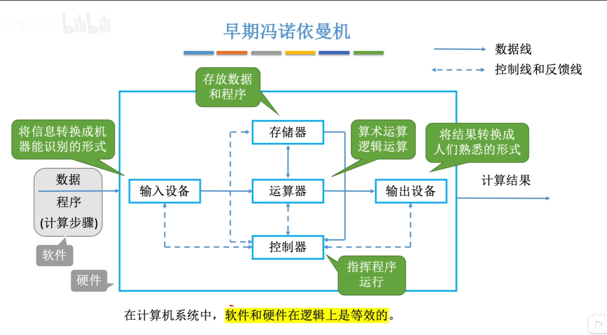
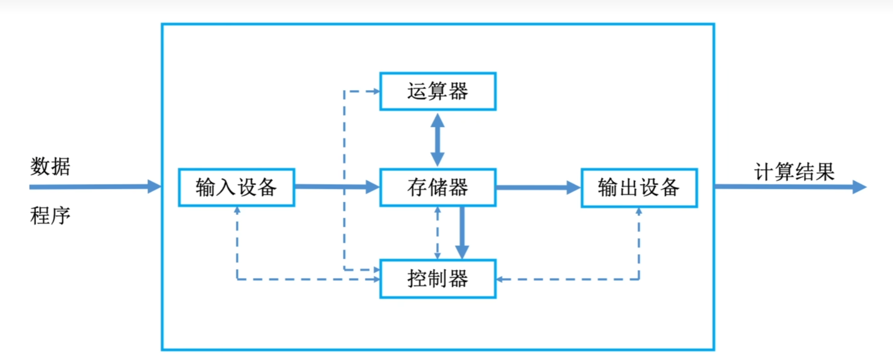
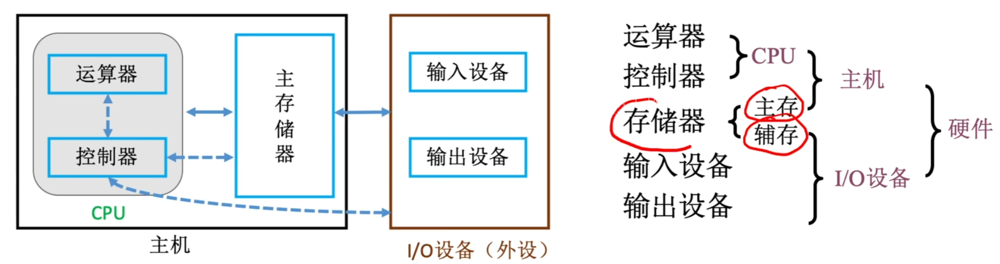
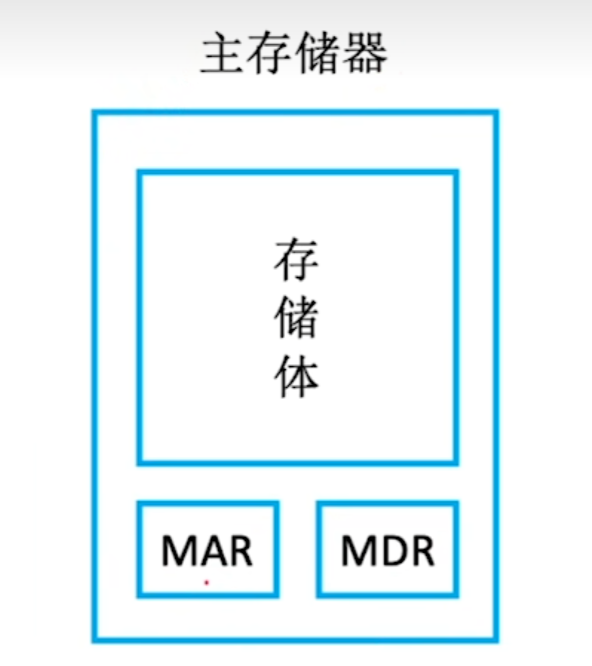
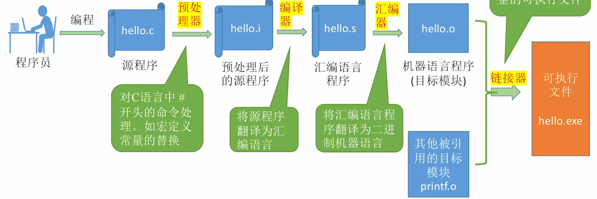

# 计算机系统概述
**计算机系统 $=$ 硬件 $+$ 软件**

软件：
- 系统软件：用来管理整个计算机系统
- 应用程序：按任务需要编制成的各种程序

## 计算机系统层次结构
### 计算机系统的组成
一个完整的计算机系统由**硬件**和**软件**组成。
-   **硬件**指有形的物理装置，即计算机系统中的各类物理部件。
-   软件则是在硬件上运行的程序机器相关的数据与文档。

**计算机系统设计必须合理划分硬件的功能边界**。

### 计算机硬件
 

#### 冯诺依曼机特点
**基本思想**为**存储程序**
-   采用“存储程序”的工作方式：将编制好的程序和初始数据预先存入主存储器，计算器启动后能自动、连续地取指并执行，直到程序结束，直到程序结束
-   硬件系统有运算器、控制器、存储器、输入设备和输出设备五大部件组成
-   指令和数据在存储器中一相同形式存放，仅凭内容无法区分，但计算机能识别他们
-   **指令和数据均采用二进制编码表示**
-   指令由操作码和地址码组成，其中操作码指明操作类型，地址码指出操作数地址
#####

#### 计算机功能部件

现代计算机将运算器、控制器和各类寄存器高度集成，形成一块称为CPU的芯片，完整的计算机硬件系统主要包含：CPU，存储器，IO设备，外部设备以及用于协调这些部件协同工作的总线

##### CPU
**CPU**是计算机系统中负责指令执行的核心部件

**传统**基本组成部分为**运算器**和**控制器**

**现代处理器架构**中，这两部飞被系统的组织为**数据通路**与**控制单元**

**数据通路**是执行时机运算的硬件，核心包括**算术逻辑单元ALU**和**通用寄存器组**
-   **ALU**负责完成算数与逻辑运算
-   **通用寄存器组**为ALU提供操作数并暂存运算结构
-   数据通路还包含多路选择器，内部互联通路等部件，用于在各个部件间高效传送数据

**控制单元**负责协调整个CPU的工作：它从存储器中取出指令并译码，随后根据指令语义生成一系列精确的控制信号，指挥数据通路中的各部件，从而确保质量有序高效地进行

######
##### 存储器
按访问特性，存储器通常微分内存与外存，**现代**内存由**主存**和**高速缓存Cache**组成
> 传统内存仅指主存

在冯诺依曼结构中，**主存作为核心的工作存储器，用于存放带执行的程序和数据**

**外存**则包括两类
-   可与主句能交换数据的磁盘，固态硬盘等
-   长期备份的海量存储设备
######
##### 外部设备和设备控制器
**外部设备**简称IO设备。通常由物理功能部件和设备控制器组成，两者在功能或物理实现上旺旺相互分离

物理功能部件负责实际的输入输出操作。设备控制器负责与主机通信或控制前者

##### 总线
**总线**是计算机中用于在各个部件之间传输信息的公共通路

### 计算机软件
#### 系统软件和应用软件
**系统软件**是一组保障计算机系统高效，正确运行的基础软件，用于管理和调度系统资源，为用户及应用程序提供基础服务

**应用软件**指用户为解决特点应用领域问题而开发的程序

#### 软硬件逻辑功能等价性
对于某一特定功能，既可采用硬件实现，又可通过团建实现；从用户视角看，在相同规范下，**两者在逻辑功能上是等价的**

### 计算机的层次结构

#### 算法和编程

##### 编程语言
-   机器语言
-   汇编语言
-   高级语言

##### 翻译程序
###### 汇编程序（汇编器）
将汇编语言源程序翻译为机器语言目标程序

###### 解释程序（解释器）
逐跳翻译并立即执行高级语言源程序语句，不生成独立目标程序

###### 编译程序（编译器）
将高级语言源程序一次性翻译为汇编语言或机器语言目标程序

#### 操作系统OS
所有语言处理系统都必须在OS所提供的云心环境中执行；OS通过对计算机硬件及其底层结构的抽象构建出一台科供程序员使用的虚拟机

#### 指令集体系结构ISA
**指令集体系结构ISA**是计算机软硬件之间的**框剪结构**，它从程序员和编译器额度视角，**完整地定义了软件可直接使用的硬件功能**

#### 微体系结构
微体系结构（微架构）是处理器内部的硬件组织方式，用于实现ISA定义的功能

**核心设计**包括数据通路主治、控制单元实现、流水线级数，缓存层次结构以及分支预测机制等

相同的ISA可对应多种不同的微架构

### 计算机系统的工作原理

#### 存储程序工作方式
规定：在程序执行前，需将其所包含的指令和数据预先加载到主存储器中；一旦启动，计算机便无需人工干预，自动逐跳取出并执行指令

#### 从源程序到可执行文件
从源程序到可执行文件：

## 计算机的性能指标

### 主要性能指标

#### 运算速度

##### 吞吐量
指系统在单位时间内处理的请求数量

##### 响应时间
指从用户发出请求到系统返回所需结构的总等待时间

##### CPU时钟周期
机器内部主时钟脉冲的宽度，是CPU工作的**最小时间单位**

**时钟脉冲**由机器脉冲源产生，经正兴和分频后形成

**时钟周期**通过以向量单位间组合逻辑电路的最大时延时间为基准确定；在流水线结构中，则以流水线的每个流水段的最大时延为准

##### 主频（CPU时钟频率）
机器内部主时钟的频率，即**时钟周期的倒数**，是衡量处理器速度的重要参数

##### CPI
执行一条指令所需的时钟周期数

不同指令所需的时钟周期数可能不同，所以对一个程序或机器，其CPI指**平均CPI**

##### IPS
每秒执行多少条指令

$$ IPS = \frac{主频}{平均CPI} $$

##### CPU执行时间
运行一个程序所花费的时间

$$ CPU执行时间 = \frac{CPU时钟周期数}{主频} = \frac{指令条数 \times CPI}{主频} $$

即**CPU性能**取决于**指令条数**，**CPI**和**主频**，三者互相制约
> 如使用更复杂的指令集，会使指令条数减少，但是时钟周期延长

##### MIPS
每秒执行多少百万条指令

**用于不同机器间的性能比较存在明显缺陷**

##### FLOPS
每秒执行的浮点运算次数
-   MFLOPS：$10^6$ 次浮点运算/秒
-   GFLOPS：$10^9$ 次浮点运算/秒
-   TFLOPS：$10^{12}$ 次浮点运算/秒
-   PFLOPS：$10^{15}$ 次浮点运算/秒
-   EFLOPS：$10^{18}$ 次浮点运算/秒
-   ZFLOPS：$10^{21}$ 次浮点运算/秒

######

#### 基准程序
**基准程序**是一组专门用于性能测评的典型程序，旨在模拟真实应用场景下的负载，从而较为准确地翻译系统在实际使用中的运行效率

