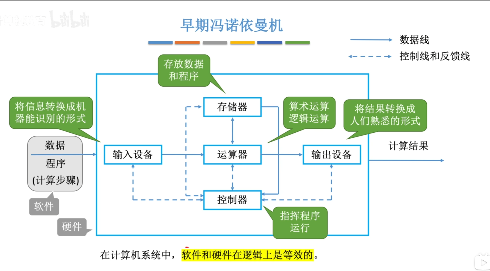
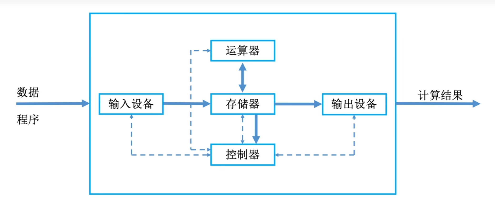
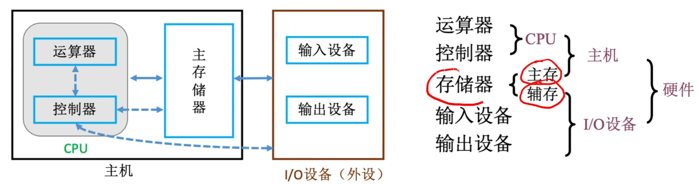
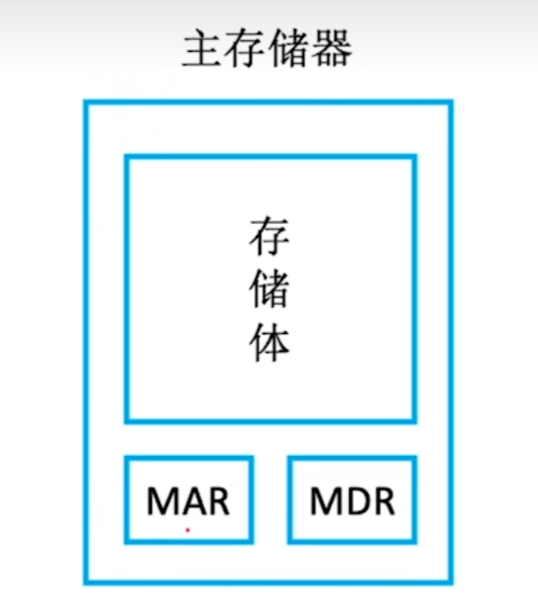

**计算机系统 $=$ 硬件 $+$ 软件**

软件：
- 系统软件 - 用来管理整个计算机系统
- 应用程序 - 按任务需要编制成的各种程序

# 计算机系统层次结构
## 计算机系统的组成
一个完整的计算机系统由**硬件**和**软件**组成。
- 硬件指有形的物理装置，即计算机系统重的各类物理部件。
- 软件则是在硬件上云翔的程序机器相关的数据与文档。

计算机系统设计必须合理划分硬件的功能边界。

## 计算机硬件
 

**冯诺依曼机特点：**
- 计算机由五大部件组成
- 指令和数据以同等地位存于存储器，可以按地址访问
- 指令和数据用二进制表示
- 指令有操作码和地址码组成
- 才有存储程序的工作方式：将编制好的程序和初始数据预先存入主存储器，计算机启动后能自动、连续地取指并执行，直至程序结束，无需人工干预
- 以运算器为中心
> 现代计算机以存储器为核心

**线代计算机结构：**

### 计算机功能部件
CPU = 运算器 + 控制器
主机 = CPU + **主存储器**
> 辅存为IO设备（如硬盘）

### 各个硬件功能
#### 存储器

MAR：存储地址寄存器 Memory Address Regrister
MDR：存储数据寄存器 Memory Data Register

**读取数据：**
CPU在MAR中找到数据的地址，存储体根据MAR找到的地址，将数据存放在MDR中，然后CPU从MDR中取用。

**写入数据：**
CPU将想要写入的地址放入MAR，并且将数据放入MDR，存储体再根据MAR内的地址放入MDR的数据。

##### 主存储器的基本组成
存储单元：每个存储单元存放一串二进制代码
存储字：存储单元中二进制代码的组合
存储字长：存储单元中二进制代码的位数
存储元：存储二进制的电子元件，每个可存1bit

可以得到：
MAR的位数 = 存储单元的个数
MDR位数 = 存储字长
> 字（word）和字节（byte）不同，字节严格 $8$ 位，字根据计算机决定

#### 运算器
运算器用于实现算术运算与逻辑运算

ACC：累加器，用于存放操作数货运算结果
MQ：乘商寄存器，在乘除运算时存放操作数和运算结果
X：通用的操作数寄存器，用于存放操作数
ALU：算术逻辑单元，通过内部复杂电路实现算术运算和逻辑运算

#### 控制器
CU：控制单元 Control Unit，分析质量，给出控制信号
IR：指令寄存器 Instruction Register，存放当前执行的指令
PC：程序计数器 Program Conuter，存放下一条指令地址，有自动+1功能

## 计算机软件
计算机软件 = 应用软件 + 系统软件

### 三种级别的语言
机器语言
汇编语言
高级语言
