# 数制与编码
## 进位计数制
各种进制的转化略
> 都打了这么久A，怎么可能不清楚进制转换

### 真值和机器数
**真值:** 符合人类习惯的数字
**机器数“** 数字实际存到机器内的形式，**正负号需要被数字化**，也就是在前面补 $01$

## 定点数的表示
定点数：小数点位置固定
浮点数：小数点位置不固定

### 有符号数的定点表示
首位均为符号位
- 对于整数，小数点隐含在末尾
- 对于小数，小数点隐含在第二位（符号位后）

两者一同表示数值

#### 四种码制的表示
**原码：** 正负数只在符号位不同，数值部分相同
整数可以表示为 $1,0101$ 或者 $1,101$ 均表示 $-5$，范围 $[2^n -1,2^n-1]$
小数则为 $1.101$，也就是 $-0.6125 $，范围 $[-(1-2^{-n}),1-2^{-n}]$

**反码：** 正数与原码相同，负数按位取反
> 只是转化为补码的过程，实际无作用

**补码：** 正数与原码相同，负数按位取反在 $+1$
范围 $[-2^n,2^n-1], [-1,1-2^{-n}]$
**移码：** 补码的基础上将符号位取反，**只能表示整数**
> 优势在于利于比大小  

## 各种码的作用
### 加减运算
计算机实现减法远不如实现加法容易，所以根据数论的同余，将减去 $x$ 改为加上 $x$ 的补码
> 补码看起来是按位取反在 $-1$，实际应该是 **模 $-$ $x$ 的绝对值**

### 大小比较
对于单调增的真值，移码也单调增，那么无需单独比较符号位，就可以直接比大小。

## C语言整数类型和类型转换
所以有符号整型符号以补码存储
> 无符号没有三种码的概念

### 无符号有符合互换
不改变存储数据，只改变解释方式
> 1001 任然为 1001，只是一个是 $-1$，一个是 $15$

### 长 $\to$ 短
保留低位

### 短 $\to$ 长
#### 符号拓展
有符号型的拓展规则
在前面用符号位值补齐到位数达标
如 $0001 \to 0000,0001$, $1001 \to 1111,1001$
这样可以保持真值不变

#### 零拓展
无符号型拓展规则
也可以理解为无符号整数的符号位固定为 $0$，那么直接拓展 $0$ 即可

# 运算方法和运算电路
## 门电路补充
$A \oplus B =\bar{A}B + A \bar{B}$

$A \odot B = \overline{A \oplus B} = (\bar{A}+B) \cdot (A + \bar{B})$

### 多输入门
本质上均为 $A ? B ? C \ldots ? Z$
问号为门代表运算
- 与门，需要全部为 $1$ 输出 $1$
- 或门，存在 $1$ 输出 $1$
- 异或门，取决于输入 $1$ 个数的奇偶性

### 运算优先级
括号 $>$ 非 $>$ 与 $>$ 或
$() > \neg > \cdot > +$

反演：$\overline{A + B} = \bar{A} \cdot \bar{B}$

### 多路选择器 MUX
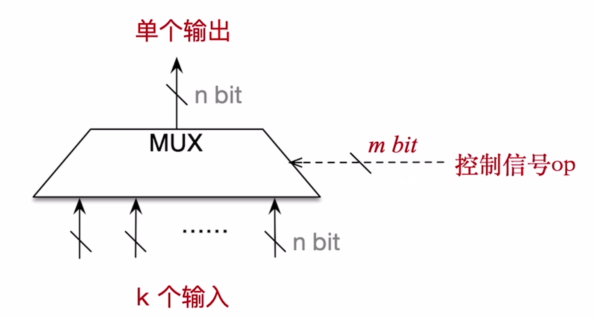

根据控制信号 op 的值，MUX 会在 $k$ 个输入信号中选择一个通过输出

输出信号的任意一路输入信号均为 $n \ \text{bit}$

$m \ge \lceil \log_2 k\rceil$

### 三态门
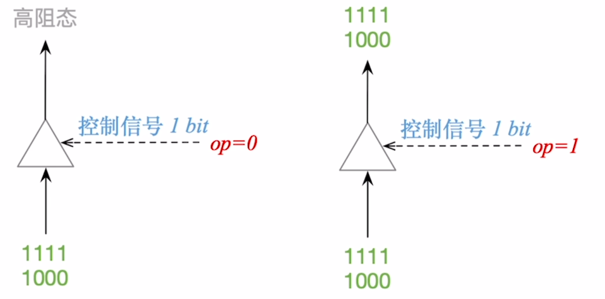

- $op = 1$ 时 输出高阻态（相当于开路）
- $op = 1$ 时，输出输入值

$op$ 只有 $1 \text{bit}$

## 加法器
### 一位全加器
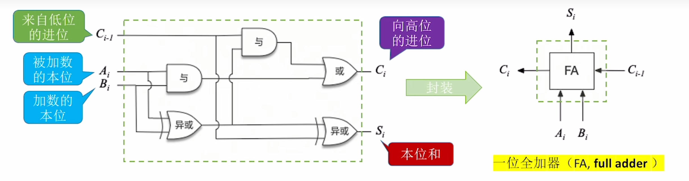

本位和 $S_i = A_i \oplus B_i \oplus C_i$
进位 $C_i = A_i B_i + (A_i \oplus B_i)C_{i-1}$

> $C_i$ 只需要保证输入有 $\ge 2$ 的 $1$ 即可，但是如图复用了一个异或门，电路会更简介

### 串行进位加法器
> 也叫并行加法器，但是此处并行描述的是并行输入
> 所以全程也就是串行进位的并行加法器

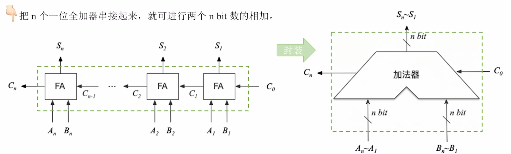

**不足：** 进位信息串行产生，位数越多运行速度越慢

### 并行进位加法器
并行进位的并行加法器
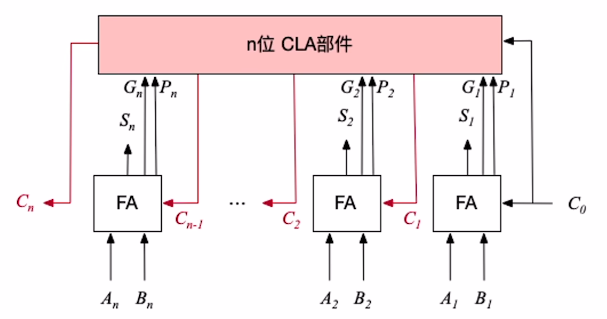

### 带标识位的加法器
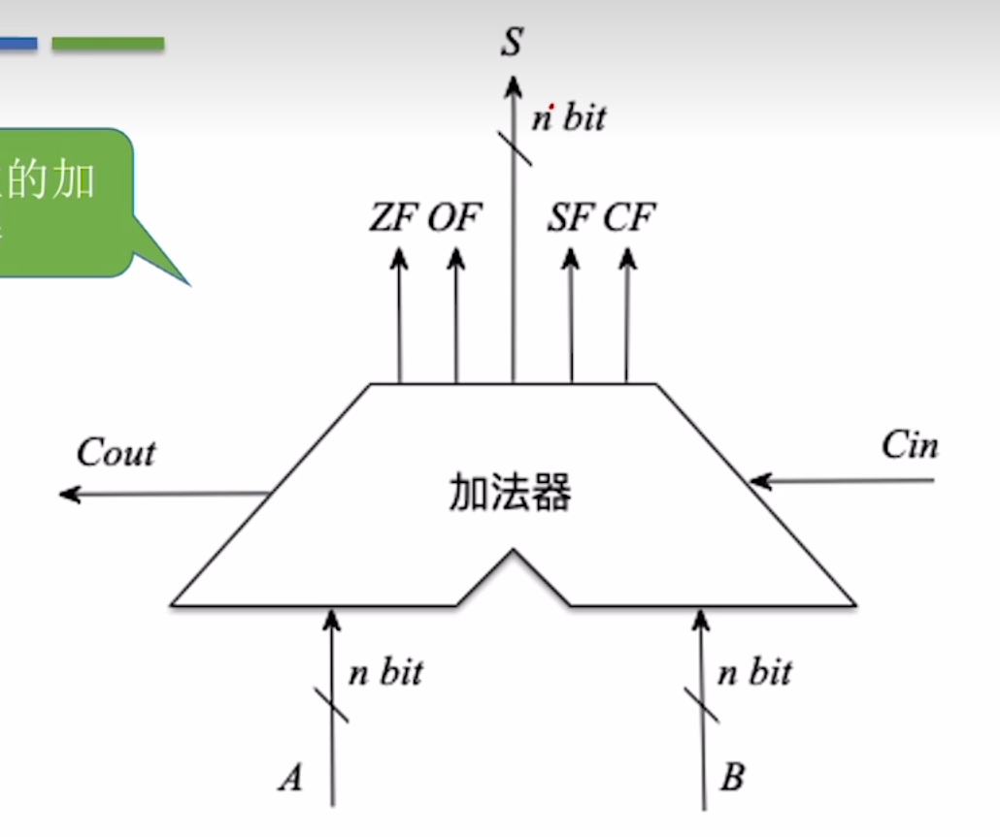
$OF$ 溢出标志
-   判断**带符号数**是否溢出，$OF = 1$ 溢出
    $OF = C_n \oplus C_{n-1}$
    > 代表符号相同的两个数相加符号不同，上式为化简结果

$SF$ 符号标志
-   判断**带符号数**加减结果的正负性，$SF = 1$ 为负
    $SF = S_n$

$ZF$ 零标志
-   判断加减运算结果是否为 $0$，$ZF = 1$ 代表为 $0$
    $ZF = \overline{S_n + \cdots + S_2 + S_1}$

$CF$ 进位/借位标志
-   判断**无符号数**加减法是否溢出，$CF = 1$ 溢出
    $CF = C_{out} \oplus C_{in}$
    根据后面补码加减电路的内容，$C_{in} = 1$ 代表进行了减法，所以才能和 $C_{out}$ 一起运算判断
## 算术逻辑单元ALU
ALU是运算器的核心，加法器是ALU的核心

### ALU的功能
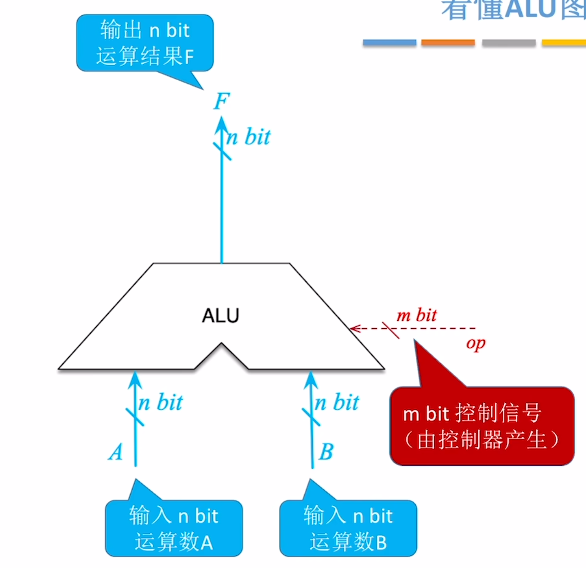
- 算术运算 - 加减乘除等
- 逻辑运算 - 与或非异或移位等
- 其他 - 求补码、直送等

### 实现原理
*简单了解即可，下述为一最简单实现方法*

输入AB接入 $k$ 个功能电路，$k$ 个功能电路的结果再接入MUX

### 看的ALU图示
**重点：**
-   ALU支持 $k$ 种功能，则控制信号位数 $m \ge \lceil \log_2 k \rceil$
-   ALU的运算数、运算结果位数**与机器字长相同**
    或者说计算机机器字长就是由ALU运算位数决定
-   标志位表示结果特征
    -   ZF 结果是否为 $0$
    -   OF 结果是否溢出
    -   SF 结果的正负
    -   CF 无符号运算是否溢出
-   这些表示位信息会送入PSW程序状态字寄存器中
    有些计算机吧PSW寄存器称为标志寄存器FR
    
## 定点数的移位运算
也就是 `>>`, `<<`
### 逻辑移位
将操作数视作无符号整数
**逻辑左移：**
相当于 $\times 2$
当某次左移丢弃的位为 $1$，代表发生了溢出

**逻辑右移**
低位丢弃，高位补 $0$
相当于 $\div 2$
### 算数移位
**算数左移：**
算数左移与逻辑左移相同，所以可能修改符号位（也就是溢出）
若是左移前后符号位改变，则代表**左移溢出**

**算数右移**
丢弃低位，高位补符号位，若丢弃 $1$ 会导致精度丢失
相当于 $\div 2$

## 定点数的加减运算
原码的加减，根据符号情况和绝对值大小进行操作

### 补码的加减运算
$[A+B] = [A] + [B]$
$[A-B] = [A] + [-B]$

#### 溢出判断
- 只有 正 $+$ 正 可能上溢
- 只有 负 $+$ 负 可能下溢

**方法一**
$V = AB\bar S + \overline{AB}S$

若是运算结果符号位和运算数不同，则溢出
> 正+正不可能为负

**方法二**
|情况|符号位进位 $C_s$ |最高位进位 $C_1$|
|:-:|:-:|:-:|
|上溢|0|1|
|下溢|1|0|

**方法三** 双符号位
正数 $00$， 负数 $11$
01上溢，10下溢
双符号位又称为模4补码
单符号位补码则为模2补码

### 无符号数的加减运算
加法相同，减法事实上也相同
减法对减数按位取反+1，然后直接相加

加法最高位进位为 $1$ 时候溢出
减法最改为进位为 $0$ 时候溢出

### 补码加减运算电路
此电路也可以实现无符号数的加减运算
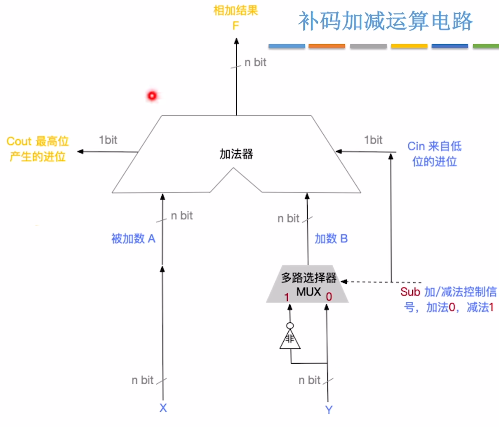
对于 $A \pm B$ 的运算
给 $B$ 加入一个多路选择器，两条输入一条接入B，一条接入$\neg B$
同时一个 $sub$ 信号接入MUX的控制端和加法器的 $C_{in}$

$sub = 0$ 时候代表加法
$sub = 1$ 时候代表减法，对 $B$ 按位取反，同时 $C_{in}$ 实现 $+1$

## 定点数乘法运算
### 无符号整数乘法（迭代式）
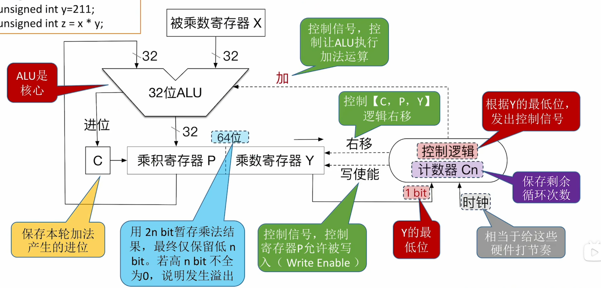
**开始**
-   将被乘数、乘数分别放入寄存器 $X,Y$
-   乘寄存器 $P$ 置 $0$
-   计数器 $C_n$ 的初始值置为 $n$

> 如果被乘数或乘数全 $0$，结果直接得 $0$

**执行过程（$n$ 轮）**
-   将**乘数寄存器 $y$ 的最低位送入控制逻辑进行判断
-   若为 $1$，执行加法（$P$ 与 $X$），运算结果写回 $P$
    否则不操作
- 将 $C,P,Y$ 整体右移一位
- 计数器 $C_n$ 减 $1$

**结束**
-   乘法运算的结果用 $2n$ 暂存
-   通常仅保存低 $n$ 位作为结果（所以可能**溢出**）

#### 溢出处理
**判断**
若高 $n$ 位不全为 $0$，则发生溢出，此时将 $OF$ （溢出标识位）置为 $1$

**处理**
-   可以选择忽略溢出
-   或者检测 $OF$ 标志位为 $1$ 后执行异常处理程序

### 阵列式无符号乘法
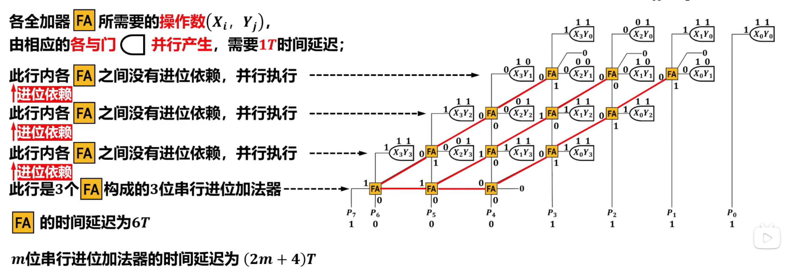

$X_iY_j$ 表示被乘数 $i$ 位和乘数 $j$ 的乘法运算结果，实际是个**与门**，共 $n^2$ 个

`FA` 是一位全加器，需要 $n \times (n-1)$ 个

$P_x$ 代表积的值

**性能分析**
与门并行执行，$1T$ 延迟

同行间无进位依赖，不同行有进位依赖，且最后一行间有依赖

### 有符号数乘法（迭代式）
也就是补码乘法
现在有两个正整数 $X,Y$
**推导**
> 下述为定点小数，但是对于小数和整数区别只是模数不同而已，即一个为 $2^{n+1}$，一个为 $2$

**对于 $X$ 符号任意，$Y$ 为正**

根据补码定义可得：
$[X]_补 = 2+X = 2^{n+1} + X (\mod 2)$
$[Y]_补 = 0.Y_1 Y_2 \cdots Y_n$

$[X]_补 \times [Y]_补 = [X]_补 \times Y = 2^{n+1} \times Y + X \times Y$
$ = 2 \times 2^n \times 0.Y_1 Y_2 \cdots Y_n + X \times Y$
$= 2 \times Y_1 Y_2 \cdots Y_n + X \times Y$

根据模数性质，$2 \times Y_1 Y_2 \cdots Y_n \mod 2 = 2$
> 实际应该 $=0$，但是为了方便使用才写了 $2$，具体原因是整数 $\times 2$ 再 $\mod 2$ 之后，必然为偶数

所以 **$= [X]_补 \times Y$**

**对于 $X$ 符号任意，$Y$ 为负**
根据补码定义可得：
$[Y]_补 = 1.Y_1 Y_2 \cdots Y_n = 2+Y$

$Y = [Y]_补 - -2 = 1.Y_1 Y_2 \cdots Y_n - 2 = 0.Y_1 Y_2 \cdots Y_n -1$

$X \times Y = X \times (0.Y_1 Y_2 \cdots Y_n - 1)$
$= X \times 0.Y_1 Y_2 \cdots Y_n - X$

$[X]_补 \times [Y]_补 = [X \times 0.Y_1 Y_2 \cdots Y_n-X]_补$
**$= [X \times 0.Y_1 Y_2 \cdots Y_n]_补 - [X]_补$**

**综上：**
**$[X \times Y]_补 =[X]_补 \times 0.Y_1 Y_2 \cdots Y_n - [X]_补 \times Y_0$**

但是因为式子和无符号整数的模系统不同，所以需要继续操作使之可以硬件实现。
下面用 $[X]$ 代替 $[X]_补$
$[X \times Y]_补 =[X]_补 \times 0.Y_1 Y_2 \cdots Y_n - [X]_补 \times Y_0$
$= [X] \times (- Y_0 + Y_1 \times 2^{-1} + Y_2 \times 2^{-2} + \cdots + Y_n \times 2^{-n})$
$= [X] \times (- Y_0 + (Y_1 - Y_1 \times 2^{-1}) + (Y_2 - Y_2 \times 2^{-2}) + \cdots + (Y_n - Y_n \times 2^{-n}))$
$= [X] \times (- Y_0 + Y_1 - Y_1 \times 2^{-1} + Y_2 - Y_2 \times 2^{-2} + \cdots + Y_n - Y_n \times 2^{-n})$
$= [X] \times((Y_1-Y_0) + 2^{-1}(Y_2-Y_1) + 2^{-2}(Y_3-Y_2) + \cdots + 2^{-(n-1)}(Y_n - Y_{n-1}) + 2^{-n}(0 - Y_n))$

然后把 $[x]$ 乘入并且逐次的提取 $2^{-1}$
$= 2^{-1}(2^{-1}(2^{-1}(0 + (0-Y_n)[X])+(Y_n - Y_{n-1})[X]) + \cdots + (Y_2 - Y_1)[X]) + (Y_1 - Y_0)[X]$

也就可以用硬件递归了
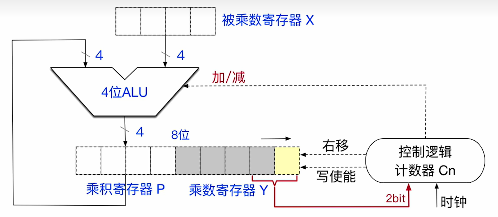
##### 执行过程
**开始**
-   被乘数乘数的**补码**分别放入寄存器 $X,Y$
    > 事实上元件操作的均为补码
-   乘积寄存器 $P$ 置为 $0$，辅助位置为 $0$
-   计数器 $C_n$ 初始值为 $n$(乘数位数)

**执行过程（重复 $n$ 轮）**
-   **判断** 将 $Y$ 最低位 $y_0$ 与辅助位 $y_{-1}$ 组合形成两位二进制码，送入控制逻辑
-   **加减法**
    -   对于 $10$，执行减法，将 $-X$ 置于 $P$
        > $-(Y_{n-1} - Y_n) = -1$
    -   对于 $01$，执行加法，将 $X$ 置于 $P$
        > $-(Y_{n-1} - Y_n) = 1$
    -   对于 $00/11$，不操作
        
-   **移位**，将 $P,Y$ 执行一次算术右移，$y_0 \to y_{-1}$
    > 也就是 $\times 2^{-1}$
-   **循环控制** 计数器 $C_n$ 减 $1$，若 $C_n \ne 0$ 继续下一轮，否则结束

**结果与溢出判断**
-   **最终结果** $2n$ 位乘积存放在寄存器对 $[P:Y]$ 中，$P$ 为高 $n$ 位，$Y$ 为低 $n$ 位
-   **溢出判断** 若 $P$ 不是 $Y_0$ 的符号位拓展，则溢出，否则不溢出
    溢出则 $OF$ 和 $CF$ 置 $1$

### 有符号乘法（阵列式）
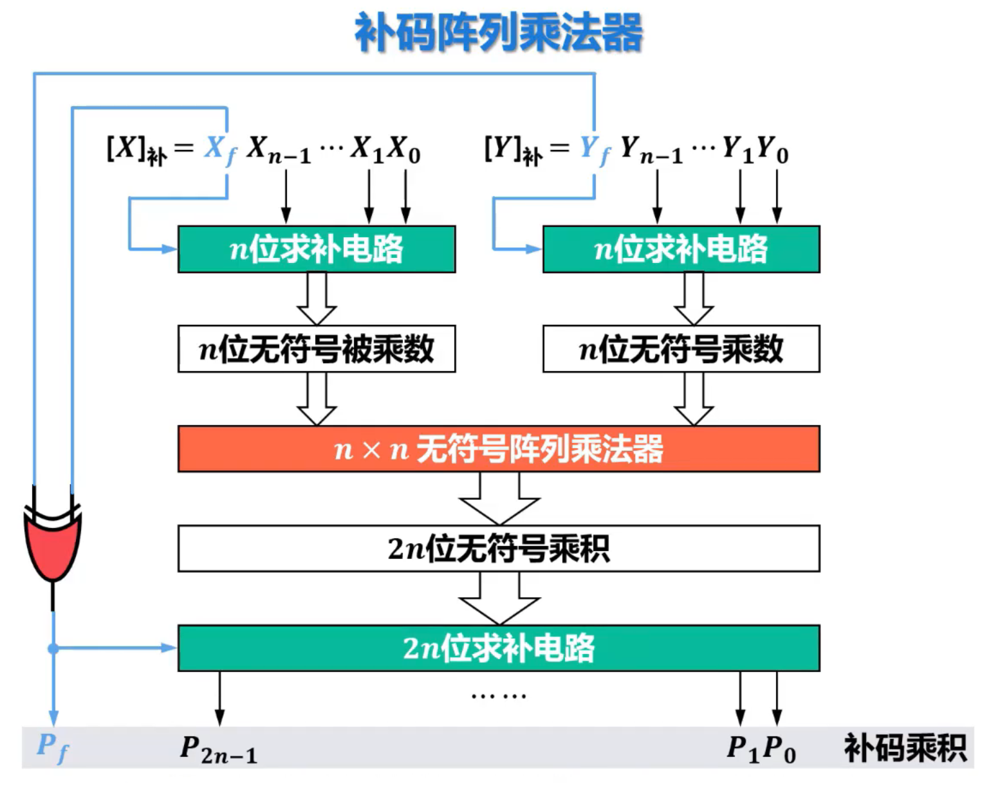

**$P_f$** 会决定最后结果师范需要求补

### 乘法运算的三种实现方式
-   **迭代式乘法器**，上述即是
-   阵列乘法器：**可以在单个时钟周期内完成一次计算**
    > 阵列乘法器只是快速乘法器的典型代表，事实上快速乘法器都可以在一个周期完成计算
-   移位-加减法：拆解为移位和加法
    也就是按二进制位的 $1$ 来进行，比如 $X \times 9 =$ `X << 3 + X`

## 定点数除法运算
### 无符号整数的除法运算（恢复余数法）
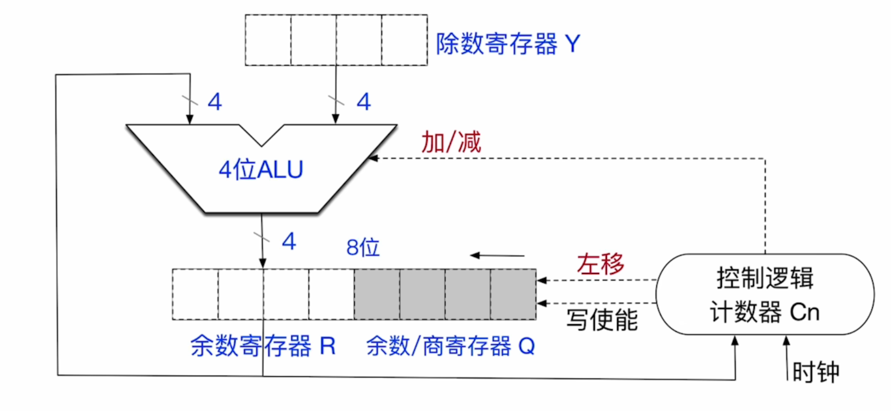

该除法器支持 $2n \ bit \div n \ bit$，最终得到 $n \ bit$ 商和 $n \ bit$ 余数

#### 执行过程
**开始**
-   将数据放入寄存器
    -   除数放入寄存器 $Y$
    -   被除数放入寄存器 $RQ$，并完成零拓展
    -   计数器 $C_n$ 初始值置为 $n$
-   特殊情况检查
    -   若除数为 $0$，发生**除数为 $0$ 异常**，停止除法运算，调出操作系统的异常处理程序
    -   若 被除数 $<$ 除数，则 商 $=0$，余数 $=$ 被除数，无需执行除法

**执行过程（$1+n$轮）**

上商的规则: $R - Y \ge 0$，上商 $1$，否则 $0$
-   **上商的操作**
    -   计算 $R-Y$，**并将结果放回 $R$**
    -   判断 **现在 $R$** 是否 $\ge 0$，若 $\ge 0$，上商 $1$，否则上商 $0$
    -   **如果上商 $0$**，执行 $R+Y$ 放回 $R$
        > 因为当前的寄存器 $R$ 存储的是 $R-Y$ 的值，但是实际并没有执行此次减法，所以需要恢复为 $R$

-   第一轮特殊处理，直接上商
    -   若第一位商 $=1$，发生**商溢出异常**，停止除法运算
        > 也就是商大于 $n$ 位了
    -   若第一位商 $=0$，说明不发生商溢出，**不必保存该位**，也不操作 $C_n$

-   其余 $n$ 轮
    -   左移 $1$ 位，空出位置用于上商
    -   上商
    -   计数器 $C_n -1$，当 $C_n = 0$ 时结束

**结束**
当 $C_n = 0$ 时，除法运算结束，$R$ 保存余数，$Q$ 保存商

**对商溢出的讨论**

$2n \ bit \div n \ bit \to$ 双精度除法
$n \ bit \div n \ bit \to$ 单精度除法，需要统一为 $2n \div n$，且**不可能发生商溢出**

最终均保留 $n \ bit$ 商 $n \ bit$ 余数

<!-- **还未学习不恢复余数法和补码除法** -->

### 无符号整数的除法运算（不恢复余数法）
在上商的操作中，我们会判断 $R-Y$ 是否 $\ge 0$ 来确定上商的值。**因为在上商判断前会先左移一位**，而 `<<1` 和 $\times 2$ 是等效的，所以可以得到下述推导：

如果 $\ge 0$，$R_{i+1} = R_i*2 -Y$
如果 $< 0$，在恢复余数时 $R_{i+1} = (R_i+y)\times 2-y$，$R_i$ 是进行判断（$-y$）但是还没有恢复操作的值。那么不恢复自然会变为 $R_{i+1} = R_i\times 2 + y$

因为运算过程加减法交替计算余数，所以也叫加减交替法

根据推导，我们每次操作应该改为
上商 - 左移
> 感觉也算是王道的坑

### 有符号整数的除法运算（补码除法）
暂略

# 浮点数的表示与运算
IEEE754标准的浮点数格式
> C的 `float` 和 `double` 都是IEEE754标准浮点数格式

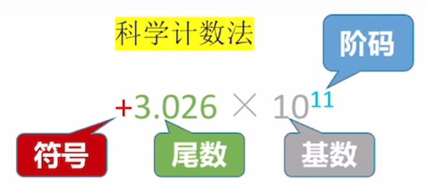

**规格化：** 确保尾数的最高位非零数位刚好在小数点之前

## IEEE754标准的浮点数
|类型|符号|阶码|尾数|
|-|-|-|-|
|`float`|1|8|23|
|`double`|1|11|52|

### `float` 单精度浮点型的存储
符号的存储：$0\to +, 1\to -$
尾数的存储：规定小数点位置在**23bit之前**，默认存储规格化尾数，**小数点前的 $1$ 省略（隐含），原码表示**
阶码的存储：移码表示，规定偏置值为 $127$
> e_0 = e-127

基数：无需专门存储，规定为 $2$

### `double` 双精度浮点型的存储
尾数的存储：规定小数点位置在**52bit之前**，默认存储规格化尾数
阶码的存储：移码表示，规定偏置值为 $1023$

### 数值转换
浮点数最终还是会表示为二进制，所以要注意转换

### 表示范围与特殊状态

#### 特殊状态
**仅当阶码==不全为0==，也==不全为1==时**，才是一个规格化浮点数
全0/1留作特殊用途
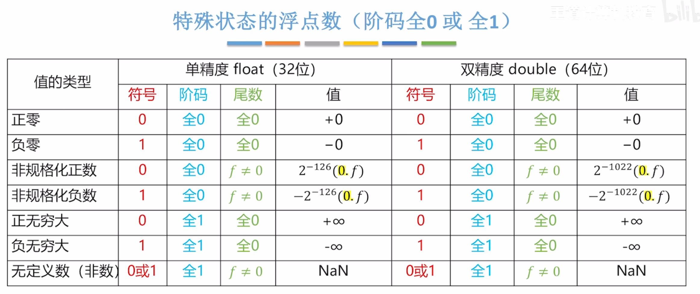

#### 表示范围
*以 `float` 为例*

**对于阶码**
因为阶码不全 $0$ 和 $1$，所以数值上范围为 $[1,254]$

减掉偏置值后范围为 $e \in [-126,127]$

**实际范围**

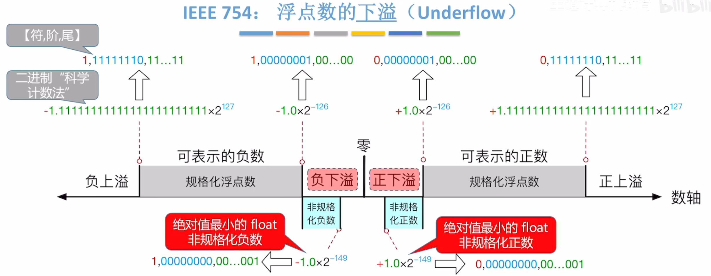
也就是
$x \in [-(2-2^{23}) \times 2^{127},-1.0\times 2^{-126}] \cap [1.0\times 2^{-126},(2-2^{-23}\times 2^{127}]$s2

**上溢处理**
正负上溢统称为**上溢**或者溢出
-   运算结果设为 $\pm \infty$
-   设置浮点溢出异常标    志位
    > 如 x86会将浮点运算单元FPU的OE表示位置1

    *注：IEEE754规定，默认不响应浮点溢出异常，不中断程序；除非手动开启此类异常响应*

**下溢处理**
正负下溢统称为**下溢**
-   若结果落入飞规格化区间，用飞规格化浮点数存储,最小到 $\pm 1.0\times 2^{-149}$;
    若结果太小，按 $0$ 存储
-   若下溢至机器 $0$，设置浮点下溢异常标识位
    > 如 x86会将浮点运算单元FPU的UE表示位置1

    *注：IEEE754规定，默认不响应浮点下溢异常，不中断程序；除非手动开启此类异常响应*

为什么最小非规格化正数是 $1.0 \times 2^{-149}$ ？
真值最小的情况下是 $2^{-23}$，再 $\times 2^{-126}$ 自然是 $2^{-149}$

同理可以算出最大非规格化正数是 $(1-2^{-23}) \times 2^{-126} = 2^{126}-2^{-149}$

正数同理

## 浮点数运算
**步骤：**
-   对阶，小阶向大阶靠齐
    > 更容易得到规格化的尾数，在加法时，首位不进位就是规格化的，减法首位不退位同理。
-   尾数加减
-   尾数规格化
    尾数**左移** $x$ 位，阶码 $+x$
    尾数**右移** $x$ 位，阶码 $-x$
-   尾数舍入处理
    按照舍，入或四舍五入
-   溢出判断
    阶码超过上限，则发生溢出

### 舍入问题
IEEE754有四种舍入模式，但是**就近舍入**是标准默认模式，也是考试考点，所以其他不做讨论。

就近舍入类似于 $0$ 舍 $1$ 入。

对于舍弃位的首位，为 $0$ 舍弃，为 $1$ **通常**进一

但是若舍弃位为 $100$，那么根据**末位判断**（末位指保留的末位）
-   末位为 $0$ 舍弃
-   末位为 $1$ 则 $+1$

### 溢出处理
**上溢**
计算结果阶码全 $1$，说明发生溢出，运算结果即为“无穷大”，然后按上文[特殊状态](./数据的表示和运算.md#特殊状态)处理，将尾数置为全 $0$

结论：浮点数溢出**不以尾数溢出来判断**，因为尾数溢出可以通过**右归**来纠正。运算结果溢出置看指数是否上溢

**下溢**
运算结果规格化时，阶码已经变为全 $0xxxxx1$，需要以“非规格化浮点数”处理，此时阶码置全 $0$，但是尾数不在移位。

然后根据尾数结果确定是非规格化还是 $0$

## C 的浮点数类型
浮点数都对应 IEEE754
`float` $\to$ 单精度
`double` $\to$ 双精度

转换顺序：char $\to$ int $\to$ long $\to$ double
在运算时会发生隐式转换，低自动转高
### 转换精度
int $\to$ float，因为float尾数仅 $24$ 位，所以可能丢失

int/float $\to$ double，通常精确

float/double $\to$ int 小数部分会被直接丢弃（向0截断，或者更应该叫向0取整）

## 数据的宽度和存储
### 数据的宽度和单位
bit 是最小信息单位
1 byte = 8bit

字（word）代表数据类型的宽度，根据**架构**而定
字长是CPU数据通路宽度，字 $\ne$ 字长

### 大小端存储

对于四字节数据 01 23 45 67 H
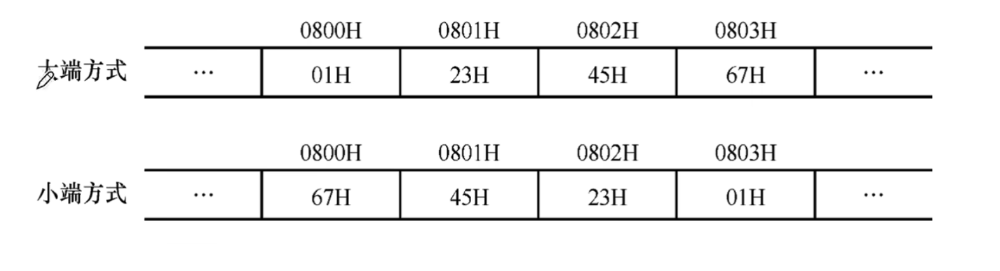

大端便于人类阅读，但是小端便于机器处理

### 边界对齐
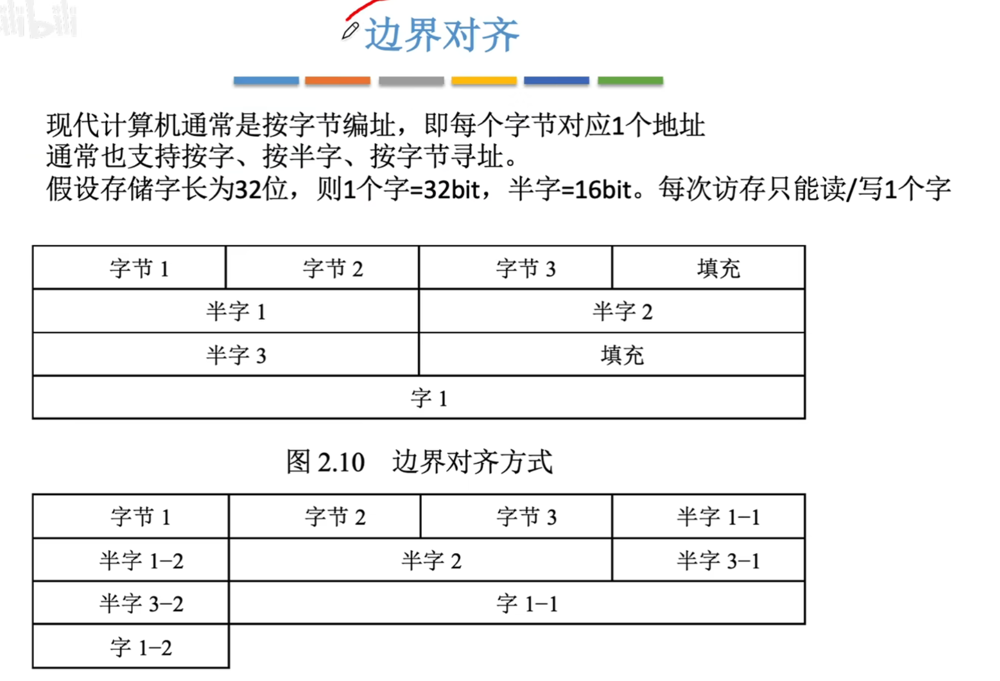

虽然空间增加，但是速度也增减，等同空间换时间