# 存储系统

## 存储器概述

### 存储器的分类

#### 按存储元件（介质）
半导体器件（DRAM，SRAM）
磁性材料（机械硬盘，磁带）
光存储器（光盘）
#####

#### 按存取方式
**随机存取存储器 RAM**，可对任意存储单元进行读写，且存储时间与物理位置无关。半导体存储器属于此类，常用于主存或Cache
**顺序存取存储器 SAM**，信息按顺数存放盒取出，存取时间取决于数据在介质的物理位。典型代表是磁带，容量大单速度慢
**直接存取存储器**，有上两者特性。可先直接选取信息所在区域，然后按顺序方式进行存取。典型代表是传统机械磁盘
**相联存储器**：按照内容而非地址访问的存储器，查找速度快且与存储位置无关，但成本高容量小，主要用于快表，路由器灯小容量高速查找场景
#####

#### 按信息可更改性
读写存储器
只读存储器ROM
#####

#### 按信息可保存性
**易失性存储器RAM**：断电后存储信息消失，如RAM
**非易失性存储器**：断电后信息仍能保持，如ROM，Flash存储器，磁盘和光盘等

**破坏性读出**：信息读出后，原存储信息被破坏
**非破坏性独处**：读取不改变元内容，无须再生

### 存储器的层次化结构
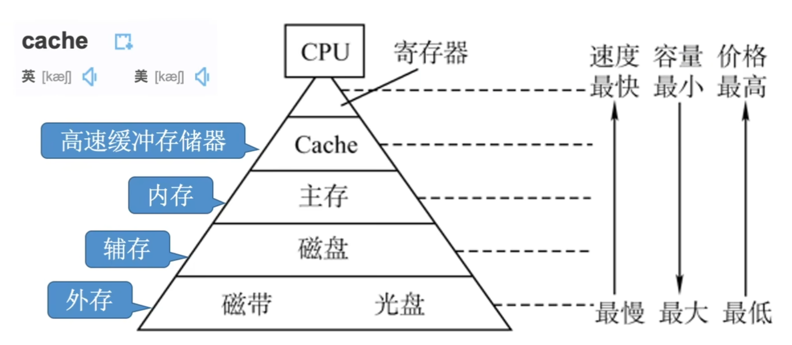

辅存中的数据要调入主存后才能被CPU访问
> 有些教材会把辅存和外存统称为一种

主存 $\leftrightarrow$ 辅存：实现虚拟存储系统，解决了主存容量不够的问题。
Cache $\leftrightarrow$ 主存：解决了主存与CPU速度不匹配的问题。

### 存储器的性能指标
**存取时间**：完成一次读写操作所需的时间
-   读出时间指从主存接收到有效地址到数据有效输出的事件
-   写入时间是指主存接收有效地址到数据成功写入知道单元的时间

**存取周期**：存储器进行连续两次独立的读写操作所需的最小时间间隔

**存储器带宽**：存储器每秒能够传输的最大数据量
####

## 主存储器

### 半导体随机存取存储器（RAM）
**随机存储器RAM**分为**静态RAM（SRAM）**和**动态RAM（DRAM）**，两者均为**易失性存储器**，现代计算机，主存主要采用DRAM，而Cache使用SRAM

#### SRAM工作原理

地址相同的多个存储元构成一个**存储单元**。若干存储单元的集合构成**存储体**

SRAM的存储元基于**双稳态触发器**利用电路的两个稳定状态分别表示bit $0$ 和 $1$

**静态特性**体现在<u>非暴力读出</u>

SRAM存取速度快，但集成度低，功耗较大，成本高，通常用于Cache
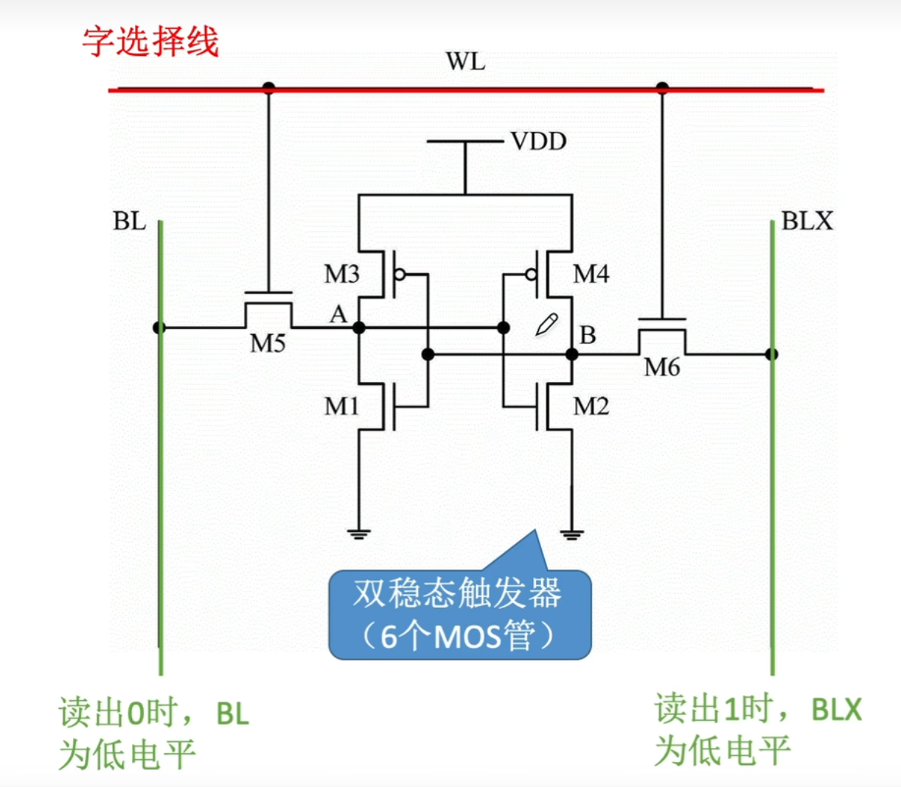

#### DRAM工作原理
利用栅极电容上的电荷来存储信息，基本结构仅由一个晶体管和一个电容构成，结构简单，集成度远高于SRAM

#### 存储芯片的组成
存储芯片由存储器，IO读写电路，地址译码器和控制电路等组成

**存储体**：是存储单元的集合，通过行选线和列选线共同选择目标单元

**地址译码器**：用来将输入地址转换为译码输出线上的高电平信号，以驱动相应的读写电路
-   **单译码法**：仅使用一个行译码器，同一行索引存储单元的字线相连，构成一个字，可被同事读写，缺点是译码器输出线数量过多
-   **双译码法**：地址译码器分为X（行）和Y（列）两个部分，通过行与列的交缠点唯一缺点一个存储单元。这是当前DRAM芯片普遍采用的译码结构

**IO电路**：用于控制被选中存储单元的读写，具有放大信号的作用

**片选控制线**：单个存储芯片容量有限，通常无法满足计算机主存容量需求，因此需将多个芯片组合拓展。在访问某个存储字时，必须选中该存储字所在芯片，而其他芯片不被选中，因此需要有片选控制信号

**读写控制线**：根据CPU发出的读写命令，通过读写控制线选中单元执行相应操作
#####

#### DRAM芯片关键技术

##### 行列地址的使用
如果排成存储单元排为一列，译码器就需要 $2^n$ 选通线

但是如果排列成 $2^{n/2} \times 2^{n/2}$ 的矩阵，行列矩阵的译码器只需要 $2^{n/2}$ 根选通线

考虑到地址复用，在行数和列数需要尽可能相近

再考虑到刷新操作，行数 $\le$ 列数
> 因为行数越少刷新次数越少

##### 地址线复用技术
DRAM芯片容量大，所需地址位数较多，即使划分为行列地址，也需要 $2 \times 2^{n/2}$ 根地址线，所以可以考虑让行地址和列地址复用地址线

使用 $n/2$ 根地址线，第一次送入行地址缓冲器，第二次送入列地址缓冲器。然后再一同送入两者的译码器。这样就使得使用的地址线再次减半

##### DRAM 的刷新
DRAM芯片需要定期刷新以维持所存信息，具体的：

以行为单位，每次刷新一行。

如何刷新？
-   有硬件支持，读出一行的信息后重新写入，占用 $1$ 个读/写周期。

什么时刻刷新？假设DRAM内部结构 $128 \times 128$，读写周期 $0.5us$，$2ms$ 有 $4000$ 个周期。
-   **分散刷新**：每次读写完都刷新一行，会是的存取周期翻倍。
-   **集中刷新**：$2ms$ 内集中安排时间全部刷新，这样不好改变存取周期，
    但是会有一段时间专门用于刷新，无法访问存储器，称为访存“死区”
-   **异步刷新**：$2ms$ 内每行刷新一次，将刷新时间分散到 $2ms$，约 $15.6 us$ 有 $0.5us$ 的死时间 
######

##### 引脚计算
考虑地址复用技术，容量为 $M \times N$ 的DRAM

地址引脚 $\dfrac{1}{2} \times \log_2 (M)$，**但是总数需要加一根行列选通线**

数据引脚 $N$

##### 缓存机制与突发传送
> 内容数据仅为示例

每个存储单元含有 $8$ 位数据，因此需要 $8$ 根数据线

芯片内部设有一个**行缓冲器**，用于缓存<u>行中所有列的数据</u>，容量等于**一行所有存储单元的数据总量**，即 列数 $\times$ 存储单元位数

**突发传送**，在一行被选中后，该行所以数据被一次性加载到行缓冲器

即在寻址阶段提供首地址，随后可连续读取多个向量存储单元的数据

#### SDRAM
目前更广泛使用的是**SDRAM**（同步DRAM）

与传统一步DRAM不同，SDRAM的数据读写操作与系统时钟同步，能以CPU-总线的较高速率运行，在连续访问同一页内的数据时，可实现突发传输，**显著减少甚至避免插入等待状态**

#### SRAM和DRAM对比
SRAM和DRAM对比：
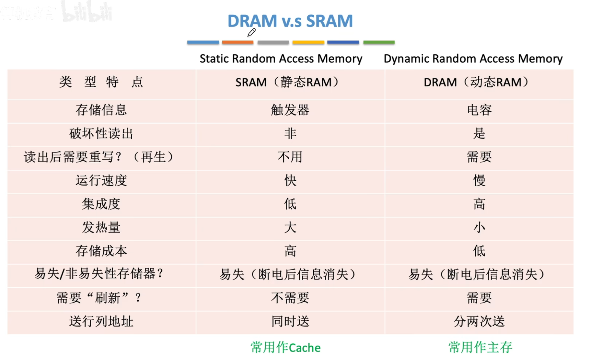

### 非易失性存储器

#### 只读存储器ROM的特点
属于非易失性存储器，支持随机访问

**优点**
-   结构简单，位密度高于SRAM等读写存储器
-   断电后数据不丢失

##### 部分 ROM 介绍
-   MROM - 掩模式ROM
    厂商在芯片生产过程中直接写入信息，之后**任何人不能重写**，只能读出
    可靠性高，灵活性查，生产周期长，只适合批量定制
-   PROM - 可编程ROM
    使用专门的PROM读写器写入信息，**写一次后不可更改**
-   EPROM - 可擦除可编程ROM
    允许用户写入信息，并用某种方法擦除数据，**可以镜像多次重写**
    -   UVEPROM - 紫外线照射 $8 \sim 20 \text{min}$ 可擦除所有信息
    -   EEPROM（E$^2$PROM），可用电擦除方式擦除特定的字。

###### Flash存储器
在 EEPROM 基础上发展而来，**断电后可长期保存信息**，且可以进行多次**快速擦除重写**
*注意：闪存需**要先擦除再写入**，所以写速度慢于读*

###### SSD - 固态硬盘
是基于 Flash 存储器构建的存储设备，由控制单元+存储单元（Flash芯片）构成，与闪存的核心区别在于控制单元不同，**可以进行多次快速擦除重写**。SSD速度快，功耗低，价格高。

### 多模块存储器
**多模块存储器**是一种空间并行技术，通过多个结构完全相同的存储模块并行工作来提高存储器的吞吐率

用于CPU的速度远高于存储器，若能在一个存取周期内连续获取多条指令或多个数据字，便能更充分利用CPU资源，提升系统性能

#### 连续编址方式
> 在王道旧课件也叫高位交叉编址

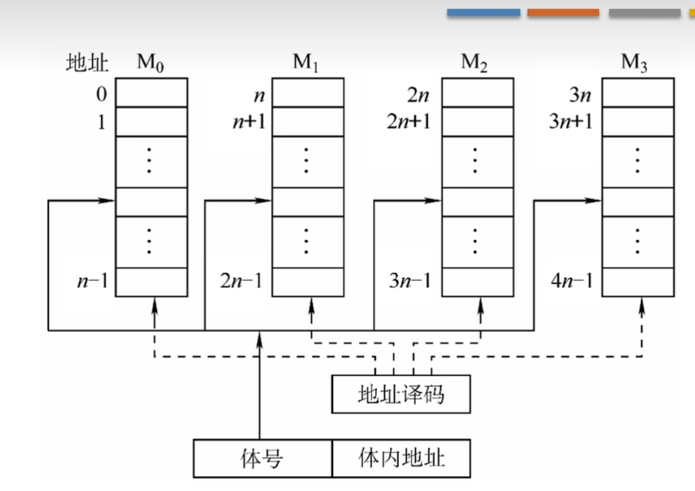
通过高位交叉编址实现

高位地址为模块号（体号），低位为体内地址。

访问一个**连续**主存块时，总是现在一个模块内访问。因为CPU按顺序访问存储库，各模块不并行，**无法提高存储器吞吐率**

#### 交叉编址方式
> 在王道旧教材也叫低位交叉编址

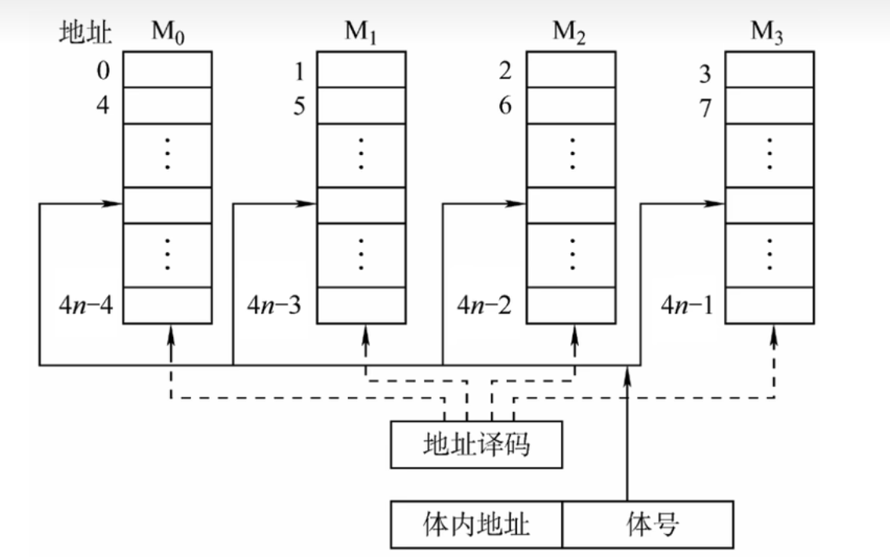
低位交叉编制实现

低位地址为体号，高位地址为体内地址。

访问连续地址可让多个相同的存储模块共同工作，**显著提高存储器吞吐率**
>   因为访问之后无需等待恢复时间，可以直接到下一存储体去进行操作。

假设按 $1/m$ 个存取周期轮流启动各模块，存 $m$ 字的时间为 $T+(m-1)r$

当存取周期为 $T$，存取时间为 $r$ 时，为了保证不间断，模块数 $m \ge T/r$

##### 轮询启动方式
若每个模块一次读写的位数正好等于数据总线位数，模块的存取周期为 $T$，总线周期为 $r$，则为实现轮流启动方式，存储器交叉模块应满足 $$ m = \dfrac{T}{r} $$
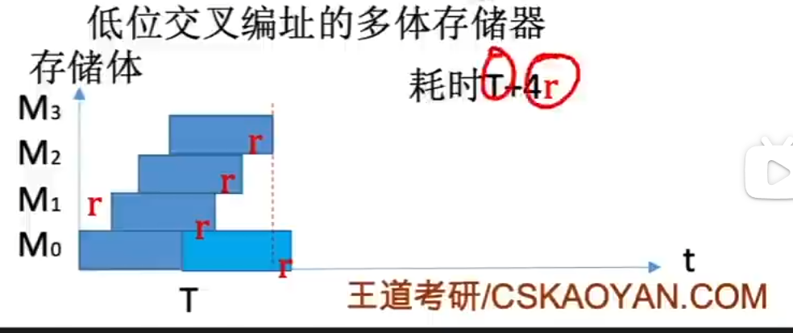

按每隔 $1/m$ 个存取周期启动各模块，则每个 $1/m$ 个存取周期可以读写一个数据，存取速度提高 $m$ 倍

连续存取 $m$ 个字所需的时间为 $t = T+(m-1) r$

##### 同时启动方式
当所有存储模块一次并行读写的总位数恰好等于存储器总线宽度时，可采用同时启动方式

并行访问要求数据来自地址对齐的块

## 主存储器与CPU的链接

### 链接原理
主存储器通过**数据总线、地址总线**和**控制总线**与CPU相连
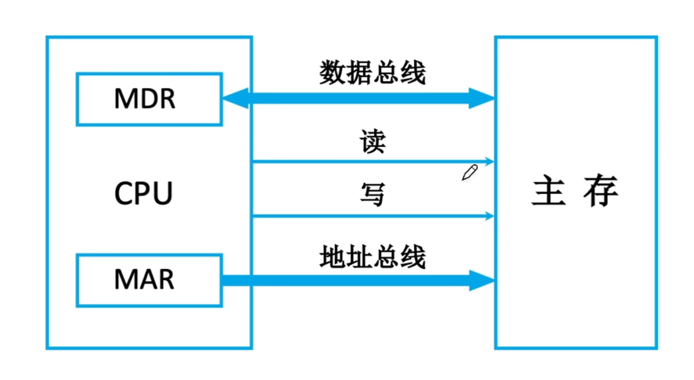

数据总线位数与工作频率绝对数据传输速率

地址总线位数觉得了CPU可寻址的最大内存空间

控制总线因存储器类型而异
-   SRAM芯片通常包含片选和读写控制信号
-   ROM芯片仅需片选线
-   DRAM芯片不设片选线，芯片选择可通过行列地址选通或外部译码实现

#### 信号线名称
$A_0 \sim A_n$ 地址线
$D_0 \sim D_n$ 数据线

片选线 $CS,CE$ 或 $\overline{CS}, \overline{CE}$，前者高电平有效
读写线 $\overline {WE}$ 或 $\overline{WR}$
-   也可能分为 $\overline{WE}$ 与 $\overline{OE}$，分别代表读和写
#####
### 主存容量拓展
对于 $a \times b$ bit 的芯片，其容量为 $a \times b$ bit，$a$ 一般为 $K$ 量级

#### 位扩展
用于增加存储字的长度，适用于CPU数据总线宽度大于单个芯片位宽的情况。通过并联多个芯片，使其匹配。

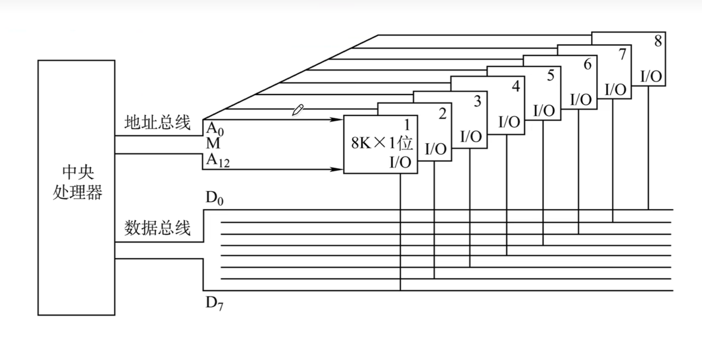
如图，地址总线并联（共用），每个芯片介入一根地址总线（恰好对应一位）。
> 无需片选线，因为各个片相同的地址的位共同存储一B信息

这样把八片 $8K \times 1$ bit 的存储芯片，组装成了一个 $8K \times 8b$ 的存储器，容量 $8KB$

#### 字扩展
用于增加存储单元的数量（扩大地址空间），而存储字的位数已满足系统要求。此时系统数据总线宽度等于芯片数据位宽度，而地址总线位数多于芯片地址线位数。
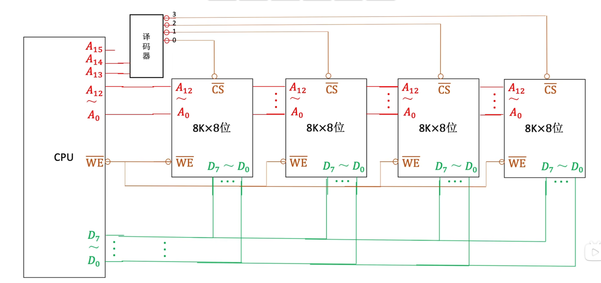
如图，数据总线和地址总线**低位**并联，高位地址线产生片选信号接入译码器决定选择对应存储芯片。 
> **注意**：字扩展后可能仍有地址线剩余，也就是说可能有多个合法地址对应一个芯片内数据，比如图中 $000...$ 与 $100...$ 都对应芯片 $0$ 的 $00...$ 地址，因为 $A_{15}$ 未接线。

|线选法|译码片选法|
|:-:|:-:|
|$n$ 线 $\to n$ 片选信号|$n$ 线 $\to 2^n$ 片选信号|
|电路简单|电路复杂|
|地址空间不连续|地址空间**可连续**|

> 所以实际应用都是片选法
#####
### 字位同时扩展
先将位扩展的芯片视作一个逻辑单元，在对这些单元进行字扩展。
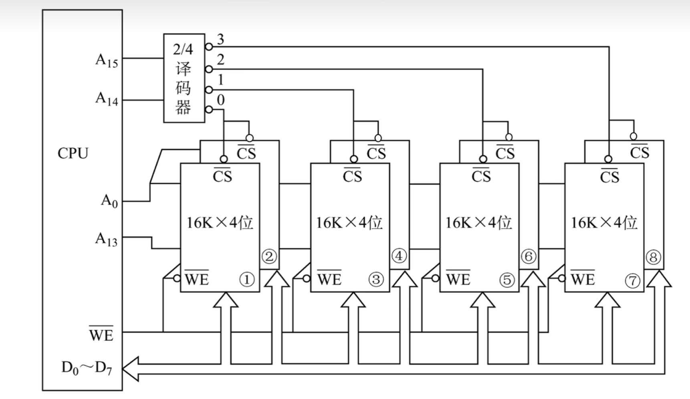
CPU可以控制使能端来控制译码器是否工作，从而控制片选信号的生效时间

## 外部存储器
### 磁盘存储器
采用磁盘作为存储介质

-   **优点**
    -   容量大，位价格低
    -   可重复使用
    -   长期保存不丢失，甚至脱机存档
    -   非破坏性独处
-   **缺点**
    -   存取速度慢
    -   机械结构复杂
    -   环境要求高

#### 磁盘设备的组成

##### 磁盘存储器的组成
由磁盘驱动器，磁盘控制器和盘片组成
-   **磁盘驱动器** 驱动磁盘旋转并通过磁头在盘面执行读写操作。
-   **磁盘控制器** 驱动器与主机之间的接口。
######

##### 存储区域
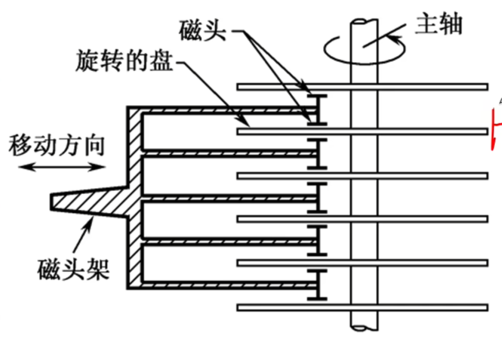
一块磁盘有若干个记录面，每个记录面划分为若干磁道，每条磁道有划分为若干扇区，扇区（块）是读写的最小单位，也就是说磁盘按块读写。
-   记录面数：代表磁头数量
-   柱面数：表示单个及路面上的磁道数量，所有记录面上相同变化的磁道构成一个柱面
-   扇区数：每条磁道所包含的扇区数量。**扇区是磁盘读写的最小单位**
######

##### 磁盘高速缓存
在内存中开辟一部分空间，用于暂存待写入磁盘的数据

**优点**：磁盘一簇（若干连续扇区组成）为单位进行写操作，缓存可减少频繁的小块写入；同时中间结果若在写回签再次被使用，可直接从缓存中读取

#### 磁盘的性能指标
##### 记录密度
盘片单位面积上记录的二进制信息量。
-   **道密度**是沿磁盘半径方向单位长度上的磁道数
-   **位密度**是磁道单位长度行能记录的二进制代码位数
-   **面密度**是位密度和道密度的乘积

**同一个扇区或者说磁道的信息量一定相等，所以每个磁道的位密度都不同**
######

##### 磁盘的容量
一个磁盘所能存储的字节总数。
分为非格式化容量和格式化容量。

**非格式化容量** $=$ 记录面数 $\times$ 柱面数 $\times$ 每磁道磁化单元数

**格式化容量** $=$ 记录面数 $\times$ 柱面数 $\times$ 每道扇区数 $\times$ 每扇区字节数

**非格式化容量 $>$ 格式化容量**，因需预留删去间隙，同步字段等格式开销

##### 响应时间和存取时间
**响应时间** $=$ 排队延迟 $+$ 控制器时间 $+$ 存取时间

**平均存取时间** $=$ 
-   寻道时间（磁头移动到目的磁道时间，平均寻道时间为最大的一半）$+$ 
-   旋转延迟时间（磁头定位到所在扇区）$+$
-   传输时间（传输数据花费）

> 题目中寻道时间一般给出平均时间，旋转延迟可以取半圈时间
> 有些题目需要加上磁盘控制器的延迟
######

##### 数据传输率
磁盘存储器在单位时间内向数据传输数据的字节数。

假设磁盘转速 $r$（转/s），每条磁道容纳 $N$ 字节，则
**数据传输率 $D_r = rN$**
> 理论最大值

#### 磁盘地址
驱动器号 | 柱面（磁道）号 | 盘面号 | 扇区号
-|-|-|-

> 驱动器号针对多个磁盘，单盘无此项
#####

#### 磁盘工作过程
主要操作是寻址、读盘、写盘。每个操作对应一个控制字，硬盘工作时，第一步取控制字，第二部执行控制字。

由于磁盘属于机械式部件，所以读写操作位串行执行。

#### 磁盘阵列
RAID（独立冗余磁盘整列） 是将多个独立的物理磁盘组成一个独立的逻辑盘，数据在多个物理盘上分割交叉存储、并行访问，具有更好的存储性能，可靠性和安全性。

RADI分级如下，在 $1 \sim 5$ 的几种方案，无论何时有磁盘损坏，都可以随时拔出受损磁盘再插入好的磁盘，数据不会损坏。
-   RAID0：无冗余和无校验
-   RAID1：镜像磁盘阵列 $1:1$
-   RAID2：采用纠错的海明码 $4:3$
-   RAID3：位交叉奇偶校验
-   RAID4：块交叉奇偶校验
-   RAID5：无独立校验的奇偶校验
#####

### 固态硬盘
SSD，**基于闪存**技术Flash Memory

一个SSD由一个或多个闪存芯片以及闪存翻译层组成，**闪存芯片**代替了传统磁盘的机械驱动器；**闪存翻译层**负责将CPU发出的逻辑块读写请求转换为底层物理闪存的读写控制信号

**闪存翻译层**
负责翻译逻辑块号，找到对应页（Page）。

读写单位是**页**

**存储介质**

多个闪存芯片，每个芯片包含多个块，每个块包含多个页。

#### 读写性能特性
-   以页为单位读写
    相当于磁盘的扇区
-   以块为单位擦除，擦除后的块，每页可以**写一次**，读无限次
-   支持随机访问
-   读块，写慢。
    要写的页如果有数据，需要将块内页复制到一个**新的块**，再写入新的页。
    并且会修改逻辑块号的映射关系
#####

#### 与机械硬盘相比的特点
-   读写速度块，随机访问性能高
-   安静无噪音，耐摔抗震，能耗低但是造价贵。
-   **一个块被多次擦除，可能会坏**，机械硬盘的扇区不会因为多次写而坏掉
#####

#### 磨损均衡
将擦除操作平均分布到各个块上，以提升使用说明。
**动态磨损均衡**
写入数据时，优先选择累计擦除次数少的新闪存块。
**静态磨损均衡**
老闪存块承担以读为主的存储任务，而新闪存块承担更多写任务。

## 高速缓冲存储器

## **Cache**
高速缓存Cache具有比主存更快的访问速度，在CPU和主存之间设置Cache可以显著提升存储系统的整体效率

Cache由SRAM组成，通常集成在CPU内部

### 局部性原理
-   **时间局部性**：如果某条指令或数据项当前被访问，则在不久的将来很可能再次被访问。
-   **空间局部性**：如果某存储单元被访问，则其临近的存储单元在不久的将来也很可能被访问。
####

### Cache 的基本工作原理
将准存和Cache都划分为**大小相等的块**，Cache块也称为Cache行，每块由若干字节组成，块的长度称为**块长**。**主存与Cache直接以块为单位进行数据交换**

#### 访问过程
CPU执行程序时，每当需要从主存取数据，首先访问Cache。若信息已在Cache中（称**Cache命中**），无需访问主存；若未命中，则从主存中将改地址所在块调入Cache，并写入一个Cache行。

**整个访问过程在单条指令周期完成，因此完全由硬件实现。** 

Cahce机制**对程序员是透明的**。
> 考试一般按 先查Cache，未命中再查主存
> 同时查Cache和主存的并行访问考试通常不涉及

#### 命中率分析
**Cache命中率 $H$**：CPU想要访问的信息已经在Cache中的比率
缺失率（未命中率）$M = 1-H$

设执行期间，Cache命中次数为 $N_c$，访问主存次数 $N_m$（未命中次数）：$$ H = \dfrac{N_c}{N_c+N_m} $$

**平均访问时间：**
设命中耗时 $T_c$，未命中总耗时 $T_m + T_c$，则平均访问时间：$$ T_a = HT_c + (1-H)(T_m+T_c) = T_c + (1-H)T_m $$
> 此为先访问Cache，在访问主存
若是两者同时访问，则耗时 $T_a = Ht_c + (1-H)t_m$

### Cache和主存的映射方式
Cache只能存放主存中部分块的副本，<u>为识别每个Cache行对应哪个主存块，需要为每行设置一个标记位</u>，**记录其主存块编号**；同时**设置一位有效位**，用于指示该行数据是否有效。
-   系统启动或复位时，所有Cache行均无效；
-   仅当主存块装入某Cache行，有效位才置 $1$。

地址映射是指将主存地址空间按一定规则映射到Cache地址空间。
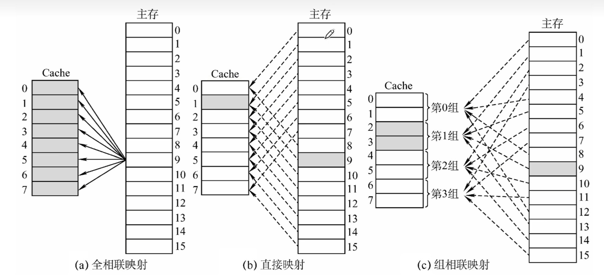
#### 直接映射
主存每一块只能装入Cache中的**唯一指定位置**。若该位置已有内容，则发生块冲突，直接**无条件替换**（无需替换算法）。

**映射关系式：** Cache行号 $=$ 主存块号 $\bmod$ Cache总行数
因为Cache总行数是 $2^x$，所以主存低 $x$ 位即为其对于的Cache行号
因此，Cache根本不需要存储末位 $x$ 位的信息。

**优点** 实现简单
**缺点** 灵活性差，**块冲突概率最高**，**空间利用率最低**。

**地址结构**
|标记|Cache行号|块内地址|
|-|-|-|
> 表示一个地址单元（一般为一个字节）的地址
#####

#### 全相联映射
主存块可以放在Cache的**任意位置**。每行的标记用于指出该行来自主存的哪一块，所以访存时需要与所以Cache行的标记进行比较。

**访存过程**
首先将主存地址的高位标记与Cache各行的标记进行比较，若有一个项的且有效位为 $1$，则Cache命中；若不相等或有效位为 $0$，则未命中，需要从主存读出该地址并放入，后有效位置 $1$。

通常为每个Cache行都设置一个**比较器**，**比较器位数等于标记字段长度**。访存是根据标记字段的内容访问Cache行的主存块，因此其查找过程是一种**按内容访问**的存取方式，属于**相联存储器**

**优点** 冲突概率低，空间利用率高，命中率高；
**缺点** 标记比较速度慢，实现成本高（通常需要按内容寻址的相联存储器）。

**地址结构**
|$\qquad\qquad\qquad$ 标记 $\qquad\qquad\qquad$|块内地址|
|-|-|

#####
#### 组相联映射
Cache划分为 $Q$ 个大小相等的组，每个主存块只能映射到固定组的任意一行。
> 也就是组间直接映射，组内全相联

**映射关系式：** Cache 组号 $=$ 主存块号 $\bmod$ Cache组数 $Q$

$n$ 路组相联映射 - $n$ 个Cache行作为一组。

$n$ 越大，组内位置越多，冲突率越低，但是所需的比较器数量和控制逻辑也越复杂。
合理选自 $n$，可以是的硬件成本接近直接映射同时，性能接近全相联映射。

|$\qquad\qquad\qquad$标记$\qquad\qquad\qquad$|组号|块内地址|
|-|-|-|
#####

### Cache替换算法
直接映射无需考虑替换算法，只有另外两种需要考虑。
-   全相联映射在Cache全满才需要替换
-   组相联映射在组内全满时替换

#### 随机（RAND）算法
随机选择一个Cache行进行替换。

未利用程序访问的局部性原理，命中率较低。

#### 先进先出（FIFO）算法
替换最早装入的Cache行。

未利用程序访问的局部性原理，早装入的可能是热点数据，命中率不高。

#### 最近最少使用（LRU）算法
替换**最近最久未被访问**的Cache行。

**命中率高于前两者，且是==考察重点==**

LRU算法为每组Cache维护一组计数器（LRU替换位），记录个Cache行的相对访问顺序。$n$ 路组需要 $\log_2(n)$ 位LRU位。

**更新规则**
-   命中时，命中行的计数器清零，比该行低的计数器 $+1$，其他行不变；
    > 这样可以保持计数器仍然是排列
-   未命中且有空闲行，新装入的行置 $0$，其他非空闲行 $+1$；
-   未命中且无空闲行，替换计数器值最大的行，新装入置 $0$，其他 $+1$。
#####

#### 近期不常使用（LFU）算法
替换一段时间内累计访问次数最少的Cache行。

**更新规则**
每行设置一个计数器，新行装入时计时器初始化 $0$，每次访问 $+1$；替换时选则计数器值最小的行。

因为经常访问的块，未来未必用到，所以效果不如LRU。

### Cache一致性问题（写策略）
因为Cache是主存块的副本，当对Cache进行写操作，需要才有适当的**写策略**，**维持Cache主存数据的一致性**。

#### 写命中的处理方法

##### 全写法
数据**同时**写入Cache和主存。

**优点**：保证主存数据的实时正确
**缺点**：每次写都需要访问主存，降低了系统性能。

**写缓冲**
> 可以用SRAM实现的FIFO队列

为了解决性能问题，可以在Cache和主存之间增设写缓冲。
CPU将数据同时写入Cache和写缓冲，写缓冲异步地将数据写入主存。可缓解CPU与主存之间的速度差异。
但是在高频写操作下，写缓冲可能饱和甚至溢出。

##### 回写法
> 也称写回法

当写命中时，仅将数据写入Cache，在该行被替换出Cache时才写回主存。

**优点**：保证Cache效率
**缺点**：存在数据不一致风险

**修改位**
为了避免不必要的写回操作，对每个Cache行设置一个修改位（脏位），修改为为 $1$ 才需要写回主存。
#### 不命中的处理方法
##### 写分配法
先将数据写入主存对应块，然后**将主存块调入Cache**的一个空闲行。
**通常搭配写回法**

利用了空间局部性，但是每次不命中都需要加载块到Cache。
##### 非写分配法
直接将数据写入主存，**不将主存块调入Cache**
**通过搭配全写法**

### Cache容量计算
Cache总容量 $=$  (每行标记位数 $+$ 每行数据位数) $\times$ Cache总行数。

**标记位数**包含有效位，标记位，脏为，LRU替换位。
### Cache应用
#### 分离Cache
将**指令Cache**和**数据Cache**分开，形成**分离Cache**结构。

因为取指部件和执行部件同时访问同一Cache容易发生冲突，采用分离Cache结构，不仅可以消除冲突，还可以对指令和数据的不同局部性特征进行优化。

#### 多级Cache
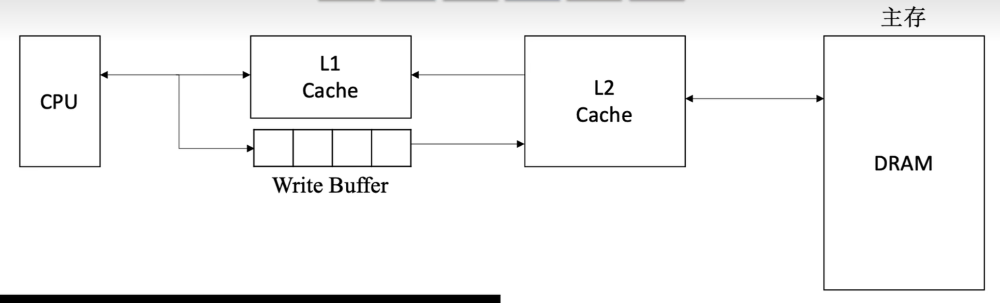
离CPU越近，速度越快，容量越小。
-   通常各级Cache采用全写法+非写分配法
-   Cache-主存采用写回法+写分配法
#####

## 虚拟存储器（见OS）
