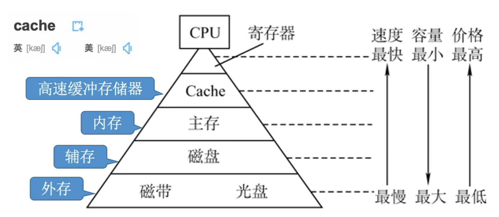

# 存储器概述

辅存中的数据要调入主存后才能被CPU访问
> 有点教材会把辅存和外存统称为一种

主存 - 辅存：实现虚拟存储系统，解决了主存容量不够的问题。
Cache-主存：解决了主存与CPU速度不匹配的问题。

## 存储器的分类
### 层次
-   高速缓存 Cache
-   主存储器（主存，内存）
-   辅助存储器（辅存，外存）

前两者可以被CPu读写

### 存储介质
-   半导体
    主存、Cache
-   磁性材料
-   光存储器

### 存取方式
随机存取存储器 RAM，Random Access Memory，读写任何一个存储单元的所需时间都相同，与物理位置无关。

顺序存取存储器 SAM，读写时间取决于单元的物理位置

直接存取存储器，有上两者特性。先直接选取信息所在区域，然后按顺序方式进行存取。

-   串行访问存储器：读写时间与位置有关

相联存储器：可以按照内容访问的存储器，可以按照内容检索到存储位置进行读写。

### 信息可更改性
读写存储器
只读存储器

### 可保存性
易失性存储器，断电后存储信息消失 - 主存，Cache
非易失性存储器，端点后村粗信息保持 - 磁盘、光盘

破坏性独处 - 信息读出后，原存储信息被破坏
非破坏性独处

## 存储器的性能指标
### 存储容量
存储字数 $\times$ 字长

### 单位成本
每位价格 $=$ 总成本 $\div$ 总容量

### 存储速度
**数据传输率** $=$ 数据的宽度 $\div$ 存储周期

**存储周期：**
存取时间 $T_a$ 是指从启动一次存储器操作到完成该操作所经历的时间。
但是完成一次操作后需要一定的恢复时间，存取周期 $T_m$ 就是 $T_a$ 与恢复时间的和，或者说是一次完整的读写操作所需的**全部时间**，或者说存储器进行连续读写操作所允许的最短时间间隔。