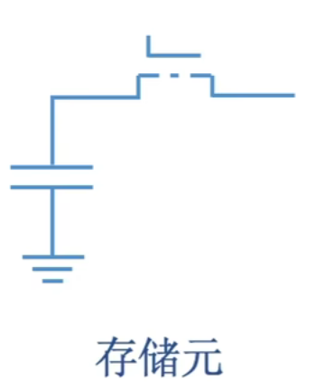
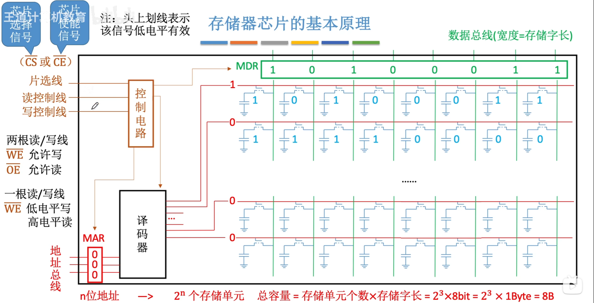
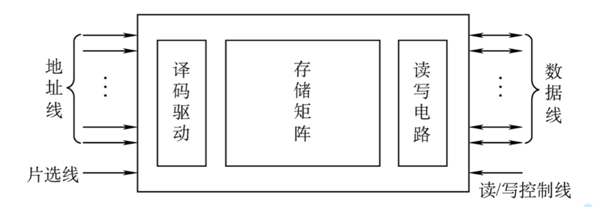
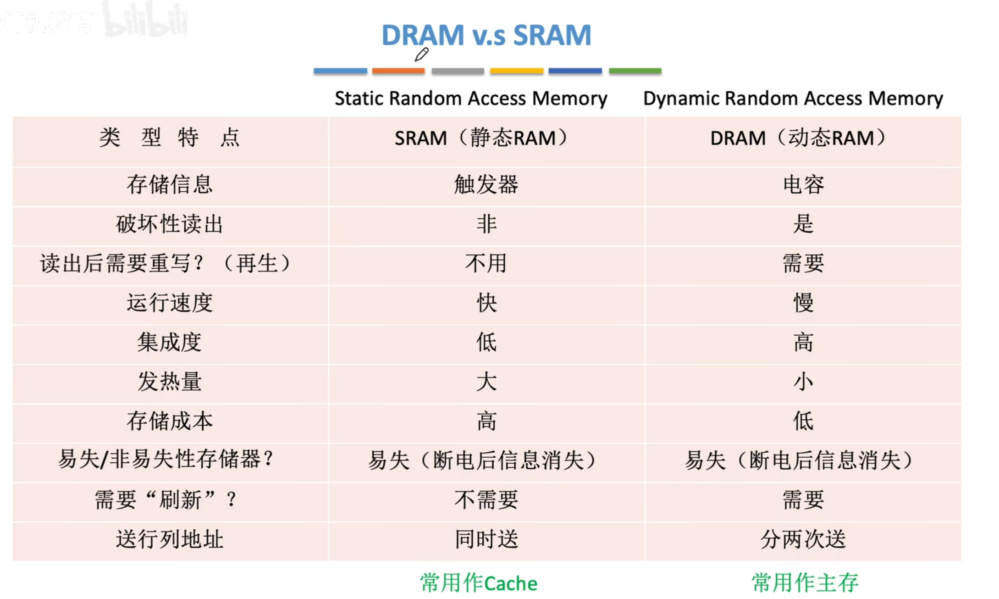
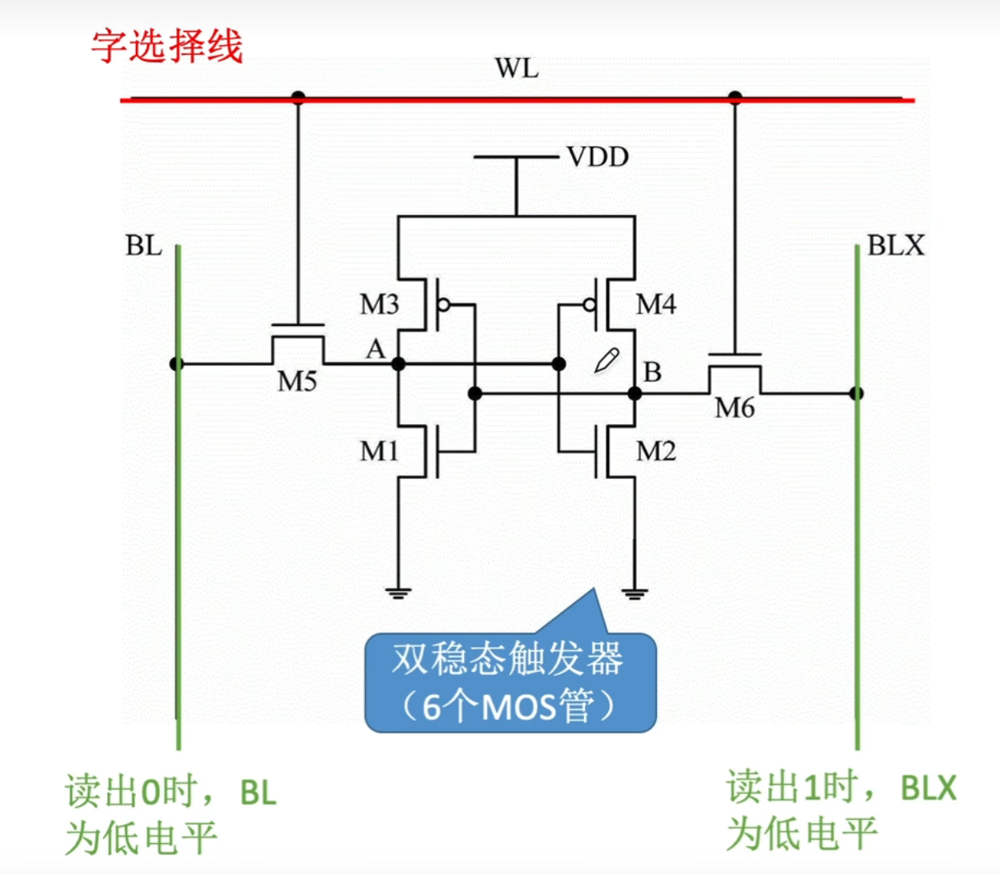
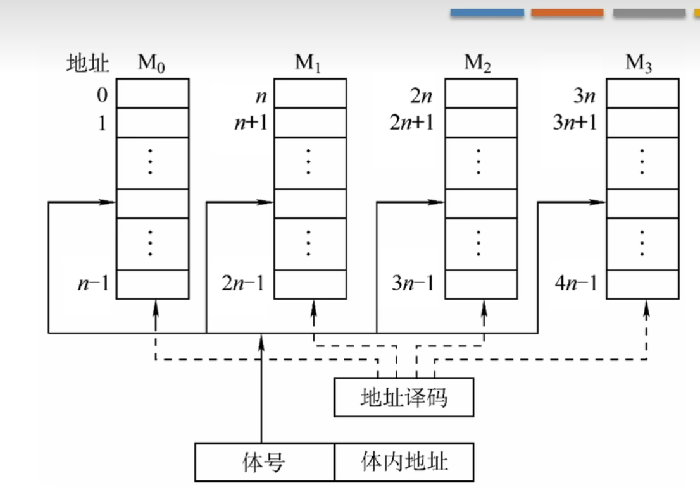
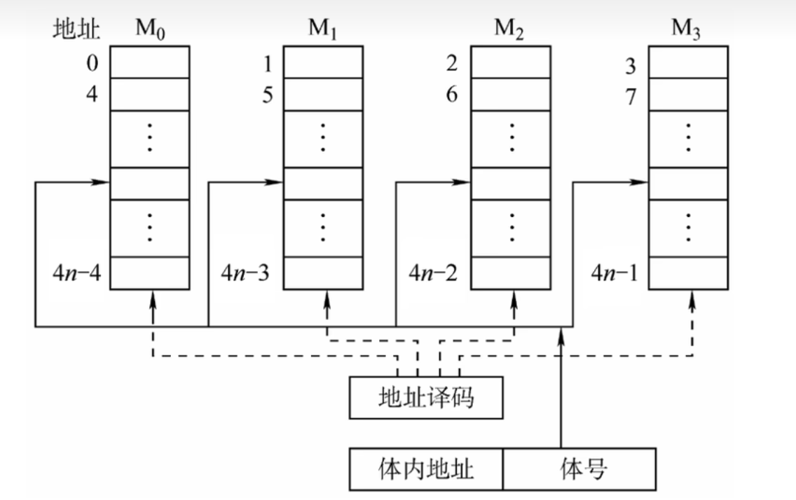

# 主存储器
## 主存储器的基本组成

### 存储器芯片的基本原理

此图每根线都会对应一个金属引脚。
此外，还有供电引脚，接地引脚。

> 可能会考“图示芯片有多少金属引脚”

$n$ 位地址 $\to$ $2^n$ 个存储单元。

总容量 $=$ 存储单元个数 $\times$ 存储字长

### 寻址
存储矩阵按字节编地，但是也支持（以总容量 $1KB$ 为例）：
-   按字节寻址：$1K$ 单元，每单元 $1B$
    对应十根地址线
-   按字寻址：$256$ 单元，每单元 $4B$
    字地址 $\times 4$（或者说是左移 $2$ 位）即字节地址
-   按半字寻址：$512$ 单元，每单元 $2B$
-   按双字寻址：$128$ 单元，每单元 $8B$

## RAM

RAM 分为 SRAM（静态）与 DRAM（动态）

两者均为易失性存储器。现在计算机，主存主要采用DRAM，Cache使用SRAM

### 差异
存储元不同
DRAM使用栅极电容，**破坏性读出**，读出后应该有重写操作，也称为“再生”
SRAM使用双稳态触发器，**非破坏性读出**

所以前者的读取速度要慢于后者，但是因为后者需要的元件更多（$6$ 个MOS管），所以成本更高，而且集成度低，功耗大

**刷新：** 电容内电荷只能维持极短时间（$5ms$），所以在此时间内必须“刷新”一次

**现在的主存通常采用SDRAM**，比如DDR3，DDR4
### DRAM
上文主存储器的芯片就是DRAM
**栅极电容存储**，价位低，功耗小，容量大。
但是存取速度慢，且必须**刷新**·
#### DRAM 的刷新
刷新周期：$2ms$
每次刷新多少？以行为单位，每次刷新一行。
>   为什么要用行列地址？
    如果排成一列，译码器就需要 $2^n$ 选通线
    但是如果排列成 $2^{n/2} \times 2^{n/2}$ 的矩阵，行列矩阵的译码器只需要 $2^{n/2}$ 根选通器

如何刷新？有硬件支持，读出一行的信息后重新写入，占用 $1$ 个读/写周期。

什么时刻刷新？假设DRAM内部结构 $128 \times 128$，读写周期 $0.5us$，$2ms$ 有 $4000$ 个周期。
-   **分散刷新**：每次读写完都刷新一行，会是的存取周期翻倍。
-   **集中刷新**：$2ms$ 内集中安排时间全部刷新，这样不好改变存取周期，
    但是会有一段时间专门用于刷新，无法访问存储器，称为访存“死区”
-   **异步刷新**：$2ms$ 内每行刷新一次，将刷新时间分散到 $2ms$，约 $15.6 us$ 有 $0.5us$ 的死时间 

#### DRAM 的地址线复用技术
使用 $n/2$ 根地址线，第一次送入行地址缓冲器，第二次送入列地址缓冲器。然后再一同送入两者的译码器。

这样行列地址分两次送，可使地址线更少，芯片引脚更少（**地址线引脚减半**）。
#### 引脚计算
考虑地址复用技术：
容量为 $M \times N$ 的
地址引脚 $\dfrac{1}{2} \times \log_2 (M)$，**但是总数需要加一根行列选通线**
数据引脚 $N$

### SRAM
**双稳态触发器**

双稳态指
-   1 - A高B低
-   0 - B高A低
#### 引脚计算
容量为 $M \times N$ 的
地址引脚 $\log_2 (M)$
数据引脚 $N$
# 只读存储器
ROM 芯片，非易失性，断电后数据不丢失。

## 各种 ROM 介绍
-   **MROM** - 掩模式只读存储器
    厂商在芯片生产过程中直接写入信息，之后**任何人不能重写**，只能读出
    可靠性高，灵活性查，生产周期长，只适合批量定制
-   **PROM** - 可编程只读存储器
    使用专门的PROM读写器写入信息，写**一次后不可更改**
-   **EPROM** - 可擦除可编程只读存储器
    允许用户写入信息，并用某种方法擦除数据，**可以镜像多次重写**
    -   UVEPROM - 紫外线照射 $8 \sim 20 \text{min}$ 可擦除所有信息
    -   EEPROM（E$^2$PROM），可用电擦除方式擦除特定的字。
-   Flash Memory - 膳宿存储器（比如U盘，SD卡）
    在 EEPROM 基础上发展而来，断电后也能保存信息，且可以进行多次**快速擦除重写**
    *注意：闪存需要先擦除再写入，所以写速度慢于读*
    > 存储元只需要单个 MOS 管，位必读高于RAM
-   SSD - 固态硬盘
    控制单元+存储单元（Flash芯片）构成，与闪存的核心区别在于控制单元不同，**可以进行多次快速擦除重写**。SSD速度快，功耗低，价格高。

## 计算机重要的ROM
主板上的BIOS芯片（ROM）存储了“自举装入程序”，负责引导装入操作系统（开机）

>   常说的内存条就是主存，但是主办上的ROM芯片（BIOS）也是主存的一部分

主存由RAM+ROM组成，且两者常统一编制（比如ROM占0开始位置，RAM再占后面位置）

# 多模块存储器
## 连续编址方式

通过高位交叉编址实现

高位地址为体号，低位为体内地址。

访问一个连续主存块时，总是现在一个模块内访问。因为CPU按顺序访问存储库，各模块不并行，**无法提高存储器吞吐率**
## 交叉编址方式

低位交叉编制实现

低位地址为体号，高位地址为体内地址。

**显著提高存储器吞吐率**
>   因为访问之后无需等待恢复时间，可以直接到下一存储体去进行操作。

假设按 $1/m$ 个存取周期轮流启动各模块，存 $m$ 字的时间为 $T+(m-1)r$

当存取周期为 $T$，存取时间为 $r$ 时，为了保证不间断，模块数 $m \ge T/r$