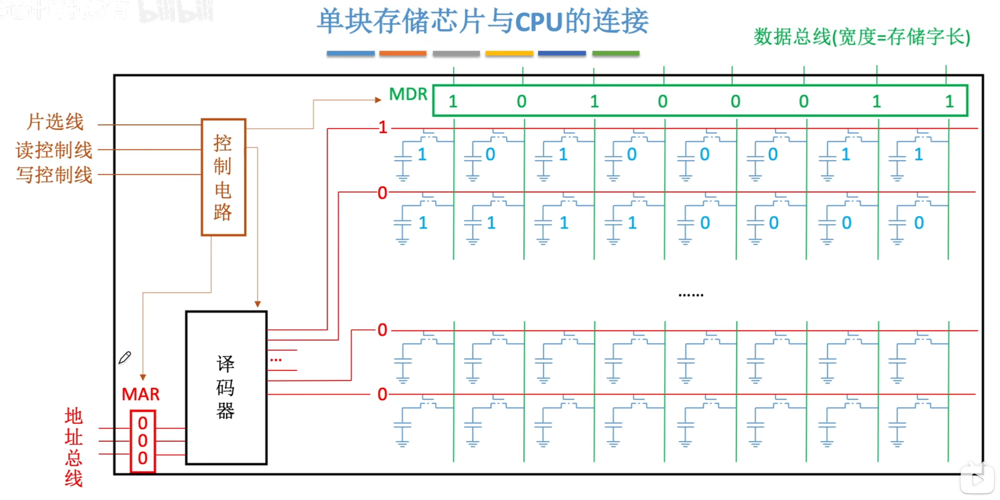
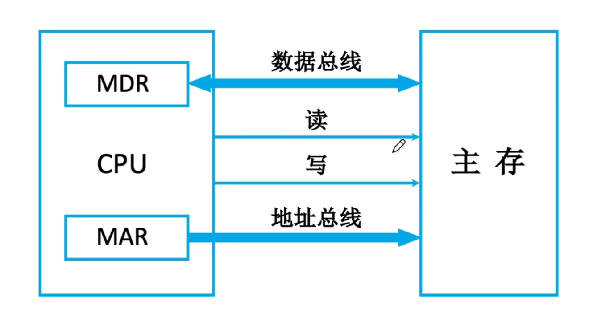
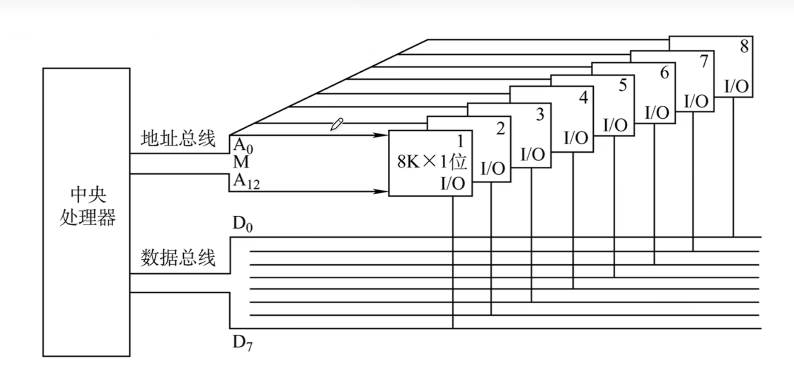
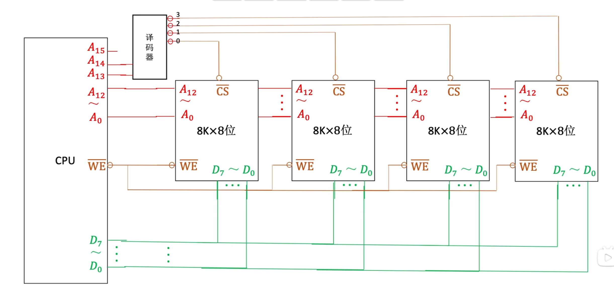
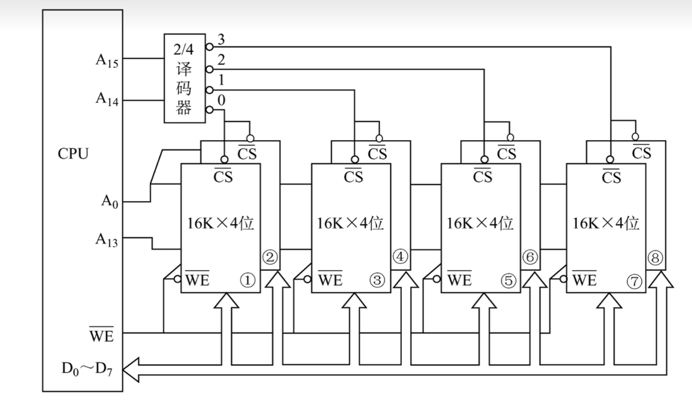
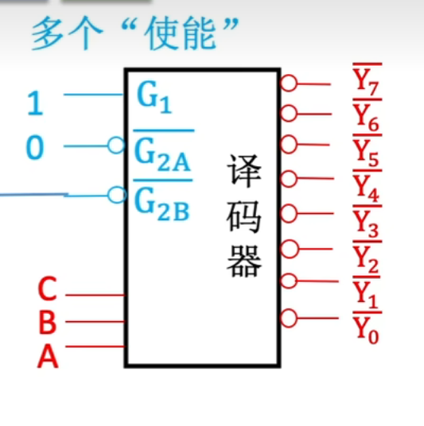

# 主存储器与CPU的链接
## 单块存储芯片与CPU的链接

MDR和MAR集成在CPU中，虽然此处描述在芯片中

想要扩展主存字数 - 字扩展

数据总线宽度 > 存储字长 - 位扩展 

## 链接原理

主存储器通过**数据总线，地址总线和控制总线**与CPU相连，三者协同完成数据传输，地址定位与操作控制。

> 主存一般包含多块存储芯片

### 信号线
$A_0 \sim A_n$ 地址线
$D_0 \sim D_n$ 数据线

片选线 $CS,CE$ 或 $\overline{CS}, \overline{CE}$，无线高电平有效
读写线 $\overline {WE}$ 或 $\overline{WR}$
-   也可能分为 $\overline{WE}$ 与 $\overline{OE}$，分别代表读和写

****
## 主存容量的扩展
### 位扩展
用于增加存储字的长度，适用于CPU数据总线宽度大于单个芯片位宽的情况。通过并联多个芯片，使其匹配。

如图，地址总线并联（共用），每个芯片介入一根地址总线（恰好对应一位）。
> 无需片选线，因为各个片相同的地址的位共同存储一B信息

这样把八片 $*K \times 1b$ 的存储芯片，组装成了一个 $8K \times 8b$ 的存储器，容量 $8KB$

### 字扩展
用于增加存储电源的数量（扩大地址空间），而存储字的位数已满足系统要求。此时系统数据总线宽度等于芯片数据位宽度，而地址总线位数多于芯片地址线位数。

如图，数据总线和地址总线**低位**并联，高位地址线产生片选信号接入译码器决定选择对应存储芯片。 
> **注意**：字扩展后可能任然有地址线剩余，也就是说可能有多个合法地址对应一个芯片内数据，比如图中 $000...$ 与 $100...$ 都对应芯片 $0$ 的 $...$ 地址，因为 $A_{15}$ 未接线。

|线选法|译码片选法|
|:-:|:-:|
|$n$ 线 $\to n$ 片选信号|$n$ 线 $\to 2^n$ 片选信号|
|电路简单|电路复杂|
|地址空间不连续|地址空间**可连续**|

> 所以实际应用都是片选法
### 字位同时扩展
先将位扩展的芯片视作一个逻辑单元，在对这些单元进行字扩展。

CPU可以控制使能端来控制译码器是否工作，从而控制片选信号的生效时间

## 译码器

如图为74ls138
当 $G_1$ 为 $1$ 或者 $\overline G_{2A} | \overline G_{2B} = 0$ 时，译码器才正常工作

## 注意
接线注意是否有 $\circ, \overline x$，防止判断错位。

**注意译码器的接线，以及空闲的地址线**

## WA
P99
### 6
一般都是介入低位，然后此处低位为 $A_{15}$。
***文字游戏恶心***

### 12
MAR应该保证访问整个主存空间。

