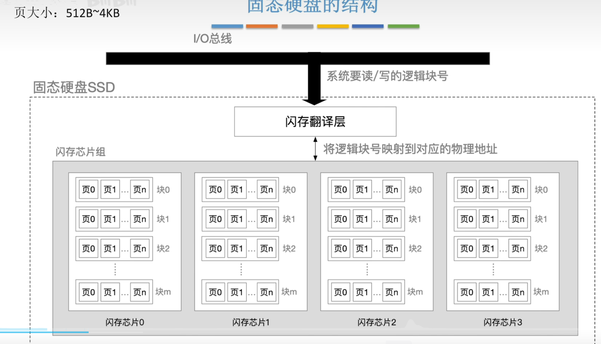

# 外存储器
外存储器又称为辅助存储器
## 磁盘存储器
磁盘存储器、磁带存储器和此柜存储器均属于磁表面存储器。

**磁表面存储**
是把某些磁性材料薄薄地涂在金属铝或塑料表面上作为载磁体来存储信息。每次读写均为 $1bit$

-   **优点**
    -   容量大，位价格低
    -   可重复使用
    -   长期保存不丢失，甚至脱机存档
    -   非破坏性独处
-   **缺点**
    -   存取速度慢
    -   机械结构复杂
    -   环境要求高

### 磁盘设备的组成
分为磁盘驱动器，磁盘控制器和盘片
**磁盘驱动器** 驱动磁盘旋转并通过磁头在盘面执行读写操作。
**磁盘控制器** 驱动器与主机之间的接口。

**存储区域**
一块磁盘有若干个记录面，每个及路面划分为若干磁道，每条磁道有划分为若干扇区，扇区（块）是读写的最小单位，也就是说磁盘按块读写。
-   记录面数：代表磁头数量
-   柱面数：表示单个及路面上的磁道数量，所有记录面上相同变化的磁道构成一个柱面
-   扇区数：每条磁道所包含的扇区数量。**扇区是磁盘读写的最小单位**

### 磁盘的性能指标
#### 磁盘的容量
一个磁盘所能存储的字节总数。
分为非格式化容量和格式化容量。
> 非格式化 $>$ 格式化

#### 记录密度
盘片单位面积上记录的二进制信息量。
-   **道密度**是沿磁盘半径方向单位长度上的磁道数
-   **位密度**是磁道单位长度行能记录的二进制代码位数
-   **面密度**是位密度和道密度的乘积

**同一个扇区或者说磁道的信息量一定相等，所以每个磁道的位密度都不同**

#### 平均存取时间
平均存取时间 $=$ 
-   寻道时间磁头移动到目的磁道）$+$ 
-   旋转延迟时间（磁头定位到所在扇区）$+$
-   传输时间（传输数据花费）

> 题目中寻道时间一般给出平均时间，旋转延迟可以取半圈时间
> 有些题目需要加上磁盘控制器的延迟

**响应时间**
响应时间 $=$ 排队延迟 $+$ 控制器时间 $+$ 存取时间

#### 数据传输率
磁盘存储器在单位时间内向数据传输数据的字节数。

假设磁盘转速 $r$（转/s），每条磁道容纳 $N$ 字节，则
**数据传输率 $D_r = \dfrac{r}{N}$**
> 理论最大值

### 磁盘地址
驱动器号 | 柱面（磁道）号 | 盘面号 | 扇区号

> 驱动器号针对多个磁盘

### 磁盘工作过程
主要操作是寻址、读盘、写盘。每个操作对应一个控制字，硬盘工作时，第一步取控制字，第二部执行控制字。

由于磁盘属于机械式部件，所以读写操作位串行执行。

## 磁盘阵列
RAID 是将多个独立的物理磁盘组成一个独立的逻辑盘，数据在多个物理盘上分割交叉存储、并行访问，具有更好的存储性能，可靠性和安全性。

RADI分级如下，在 $1 \sim 5$ 的几种方案，无论何时有磁盘损坏，都可以随时拔出受损磁盘再插入好的磁盘，数据不会损坏。

-   RAID0：无冗余和无校验
-   RAID1：镜像磁盘阵列 $1:1$
-   RAID2：采用纠错的海明码 $4:3$
-   RAID3：位交叉奇偶校验
-   RAID4：块交叉奇偶校验
-   RAID5：无独立校验的奇偶校验

## 固态硬盘
SSD，基于闪存技术Flash Memory，输出电可擦除ROM，即EEPROM。

### 组成
**闪存翻译层**
负责翻译逻辑块号，找到对应页（Page）。

读写单位是**页**
**存储介质**

多个闪存芯片，每个芯片包含多个块，每个块包含多个页。

### 读写性能特性
-   以页为单位读写
    相当于磁盘的扇区
-   以块为单位擦除，擦除后的块，每页可以**写一次**，读无限次
-   支持随机访问
-   读块，写慢。
    要写的页如果有数据，需要将块内页复制到一个**新的块**，再写入新的页。
    并且会修改逻辑块号的映射关系

### 与机械硬盘相比的特点
-   读写速度块，随机访问性能高
-   安静无噪音，耐摔抗震，能耗低但是造价贵。
-   **一个块被多次擦除，可能会坏**，机械硬盘的扇区不会因为多次写而坏掉

### 磨损均衡
将擦除操作平均分布到各个块上，以提升使用说明。
**动态磨损均衡**
写入数据时，优先选择累计擦除次数少的新闪存块。
**静态磨损均衡**
老闪存块承担以读为主的存储任务，而新闪存块承担更多写任务。
