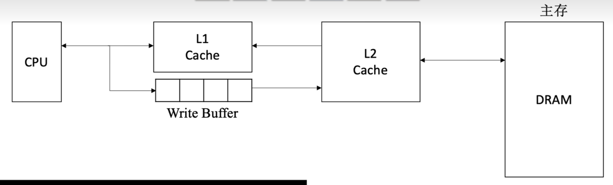

# Cache
## 程序访问的局部性原理
-   **时间局部性**：如果某条指令或数据项当前被访问，则在不久的将来很可能再次被访问。
-   **空间局部性**：如果某存储单元被访问，则其临近的存储单元在不久的将来也很可能被访问。

## Cache 的基本工作原理
### 访问过程
将准存和Cache都划分为**大小相等的块**，Cache块叶成文Cache行，每块由若干字节组成，块的长度称为块长。**主存与Cache直接以块为单位进行数据交换**

CPU执行程序时，每当需要从主存取数据，首先访问Cache。若信息已在Cache中（称Cache命中），无需访问主存；若未命中，则从主存中将改地址所在块调入Cache，并写入一个Cache行。

**整个访问过程在单条指令周期完成，因此完全由硬件实现。** Cahce机制对程序员是透明的。
> 同时查Cache和主存的并行访问考试通常不涉及

### 命中率分析
命中率 $H$：CPU想要访问的信息已经在Cache中的比率
缺失率（未命中率）$M = 1-H$

设执行期间，Cache命中次数为 $N_c$，访问主存次数 $N_m$（未命中次数）：$H = \dfrac{H_c}{H_c+H_m}$

**平均访问时间：**
设命中耗时 $T_c$，未命中总耗时 $T_m + T_c$。
则平均访问时间：$T_a = HT_c + (1-H)(T_m+T_c) = T_c + (1-H)T_m$
> 此为先访问Cache，在访问主存
若是两者同时访问，则耗时 $T_a = Ht_c + (1-H)t_m$

## Cache和主存的映射方式
为识别每个Cache行对应哪个主存块，需要为每行设置一个标记位，**记录其主存块编号**；同时**设置一位有效位**，用于指示该行数据是否有效。
-   系统启动或复位时，所有Cache行均无效；
-   仅当主存块装入某Cache行，有效位才置 $1$。

地址映射是指将主存地址空间按一定规则映射到Cache地址空间。
### 直接映射
主存每一块只能装入Cache中的**唯一指定位置**。若该位置已有内容，则发生块冲突，直接**无条件替换**（无需替换算法）。

**映射关系式：** Cache行号 $=$ 主存块号 $\bmod$ Cache总行数
因为总块数是 $2^x$，所以只需要截取块号的末位 $x$ 位即可。
因此，Cache根本不需要存储末位 $x$ 位的信息。

**优点** 实现简单
**缺点** 灵活性差，块冲突概率最高，空间利用率最低。

### 全相联映射
主存块可以放在Cache的任意位置。

**访存过程**
首先将主存地址的高位标记与Cache各行的标记进行比较，若有一个想的且有效位为 $1$，则Cache命中；若不相等或有效位为 $0$，则未命中，需要从主存读出该地址并放入，后有效位置 $1$。

**优点** 冲突概率低，空间利用率高，命中率高；
**缺点** 标记比较速度慢，实现成本高（通常需要按内容寻址的相联存储器）。

### 组相联映射
Cache划分为 $Q$ 个大小相等的组，每个主存块只能映射到固定组的任意一行。
> 也就是组间直接映射，组内全相联

**映射关系式：** Cache 组号 $=$ 主存块号 $\bmod$ Cache组数 $Q$

$n$ 路组相联映射 - $n$ 个Cache行作为一组。

$n$ 越大，组内位置越多，冲突率越低，但是所需的比较器数量和控制逻辑也越复杂。
合理选自 $n$，可以是的硬件成本接近直接映射同时，性能接近全相联映射。
## Cache替换算法
直接映射无需考虑替换算法，只有另外两种需要考虑。
-   全相联映射在Cache全满才需要替换
-   组相联映射在组内全满时替换

### 随机（RAND）算法
随机选择一个Cache行进行替换。

未利用程序访问的局部性原理，命中率较低。

### 先进先出（FIFO）算法
替换最早装入的Cache行。

未利用程序访问的局部性原理，早状图的可能是热点数据，命中率不高。

### 最近最少使用（LRU）算法
替换**最近最久未被访问**的Cache行。
**命中率高于前两者，且是==考察重点==**

LRU算法为每组Cache维护一组计数器（LRU替换位），记录个Cache行的相对访问顺序。$n$ 路组需要 $\log_2(n)$ 位LRU位。

**更新规则**
-   命中时，命中行的计数器清零，比原值低的计数器 $+1$，其他行不变；
    > 这样可以保持计数器任然是排列
-   未命中且有空闲行，新装入的行置 $0$，其他非空闲行 $+1$；
-   未命中且无空闲行，替换计数器值最大的行，新装入置 $0$，其他 $+1$。

### 近期不常使用（LFU）算法
替换一段时间内累计访问次数最少的Cache行。

**更新规则**
每行设置一个计数器，新行装入是计时器初始化 $0$，每次访问 $+1$；替换时西安则计数器值最小的行。

因为经常访问的块，未来未必用到，所以效果不如LRU。

## Cache一致性问题（写策略）
因为Cache是主存块的飞奔，当对Cache进行写操作，需要才有适当的**写策略**，维持Cache主存数据的一致性。

### 写命中的处理方法
#### 全写法
数据同时写入Cache和主存。

**优点** 保证主存数据的实时正确
**缺点** 每次写都需要访问主存，降低了系统性能。

**写缓冲**
> 可以用SRAM实现的FIFO队列

为了解决性能问题，可以在Cache和主存之间增设写缓冲。
CPU将数据同时写入Cache和写缓冲，写缓冲异步地将数据写入主存。
但是在高频写操作下，写缓冲可能饱和甚至溢出。

#### 回写法
> 也称写回法
当写命中时，仅将数据写入Cache，在该行被替换出Cache时才写回主存。

**优点** 保证Cache效率
**缺点** 存在数据不一致风险

**修改位**
为了避免不必要的写回操作，对每个Cache行设置一个修改位（脏位），修改为为 $1$ 才需要写回主存。
### 不命中
#### 写分配法
先将数据写入主存对应块，然后将主存块调入Cache的一个空闲行。
**通常搭配写回法**

利用了空间局部性，但是每次不命中都需要加载块到Cache。
#### 非写分配法
直接将数据写入主存，不将主存块调入Cache
**通过搭配全写法**

## Cache容量计算
Cache总容量 $=$  (每行标记位数 $+$ 每行数据位数) $\times$ Cache总行数。

**标记位数**包含有效位，标记位，脏为，LRU替换位。
## Cache应用
### 分离Cache
将指令Cache和数据Cache分开，形成**分离Cache**结构。

因为取指部件和执行部件同时访问同一Cache容易发生冲突，采用分离Cache结构，不仅可以消除冲突，还可以对指令和数据的不同局部性特征进行优化。
### 多级Cache

离CPU越近，速度越快，容量越小。
通常各级Cache采用全写法+非写分配法
Cache-主存采用写回法+写分配法

## WA
### 1
Cache是主存的副本，计算总容量不能将两者叠加。

### 2
CPU与两者交换的单位是字，但是两者之间的单位是块。

### 9
指令Cache比数据Cache有更好的空间局部性
因为指令一般顺序执行，而数据经常跳跃

### 10
二路组相联，注意审题

### 12
$K$ 路相联代表每个组有 $k$ 块。

### 20
块数 $=$ 行 $\div$ 路数