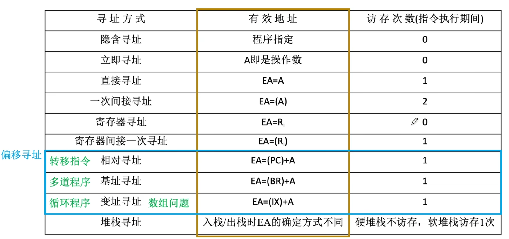
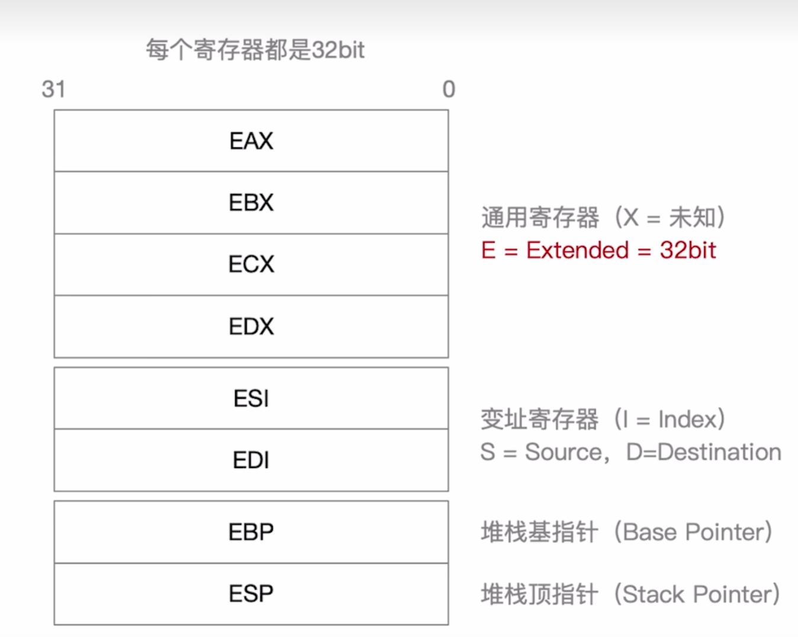
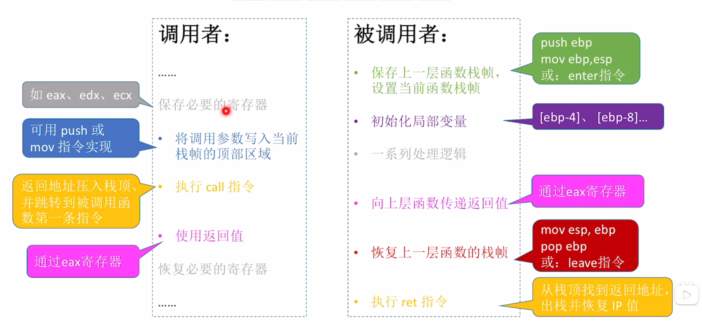
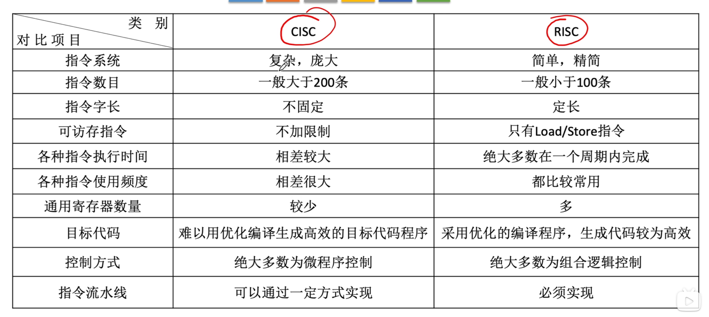

# 指令系统

## 指令系统
### 指令集体系结构
指令（机器指令）是计算机执行某种操作的命令。是计算机运行的最小功能单元。

一台计算机的所有指令构成该计算机的**指令系统**，也称为指令集。

>   一台计算机只能执行自己指令系统中的指令。
    比如x86架构和ARM架构

指令系统是**指令集体系结构ISA**最核心的部分。ISA完整定义了软件与硬件的结构，
ISA规定的内容主要包括：
-   指令格式、寻址方式、操作类型，以及各操作所需操作数的个数、类型和寻址约束。
-   操作数的数据类型，以及按大小端哪种方式存放。
-   程序可访问的寄存器编号、数量和位数，存储空间的大小及编址方式。
-   程序员可见的控制状态，如程序计数器、条件码的定义与行为等。

### 指令的基本结构
一条指令是机器语言的一个语句，由一组二进制数组成，基本格式如下：

|操作码字段|地址码字段|
|-|-|

**操作码**指明指令应执行的操作及功能，是识别地址、理解其作用以及确定地址码含义的关键。

**地址码**给出被操作信息（指令或数据）的地址，包括源操作数地址、目的操作数地址、转移目标地址或子程序入口地址。

**指令子长**是指一条指令所包含的二进制位数，取决于操作码长度，地址码长度及地址码个数。一个指令系统若所有指令字长想的，则称**定长指令字结构**，若指令长度随功能而异，则称**变长指令字结构**

#### 零地址指令
结构：
|op|
|-|

仅包含操作码，无显式地址。有两种可能
-   无需操作数，如空操作，停机，关中断
-   用于堆栈计算机的运算操作，操作数隐含从栈顶或次栈顶弹出，结果压会栈顶

#### 一地址指令
结构：
|op|$A_1$|
|-|-|

-   单操作数指令：按 $A_1$ 地址读取操作，进执行op操作后存回 $A_1$。
    含义： $OP(A_1) \to A_1$
    如 `++`,`--`,`~`,`<<`,`>>`等
-   累加器类型双操作数指令：$A_1$ 为源操作数地址，另一操作数隐含在 $ACC$，结果存回ACC。
    含义: $(ACC)OP(A_1) \to ACC$

> $A_1$ 代表地址，$(A_1)$ 代表地址内容。

若地址码为主存地址，完成一条一地址指令需要 $3$ 次访存（取址 $1$，取数 $1$，存结果 $1）$

#### 二地址指令
结构：
|op|$A_1$|$A_2$|
|-|-|-|

指令含义：$(A_1)OP(A_2) \to A_1$

$A_1$ 为目的的操作数地址兼结果地址，$A_2$ 为源操作数地址。完成一次需要 $4$ 次访存（取地 $1$，取操作数 $2$，存结果 $1$）

#### 三地址指令
结构：
|op|$A_1$|$A_2$|$A_3$（结果）|
|-|-|-|-|

指令含义：$(A_1)OP(A_2) \to A_3$
$A_1,A_2$ 为两个源操作数地址，$A_3$ 为结果地址。完成一次也需要 $4$ 次寻址。

#### 四地址指令
结构：
|op|$A_1$|$A_2$|$A_3$（结果）|$A_4$（下址）|
|-|-|-|-|--|

指令含义：$(A_1)OP(A_0) \to A_3, A_4 = $ 下一条指令地址。
完成一条需要 $4$ 次访存

### 定长操作码指令格式
定长操作码指令是在指令字的最高位部分分配**固定位数**表示操作码。

$n$ 位操作码指令系统最多可以表示 $2^n$ 条指令。

### 扩展操作码指令格式
**可变长度操作码**指令的操作码字段位数不固定，且分散在指令的不同位置。最常见的边长操作码是**扩展操作码**，使操作码长度随地址码减少而增加。

对于指令字长为 $16$ 位，$4$ 位为基本操作码字段OP，另外三个 $4$ 位长的地址字段 $A_1,A_2,A_3$。
**一种设计方法是：**
-   op 为 $0000 \sim 1110$ 这十五条时是三地址指令
    > $A_1, A_2, A_3$ 均为地址
-   op 为 $1111$，$A_1$ 为 $0000 \sim 1110$ 时候为二地址
同理得出一地址和零地址。

零地址指令 $16$ 条，其他都为 $15$ 条。

设计的注意事项：
-   **不允许段操作码成为长操作码的前缀**
-   各指令的操作码一点不能重复

****
**两者差别**：定长控制电路设计简单，可变长灵活性较高。

####

### 指令的类型

#### 数据传送指令
|指令|功能|
-|-
MOV|寄存器之间的传送
LOAD|把内存单元中的数据放入寄存器
STORE|把寄存器中数据写到内存单元
PUSH|进栈
POP|出栈
#####

#### 算术和逻辑运算指令
ADD加，SUB减，MUL乘，DIV除，INC加 $1$，DEC减 $1$，AND与，OR或，NOT取反，XOR异或等。

#### 移位操作指令
算术移位，逻辑移位，循环移位。

#### 顺序控制指令
> PPT为转移操作

JMP：无条件转移
BRANCH：条件转移，JZ：结果为 $0$，JO：结果溢出，JC：结果有进位
CALL：调用
RET：返回
TRAP：陷阱

#### 输入输出指令
用于完成CPU与外部设备交换数据或传送控制命令及状态信息。

#### CPU控制指令
停机，开中断，关中断，系统模式切换以及进入特殊处理程序。

这类指令只能在操作系统内核代码使用

## 寻址方式
确定下一条将要执行的指令地址称为**指令寻址**，确定本条指令操作数地址称为**数据寻址**

### 指令寻址
指令寻址有两种方式：**顺序寻址**和**跳跃寻址**。
#### 顺序寻址
通过**程序计数器PC加上当前指令的字节长度**，自动形成下一条指令地址。
> 注意是**当前指令的长度**，比如遇上变长指令，读入一个字节之后发现实际为两个字节，再次读入之后，PC会直接 $+2$。
#### 跳跃寻址
通过转移类指令实现。是否发生转移通常有状态寄存器的条件码决定，**转移目标地址由指令给出**，**转移方式**分为：
-   **绝对转移**：地址码直接给出目标地址；
-   **相对转移**：地址码给出相对偏移量

### 数据寻址
**数据寻址**指如何在指令中表示或计算操作数的地址。

**常见的数据寻址方式有十种**
一般会在**地址码前**标上若干bit位（如四位）表示为哪种寻址方式

**指令格式：**
一地址指令
|操作码|寻址特征|形式地址$A$|
|-|-|-|

二地址指令
|操作码|寻址特征|形式地址$A_1$|寻址特征|形式地址$A_2$|
|-|-|-|-|-|

也就是说
-   每个寻址特征只针对其形式地址
-   每个形式地址前有一个**寻址特征**

真实地址通过**寻址特征**由**形式地址 $A$** 计算得出，称为**有效地址 $EA$**
-   **立即寻址**，形式地址位数决定了操作数的取值范围
-   **直接寻址**，形式地址位数决定了可寻址的存储空间大小
-   **寄存器寻址**，形式地址位数决定了通用寄存器的最大数量
-   **寄存器间接寻址**，寄存器位数决定了可寻址空间大小


#### 隐含寻址
隐含寻址不显式给出操作数地址，而是将操作数隐含在特定寄存器中。

*比如累加器结果仅显式指定一个操作数，另一个隐含在ACC中*

**优点**：有效缩短指令字长
**缺点**：依赖存储隐含操作数的硬件（如ACC）

#### 立即寻址
|操作码|#|立即数|
|-|-|-|

的地址字段表示**操作数本身**，而非操作数地址，称为**立即数**。

**优点**：执行速度最快，无需访存
**缺点**：立即数大小首先与形式地址字段位数，寻址范围也非常有限
#####

#### 直接寻址
形式地址A即真实地址EA，即 **$EA = A$**

**优点**：实现简单，执行阶段只需访存一次，无需专门计算地址
**缺点**：限制了寻址范围，且地址固定不便于动态修改

#### 间接寻址
形式地址是存储操作数有效地址的地址，即 $EA = (A)$
> 指向指针的指针

共需要访存 $3$ 次，取指 $1 +$ 执行 $n+1$
> $n$ 次间接寻址则 $n$ 次

**优先** 可以扩大寻址范围，便于编制程序。
**缺点**：需要多次访存，访存开销大，想要坚固范围与效率，就需要采用寄存器。

#### 寄存器寻址
寄存器寻址将操作数存放在寄存器中，指令的地址字段给出操作数所在寄存器编号，即 $EA = R_i$。

**优点**：**执行无需访存**，执行速度快，有助于缩短指令字长（因为寄存器数量少，地址码位数也就较小），且支撑向量和矩阵运算
**缺点**：寄存器数量有限（寄存器成本高）

#### 寄存器间接寻址
寄存器存放操作数所在主存地址，而非操作数，即 $EA = (R_i)$

**优点**：执行只需一次寻址；寻址范围不收地址字段位数限制，扩大了寻址范围
**缺点**：相比寄存器寻址，需要从主存获得操作数

#### 相对寻址
将程序计数器 $PC$ 内容与形式地址 $A$ 相加，即 $EA = (PC) + A$
> 也就是相当于下一条指令的位移量

**优点**：操作数地址不固定，所以便于程序浮动

**$PC$** 存储的是当前指令字长

#### 基址寻址
将CPU**基址寄存器BR**的内容加上形式地址 $A$，即 $EA = (BR)+A$

> OS 的重定位寄存就是基址寄存器

可能用一个通用寄存器代替BR，此时指令格式为
|操作码|寻址特征|$R_0$|$A$|
|-|-|-|-|

**$R_0$ 代表通用寄存器编号**，对有 $n$ 个通用寄存器，$R_0$ 有 $\lceil \log_2 n \rceil$ 位。

**优点**：便于程序“浮动”，方便多道程序并发运行
**缺点**：形式地址位数较短，限制偏移量范围

> 基址寄存器面向OS，内容由OS或管理程序确定。在程序执行过程中，基址寄存器内容不变，形式地址可变。
> 当采用通用寄存器作为BR时，可以由用户决定哪个寄存器作为基址寄存器，但内容仍由操作系统决定。
##### 
#### 变址寻址
有效地址EA等于指令字中的形式地址A与变址寄存器IX的内容相加，即 $EA = (IX)+A$，其中 $IX$ 可为变址寄存器（专用），也可为通用寄存器。

> 变址寄存器是**面向用户**的，**用户可在执行过程中修改IX值**，而形式地址 $A$ 不变。
> 比如循环处理数组，可以设定 $A$ 为数组首地址，然后不断改变IX内容，来遍历整个数组

**基址变址复合寻址**
先作基址寻址，$+BR$ 内容，然后循环过程中变址寻址，$+IX$

#### 堆栈寻址
操作数存放在战队中，隐含使用堆栈指针SP作为操作数地址。

**堆栈**是存储器（或专用寄存器组）中一块特定的按LIFO原则管理的存储器，该存储区中地址用一个特定的寄存器给出，称为堆栈指针SP。

记 $M_{sp}$ 为栈顶元素，且栈顶在小地址方向。
**出栈**
-   $M_{sp} \to ACC$
-   $(SP) +1 \to SP$

**入栈**
-   $SP-1 \to SP$
-   $ \to M_{sp}$

**硬堆栈** 寄存器实现
**软堆栈** 主存划分一片区域
#####

## 程序的机器级代码表示
**考试要求** 
-   **x86汇编语言**，其他汇编语言会详细注释；
    > 历年真题主要考察x86和MIPS汇编指令，而MIPS指令通常会在试题标注
-   题目会给出某段简单程序的C语言、汇编语言、机器语言表示。需要能结合C语言看懂汇编的关键语句
-   **不考将C翻译**

**指令的作用**
-   处理数据
-   改变指令的执行流

### 常用汇编指令介绍

#### 相关寄存器

通用寄存器可以只使用**低 $16 bit$**(AX,BX,CX,DX) 或者拆成两个 $8 bit$ (ah,al,bh,bl,ch,cl,dh,dl)

**调用主存**：使用中括号 $[address]$ 包括
若是如 $[eax]$ 这样包括一个寄存器，则代表调用该寄存器指向的主存地址

**不同长度的调用**
-   `dword ptr [address]` 32bit
-   `word ptr [address]`16bit
-   `byte ptr [address]`8bit
#####

**常用操作数的标记**
`<reg>`：表示任意寄存器，其后数字代表位数
`<mem>`：表示内存地址
`<con>`：表示常数，其后数字代表常数位数

同一机器因操作数类型或寄存器不同，可能对应多种机器码编码

#### 数据传送指令

##### mov指令
将第二个操作数**复制**到第一个操作数
```nasm
mov <reg>, <reg>
mov <mem>, <reg>
mov <reg>, <mem>
mov <reg>, <con>
mov <mem>, <con>
```

**双操作数指令的两个操作数不能同时为内存**，如需复制，需要将一者先复制到寄存器。
######

##### push指令
将操作数压入栈中，常用与函数调用和现场保护。
> ESP是栈顶，入栈前先ESP $-4$， 然后操作数压入
```nasm
push <reg32>
push <mem>
push < con32>
```
**栈中元素固定位 $32$ 位**
######

##### pop指令
从栈弹出数据，并存入容器。
> 出栈前先将内容读出，然后ESP $+4$

语法同push

#### 算术运算与逻辑运算

##### add/sub指令
第一个数add/sub第二个数，然后存在第一个数地址，和mov一样**操作数不能同时为内存**
> 也就是 `a += b`
```nasm
add <reg>, <reg>
add <mem>, <reg>
add <reg>, <mem>
add <reg>, <con>
add <mem>, <con>
```
######

##### inc/dec
对操作数自增 $1$ 或自减 $1$
```nasm
inc <reg>
inc <mem>
```
######

##### mul
无符号整数乘法，**仅支持单操作数**，**被乘数隐含在`eax`**，**结果存放在 $edx:eax$ 中**（超过 32bit的存在edx中），此时CPU的 $CF = 1, OF = 1$，以 $CF$ 作为溢出标准
```nasm
mul <reg>
mul <mem>
mul <con>
```
######

##### imul
有符号乘法
-   双操作数，将两者相乘，结果存在第一操作数
-   三操作数，将第二第三操作数相乘，结果存在第一操作数

**第一操作数必须为寄存器，而第三操作数必须为立即数**
```nasm
imul <reg32>, <reg32>
imul <reg32>, <mem>
imul <reg32>, <reg32>, <con>
imul <reg32>, <mem>, <con>
```
######

##### div/idiv
> 两者语法完全一致
无符号除法与有符号除法，被除数为 `edx:eax` 组成的 $64$ 位数（根据有无符号区别），第一操作数指定除数，执行后商存入`eax`，余数存入`edx`

```nasm
div <reg32>
div <mem>
```
######

##### and/or/xor
按位与、或、异或，结果存入第一操作数
```nasm
and <reg>, <reg>
and <mem>, <reg>    
and <reg>, <mem>    
and <reg>, <con>    
and <mem>, <con>    
```
######

##### not
按位取反
```nasm
not <reg>
not <mem>
```
######

##### neg
取负指令，计算二进制补码 $-x$
```nasm
neg <reg>
neg <mem>
```
######

##### shl/shr
逻辑左右移
第一操作数为被移数，第二操作数为移动位数，**第二操作数只能是八位**（且需要为正整数）
```nasm
shl <reg>, <con8>   ; shr语法相同
shl <mem>, <con8>
shl <reg>, <cl>
shl <mem>, <cl>
```
######

#### 控制流指令
x86处理器通过指令指针寄存器EIP（相当于PC）只是当前执行指令的地址。每条指令执行后，EIP自动指向下一条指令。EIP不能直接访问，但是可以通过程序流指令修改，程序中常用标签（lable）标记指令地址。

##### 标签lable
跳转指令直接跳转到标签，以执行标号代表的位置
比如
```nasm
jmp lab ;会无条件跳转到标号lab的内容

lab: statement
```

但是控制流指令也可以跳转到任意**立即数地址**或者被**寄存器**或**主存**存储的地址
######

##### jmp
无条件转移到lable标签指示的地址继续执行
```nasm
jmp <label>
```
######

##### j $condition$
条件转移指令，**根据程序状态字寄存器中的标志状态**（如ZF，SF等）决定是否转移。
```nasm
je <lable>  ; 结果相等  ZF == 1
jz <lable>  ; 结果为零  ZF == 1
jne <lable> ; 不相等    ZF == 0
jg <lable>  ; 大于      ZF == 0 && SF == OF
jge <lable> ; 大于等于  SF == OF
jl <lable>  ; 小于      SF == OF
jle <lable> ; 小于等于  SF != OF || ZF == 1
; 示例
cmp eax, ebx
jle done    ; 如果 eax <= ebx，则跳转done，否则顺序执行下一条指令
```
######

##### cmp/test
-   cmp指令执行**减法**运算**但不保存结果，仅根据结果设置标志位**
-   test指令执行**按位与**运算**但不保存结果，仅根据结果设置标志位**
```nasm
cmp <reg>, <reg>    ; test语法相同
cmp <reg>, <mem>
cmp <mem>, <reg>
cmp <reg>, <con>
```

通常与 j$condition$ 配合使用

表示位及内容
-   OF，溢出标志位，溢出置 $1$
-   SF，符号标志位，为负置 $1$
-   ZF，零标志位，为 $0$ 置 $1$
-   CF，进位（借位）标志位，进位置 $1$
######

##### call/ret
call实现子程序的调用
ret实现子程序返回
```nasm
call <lable>
ret
```
call指令将下一条指令的地址（返回地址）压入栈，然后转移到label处执行；ret指令从栈顶天厨返回地址，并转移到该地址继续执行。**call/ret**是函数调用机制的核心指令。
######

### 汇编指令格式
主要有AT&T与Intel两种格式
前者常用于Unix与Linux，后者则常用于Windows
区别如下
区别|AT&T|Intel
:-:|:-:|:-:
指令名大小写|必须小写|不敏感
**操作数顺序**|`op d,s`<br>左 $\to$ 右|`op s,d` <br>左 $\leftarrow$ 右
存储容器前缀|寄存器"%"<br>立即数"$"|无
内存寻址符号|`()`|`[]`
复杂寻址方式|`movl -8(%ebx), %eax`<br>偏移量(基址)<br>`mobl 4(%ebx, %ecx,32), %eax`<br> 偏移量（基址，变址，比例因子）|`mov eax,[ebx-8]`<br>[基址+偏移量]<br>`mov eax, [ebx+ecx*32+4]`<br>[基址+变址*比例因子+偏移量]
操作数长度指定方式|后缀<br>movb<br>addw<br>movl|前加<br>byte ptr<br>word ptr<br>dword ptr
> 注：x86体系结构，32位和64位系统都由16位发展而来，所以**word（字）均为$16$ 位**
#####

### 选择语句的机器级表示
选择语句：`if-then`,`if-then-else`等。编辑器通过**条件码**（表示位）**设置指令**和**各类条件转移指令**实现选择结构。

常见的算术逻辑运算执行时会**自动设置条件码**，`cmp`和`test`专门用于设置条件码。

**示例**
```cpp
if(a > b)
    c = a;
else
    c = b;
```
转汇编后：
```nasm
    mov eax [a];    将 a 的值放入eax
    mov ebx [b];    将 b 的值放入ebx
    cmp eax, ebx;   比较 ab的值
    jg then;        若 a > b, 跳转到then
    mov [c] ebx;    相当于else, 将ebx存储的b的值赋值给c
    jmp end;        无条件跳转到end
then:   mov c eax; 将eax存储的a的值赋值给c
end:
```
> $a,b,c$ 代表三个变量的主存地址
修改jg为jle后，就可以让if内容在前，else内容在后

**汇编代码通常会以函数名作为lable，来标注起始地址**
####

### 循环语句的机器级表示
循环通过条件测试盒条件转移组合实现，实际上大多数编译器会同意转化为`do-while`形式。

#### do-while
cpp语句
```cpp
do
    body_staement;
while(test_expr);
```
goto语句
```cpp
loop:
    body_statement;
    t = test_expr;
if(t)
    goto loop;
```
#####

#### while
cpp语句
```cpp
while(test_expr)
    body_statement;
```
goto语句
```cpp
t = test;
if(!t)
    goto done;
loop:
    body_statement;
    t = test_expr;
if(t)
    goto loop;
done:
```
相当于在`do-while`前加一次判断
#####

#### for
`for`比`while`在起始多一次初始化，结束多一次更新表达式，所以可以转为`while`，也就可以转为`do-while`

cpp语句
```cpp
for(init_expr;test_expr;update_expr)
    body_statement;
```

goto语句
```cpp
init_expr;
t = test_expr;
if(!t)
    gto done;
loop:
    body_statement;
    update_expr;
    t = test_expr;
if(t)
    goto loop;
done;
```
#####

#### 一条实例
```cpp
int n_sum_for(int n)
{
    int i;
    int res = 0;
    for(i=0;i<=n;++i)
        res += i;
    return res;
}
```

```nasm
    mov ecx, dword ptr [ebp+8]; 加载参数 n 到ecx
    mov eax 0;                  设eax为res，初始化res = 0
    mov edx 1;                  设edx为i，初始化i = 1
    cmp edx,ecx;                比较 i 和 那
    jd done;                    如果为假，结束循环
looptop:    add eax, ebx;               执行 res += i
    add edx 1;                  执行 i ++
    cmp edx, ecx;               比较 i 与 n
    jle looptop;                    如果为真，再次进行循环
.done:;                       循环结束
```

**loop指令**
> 被淘汰的老东西
```nasm
mov ecx 100;    exc作为循环计数器
Looptop: statement
lool Looptop;   ecx --，若 ecx != 0，跳转到Looptop
```

还有loopx，比如loopnz代表not zero

**可以节约程序占据的空间，但是速度要更慢**
#####

### 函数调用的机器级表示

每调用一个函数，会在运行时栈中分配一个**栈帧**。**EBP（基址指针）** 指向当前栈帧的基址，**ESP（栈指针）** 时钟指向当前栈顶。运行时EBP不变，而ESP随出入栈移动。

**栈帧**会存储**局部变量**，入栈前的寄存器值（方便恢复），返回地址，函数参数等

具体调用过程（P为调用函数，Q为被调用函数）
-   P将实参放入Q可以访问的位置
-   P执行call指令，将返回地址（call的下一条地址）入栈，并转移到Q
-   Q建立自己的栈帧（分配局部变量空间，保存一些寄存器内容）
-   Q执行
-   Q将返回值放入约定地点，释放栈帧（释放局部变量空间，恢复寄存器）
-   执行ret指令，将栈顶弹出并返回地址，回到P继续

#### 如何访问栈帧
ebp指向栈底，esp指向栈顶，通过push和pop可以操作esp
也可以操作mov指令结合ebp或esp访问，或者用sub/add操作esp

#### 栈帧可能包含哪些内容
按顺序
-   上一层栈帧基地址
-   局部变量（按定义顺序出现）
    > 第一个局部变量是`[ebp-4]`
-   空闲区域（比如GCC会规定栈帧大小是16B的整数倍）
-   调用参数（参数列表越靠前月近栈顶）
    > 第一个参数是`[ebp+8]`
-   IP（返回地址）

#### 示例
对于函数
```cpp
int add(int x,int y)
{
    return x + y;
}

int caller(void)
{
    int tmp1 = 125;
    int tmp2 = 80;
    int sum = add(tmp1,tmp2);
    return sum;
}
```
汇编代码：
```nasm
caller:    enter
    ;等价
    ;push ebp           ;保存调用者P的EBP
    ;mov ebp, esp       ;简历新栈帧， EBP赋值为当前栈帧
    sub esp, 24         ;给栈帧分配24bit空间
    mov [ebp-12], 125   ;tmp1 = 125
    mov [ebp-8], 80     ;tmp2 = 80
    mov eax, [ebp-8]    ;加载tmp2
    mov [esp+4], eax    ;将tmp2放入参数区
    mov eax, [ebp-12]   ;加载tmp1
    mov esp, eax        ;将tmp1放入参数区
    call add            ;调用add，返回值保存与eax
    mov [ebp-4], eax    ;返回值存入eax
    mov eax, [ebp-4]    ;返回值存入sum
    leave               ;栈帧出栈
    ;等价
    ;mov esp ebp        
    ;pop ebp
    ret                 ;弹出返回地址并跳回

add:    enter
    mov eax, [ebp+12]   ;参数x放入eax
    mov edx, [ebp+8]    ;参数y放入ebx
    add eax, edx        ;做加法，结果放入eax
    leave               ;返回
    ret

```
> 王道给tmp1放在ebp-12，且说越前定义的局部变量越靠近栈顶，而询问`ds-v4.1-flash`回答说“这正好符合 GCC/Clang 一类编译器的常见做法：为每个变量分配栈槽时，把 esp/偏移指针一路往下推，也就是倒序处理变量列表”

**特别说明**
一个变量的四个字节，是从地址 $A$ 到地址 $A+3$，的四个字节

也就是说，执行sub esp, 24后，ebp-24 $\sim$ ebp-21 是esp对应的位置，也就是第一个字节，这个栈帧在不包含ebp这个元素时，有了 $6$ 个字节
#####

## CISC和RISC
### CISC
复杂指令集系统 Complex Instruction Set Computer

**设计思路：** 一条指令完成一个复杂的基本功能
**代表：** **x86架构**，只要用于笔记本、台式机

指令庞大复杂，数量很多

结果导致越 $80\%$ 的程序仅使用 $20\%$ 的指令

### RISC
精简指令集系统 Reduced Instruction Set Computer

### 对比
