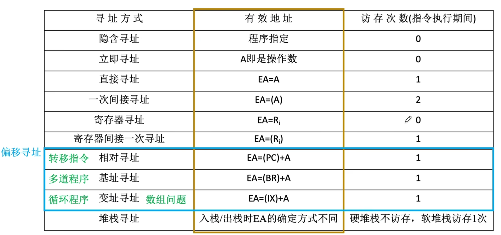

# 寻址方式
## 分类
确定下一条将要执行的指令地址称为**指令寻址**，确定本条指令操作数地址称为**数据寻址**

## 指令寻址
指令寻址有两种方式：顺序寻址和跳跃寻址。
### 顺序寻址
通过程序计数器**PC加上当前指令的字节长度**，自动形成下一条指令地址。
> 注意是当前指令的长度，比如遇上变长指令，读入一个字节之后发现实际为两个字节，再次读入之后，PC会直接 $+2$。
### 跳跃寻址
通过转移类指令实现。是否发生转移通常有状态寄存器的条件码决定，**转移目标地址由指令给出**

**转移方式：**
-   **绝对转移**，地址码直接给出目标地址；
-   **相对转移**，地址码给出相对偏移量

## 数据寻址
确定本条地址地址码指明的真实地址。

**常见的数据寻址方式有十种**
一般会在**地址码前**标上若干bit位（如四位）表示为哪种寻址方式

**指令格式：**
一地址指令
|操作码|寻址特征|形式地址$A$|
|-|-|-|

二地址指令
|操作码|寻址特征|形式地址$A_1$|寻址特征|形式地址$A_2$|
|-|-|-|-|-|

也就是说
-   每个寻址特征只针对其形式地址
-   每个形式地址前有一个寻址特征

真实地址通过寻址特征由形式地址A计算得出，称为有效地址 EA

**偏移寻址**
以某个固定的起点，偏移 $A$ 个单位。
如基址寻址，变址寻址和相对寻址，三者区别只是起点不同

### 隐含寻址
隐含寻址不显式给出操作数地址，而是将操作数隐含在特定寄存器中。

*比如，；累加器结果仅显示知道一个操作数，另一个隐含在ACC中*

**优点** 有效缩短指令字长
**缺点** 依赖存储隐含操作数的硬件（如ACC）

### 立即寻址
|操作码|#|立即数|
|-|-|-|

的地址字段表示**操作数本身**，而非操作数地址，称为*立即数*。

**优点** 执行速度最快，无需访存
**缺点** 立即数大小首先与形式地址字段位数，寻址范围也非常有限

### 直接寻址
形式地址A即真实地址EA，即 **$EA = A$**

**优点** 实现简单，执行阶段只需访存一次，无需专门计算地址
**缺点** 限制了寻址范围，且地址固定不便于动态修改

### 间接寻址
形式地址是存储操作数有效地址的地址，即 $EA = (A)$
> 指向指针的指针

共需要访存 $3$ 次，取指 $1 +$ 执行 $n+1$
> $n$ 次间接寻址则 $n$ 次

**优先** 可以扩大寻址范围，便于编制程序。
**缺点** 需要多次访存，访存开销大，想要坚固范围与效率，就需要采用寄存器。

### 寄存器寻址
寄存器寻址将操作数存放在寄存器中，指令的地址字段给出操作数所在寄存器编号，即 $EA = R_i$。

**优点** **执行无需访存**，执行速度快，有助于缩短指令字长（因为寄存器数量少，地址码位数也就较小），且支撑向量和矩阵运算
**缺点** 寄存器数量有限（寄存器成本高）

### 寄存器间接寻址
寄存器存放操作数所在主存地址，而非操作数，即 $EA = (R_i)$

**优点** 执行只需一次寻址；寻址范围不收地址字段位数限制，扩大了寻址范围
**缺点** 相比寄存器寻址，需要从主存获得操作数

### 相对寻址
将程序计数器 $PC$ 内容与形式地址 $A$ 相加，即 $EA = (PC) + A$
> 也就是相当于下一条指令的位移量

**优点** 操作数地址不固定，所以便于程序浮动

**$PC$** 存储的是当前指令字长

### 基址寻址
将CPU**基址寄存器BR**的内容加上形式地址 $A$，即 $EA = (BR)+A$

> OS 的重定位寄存就是基址寄存器

可能用一个通用寄存器代替BR，此时指令格式为
|操作码|寻址特征|$R_0$|$A$|
|-|-|-|-|

**$R_0$ 代表通用寄存器编号**，对有 $n$ 个通用寄存器，$R_0$ 有 $\lceil \log_2 n \rceil$ 位。

**优点** 便于程序“浮动”，方便多道程序并发运行
**缺点** 形式地址位数较短，限制偏移量范围

> 基址寄存器面向OS，内容由OS或管理程序确定。在程序执行过程中，基址寄存器内容不变，形式地址可变。
> 当采用通用寄存器作为BR时，可以由用户决定哪个寄存器作为基址寄存器，但内容仍由操作系统决定。

### 变址寻址
有效地址EA等于指令字中的形式地址A与变址寄存器IX的内容相加，即 $EA = (IX)+A$，其中 $IX$ 可为变址寄存器（专用），也可为通用寄存器。

> 变址寄存器是**面向用户**的，**用户可在执行过程中修改IX值**，而形式地址 $A$ 不变。
> 比如循环处理数组，可以设定 $A$ 为数组首地址，然后不断改变IX内容，来遍历整个数组

#### 基址变址复合寻址
先作基址寻址，$+BR$ 内容，然后循环过程中变址寻址，$+IX$

### 堆栈寻址
操作数存放在战队中，隐含使用堆栈指针SP作为操作数地址。

**堆栈**是存储器（或专用寄存器组）中一块特定的按LIFO原则管理的存储器，该存储区中地址用一个特定的寄存器给出，称为堆栈指针SP。

记 $M_{sp}$ 为栈顶元素，且栈顶在小地址方向。
**出栈**
-   $M_{sp} \to ACC$
-   $(SP) +1 \to SP$

**入栈**
-   $SP-1 \to SP$
-   $ \to M_{sp}$

**硬堆栈** 寄存器实现
**软堆栈** 主存划分一片区域