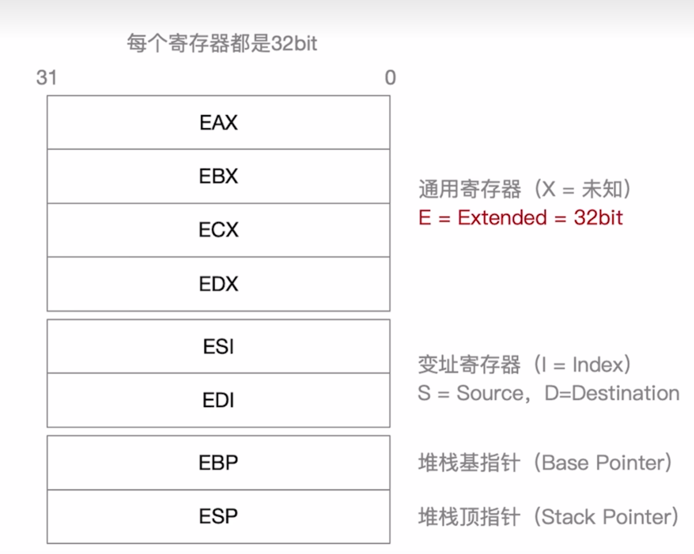
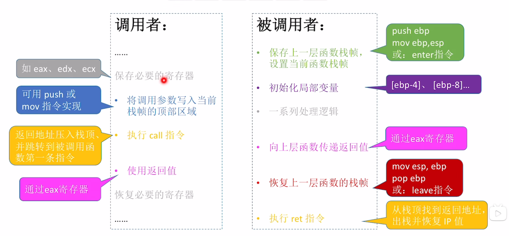

# 程序的机器级代码表示
**考试要求**
-   **x86汇编语言**，其他汇编语言会详细注释；
-   题目会给出某段简单程序的C语言、汇编语言、机器语言表示。需要能结合C语言看懂汇编的关键语句
-   **不考将C翻译**

**指令的作用**
-   处理数据
-   改变指令的执行流

## 常用汇编指令介绍
### 寄存器

通用寄存器可以只使用**低** $16 bit$(AX,BX,CX,DX) 或者拆成两个 $8 bit$ (ah,al,bh,bl,ch,cl,dh,dl)

**调用主存**：使用中括号 $[address]$ 包括
若是如 $[eax]$ 这样包括一个寄存器，则代表调用该寄存器指向的主存地址

**不同长度的调用**
-   `dword ptr [address]` 32bit
-   `word ptr [address]`16bit
-   `bity ptr [address]`8bit

### 常用指令
#### 数据传送指令
**mov指令**
将第二个操作数复制到第一个操作数
```nasm
mov <reg>, <reg>    ; reg 代表寄存器
mov <mem>, <reg>    ; mem 代表内存
mov <reg>, <mem>
mov <reg>, <con>    ; con 代表立即数
mov <mem>, <con>
```
**双操作数指令的两个操作数不能同时为内存**，如需复制，需要将一者先复制到寄存器。

**push指令**
将操作数压入栈中，常用与函数调用和现场保护。
> ESP是栈顶，入栈前先ESP $-4$， 然后操作数压入
```nasm
push <reg32>
push <mem>
push < con32>
```
**栈中元素固定位 $32$ 位**

**pop指令**
从栈弹出数据。
> 出栈前先将内容读出，然后ESP $+4$

语法同push

### 算术运算与逻辑运算
#### add/sub指令
第一个数add/sub第二个数，然后存在第一个数地址，和mov一样**操作数不能同时为内存**
```nasm
mov <reg>, <reg>
mov <mem>, <reg>
mov <reg>, <mem>
mov <reg>, <con>
mov <mem>, <con>
```

#### inc/dec
对操作数自增 $1$ 或自减 $1$
```nasm
inc <reg>   ; dec语法相同
inc <mem>
```

#### mul
无符号整数乘法，**仅支持单操作数**，**被乘数隐含在`eax`**，**结果存放在 $edx:eax$ 中**（超过 32bit的存在edx中），此时CPU的$CF = 1, OF = 1$，以CF作为溢出标准
```nasm
mul <reg>
mul <mem>
mul <con>
```
#### imul
有符号乘法
-   双操作数，将两者相乘，结果存在第一操作数
-   三操作数，将第二第三操作数相乘，结果存在第一操作数

**第一操作数必须为寄存器，而第三操作数必须为立即数**
```nasm
imul <reg32>, <reg32>
imul <reg32>, <mem>
imul <reg32>, <reg32>, <con>
imul <reg32>, <mem>, <con>
```

#### div/idiv
无符号除法与有符号除法，被除数为 `edx:eax` 组成的 $64$ 位数（根据有无符号区别），第一操作数指定除数，执行后商存入`eax`，余数存入`edx`

```nasm
div <reg32>     ; div 语法相同
dev <mem>
```

#### and/or/xor
按位与、或、异或，结果存入第一操作数
```nasm
and <reg>, <reg>    ; or/xor 语法相同
and <mem>, <reg>    
and <reg>, <mem>    
and <reg>, <con>    
and <mem>, <con>    
```

#### not
按位取反
```nasm
not <reg>
not <mem>
```

#### neg
取负指令，计算耳机罩补码 $-x$
```nasm
neg <reg>
neg <mem>
```

#### shl/shr
逻辑左右移
第一操作数为被移数，第二操作数为移动位数，**第二操作数只能是八位**（且需要为正整数）
```nasm
shl <reg>, <con8>   ; shr语法相同
shl <mem>, <con8>
shl <reg>, <cl>
shl <mem>, <cl>
```

### 控制流指令
x86处理器通过指令指针寄存器EIP（相当于PC，也可以交IP）只是当前执行指令的地址。每条指令执行后，EIP自动指向下一条指令。EIP不能直接访问，但是可以通过程序流指令修改，程序中常用标签（lable）标记指令地址。

#### 标签lable
跳转指令直接跳转到标签，以执行标号代表的位置
比如
```nasm
jmp lab ;会无条件跳转到标号lab的内容

lab: statement
```

但是控制流指令也可以跳转到任意**立即数地址**或者被**寄存器**或**主存**存储的地址

#### jmp
无条件转移到lable标签只是地址继续执行
```nasm
jmp <label>
```

#### j$condition$
条件转移指令，**根据程序状态字寄存器中的标志状态**（如ZF，SF等）决定是否转移。
```nasm
je <lable>  ; 结果相等  ZF == 1
jz <lable>  ; 结果为零  ZF == 1
jne <lable> ; 不相等    ZF == 0
jg <lable>  ; 大于      ZF == 0 && SF == OF
jge <lable> ; 大于等于  SF == OF
jl <lable>  ; 小于      SF == OF
jle <lable> ; 小于等于  SF != OF || ZF == 1
; 示例
cmp eax, ebx
jle done    ; 如果 eax <= ebx，则跳转done，否则顺序执行下一条指令
```

#### cmp/test
-   cmp指令执行减法运算**但不保存结果，仅根据结果设置标志位**
-   test指令执行按位与运算**但不保存结果，仅根据结果设置标志位**
```nasm
cmp <reg>, <reg>    ; test语法相同
cmp <reg>, <mem>
cmp <mem>, <reg>
cmp <reg>, <con>
```

表示位及内容
-   OF，溢出标志位，溢出置 $1$
-   SF，符号标志位，为负置 $1$
-   ZF，零标志位，为 $0$ 置 $1$
-   CF，进位（借位）标志位，进位置 $1$

### call/ret
call实现子程序的调用
ret实现子程序返回
```nasm
call <lable>
ret
```
call指令将下一条指令的地址（返回地址）压入栈，然后转移到label处执行；ret指令从栈顶天厨返回地址，并转移到该地址继续执行。**call/ret**是函数调用机制的核心指令。

## 汇编指令格式
主要有AT&T与Intel两种格式
前者常用于Unix与Linux，后者则常用于Windows
区别如下
区别|AT&T|Intel
:-:|:-:|:-:
指令名大小写|必须小写|不敏感
**操作数顺序**|`op d,s`<br>左 $\to$ 右|`op s,d` <br>左 $\leftarrow$ 右
存储容器前缀|寄存器"%"<br>立即数"$"|无
内存寻址符号|`()`|`[]`
复杂寻址方式|`movl -8(%ebx), %eax`<br>偏移量(基址)<br>`mobl 4(%ebx, %ecx,32), %eax`<br> 偏移量（基址，变址，比例因子）|`mov eax,[ebx-8]`<br>[基址+偏移量]<br>`mov eax, [ebx+ecx*32+4]`<br>[基址+变址*比例因子+偏移量]
操作数长度指定方式|后缀<br>movb<br>addw<br>movl|前加<br>byte ptr<br>word ptr<br>dword ptr
> 注：x86体系结构，32位和64位系统都由16位发展而来，所以**word（字）均为$16$ 位**

## 选择语句的机器级表示
选择语句：`if-then`,`if-then-else`等。编辑器通过**条件码**（表示位）**设置指令**和**各类条件转移指令**实现选择结构。

常见的算术逻辑运算执行时会**自动设置条件码**，`cmp`和`test`专门设置条件码。

**示例**
```cpp
if(a > b)
    c = a;
else
    c = b;
```
转汇编后：
```nasm
    mov eax [a];    将 a 的值放入eax
    mov ebx [b];    将 b 的值放入ebx
    cmp eax, ebx;   比较 ab的值
    jg then;        若 a > b, 跳转到then
    mov [c] ebx;    相当于else, 将ebx存储的b的值赋值给c
    jmp end;        无条件跳转到end
then:   mov c eax; 将eax存储的a的值赋值给c
end:
```
> $a,b,c$ 代表三个变量的主存地址
修改jg为jle后，就可以让if内容在前，else内容在后

**汇编代码通常会以函数名作为lable，来标注起始地址**

## 循环语句的机器级表示
循环通过条件测试盒条件转移组合实现，实际上大多数编译器会同意转化为`do-while`形式。

### `do-while`
cpp语句
```cpp
do
    body_staement;
while(test_expr);
```
goto语句
```cpp
loop:
    body_statement;
    t = test_expr;
if(t)
    goto loop;
```

### `while`
cpp语句
```cpp
while(test_expr)
    body_statement;
```
goto语句
```cpp
t = test;
if(!t)
    goto done;
loop:
    body_statement;
    t = test_expr;
if(t)
    goto loop;
done:
```
相当于在`do-while`前加一次判断

### `for`
`for`比`while`在起始多一次初始化，结束多一次更新表达式，所以可以转为`while`，也就可以转为`do-while`

cpp语句
```cpp
for(init_expr;test_expr;update_expr)
    body_statement;
```

goto语句
```cpp
init_expr;
t = test_expr;
if(!t)
    gto done;
loop:
    body_statement;
    update_expr;
    t = test_expr;
if(t)
    goto loop;
done;
```

### 一条实例
```cpp
int n_sum_for(int n)
{
    int i;
    int res = 0;
    for(i=0;i<=n;++i)
        res += i;
    return res;
}
```

```nasm
    mov ecx, dword ptr [ebp+8]; 加载参数 n 到ecx
    mov eax 0;                  设eax为res，初始化res = 0
    mov edx 1;                  设edx为i，初始化i = 1
    cmp edx,ecx;                比较 i 和 那
    jd done;                    如果为假，结束循环
looptop:    add eax, ebx;               执行 res += i
    add edx 1;                  执行 i ++
    cmp edx, ecx;               比较 i 与 n
    jle looptop;                    如果为真，再次进行循环
.done:;                       循环结束
```

**loop指令**
> 被淘汰的老东西
```nasm
mov ecx 100;    exc作为循环计数器
Looptop: statement
lool Looptop;   ecx --，若 ecx != 0，跳转到Looptop
```

还有loopx，比如loopnz代表not zero

**可以节约程序占据的空间，但是速度要更慢**

## 函数调用的机器级表示

每调用一个函数，会在运行时栈中分配一个**栈帧**。**EBP（基址指针）**指向当前栈帧的基址，**ESP（栈指针）**时钟指向当前栈顶。运行时EBP不变，而ESP随出入栈移动。

**栈帧**会存储**局部变量**，入栈前的寄存器值（方便恢复），返回地址，函数参数等

具体调用过程（P为调用函数，Q为被调用函数）
-   P将实参放入Q可以访问的位置
-   P执行call指令，将返回地址（call的下一条地址）入栈，并转移到Q
-   Q建立自己的栈帧（分配局部变量空间，保存一些寄存器内容）
-   Q执行
-   Q将返回值放入约定地点，释放栈帧（释放局部变量空间，恢复寄存器）
-   执行ret指令，将栈顶弹出并返回地址，回到P继续

### 如何访问栈帧
ebp指向栈底，esp指向栈顶，通过push和pop可以操作esp
也可以操作mov指令结合ebp或esp访问，或者用sub/add操作esp

### 栈帧可能包含哪些内容
按顺序
-   上一层栈帧基地址
-   局部变量（按定义顺序出现）
    > 第一个局部变量是`[ebp-4]`
-   空闲区域（比如GCC会规定栈帧大小是16B的整数倍）
-   调用参数（参数列表越靠前月近栈顶）
    > 第一个参数是`[ebp+8]`
-   IP（返回地址）

### 示例
对于函数
```cpp
int add(int x,int y)
{
    return x + y;
}

int caller(void)
{
    int tmp1 = 125;
    int tmp2 = 80;
    int sum = add(tmp1,tmp2);
    return sum;
}
```
汇编代码：
```nasm
caller:    enter
    ;等价
    ;push ebp           ;保存调用者P的EBP
    ;mov ebp, esp       ;简历新栈帧， EBP赋值为当前栈帧
    sub esp, 24         ;给栈帧分配24bit空间
    mov [ebp-12], 125   ;tmp1 = 125
    mov [ebp-8], 80     ;tmp2 = 80
    mov eax, [ebp-8]    ;加载tmp2
    mov [esp+4], eax    ;将tmp2放入参数区
    mov eax, [ebp-12]   ;加载tmp1
    mov esp, eax        ;将tmp1放入参数区
    call add            ;调用add，返回值保存与eax
    mov [ebp-4], eax    ;返回值存入eax
    mov eax, [ebp-4]    ;返回值存入sum
    leave               ;栈帧出栈
    ;等价
    ;mov esp ebp        
    ;pop ebp
    ret                 ;弹出返回地址并跳回

add:    enter
    mov eax, [ebp+12]   ;参数x放入eax
    mov edx, [ebp+8]    ;参数y放入ebx
    add eax, edx        ;做加法，结果放入eax
    leave               ;返回
    ret

```
> 王道给tmp1放在ebp-12，且说越前定义的局部变量越靠近栈顶，但是我不太理解为什么是这样的逻辑，搜索之后又说应该底部放最早，又有说看具体情况，所以就按王道来了。而且并不会根据内容涉及汇编，只有读程序，所以问题更不大。