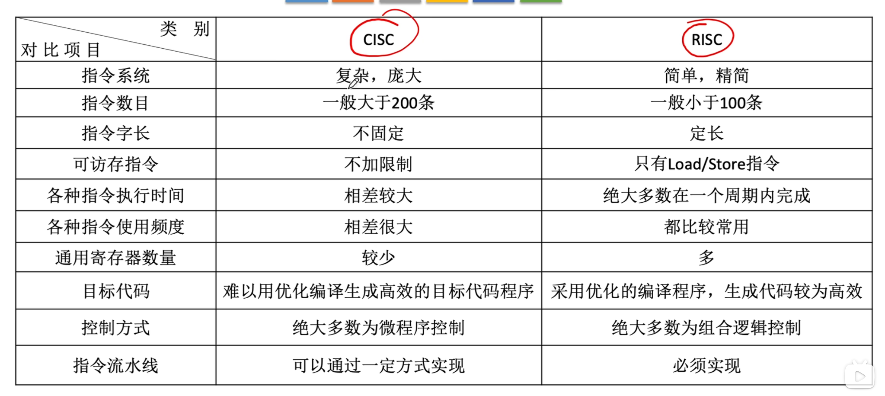

# CISC和RISC
## CISC
复杂指令集系统 Complex Instruction Set Computer

**设计思路：** 一条指令完成一个复杂的基本功能
**代表：** **x86架构**，只要用于笔记本、台式机

指令庞大复杂，数量很多

结果导致越 $80\%$ 的程序仅使用 $20\%$ 的指令

## RISC
精简指令集系统 Reduced Instruction Set Computer

## 对比
