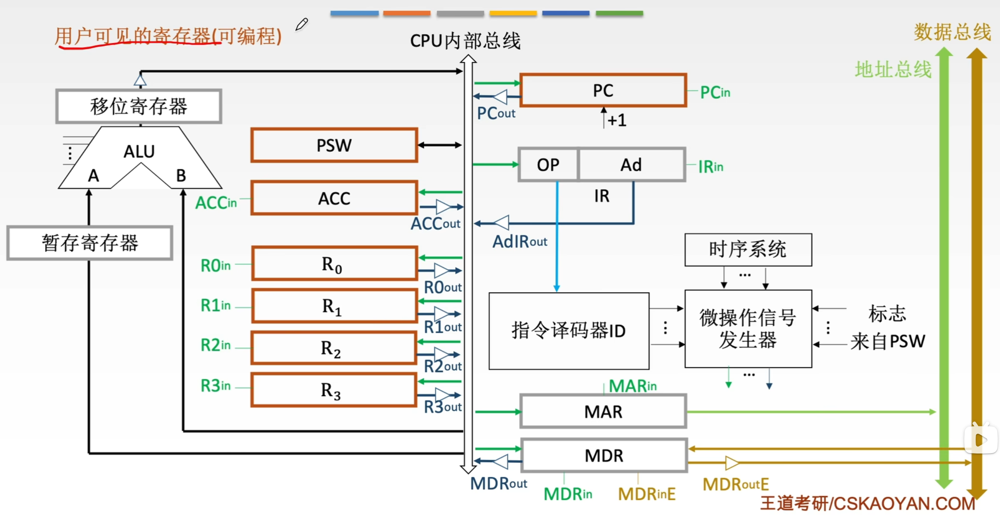
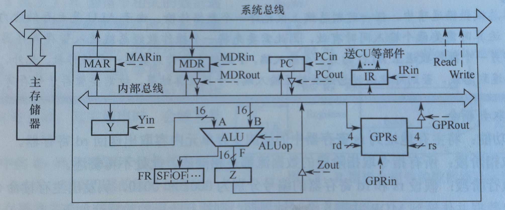
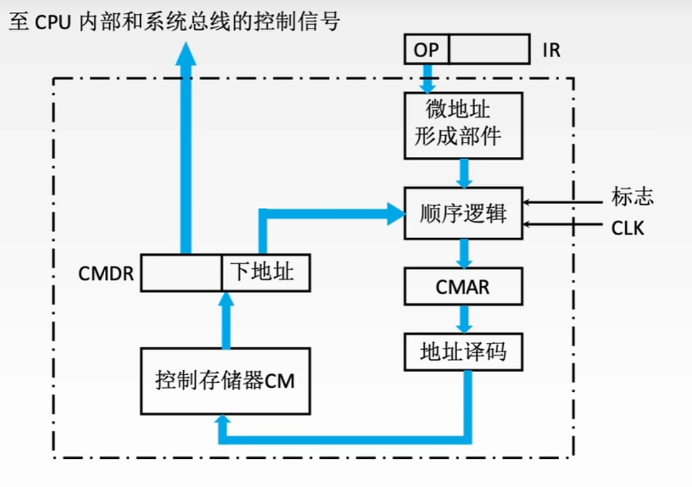
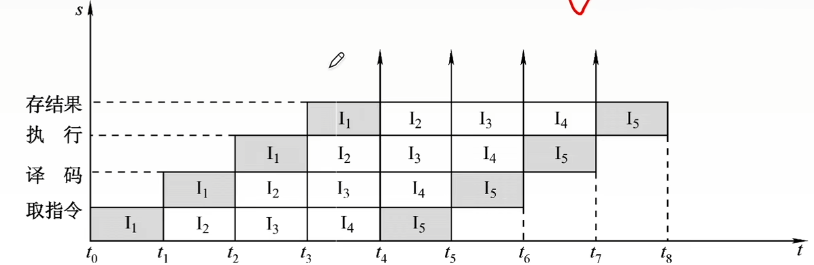

# 中央处理器

## CPU的功能和基本结构

### CPU的功能
CPU不仅需要高效地执行执行，还要具备检测并响应各类一场与中断的能力，其**核心功能是执行程序**

CPU基本功能包括
-   **取指令并译码**：从主存中取出指令，解析操作码，并生成相应的控制信号
-   **更新程序计数器（PC）**：确定下一条指令地址，以支持顺序执行或程序转移
-   **执行算数与逻辑运算**：通过ALU对操作数进行算术或逻辑运算
-   **取操作数或写结果**：访问主存或IO接口，读取操作数或将运算结果写回
-   **处理异常或中断**
-   **时序控制**
####

### CPU的基本结构

-   程序计数器PC：存放即将执行的指令地址。顺序执行时自动递增；转移类指令更新为目标地址
-   指令寄存器IR：暂存当前正在执行的指令
-   通用寄存器组(GPRS)：供用户程序灵活使用，用于暂存操作数、中间结果或地址指针
-   标志寄存器FR，也称程序状态字寄存器PSW：保存ALU运算产生的状态信息，用于条件判断与转移控制
-   存储器地址寄存器MAR：存放要访问的主存单元的地址
-   寄存器数据寄存器MDR：存放向主存写入或读出的信息
-   指令译码器ID：对IR中的操作码进行分析，识别指令类型，输出对应的译码信号
-   算术逻辑单元ALU：执行数据运算的核心部件，完成算术与逻辑运算
-   时序信号产生部件
-   操作控制信号形成部件：综合译码信号、时序信号和状态标志，生成微操作控制信号
    > MDRin控制CPU内部总线通路，MDRinE控制外部数据总线通路，out同理
-   总线控制逻辑
-   中断机构

#### 寄存器

##### 用户可见寄存器
**可以被用户程序直接读取或修改**，用于暂存数据，地址或状态信息

包括通用寄存器组，专用地址寄存器（如基址寄存器，变址寄存器，堆栈指针等），PC；
还有**只读用户可见寄存器**，即标志寄存器，用户不能直接修改其值

##### 用户不可见寄存器
**对用户完全透明**，仅CPU硬件或操作系统内核在特权模式下使用，如指令寄存器IR，MAR，MDR，页表基址寄存器等

## 指令执行过程

### 指令执行的一般过程
-   以当前PC为地址，从主存取出下一条指令，**同时**PC自动更新为下一条顺序指令地址
-   进入译码与执行阶段
    -   若为分支指令，执行阶段判断分支条件，满足时**PC被更新为分支目标地址**
    -   若非分支指令，依次完成取操作数、执行运算、写回操作等
-   执行完成CPU进行**中断与异常检测**
    -   未检测中断或异常，则开始下一周期
    -   检测到中断或异常，进入中断响应阶段
####

### CPU的时序控制
计算机的时序控制用于**协调指令执行过程中各操作的先后顺序**。CPU必须按照精确的时序产生控制信号，以适应不同指令在操作步骤和执行时间上的差异

**时钟信号**是时序控制的基础

**时钟周期的长度**由数据通路中相邻状态单元之间组合逻辑的最大传播延迟决定

早期计算机采用“机器周期-节拍-脉冲”三级时序系统：一个**指令周期**被划分为若干**机器周期**，每个**机器周期**又细分为多个**节拍**。
> 因为不同指令功能复杂度不同，所需机器周期以及各机器周期的节拍均不同

**现代处理器已大幅简化时序结构**，机器周期概念被逐渐淡化，CPU内部由统一的系统时钟直接确定，**一个时钟周期即对应一个节拍**  

### 指令周期的基本概念
**指令周期**指一条指令从主存读出到执行完成所经历的**全部时间**。

简单划分：
取指阶段|执行阶段
-|-

典型划分
取指|译码/ 读寄存器|执行/ 计算地址|访存|写回
-|-|-|-|-

-   **取指（IF）**，CPU根据PC的值，从主存（或指令Cache）中读取下一条指令，并将其送入IR，同时PC自动更新为下一条指令的地址
-   **译码/读寄存器（ID）** ，对IR中的指令进行译码，识别操作码和寻址方式，并从寄存器堆中读取所需操作数。
-   **执行/计算地址（EX）**，根据指令的类型执行相应操作：
    -   **算数或逻辑指令**，ALU完成
    -   **访存类指令**，计算操作数在主存中的有效地址
    -   **分支指令**，计算目标地址并判断是否转移
-   **访存（MEM）**，若指令需要访问主存，则此阶段通过数据Cache或主存完成读写操作。
    > 寄存器 - 寄存器类指令不涉及此阶段
-   **写回**，将最终结果写回寄存器堆
####

### 处理器指令执行模型
**CPI**：每条指令的周期数

#### 单周期处理器
为所有指令分配相同的执行时间，**每条指令在一个时钟周期内完成**

**时钟周期的长度由执行时间最长的指令决定**

缺点：对于可以在更短时间完成的指令，仍然要占用这个较长的周期。

#### 多周期处理器
根据指令类型动态分配执行周期数，**不同指令可以占用不同数量的周期数**（平均CPI $> 1$）。

提高了时钟频率和资源利用效率，但是**指令之间仍是串行执行**，且需要更复杂的硬件设计

#### 流水线处理器
采用指令级并行策略，目标是每个时钟周期完成一条指令的吞吐（**理想情况下CPI $=1$**）

实现机制：每个时钟周期启动一条新指令，使多条指令在流水线中重叠执行，各自处于不同的执行阶段。这样单条指令的起止经过多个周期，但是整体吞吐率显著提高

## 数据通路的功能和基本结构
数据在指令执行过程中所经过的路径，以及路径上涉及的硬件部件，称为**数据通路**

ALU，通用寄存器，状态寄存器等，都是指令执行时数据流经的部件，属于数据通路的一部分。

**数据通路**描述了数据从何处开始，中间经过哪些部件，最终被传送到哪里

### 数据通路的组成
分为组合逻辑元件和时序逻辑元件

数据通路的基本结构可抽象为时序逻辑元件与组合逻辑元件交替连接的形式

#### 组合逻辑元件（操作原件）
主要执行数据运算和路径选择，也称**操作元件**。

**特征**：
-   任何时刻的输出**仅由当前输入决定**，不依赖历史状态
-   内部不含记忆单元，不受时钟控制，且无输出到输入的反馈通路

具有确定性和即时响应性

**常用元件**：加法器，ALU，译码器，多路选择器MUX，三态门等
-   **译码器** 
    用于操作码译码或地址码译码
    $n$ 位输入产生 $2^n$ 个互斥输出。
-   **多路选择器MUX**
    根据控制信号Select从多路输入选择一路输出
    $n$ 位输入，需要 $\lceil\log_2 n\rceil$ 位控制信号
-   **三态门**
    一种受控的总线开关，$EN = 1$，三态门打开；$EN = 0$，三态门关闭，输出呈高阻态
#####

#### 时序逻辑元件（状态元件）
时序逻辑元件的输入不仅取决于当前输入，还依赖于电路的历史状态，因此内部**必然包含用于存储信息的记忆单元**，此类元件必须在时钟的同步控制下工作。

**常用元件**：各类寄存器组，存储器，PC，状态/暂存寄存器等

**最小时钟周期**
$T = T_{\text{clk\_to\_q}} + T_{\max} + T_{\text {setup}}$
-   **$T_{\text{clk\_to\_q}}$ 寄存器延迟**，从时钟上升沿开始到寄存器输出稳定的时间
-   **$T_{\max}$ 关键路径延迟**（所有输出信号达到稳定所需的最长时间），其输出输出经组合逻辑电路处理，经过 $T_{\max}$
-   **$T_{\text {setup}}$ 寄存器建立时间**
#####

### 数据通路的组织与分类
数据通路可根据内部部件的连接方式和指令执行的时序组织方式进行分类

#### 按部件连接方式划分

##### 总线式数据通路
将通用寄存器、ALU和内部寄存器等主要部件连接至一条或多条CPU内部总线（片内总线，不同于系统总线）。根据总线数量分为两类：
-   **单总线结构**：所有数据共享一条内部总线，ALU的输入与输出均从该总线分时传送
-   **多总线结构**：提供多条独立总线

**优点**：硬件简介、易于拓展
**缺点**：同一时刻只能传输一组数据，存在总线竞争问题
######

##### 专用数据通路
采用点对点专用连线连接寄存器、ALU等部件。各数据可以并行传输，避免了总线冲突。

**优点**：数据传输效率高，延迟低；
**缺点**：不限复杂，拓展性差，成本高

#### 按时序组织方式划分
-   单周期数据通路
    > **单周期处理器不能采用单总线结构**
-   多周期数据通路
-   流水线数据通路

### 单总线结构的数据通路
所有数据传输共享一条内部总线，**同一时刻仅允许一个部件向总线输出数据**，导致操作需要分布进行

所有可向内部总线输出数据的部件均**通过各自的三态门**与总线相连，以控制其与总线之间的通断

**控制信号**的命名采用`部件名+in/out`

ALU的操作类型由控制信号`ALUop`决定，其有 $n$ 位则最多支持 $2^n$ 种操作

#### 加法指令
GPRs为通用寄存器组，rs和rd分别是源寄存器和目的寄存器的编号，假设加法指令的ALUop为000
> 应该将rs和rd理解为指令的源操作数和目的操作数字段

**功能**：将rs和rd寄存器中的值相加，并将结果写入rd寄存器

##### 取值阶段
根据PC端内容，从主存储区中取出指令代码并存放在IR中（假设取指需要 $5$ 个时钟周期）

时钟|功能|有效控制信号
:-:|:-:|:-:
C1 | (PC) $\to$ MAR | PCout, MARin
C2$\sim$ C6 | MEM(MAR) $\to$ MDR | MDRin, read
C7 | (MDR) $\to$ IR | MDRout, IRin
######

##### 执行阶段
根据rs和rd寄存器的编号（假设为0001, 0010），将两个操作数取出，送入ALU进行加法操作，并将运算结果送回rd

时钟|功能|有效控制信号
:-:|:-:|:-:
C8 | (rs) $\to$ Y | rs $=$ 0001, GPRout, Yin
C9 | (rs)+(rd) $\to$ Z | rd = 0010, GPRout, ALUop = 000
C10 | (z) $\to$ rd | Zout, rd = 0010, GPRin
######

#### 取数指令
**功能**：将主存地址为rs寄存器中的值的主存单元内容取出送回rd寄存器

##### 取值阶段
同加法

##### 执行阶段
时钟|功能|有效控制信号
:-:|:-:|:-:
C8|(rs) $\to$ MAR | rs $=$ 0001, GPRout, MARin
C9 $\sim$ C13 | MEM(MAR) $\to$ MDR | MDRin, read
C10|(MDR) $\to$ rd | MDRout, rd = 0010, GPRin
######

### 专用结构的数据通路
不方便记录，暂略

## 控制器的功能和工作原理

### 控制器的结构和功能
控制器的主要职责包括
-   取出待执行的指令并计算下一条指令的位置（更新PC）
-   对指令的操作码进行解码，产生对应的时序信号和控制信号，以协调各部件工作
-   管理CPU，主存和IO设备间的数据流向及时序，确保指令正确执行

根据微操作控制信号的生成方式不同，控制器可分为**硬布线控制器**和**微程序控制器**

####
### 硬布线控制器
由复杂的组合逻辑电路和触发器构成，也称组合逻辑控制器。

它根据指令需求、当前时序和内部状态，按时间顺序生成一系列**微操作控制信号**

控制单元CU的**输入**主要包括三类信号

-   操作译码器输出的**指令信息**
-   **时钟脉冲**
-   执行单元反馈的**状态标志**

根据指令操作码，当前机器周期，节拍信号，机器状态条件，可确定在这个节拍下应该发出哪些微命令

局限性：响应速度快但是灵活性低，修改或新增指令需要重新设计电路，复杂且耗时；同时随指令系统功能增强，微操作控制信号的数量急剧增加，导致电路规模庞大、调试困难。
####

### 微程序控制器
微程序控制器采用存储逻辑实现，核心思想是：将控制器所需的微操作控制信号组织微**微指令**，并将执行每条指令所需的微指令序列（微程序）预先存入一个专用的高速存储器中。运行时，控制器通过依次读取微指令，生成相应的微操作控制信号，从而完成指令的执行。

#### 微程序控制的基本概念
微程序计思想是将每条机器指令编写为一段微程序。该程序由若干条微指令组成，每条微指令可产生一个或多个微命令。

执行一条机器指令的过程，实质上就是顺序执行其对应微程序的过程。

这些微程序预先存放在专用的**控制存储器CM**中

##### 一些术语 
**微指令**：若干微命令的集合，通常包含两个字段：
-   操作控制字段：用于生成当前步骤所需的微操作控制信号
-   顺序控制字段：用于确定下一条微指令地址

**微周期**：执行一条微指令所需的基本时间单位，一般为一个时钟周期
**微命令**：控制部件向执行部件发出的最基本控制信号，是构成控制序列的最小单位
**微操作**：执行部件收到微命令后执行的具体动作称为微操作

**关系**
-   一条机器指令
    -   一个微程序
        -   微指令$1$
        -   微指令$2$
            -  微命令$1$ - 微操作
            -  微命令$2$ - 微操作
            -   $\vdots$
            -   微命令$m$ - 微操作
        -   $\vdots$
        -   微指令 $n$

**主存储器**：用于存放程序和数据，位于CPU外部，通常RAM实现。
**控制存储器**：用于存放微程序，位于CPU内部，通过ROM实现；控制存储器中每个存储单元的地址称为微地址

**程序**：指令的有序集合，由软件开发者编写，完成特定功能麻醉针存放在主存或辅存。
**微程序**：微指令的有序集合，由计算机体系结构设计者编写，用于解释和执行机器级指令。微程序本质是机器指令的**硬件级解释逻辑**，对程序员而言完全透明。

**寄存器**
-   **地址寄存器MAR**，存放主存读写地址
-   **微地址寄存器CMAR/$\mu$PC**，存放待执行微指令在控制存储器中的微地址
-   **指令寄存器IR**，存放从主存读出的当且机器指令
-   **微指令寄存器CMDR/$\mu$IR**，存放从控制存储器读出的当前微指令
######
#### 微程序控制器的组成和工作过程
##### 微程序控制器的基本组成

> 对于此图，最新版王道将
> 顺序逻辑并入了微地址形成部件，
> CMAR改为 $\mu$PC，CMDR改为 $\mu$IR
> 地址译码并入$\mu$PC

**微地址形成部件** 
-   根据机器指令的操作码生成对应微程序的入口地址
-   依据当前微指令的顺序控制字段状态条件，产生后续**微地址**

**微指令寄存器 $\mu$PC**
接受微地址形成部件的微地址，作为CM的读地址

**控制存储器 CM**
微程序控制器的**核心部件**，存放所有机器指令对应的微程序

**微指令寄存器 $\mu$IR**
-   暂存从CM读出的微指令
-   将其操作控制字段和顺序控制字段分别送至执行单元和微地址形成部件
######

##### 微程序控制器的工作过程
-   **执行取指公共操作**
    -   系统启动或每条指令执行完毕后，将取指微程序的入口地址送入$\mu$PC
    -   从CM读取首条取指微指令并送入$\mu$IR，
    -   完成取指微程序后，从主存取出的机器指令被存在IR中
-   **生成当前指令的微程序入口**
    -   根据IR中操作码，通过微地址形成部件产生对应微程序的**起始微地址**并送入$\mu$PC
    > 比如如果取指周期紧接着间址周期，但是某个指令不需要间址周期，那么IR就会直接给出取指周期之后需要做的微程序起点，而不是顺序执行间址
-   **顺序执行微程序**
    -   从CM**逐条**读取微指令，送入$\mu$IR并执行，直到该微程序执行完毕
-   **返回循环**
    -   当前微程序执行结束，控制器自动转移会取指微程序入口
    -   重新开始处理下一条机器指令
######

##### 微程序和机器指令
一般而言，**一条机器指令对应一个微程序**

微程序总数 $=$ 机器指令条数 $+$ 公共微程序数（如取指，间址，中断等）
#### 微指令的编码方式
微指令的编码方式也称为微指令的控制方式，是指对微指令**操作控制字段**进行最值和表示的方法

**目的** 在保证执行速度的前提下，尽可能缩短微指令字长

##### 直接编码（直接控制）方式
直接编码方式无需译码。控制字段的**每一位对应一个微命令**，若需要发出某个微命令，只需要将该位设为 $1$，

**优点** 结构简单直观，微命令可以并行发出，执行速度快
**缺点** 指令字长过长，$n$ 个微指令需要 $n$ 位

##### 字段直接编码方式
将操作控制字段划分为若干**互斥段**，互斥性微命令归于同一字段，每个字段独立编码，经译码后再起所属互斥微命令集中激活一个微命令

**分段遵循以下原则**
-   互斥性微命令分配在同一字段，相容性微命令分布在不同字段
-   每个字段位数不宜过多，以避免译码复杂或引入较大延迟
-   每个字段还需预留一个**本字段无操作**

**优点** 显著缩短微指令字长
**缺点** 需要译码，执行速度略低于直接编码
######

##### 字段间接编码方式
**基本思想：某个微命令字段的实际含义，由另一个字段的编码共同决定**

比如对于两类互斥操作：ALU操作的加减乘除 $4$ 种和存储器操作的读、写、取指、间址 $4$ 种。可以用 $3$ 位（包含无操作） $+ 1$ 位控制，控制信号为 $0$ 时候为 $ALU$ 操作，为 $1$ 则是存储器操作，这样只需要 $4$ 位，而直接编码需要 $8$ 位，字段直接编码需要 $6$ 位

**进一步缩短了指令字长，但是削弱了微指令的并行控制能力**

#### 微地址的地址形成方式
为保证微指令流的连续执行，每条微指令必须指明其下一条微指令的地址。一般有两种方式：
-   增量方式，下一条微地址由$\mu$PC自动 $+1$，适用于微程序的顺序执行段
-   断定方式，在当前微指令显式指定下条微地址

实际运行，下调为地址的确定也取决于
-   **微程序入口地址的形成**，指令送入IR后，操作码经生成部件生成对应微程序的**首条微指令地址**，并送入$\mu$PC
-   **顺序执行**，通常采用增量方式；若采用断定方式，则显示填入顺序地址
-   **条件分支**
#####

#### 微指令的格式
##### 水平型微命令
|操作控制|顺序控制|
|:-:|:-:|
|$A_1,A_2,\cdots A_n$|判断测试字段 \| 后继地址字段|

直接编码，字段直接编码和字段简介编码都属于此格式

操作控制字段中，**每一位（或每一字段）直接对应一个微命令**
可以同时执行多个并行微操作

**优点** 并行能力强、执行效率高，微程序短
**缺点** 微指令字长长，编写微程序困难

##### 垂直型微指令
|微操作码|目的地址|原地址|
|:-:|:-:|:-:|
|$\mu\text{OP}$|Rd|Rs|

采用**类似机器指令**的结构，在微指令中设置未操作码字段，通过译码产生控制信号

一条垂直型微命令只能定义一个基本微操作

微指令短但是微程序长
> 不利于并行，已基本被淘汰
##### 混合型微指令
在除执行的基础上增加一些不太复杂的并行操作

## 中断和异常
见OS

## 指令流水线
现代计算机普遍采用**指令流水线**技术，使多条指令在CPU的不同功能部件中并发执行，从而显著提升硬件资源的并行利用率和程序的整体执行效率

### 指令流水线的基本概念
提升处理器并行性的途径主要有两类
-   **时间上的并行**：将一个任务分解为多个子阶段，个阶段由专业功能部件依次处理，并循序多个任务在不同阶段同时推进，即**流水线技术**
-   **空间上的并行**：在一个处理器内配置多个相同的功能部件，使其并行工作，称为**超标量处理器**

在理想情况下，每条指令的平均时钟周期CPI趋近于 $1$

为高效实现指令流水线，**指令集**应具备以下特征：
-   指令长度统一
-   指令格式规整
-   采用LOAD/STORE架构
-   数据域指令按边界对齐存放
####

### 指令流水线的基本实现

#### 流水线设计原则
在单周期实现，时钟周期**必须以执行时间最长的指令路径为基准**，**单周期CPU的时钟周期首先域数据通路的最长路径**

**流水线设计遵循以下原则**：
-   流水线的数量以最复杂指令所需的功能段数为准
-   每个流水段时长以最耗时的操作为准

**流水线不能缩短单条指令的执行延迟**
#####

#### 流水线的逻辑结构
每个流水段后都需设置一个**流水段寄存器**，用于锁存该段的输出结果，确保其能在下一个时钟周期供下一流水段使用

#### 流水线的时空图表示

#####

#### 流水线的吞吐率分析
吞吐率TP值单位时间内流水线完成的任务数

$$ TP = n/T_k $$
$n$ 为任务总数，$T_k$ 为完成 $n$ 个任务的总时间

设流水线有 $k$ 段，时钟周期为 $\Delta t$，则理想条件（任务连续输入，无阻塞），完成 $n$ 个任务所需的时间为 $(k+n-1) \Delta t$，因此 $$ TP = \dfrac{n}{(k+n-1) \Delta t}$$

当 $n \to \infty$，$TP \to 1/\Delta t$

### MIPS指令集的流水段分析
每条MIPS指令的前两个功能段相同
-   **取指IFetch**：从指令存储器中取出指令并计算 $PC+4$
-   **寄存器/译码(Reg/Dec)**：从寄存器堆中读取操作数并对指令进行译码

#### R型指令的功能段划分
R型指令属于寄存器-寄存器指令，其操作数和结果均位于通用寄存器中

典型的R型指令从寄存器Rs和Rt读取源操作数，在ALU完成指定运算，并将结果写入目的寄存器Rd，后续阶段为
-   **执行Exec**：在ALU完成运算
-   **写回Write**：将ALU的结果写入寄存器堆中的Rd
#####

#### I型指令的功能段划分
I型指令包含 $16$ 位立即数，用于立即数运算，内存访问或条件分支

**功能段划分与R型指令的完全相同**

#### lw指令的功能段划分
lw指令的功能为 R[Rt] $\leftarrow$ M[R[Rs] + SEXT(imm16)]，即从内存中读取一个字并写入寄存器Rt。它将Rs的值域**符号拓展**后的 $16$ 位立即数相加，形成有效地址，再从该地址读取数据，后续阶段：
-   **执行Exec**：计算内存地址（R[Rs] + SEXT(imm16)）
-   **访存Mem**：从数据寄存器读取一个字
-   **写回Write**：将读取的数据写入寄存器堆中的Rt
#####

#### sw指令的功能段划分
sw的指令功能为 M[R[Rs] + SEXT(imm16)] $\leftarrow$ R[Rt]，即将寄存器Rt中的数据写入内存，后续阶段为
-   **执行Exec**：计算内存地址（R[Rs] + SEXT(imm16)）
-   **访存Mem**：将Rt中的数据写入数据寄存器中指定地址
#####

#### beq指令的功能段划分
beq指令的功能为：若 R[Rs] $=$ R[Rt]，则 PC $\leftarrow$ PC $+4+$SEXT(imm16) $\times 4$。它比较两个寄存器的值，若相等，则转移至目标地址，否则顺序执行。目标地址由当前 PC $+4$ 后，在加上符号拓展并左移 $2$ 为的 $16$ 为立即数得到。后续阶段为：
-   **执行Exec**：比较Rs与Rt，并计算分支目标地址
-   **访存Mem**：若比较结果为相等，则将目标地址写入PC
#####

#### j指令的功能段划分
j指令是无条件跳转指令，功能是直接将目标地址送入PC

后续将阶段：
-   **执行Exec**：计算目标地址并更新PC
#####

****

由上述分析可见，lw指令最复杂，需要 $5$ 个功能段，为统一流水线结构，需要插入空段以对其 $5$ 段

### 流水线的冒险与处理
