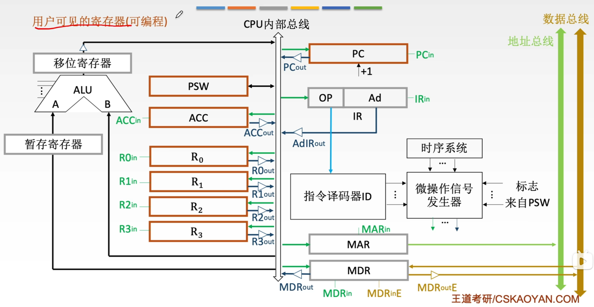

# CPU的功能和基本结构
## CPU的功能
CPU基本功能包括
-   取指令并译码
-   更新程序计数器（PC）
-   执行算数与逻辑运算
-   取操作数或写结果
-   处理异常或中断
-   时序控制

## CPU的基本结构

逻辑上CPU可以分为ALU（算术逻辑单元），CU（控制单元），寄存器和中断系统。

### 运算器的基本结构
-   算术逻辑单元ALU
-   通用寄存器组
-   暂存寄存器
-   程序状态字寄存器PSW，也称标志寄存器FR
-   移位器
-   计数器

### 控制器的基本功能
-   程序计数器PC（一般有自增功能，但是也有通过ALU实现）
-   指令寄存器IR：用于保存当前正在执行的指令
-   指令译码器ID：仅对操作码字段进行译码，向控制器提供特定的操作信号
-   操作控制信号形成部件：综合译码信号、时序信号和状态标志，生成微操作控制信号
-   时序系统：用于产生各种时序型号，由统一时钟分频得到
-   存储器地址寄存器MAR：用于存放要访问的主存单元的地址
-   寄存器数据寄存器MDR：用于存放向主存写入或读出的信息
    > MDRin控制CPU内部总线通路，MDRinE控制外部数据总线通路，out同理

### 寄存器
**用户可见寄存器**：可以被用户程序直接读取或修改。
包括寄存器组，专用地址寄存器（如基址寄存器，变址寄存器，堆栈指针等），PC；
还有**只读用户可见寄存器**，即标志寄存器，用户不能直接修改其值。

**用户不可见寄存器**：对用户完全透明，仅CPU硬件或操作系统内核在特权模式下使用，容易指令寄存器IR，MAR，MDR，页表基址寄存器等。

