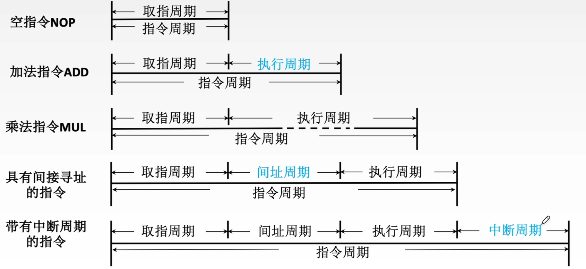
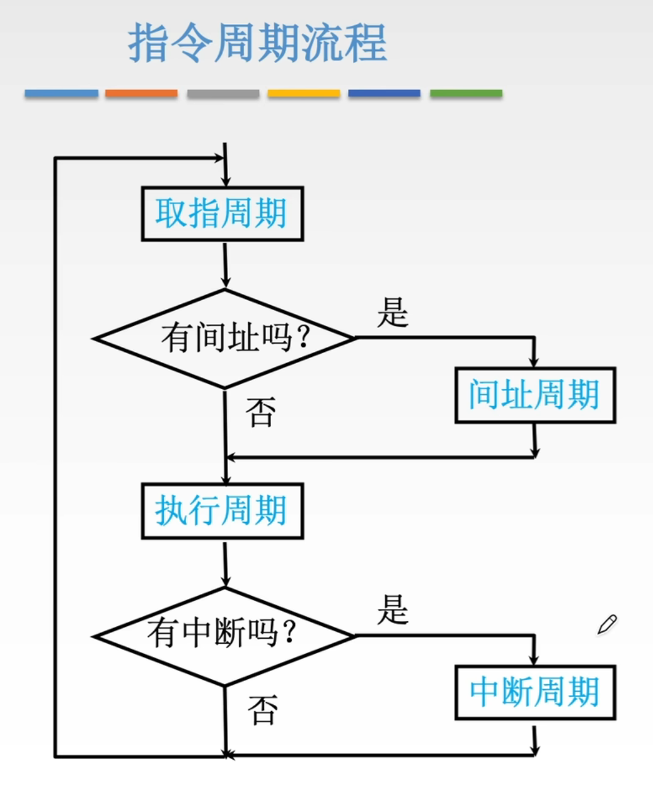
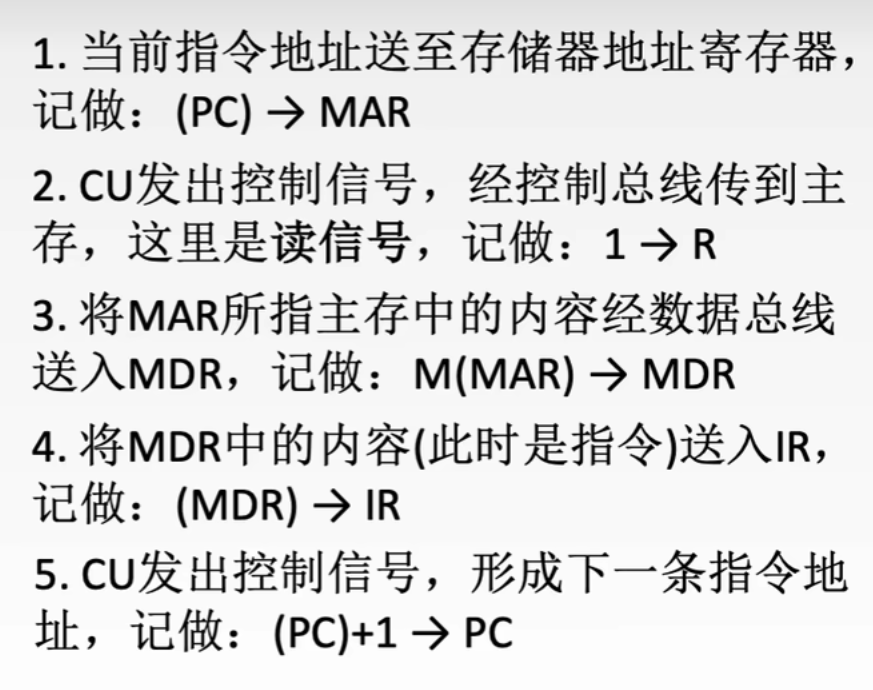
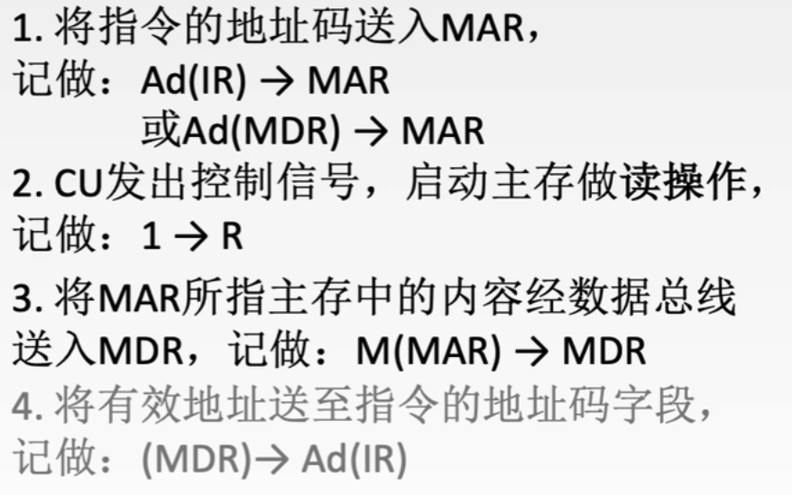
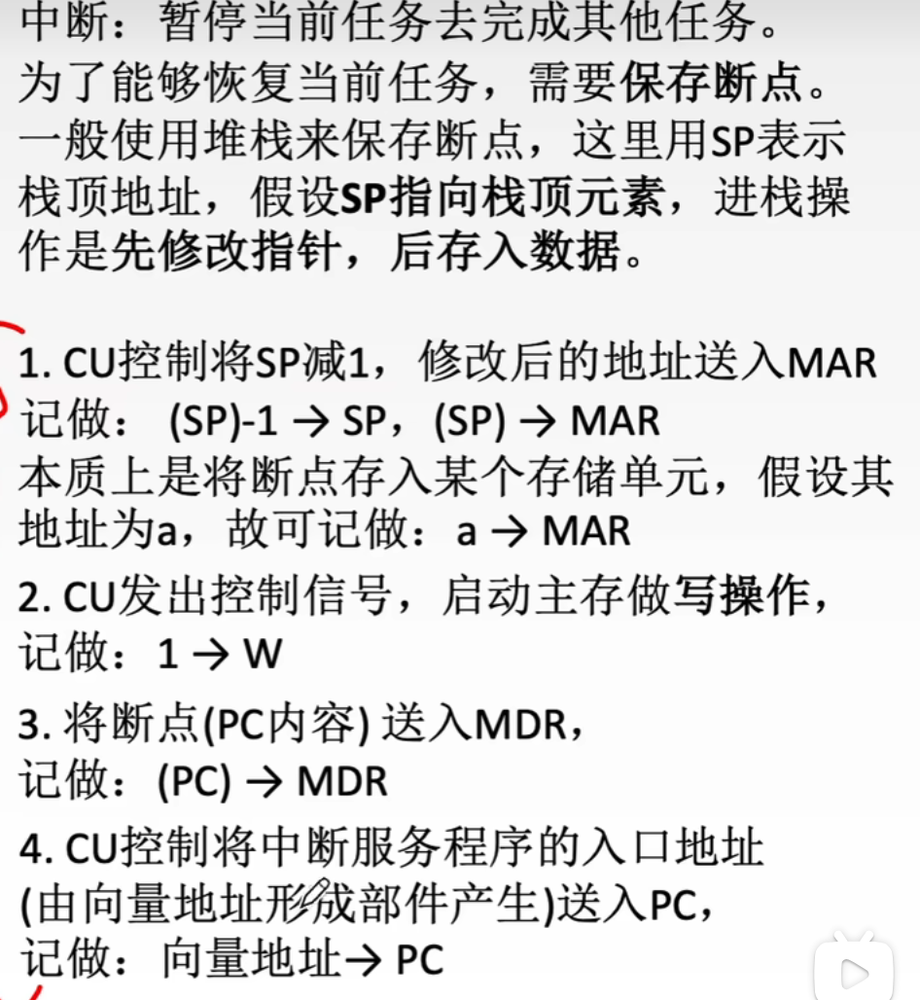

# 指令执行过程

## 指令执行的一般过程
-   以当前PC为地址，从主存取出下一条指令，**同时**PC自动更新为下一条顺序指令地址
-   进入译码与执行阶段
    -   若为分支指令，执行阶段判断分支条件，满足时**PC被更新为分支目标地址**
    -   若非分支指令，依次完成取操作数、执行运算、写回操作等
-   执行完成CPU进行**终端与异常检测**
    -   未检测中断或异常，则开始下一周期
    -   检测到中断或异常，进入中断响应阶段

## CPU的时序控制
计算机的时序控制用于**协调质量执行过程中各操作的先后顺序**。

**时钟信号**是时序控制的基础，**时钟周期的长度**由数据通路中相邻状态单元之间组合逻辑的最大传播延迟决定。

早期计算机采用“机器周期-节拍-脉冲”三级时序系统：一个**指令周期**被划分为若干**机器周期**，每个机器周期又细分为多个节拍。
> 因为不同指令功能复杂度不同，所需机器周期以及各机器周期的节拍均不同

**现代处理器已大幅简化时序结构**，机器周期概念被逐渐淡化，CPU内部由统一的系统时钟直接确定，**一个时钟周期即对应一个节拍**  

## 指令周期

指令周期指一条指令从主存读出到执行完成所经历的全部时间。

指令周期常用若干**机器周期**来表示，机器周期又叫**CPU周期**，一个机器周期又包含若干**时钟周期**（也称为节拍，T周期，CPU时钟周期，是CPU操作的最基本单位）

简单划分：
取指阶段|执行阶段
-|-

细致划分
取指|译码/ 读寄存器|执行/ 计算地址|访存|写回
-|-|-|-|-

-   **取指（IF）**，CPU根据PC的值，从主存（或指令Cache）中读取下一条指令，并将其送入IR，同时PC自动更新为下一条指令的地址
-   **译码/读寄存器（ID）** ，对IR中的指令进行译码，识别操作码和寻址方式，并从寄存器堆中读取所需操作数。
-   **执行/计算地址（EX）**，根据指令的类型执行相应操作：
    -   **算数或逻辑指令**，ALU完成
    -   **访存类指令**，计算操作数在主存中的有效地址
    -   **分支指令**，计算目标地址并判断是否转移
-   **访存（MEM）**，若指令需要访问主存，则此阶段通过数据Cache或主存完成读写操作。
-   **写回**，将最终结果写回寄存器堆

|||
-|-

怎么判断当前处于什么周期？借助四个触发器
类型|FE|IND|EX|INT
:-:|:-:|:-:|:-:|:-:
取指周期|$1$|$0$|$0$|$0$
间址周期|$0$|$1$|$0$|$0$
执行周期|$0$|$0$|$1$|$0$
中断周期|$0$|$0$|$0$|$1$

### 取指周期

### 执行周期
根据实际情况而定
### 间址周期

### 中断周期

## 处理器指令执行模型
**CPI**：每条指令的周期数
### 单周期处理器
为所有指令分配相同的执行时间，每条指令在一个时钟周期内完成。

缺点：对于可以在更短时间完成的指令，仍然要占用这个较长的周期。

### 多周期处理器
根据指令类型动态分配执行周期数，不同指令可以占用不同数量的周期数（平均CPI $> 1$）。

提高了时钟频率和资源利用效率，但是指令之间仍是串行执行，且需要更复杂的硬件设计。

### 流水线处理器
采用指令级并行策略，目标是每个时钟周期完成一条指令的吞吐（理想情况下CPI $=1$）。

实现机制：每个时钟周期启动一条新指令，使多条指令在流水线中重叠执行，各自处于不同的执行阶段。这样单条指令的起止经过多个周期，但是整体吞吐率显著提高。

