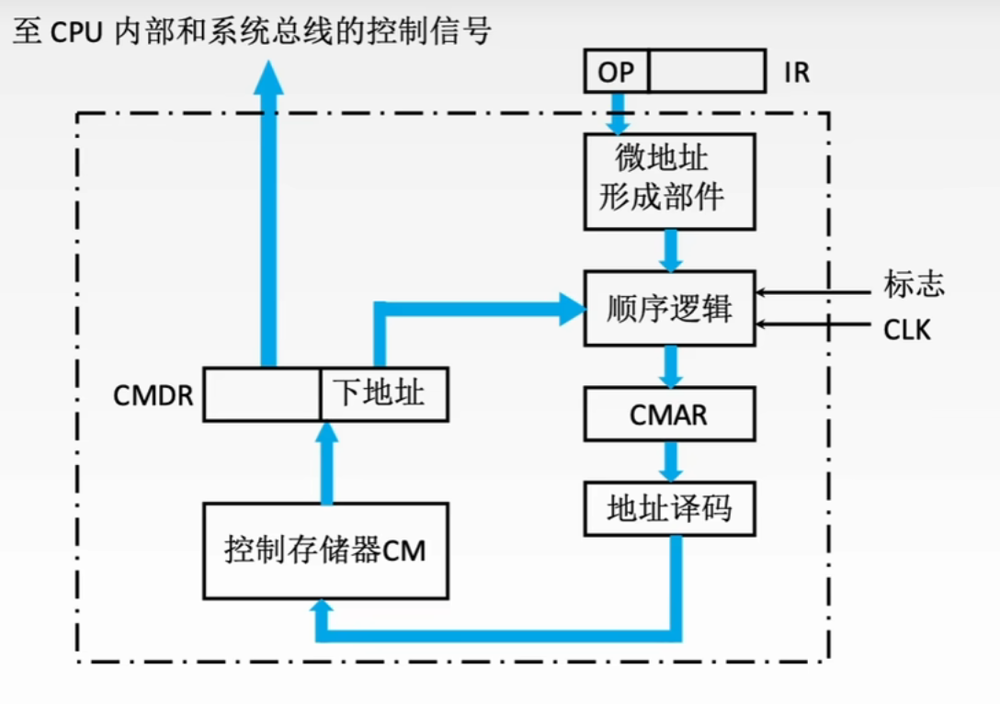

# 控制器的功能和工作原理
控制器的主要职责包括
-   取出待执行的指令并计算下一条指令的位置（更新PC）
-   对指令的操作码进行解码，产生对应的时序信号和控制信号，以协调各部件工作
-   管理CPU，主存和IO设备间的数据流向及时序，确保指令正确执行

根据微操作控制信号的生成方式不同，控制器可分为**硬布线控制器**和**微程序控制器**

## 硬布线控制器
由复杂的组合逻辑电路和触发器构成，也称组合逻辑控制器。

它根据指令需求、当前时序和内部状态，按时间顺序生成一系列**微操作控制信号**

CU的**输入**主要包括三类信号

-   操作译码器输出的**指令信息**
-   **时钟脉冲**
-   执行单元反馈的**状态标志**

根据指令操作码，当前机器周期，节拍信号，机器状态条件，可确定在这个节拍下应该发出哪些微命令

局限性：响应速度快但是灵活性低，修改或新增指令需要重新设计电路，复杂且耗时；同时随指令系统功能增强，微操作控制信号的数量急剧增加，导致电路规模庞大、调试困难。

## 微程序控制器
微程序控制器采用存储逻辑实现，核心思想是：将控制器所需的微操作控制信号组织微**微指令**，并将执行每条指令所需的微指令序列（微程序）预先存入一个专用的高速存储器中。运行时，控制器通过依次读取微指令，生成相应的微操作控制信号，从而完成指令的执行。

### 微程序控制的基本概念
微程序计思想是将每条机器指令编写为一段微程序。该程序由若干条微指令组成，每条微指令可产生一个或多个微命令。

执行一条机器指令的过程，实质上就是顺序执行其对应微程序的过程。

这些微程序预先存放在专用的**控制存储器CM**中

#### 一些术语 
**微指令**：若干微命令的集合，通常包含
-   操作控制字段：用于生成当前步骤所需的微操作控制信号
-   顺序控制字段：用于确定下一条微指令地址

**微周期**：执行一条微指令所需的基本时间单位，一般为一个时钟周期
**微命令**：控制部件向执行部件发出的最基本控制信号，是构成控制序列的最小单位；
**微操作**：执行部件收到微命令后执行的具体动作称为微操作

**关系**
-   一条机器指令
    -   一个微程序
        -   微指令$1$
        -   微指令$2$
            -  微命令$1$ - 微操作
            -  微命令$2$ - 微操作
            -   $\vdots$
            -   微命令$m$ - 微操作
        -   $\vdots$
        -   微指令 $n$

**主存储器**：用于存放程序和数据，位于CPU外部，通常RAM实现。
**控制存储器**：用于存放微程序，位于CPU内部，通过ROM实现；控制存储器中每个存储单元的地址称为微地址

**程序**：指令的有序集合，由软件开发者编写，完成特定功能麻醉针存放在主存或辅存。
**微程序**：：微指令的有序集合，由计算机体系结构设计者编写，用于解释和执行机器级指令。微程序本质是机器指令的**硬件级解释逻辑**，对程序员而言完全透明。

**寄存器**
-   **地址寄存器MAR**，存放主存读写地址
-   **微地址寄存器CMAR/$\mu$PC**，存放待执行微指令在控制存储器中的微地址
-   **指令寄存器IR**，存放从主存读出的当且机器指令
-   **微指令寄存器CMDR/$\mu$IR**，存放从控制存储器读出的当前微指令

### 微程序控制器的组成和工作过程
#### 微程序控制器的基本组成

> 对于此图，最新版王道将
> 顺序逻辑并入了微地址形成部件，
> CMAR改为 $\mu$PC，CMDR改为 $\mu$IR
> 地址译码并入$\mu$PC

**微地址形成部件** 
-   根据机器指令的操作码生成对应微程序的入口地址
-   依据当前微指令的顺序控制字段状态条件，产生后续**微地址**

**微指令寄存器 $\mu$PC**
接受微地址形成部件的微地址，作为CM的读地址

**控制存储器 CM**
微程序控制器的**核心部件**，存放所有机器指令对应的微程序

**微指令寄存器 $\mu$IR**
-   暂存从CM读出的微指令
-   将其操作控制字段和顺序控制字段分别送至执行单元和微地址形成部件

#### 微程序控制器的工作过程
-   **执行取指公共操作**
    -   系统启动或每条指令执行完毕后，将取指微程序的入口地址送入$\mu$PC
    -   从CM读取首条取指微指令并送入$\mu$IR，
    -   完成取指微程序后，从主存取出的机器指令被存在IR中
-   **生成当前指令的微程序入口**
    -   根据IR中操作码，通过微地址形成部件产生对应微程序的**起始微地址**并送入$\mu$PC
    > 比如如果取指周期紧接着间址周期，但是某个指令不需要间址周期，那么IR就会直接给出取指周期之后需要做的微程序起点，而不是顺序执行间址
-   **顺序执行微程序**
    -   从CM**逐条**读取微指令，送入$\mu$IR并执行，直到该微程序执行完毕
-   **返回循环**
    -   当前微程序执行结束，控制器自动转移会取指微程序入口
    -   重新开始处理下一条机器指令

#### 微程序和机器指令
一般而言，**一条机器指令对应一个微程序**

微程序总数 $=$ 机器指令条数 $+$ 公共微程序数（如取指，间址，中断等）
### 微指令的编码方式
微指令的编码方式也称为微指令的控制方式，是指对微指令**操作控制字段**进行最值和表示的方法

**目的** 在保证执行速度的前提下，尽可能缩短微指令字长

#### 直接编码（直接控制）方式
直接编码方式无需译码。控制字段的**每一位对应一个微命令**，若需要发出某个微命令，只需要将该位设为 $1$，

**优点** 结构简单直观，微命令可以并行发出，执行速度快
**缺点** 指令字长过长，$n$ 个微指令需要 $n$ 位

#### 字段直接编码方式
将操作控制字段划分为若干**互斥段**，互斥性微命令归于同一字段，每个字段独立编码，经译码后再起所属互斥微命令集中激活一个微命令

**分段遵循以下原则**
-   互斥性微命令分配在同一字段，相容性微命令分布在不同字段
-   每个字段位数不宜过多，以避免译码复杂或引入较大延迟
-   每个字段还需预留一个**本字段无操作**

**优点** 显著缩短微指令字长
**缺点** 需要译码，执行速度略低于直接编码

#### 字段间接编码方式
**基本思想：某个微命令字段的实际含义，由另一个字段的编码共同决定**

比如对于两类互斥操作：ALU操作的加减乘除 $4$ 种和存储器操作的读、写、取指、间址 $4$ 种。可以用 $3$ 位（包含无操作） $+ 1$ 位控制，控制信号为 $0$ 时候为 $ALU$ 操作，为 $1$ 则是存储器操作，这样只需要 $4$ 位，而直接编码需要 $8$ 位，字段直接编码需要 $6$ 位

**进一步缩短了指令字长，但是削弱了微指令的并行控制能力**

### 微地址的地址形成方式
为保证微指令流的连续执行，每条微指令必须指明其下一条微指令的地址。一般有两种方式：
-   增量方式，下一条微地址由$\mu$PC自动 $+1$，适用于微程序的顺序执行段
-   断定方式，在当前微指令显式指定下条微地址

实际运行，下调为地址的确定也取决于
-   **微程序入口地址的形成**，指令送入IR后，操作码经生成部件生成对应微程序的**首条微指令地址**，并送入$\mu$PC
-   **顺序执行**，通常采用增量方式；若采用断定方式，则显示填入顺序地址
-   **条件分支**

### 微指令的格式
#### 水平型微命令
|操作控制|顺序控制|
|:-:|:-:|
|$A_1,A_2,\cdots A_n$|判断测试字段 \| 后继地址字段|

直接编码，字段直接编码和字段简介编码都属于此格式

操作控制字段中，**每一位（或每一字段）直接对应一个微命令**
可以同时执行多个并行微操作

**优点** 并行能力强、执行效率高，微程序短
**缺点** 微指令字长长，编写微程序困难

#### 垂直型微指令
|微操作码|目的地址|原地址|
|:-:|:-:|:-:|
|$\mu$OP|Rd|Rs|

采用**类似机器指令**的结构，在微指令中设置未操作码字段，通过译码产生控制信号

一条垂直型微命令只能定义一个基本微操作

微指令短但是微程序长

#### 混合型微指令
在除执行的基础上增加一些不太复杂的并行操作

