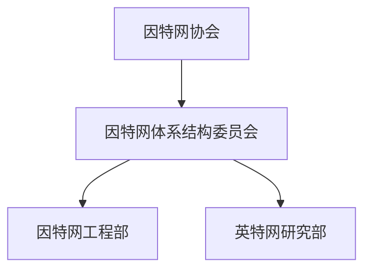
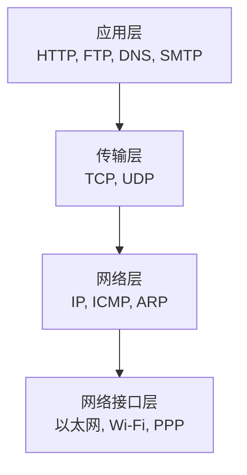

# 因特网概述
## 网络、互联网与英特网
**网络**是由若干结点和连接这些结点的链路组成
**互联网**是网络的网络
多个网络可以通过路由器互连起来，构成一个覆盖范围更大的网络，即互联网
**Internet（因特网）** 是世界上最大的互联网

## 因特网发展历程

**Internet诞生于 1983年**

### 因特网服务提供者ISP
Internet Service Provider
1993年起Internet有ISP运营。

现在，**Internet已经发展成基于ISP的多层次结构的互联网络**

- 第一层，**国际级**
    覆盖面积最大且拥有高速链路和和交换设备；
    第一层ISP直接直接相连构成**Internet主干网**
- 第二层，**区域级或国家级**
    与少数第一层ISP相连接，作为第一层ISP的用户。
- 第三层，**本地级**
    与第二层ISP相连，作为第二层ISP的用户。
    普通校园网，企业网，个人用户也是第三层ISP的用户。**相同层级的ISP也可以选择直接连接**

**接入Internet的用户也可以作为一个ISP**

### 因特网的标准化工作
Internet的标准化工作对Internet的发展气到了非常重要的作用。
一个很大**特点**是**面向公众**
任何一个标准建议都会先一RFC技术文档的心事在Internet上发表，任何人都可以免费下载RFC，并随时发表意见和建议

**制定标准的流程：**
因特网草案 $\to$ 建议标准 $\to$ 因特网标准
*其中在建议标准时成为RFC文档*
> 只有小部分RFC文档能够成为因特尔标准

> 原流程为：
> 因特网草案 $\to$ 建议标准 $\to$ 草案标准 $\to$ 因特网标准
> 但草案标准已于2011年10月取消，

### 因特网的管理机构
**因特网协会ISOC**是一个国际性组织，负责对Internet进行全面管理，以及在世界范围内促进其发展和使用。

- 因特网协会ISOC：全面管理
- 因特网体系结构委员会IAB：负责管理英特网相关协议的开发
- 因特网工程部IETF：负责研究中短期工程问题、相关蜥蜴的开发和标准化
- 因特网研究部IRTF：负责研究理论方面需要长期考虑的问题

### 因特网的组成
拓扑结构非常复杂，但是可以从功能上简单划分为两部分
- **边缘部分：** 由各种用户设备组成，这些用户设备常被称为**主机**
    - 主机由用户直接使用，为其提供各种网络服务
- **核心部分：** 由**大量异构性网络**和连接这些网络的**路由器**组成。
    核心部分为边缘部分提供连通性和数据交换等服务。

# 电路交换、分组交换、报文交换
**交换** 就是按照某周方式动态地分配传输线路的资源
## 电路交换

步骤
- 建立连接（分配通信资源）
- 通话（一直占用通信资源）
- 释放连接（归还通信资源）

使用电路交换传输计算机数据时，线路的传输效率往往很低。

## 分组交换
将传输的信息称为报文。较长的数据不适合直接传输，对缓存需求较大，且在错误处理方面比较低效。所以将报文划分为若干较小**等长**数据段，并在前面加上一些必要控制信息（称为**首部**）。这样就构成了一个个**分组**

源主机将分组发送到交换网中，交换网接受一个分组后，先缓存下来，然后从首部提取目标地址，查找自己的转发表后发送到下一个交换机。最终转发到目的主机。

**各部分任务**
发送方：构造分组，发送分组
交换节点：存储，转发
接收方：接收，还原报文

# 计算机网络的定义和分类
## 计算机网络的定义
计算机网络并没有一个精确和统一的定义

不同的阶段有着不同的定义，这反映了当时计算机网络技术的发展水平

**早期的最简单定义：** 一些**互联**的，**自洽**的**计算机的集合**

**现阶段较好的定义：** 计算机网络主要是由一些**通用的，可编程的硬件互联而成**，这些可编程硬件能够用来**传送多种不同类型的数据**，并且支持广泛的和日益增长的 应用。

## 计算机网络的分类
### 交换方式
电路交换，报文交换，分组交换

### 使用者
公用网，如Internet
专用网

### 传输介质
无线/有线

### 覆盖范围
- 广域网
    **几十千米到几千千米**，可以覆盖一个国家甚至几个洲。
- 城域网
    $5 \sim 50km$，跨越几个街区甚至整个城市
- 局域网
    一般 $1km$，通常通过高速链路连接。
    现在校园网和企业网就可能有多个互联的局域网
- 个域网
    个人局域网，一般 $10m$。
    因为主要用于个人，把个人的各种设备通过Wi-Fi或蓝牙等无线技术连接，因此也称为**无线个域网**

### 拓扑结构
总线型，星型，环型，网状型

这四种基本拓扑还可以互联为更复杂的结构

# 计算机网络的性能指标
## 速率
### 数据量的单位
最基础单位**比特** $bit$，一个比特即二进制下一位数字

$1 byte$（字节） $= 8bit$
然后千字节 $KB$，兆字节 $MB$，吉字节 $GB$，太字节 $TB$
互相为前者的 $2^{10}$ 倍

### 比特率
单位为 $bps$ 或者 $b/s$，表示每秒传输多少 $bit$
同样也有 $k,m,g,t$ 的单位
但是注意对于比特率的换算 **$1kbps = 10^3 bps$**

**$b/s$ 和 $B/s$ 是不同的，前者表示比特每秒，后者表示字节每秒，有八倍的差距** 

在计算传输时间时，需要将分子的数据量和分母的比特率均换算为 $bit$，防止两者换算倍率不同造成错误

## 带宽
**在模拟信号下的意义：** 某个信号所包含的各种不同频率成分所占据的频率范围。单位 $Hz$

**在计算机网络中的意义：** 网络的通信线路所能传送数据的能量。即在单位时间从某一点到另一点所**能通过的最高数据率**。单位和速率相同。

数据传输速率 $= \min \{$主机接口速率，线路带宽，交换机或路由器接口速率$\}$

## 吞吐量
指单位时间内通过某个网络或接口的**实际数据量**。

> 对于用户主机，可以理解为 $\sum$ 下载速率 $+$ 上传速率

## 时延

**时延**是指数据从网络的一段传送到另一端所耗费的时间。

### 发送时延
**发送时延是主机或路由器发送分组所耗费的时间。** 也就是从发送第一个分组的第一个bit开始，到该分组的最后一个bit发送完毕为止耗费的时间。

$$ 发送时延 = \dfrac{分组长度(b)}{发送速率(b/s)} $$

### 传播时延
**传播时间是电磁波在链路（传输介质）上传播一定距离所耗费的时间。**

$$ 传播时延 = \dfrac{链路长度(m)}{电磁波传播速率(m/s)} $$

|介质|速率|
|-|-|
|自由空间|$3 \times 10^8 m/s$|
|铜线电缆|$2.3 \times 10^8 m/s$|
|光纤|$2 \times 10^8 m/s$|

**1km光纤链路传播时延 $5\mu s$**
### 排队时延
分组在路由器的输入队列和输出队列中排队所耗费的时间就是排队时延

**无法用一个简单的公式进行计算**

### 处理时延
**处理时延路由器对分组进行一系列处理工作所耗费的时间。**
处理工作包括检查分组首部是否误码，提取分组首部的目的地址，为分组查找相应的转发接口已经修改首部的部分内容等。

**也无法用一个简单公式进行计算**

### 时延带宽积
时延带宽积 $=$ 传播时延($s$) $\times$ 带宽($b/s$)

链路的时延带宽积叶成文以贴为单位的链路长度 

### 往返时间RTT
往返时间是指从发送端发送数据开始，到发送端收到接收端发来的相应确认分组为止，总共耗费的时间。

### 利用率
分为**链路利用率**和**网络利用率**

**链路利用率**是指某条链路有多少百分比的时间被利用。

**网络利用率**是指网络中**所有链路**的**加权平均**

$$ 当前时延 = \dfrac{空闲时延}{1 - 网络利用率} $$

### 丢包率
丢包率指在一定时间范围内，传输过程中丢失的分组数量与总分组数量的比例。

# 计算机网络的体系结构

## 常见三种网络体系结构
开放系统互联参考模型OSI
七层，但是过晚过复杂功能重复且效率低，所以没有使用运用

### TCP/IP参考模型
Internet使用
四层

### 原理参考模型
将OSI和TCP/IP结合
也就是将网络接口层重新划分为数据链路层和物理层

## 分层的必要性
分层是计算机网络体系结构最重要的思想。

计算机网络是一个复杂的结构，早在ARPANET设计初期就提出了分层设计的概念。
 

### 物理层
- 采用什么**传输媒体**
- 采用什么**物理接口**
- 采用什么**信号**

### 数据链路层
- 如何识别网络中的各主机
    主机编码（如MAC地址）
- 如何区分出地址和数据
    数据封装格式
- 如何协调主机争用总线
    媒体介入控制
- 以太交换机
    自学习，转发帧
- 监测数据是否误码
    可靠传输和不可靠传输
- 流量控制

### 网络层
如何识别互联网中的各网络以及网络中的各主机？
IP地址

路由器如何转发分组和进行路由选择
路由转发协议，路由表和转发表

### 运输层
如何识别主机中与网络通信相关的应用进程？
进程的表示

如何处理传输差错？
可靠传输与不可靠传输

### 应用层
通过进程间的交互完成特定的网络应用

进行会话管理与数据表示

# 计算机网络协议结构中的专用术语
**实体：** 人合伙可发送或接受信息的硬件或软件进程。
**对等实体：** 双方相同层次中的实体

**协议：** 控制两个对等实体在“水平方向”进行“逻辑通信”的规则集合
> “逻辑通信”并不存在，只是假设出来的一种通信。

**协议三要素：**
- **语法**：定义通信双方所**交换信息的格式**
- **语义**：定义通信双方所**要完成的操作**
- **同步**：定义通信双方的**时序关系**

**服务：** 在协议控制下，两个对等实体在水平方向的逻辑通信使得**本层能够向上一层提供服务**

在同一系统重相邻两层的实体交换信息的逻辑接口称为**服务访问点**（SAP）。

上层要使用下层所提供的服务，必须通过与下层**交换一些命令**，这些命令称为**服务原语**

**通信双方交互的数据包：**
- **协议数据单元PDU**：对等层次之间传送的数据包
- **服务数据单元SDU**：同一系统相邻层之间交换的数据包
- **比特流**：**物理层**对等实体间逻辑通信的数据包
- **帧**：数据链路层...
- **分组**：网络层
    如果使用IP协议，也称为**IP数据报**
- 运输层视协议而定
    - **TCP报文段**：TCP协议
    - **UDP用户数据报** ： UDP协议
- **应用报文**：应用层