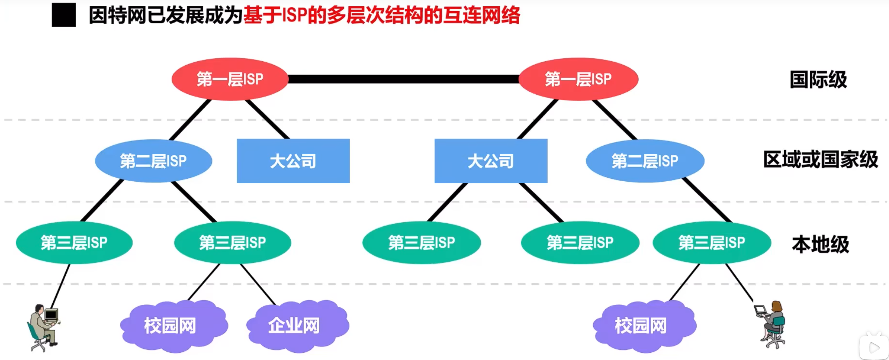
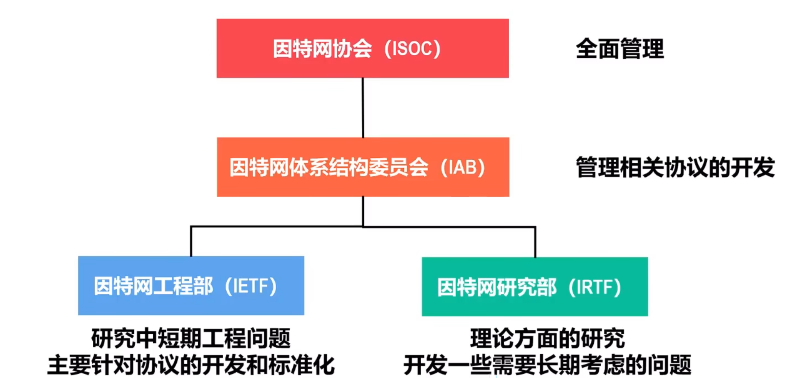

# 因特网概述
## 网络，互联网，英特网的曲边与关系
### 网络Network
**网络**是由若干**节点**和连接这些节点的**链路**组成

### 互联网internet
**互联网**是由**若干网络**和连接这些网络的**路由器**组成的

*可以将其称为<u>网络的网络</u>*

### 因特网Internet
**因特网Internet是当今世界上最大的互联网**

### 总结与辨析
**总结**
若干节点和链路互连形成网络，而若干网络通过路由器互连形成互联网，英特网是世界最大的互联网

**注意**
-   internet是互联网，可以使用**任意通信协议**
-   Internet是因特网，必须使用**TCP/IP协议族**

## 因特网发展阶段
1966年，第一个分组交换网ARPANET被创建

### 单个分组交换网想互联网发展
人们意识到不可能通过一个单独的网络解决所有通信问题

1983年**TCP/IP协议族**称为ARPANET上的标准协议，任何使用TCP/IP协议族的计算机都能通过网络互联通信。

**1983年成为因特网诞生时间**

### 三级结构因特网
1985年建立国家科学家基金网NSFNET

由**主干网 - 地区网 - 校园网**三级结构组成

1990年，ARPANET正式关闭

1991年，因特网初步商业化，开始收费

### 多层次ISP结构因特网
1993年，NSFNET被多个商用因特网主干网替代

由各种**ISP（因特网服务提供者）**运用，任何单位或个人都可以通过ISP接入因特网，只需要安装ISP规定缴纳费用即可。

1994年，**万维网**技术在因特网上被广泛使用，使得众多普通的计算机用户可以便捷使用网络

1995年，NSFNET停止运作，因特网彻底商业化

目前，**因特网已发展为基于ISP的多蹭结构的互联网络**

已经介入因特网的永和也可以称为一个ISP。因此，因特网的结构实际上是**基于ISP的多层次结构**

## 因特网的标准化工作和管理机构
### 因特网的标准化工作
因特网的标准化工作是面向公众的，任何一个建议标准在成为因特网标准前，都以RFC技术文档的形式在因特网发表。

**指定标准过程**
因特网草案 $\to$ 建议标准 $\to$ ~~草案标准~~ $\to$ 因特网标准
> 2011年10月取消了草案标准阶段

在建议标准时会成为RFC文档

### 因特网管理机构

因特网由国际组织**因特网协会ISOC**全面管理。下设**因特网体系结构委员会IAB**，负责管理因特网相关协议的开发。

IAB下设**因特网工程部IETF**负责*中短期*工程问题，相关协议的开发和标准化
下设**因特网研究部IRTF**负责研究理论方面需要*长期**考虑的问题

## 因特网的组成
网络拓扑结构非常复杂，但是可以从功能上简答划分为两部分
-   **边缘部分**，由链接在因特网上的各种用户设备组成，这些用户设备被称为**主机**，由用户直接使用，为用户提供各种网络应用。
-   **核心部分**，由**大量异构型网络**和连接这些网络的**路由器**构成。因特网核心部分为其边缘部分提供**连通性**和**数据交换**等服务。

