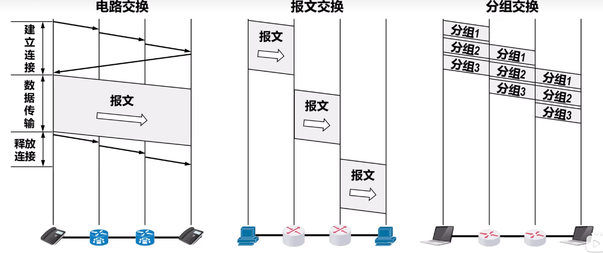

# 三种交换方式

## 电路交换
**步骤**：
-   建立连接，分配通信资源
-   通话，一直占用通信资源
-   释放连接，归还通信资源

计算机之间的数据传送是**突发式的**，当使用电路交换来传送计算机数据时，其线路的<u>传输效率一般都很低</u>

## $\star$ 分组交换
在ARPANET颜值初期，就采用了基于*存储转发*技术的*分组交换*技术

待发送的<u>整块数据</u>通常被称为**报文**

较长的报文一般不适宜直接传输，对交换节点的缓冲容量有较大需求，在错误处理上也比较低效

**构造分组过程**：
将较长的报文划分为若干较小的等长数据段，在每个数据段前添加一些<u>必要的控制信息（如源地址和目的地址等）</u>组成**首部**，这样就构造出了一个**分组**

**分组是在分组交换网上传输的数据单元**

**交换过程**：
源主机将分组发送到分组交换网中，分组交换网中的交换机收到一个分组后，先缓存下来，然后从首部提取目的地址，按照目的地址查找自己的转发表，找到对于的转发接口将分组转发出去，将分组交给下一个分组交换机。经过多个分组交换机的存储转发后，分组最终转发到目的主机

**优点**
-   没有建立连接盒释放连接的过程
-   传输过程中逐段占用通信链路，**有较高的通信线路利用率**
-   交换节点为每个分组独立选择转发路由，使网络有很好的生存性

**缺点**
-   首部带来额外开销
-   路由器存储转发分组造成一定**时延**
-   通信量较大时造成网络堵塞
-   分组可能出现失序或丢失

## 报文交换
分组交换的前身

**报文被整个地发送**，所以报文交互比分组交换带来的转发时延更长，需要交换节点具有的缓存页更多

