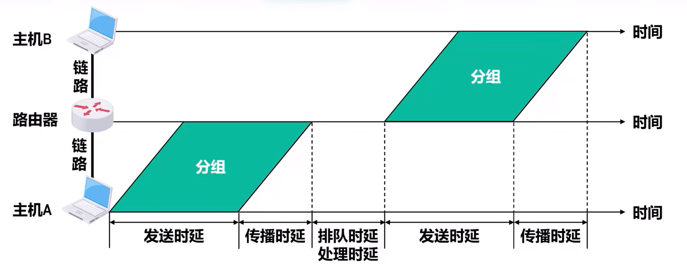

# 计算机网络的性能指标
## 速率
### 数据量的单位
最基础单位**比特** $bit$，一个比特即二进制下一位数字

$1 Byte$（字节） $= 8bit$
然后千字节 $KB$，兆字节 $MB$，吉字节 $GB$，太字节 $TB$
互相为前者的 $2^{10}$ 倍

### 比特率
单位为 $bps$ 或者 $b/s$，表示每秒传输多少 $bit$
同样也有 $k,m,g,t$ 的单位
但是注意对于比特率的换算 **$1kbps = 10^3 bps$**

**$b/s$ 和 $B/s$ 是不同的，前者表示比特每秒，后者表示字节每秒，有八倍的差距** 

在计算传输时间时，需要将分子的数据量和分母的比特率均换算为 $bit$，防止两者换算倍率不同造成错误

## 带宽
**在模拟信号下的意义：** 某个信号所包含的各种不同频率成分所占据的频率范围。单位 $Hz$

**在计算机网络中的意义：** 网络的通信线路所能传送数据的能量。即在单位时间从某一点到另一点所**能通过的最高数据率**。单位和速率相同。

数据传输速率 $= \min \{$主机接口速率，线路带宽，交换机或路由器接口速率$\}$

## 吞吐量
指单位时间内通过某个网络或接口的**实际数据量**。

> 对于用户主机，可以理解为 $\sum$ (下载速率 $+$ 上传速率)

## 时延

**时延**是指数据从网络的一段传送到另一端所耗费的时间。

### 发送时延
**发送时延是主机或路由器发送分组所耗费的时间。** 也就是从发送第一个分组的第一个bit开始，到该分组的最后一个bit发送完毕为止耗费的时间。

$$ 发送时延 = \dfrac{分组长度(b)}{发送速率(b/s)} $$

### 传播时延
**传播时间是电磁波在链路（传输介质）上传播一定距离所耗费的时间。**

$$ 传播时延 = \dfrac{链路长度(m)}{电磁波传播速率(m/s)} $$

|介质|速率|
|-|-|
|自由空间|$3 \times 10^8 m/s$|
|铜线电缆|$2.3 \times 10^8 m/s$|
|光纤|$2 \times 10^8 m/s$|

**1km光纤链路传播时延 $5\mu s$**
### 排队时延
分组在路由器的输入队列和输出队列中排队所耗费的时间就是排队时延

**无法用一个简单的公式进行计算**

### 处理时延
**处理时延路由器对分组进行一系列处理工作所耗费的时间。**
处理工作包括检查分组首部是否误码，提取分组首部的目的地址，为分组查找相应的转发接口已经修改首部的部分内容等。

**也无法用一个简单公式进行计算**

### 时延带宽积
时延带宽积相当于链路管道的容积

时延带宽积 $=$ 传播时延($s$) $\times$ 带宽($b/s$)

链路的时延带宽积也称为以bit为单位的链路长度

### 往返时间RTT
往返时间是指从发送端发送数据开始，到发送端收到接收端发来的相应确认分组为止，总共耗费的时间。

### 利用率
分为**链路利用率**和**网络利用率**

**链路利用率**是指某条链路有多少百分比的时间被利用。

**网络利用率**是指网络中**所有链路**的**加权平均**

$$ 当前时延 = \dfrac{空闲时延}{1 - 网络利用率} $$

### 丢包率
丢包率指在一定时间范围内，传输过程中丢失的分组数量与总分组数量的比例。