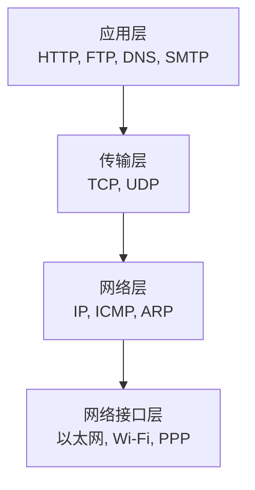
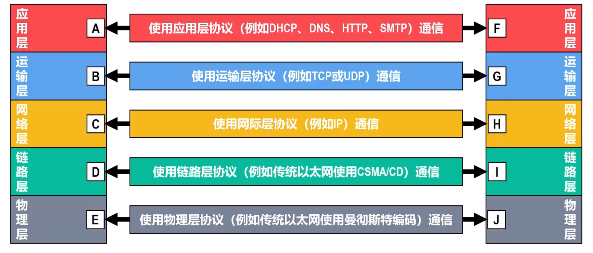
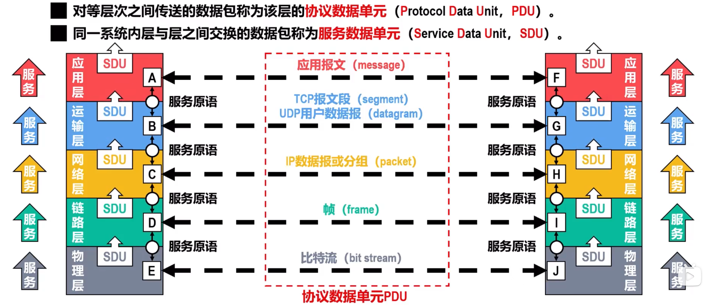

# 计算机网络体系结构
## 常见三种网络体系结构
开放系统互联参考模型OSI
七层，但是过晚过复杂功能重复且效率低，所以没有使用运用

### TCP/IP参考模型
Internet使用
四层

### 原理参考模型
将OSI和TCP/IP结合
也就是将网络接口层重新划分为数据链路层和物理层

## 分层的必要性
分层是计算机网络体系结构最重要的思想。

计算机网络是一个复杂的结构，早在ARPANET设计初期就提出了分层设计的概念。
 

### 物理层
-   采用什么**传输媒体**
    > 严格来说**传输媒体并不属于物理层**，其并不包含在计算机网络体系结构中
-   采用什么**物理接口**
-   采用什么**信号**

### 数据链路层
-   **如何识别网络中的各主机**
    主机编码（如MAC地址）
-   **如何区分出地址和数据**
    数据封装格式
-   **如何协调主机争用总线**
    媒体介入控制
-   **以太交换机**
    自学习，转发帧
-   **监测数据是否误码**
    可靠传输和不可靠传输
-   **流量控制**

### 网络层
-   **如何识别互联网中的各网络以及网络中的各主机？**
    IP地址
-   **路由器如何转发分组和进行路由选择**
    路由转发协议，路由表和转发表

### 运输层
-   **如何识别主机中与网络通信相关的应用进程？**
    进程的标识
-   **如何处理传输差错**？
    可靠传输与不可靠传输

### 应用层
通过进程间的交互完成特定的网络应用

进行会话管理与数据表示

## 计算机网络协议结构中的专用术语
### 实体和对等实体
**实体**：任何可发送或接受信息的硬件或软件进程。
**对等实体**：双方相同层次中的实体

### 协议
**协议**：控制两个对等实体在“**水平方向**”进行“**逻辑通信**”的**规则**集合
> “逻辑通信”并不存在，只是假设出来的一种通信。

**协议三要素：**
- **语法**：定义通信双方所**交换信息的格式**
- **语义**：定义通信双方所**要完成的操作**
- **同步**：定义通信双方的**时序关系**

### 服务
**服务：** 在协议控制下，两个对等实体在水平方向的逻辑通信使得**本层能够向上一层提供服务**
> 应用层给用户提供服务

在同一系统重相邻两层的实体交换信息的逻辑接口称为**服务访问点**（SAP）。

上层要使用下层所提供的服务，必须通过与下层**交换一些命令**，这些命令称为**服务原语**

**通信双方交互的数据包：**

- **协议数据单元PDU**：对等层次之间传送的数据包
- **服务数据单元SDU**：同一系统相邻层之间交换的数据包
- **比特流**：**物理层**对等实体间逻辑通信的数据包
- **帧**：数据链路层...
- **分组**：网络层
    如果使用IP协议，也称为**IP数据报**
- 运输层视协议而定
    - **TCP报文段**：TCP协议
    - **UDP用户数据报** ： UDP协议
- **应用报文**：应用层