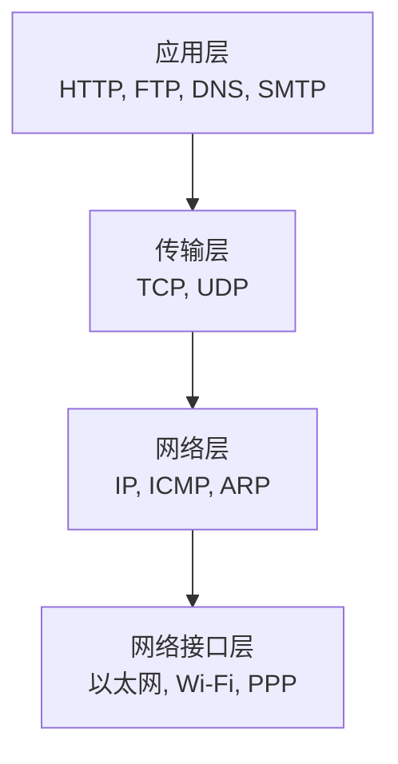
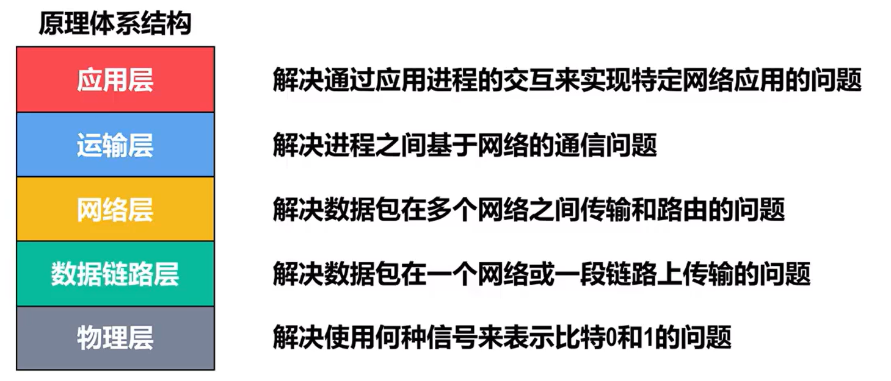

# 计算机网络体系结构
# 计算机网络的体系结构

## 常见三种网络体系结构
开放系统互联参考模型OSI
七层，但是过晚过复杂功能重复且效率低，所以没有使用运用

### TCP/IP参考模型
Internet使用
四层

### 原理参考模型
将OSI和TCP/IP结合
也就是将网络接口层重新划分为数据链路层和物理层

## 分层的必要性
分层是计算机网络体系结构最重要的思想。

计算机网络是一个复杂的结构，早在ARPANET设计初期就提出了分层设计的概念。
 

### 物理层
-   采用什么**传输媒体**
    > 严格来说**传输媒体并不属于物理层**，其并不包含在计算机网络体系结构中
-   采用什么**物理接口**
-   采用什么**信号**

### 数据链路层
-   **如何识别网络中的各主机**
    主机编码（如MAC地址）
-   **如何区分出地址和数据**
    数据封装格式
-   **如何协调主机争用总线**
    媒体介入控制
-   **以太交换机**
    自学习，转发帧
-   **监测数据是否误码**
    可靠传输和不可靠传输
-   **流量控制**

### 网络层
-   **如何识别互联网中的各网络以及网络中的各主机？**
    IP地址
-   **路由器如何转发分组和进行路由选择**
    路由转发协议，路由表和转发表

### 运输层
-   **如何识别主机中与网络通信相关的应用进程？**
    进程的标识
-   **如何处理传输差错**？
    可靠传输与不可靠传输

### 应用层
通过进程间的交互完成特定的网络应用

进行会话管理与数据表示