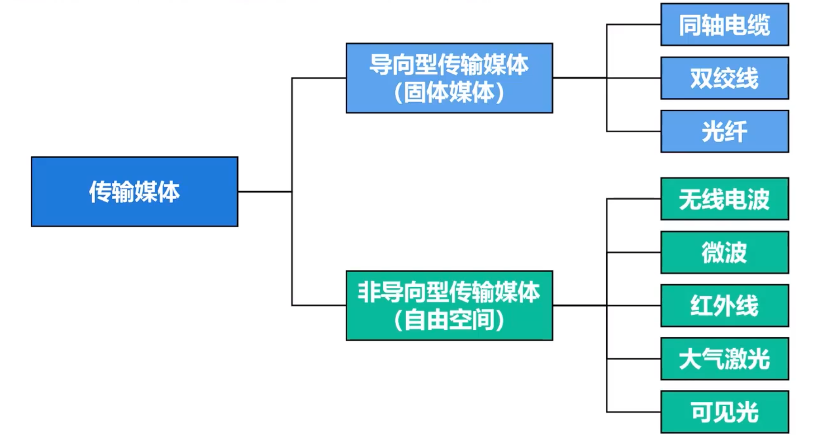

# 物理层下的传输媒体
**传输媒体**是计算机网络设备之间的物理通路，也称传输介质或传输媒体。
可分为
-   **导向性传输媒体**，也就是固体媒体
-   **非导向性传输媒体**，也就是自由空间

**传输媒体不包含在计算机网络体系结构**，其在物理层之下

## 导向性传输媒体
### 同轴电缆

同轴电缆具有很好的抗干扰性，广泛应用于高速数据传输

一般分为两类
-   $50 \Omega$ 阻抗的**基带同轴电缆**：用于数字传输，在早期局域网广泛使用
-   $75 \Omega$ 阻抗的**宽带同轴电缆**：用于模拟传输，目前主要用于有线电视的入户线

**缺点**：价格较贵且布线不够灵活和方便

现在局域网邻域基本都采用双绞线作为传输媒体

### 双绞线
把两根互相绝缘的铜导线按一定密度互相**绞合**构成**双绞线**

**绞合的作用**
-   减少相邻导线的电磁干扰
-   地狱部分俩字外接的电磁干扰

双绞线可以用于模拟传输和数字传输，通信距离一般为**即到十几km**
-   对于模拟传输，距离太长需要添加**放大器**，以将衰减信号放到到合适的强度
-   对于数字传输，距离太长需要添加**中继器**，以便对失真数字信号进行整型

### 光纤
光纤通信是利用光脉冲在光纤中的传递来通信的

因为可见光频率非常高，所以一个光纤通信系统的传输带宽远大于其他媒体

## 非导向性传输媒体
**自由空间**就是无线通信所使用的**非导向性传输媒体**

### 无线电波
无线电波（波长 $1m \sim 10km$）很容易产生，并且传播距离很远。因此无线电波广泛用于通信领域
-   低频无线电波能够很容易地穿透障碍物，但其能量随着距离急剧衰减
-   高频无线电波趋于直线传播并会受到障碍物阻挡

### 微波
波长 $1mm \sim 1m$，有地面微波通信和卫星通信两种方式

