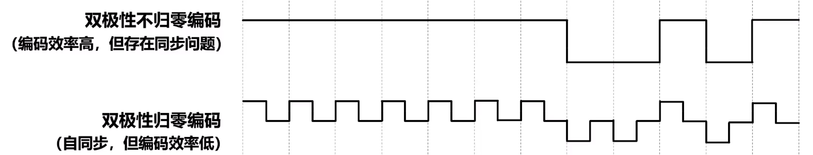
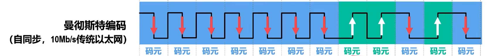
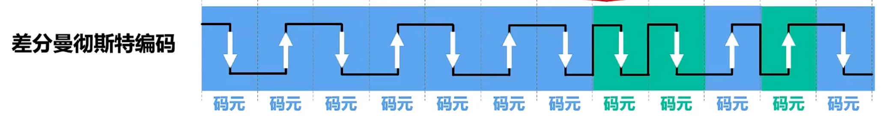
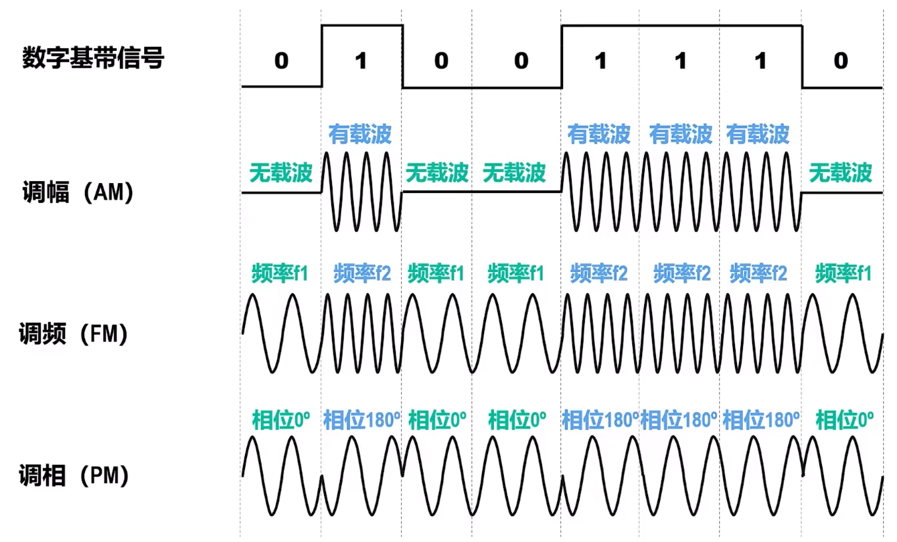
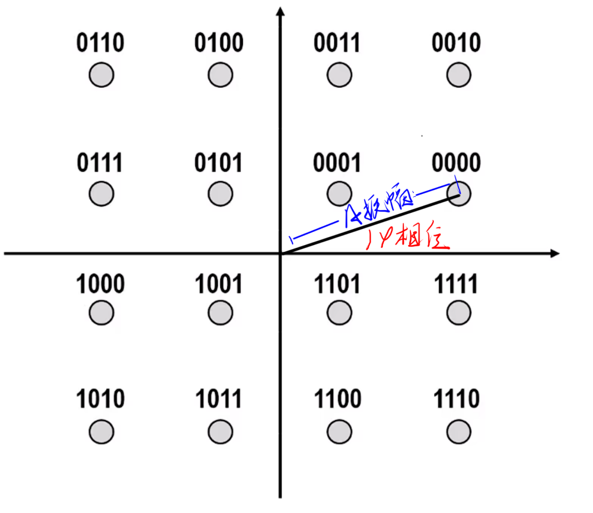

# 编码与调制
## 编码与调制的基本概念
### 消息、数据和信号
**消息**：需要由计算机处理和传输的文字、图片、音频和视频等内容。
**数据**：运送消息的实体
**信号**：数据的电磁表现

### 基带信号
由信源发出的原始信号称为**基带信号**

**调制的原因**：基带信号包含较多低频和直流成分，许多信道并不难传输此类分量

### 调制和编码
调制分为基带调制和带通调制

-   **基带调制**，也称**编码**，对数字基带信号的波形进行变换，调制后仍为**数字基带信号**
-   **带通调制**，转换为**模拟信号**

### 码元
在使用时间域的波形表示信号时，代表不同离散数值的基本波形被称为**码元**

一个码元携带的信息不固定，取决于编码方式和调制方式

## 常用编码方式

### 不归零制
在码元器件不会回归零电平。
**编码效率最高**，但是**存在收发双方同步问题**。

### 归零制
每个码元器件回归零电平

可以**自同步**，但是大部分数据带宽都用来归零而浪费了

### 曼切斯特编码

每个码元中间时刻电平发生**跳变**，**电平的跳变既表示时钟信号，也表示数据**。

**向下跳变是0还是1，可自行设定**

> $10Mb/s$ 的传统以太网采用曼切斯特编码
### 差分曼切斯特编码

每个码元中间时刻电平发生跳变，但是**跳变仅表示时钟信号，不表示数据**，**数据表示在码元开始是否有电平跳变**，**无跳变表示1，有跳变表示0**

差分比传统有更强的抗干扰性

> 思考：湖科大教材说差分的变化更少
但是在大量变化的情况下（010101），传统的变化就会比差分更少。
> 因为对于传统，每bit约一次，而差分对于bit1需要变一次，而bit0需要两次，平均 $1.5$ 次。
> 
> 同时对于全相同数据，传统是固定均 $2N$，而差分是全 $1$ 的 $N$，全 $0$ 的 $2N$，所以应该说明清楚

## 调制方法
### 基本带通调制
**调幅：** 振幅变化，如有载波代表1，无载波代表0
**调频：** 频率变化，如 $f_1$ 代表1，$f_2$ 代表0
**调相：** 初相位变化，如0相位代表0，180相位代表1

上述方法1码元只能包含1bit信息

### 混合调制
混合调制方法可以**使得1码元包含多个bit信息**

因为频率和相位相关，所以不能混合调制

但是相位和振幅可以混合调制
比如正交调幅信号，有 $12$ 种相位，每个相位有 $1\sim2$ 种振幅可选，可以调制出 $16$ 种码元，那么每个码元表示 $\log_2 16 = 4$ 位。
此方法使用**格雷码**，保证相邻码元只有1bit不同。
> 可以保证失真时误码尽可能少。

