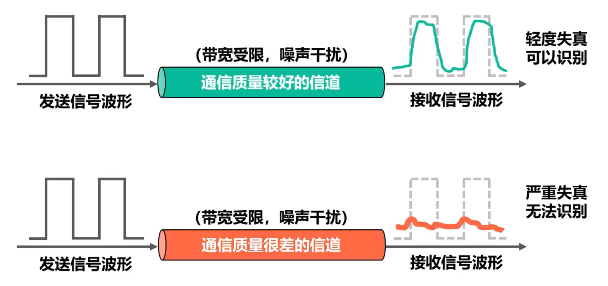

# 信道的极限容量
## 造成信号失真的原因

任何实际的信道都不是理想的，信号在信道上传输时不可避免会产生失真。

**造成失真原因**：
- 码元传输速率
- 信号传输距离
- 噪声干扰
- 传输媒体质量

如果数字信号中的高频分类传输时衰减甚至不能通过信道，则接收端收到的波形前后沿变得不那么陡峭，<u>每个码元的时间界限不再明确</u>。这样接收端收到的信号波形就失去了码元间的清晰界限，这被称为**码间串扰**

## 奈氏准则
如果信道的频带越宽，则通过的高频分量越多，传输速率就可能更高，而不产生码间串扰。但是**信道的频率贷款有上限**，所以**码元的传输速率也有上限**

**奈氏准则**
$$ 理想低通信道的最高码元传输速率 = 2W Baud $$

-   $W$：信道的频率带宽 $Hz$
-   $Baud$：波特，$码元/s$（单位）

<u>奈氏准则只给出理想最高情况，实际的最高速率会明显低于其值</u>

**极限波特率 $= 2W$**
**极限比特率 $= 2W \log_2K$**

波特率是每秒传输多少码元

## 香农公式
为在传输速率受限的情况下更快的传输信息，需要**使每个码元可以表示更多的信息量**

但是因为**噪声**的存在，信息的传输速率不能无限制提高

**在频率带宽受限且有高斯白噪声干扰的信道极限信息船速速率**，即**香农公式**为：
$$ C = W \log_2(1+\frac{S}{N}) (b/s) $$

-   $C(b/s)$ 信道的极限信息传输速率
-   $W(Hz)$ 信道的频率带宽
-   $S$ 信道内所传输信号的平均功率
-   $N$ 信道内的高斯噪声功率
-   $S/N$ 信噪比，单位 $dB$
    $$ 信噪比(dB) = 10 \log_{10}(\frac{S}{N})(dB)$$

各种信号处理和调制方法，目的都是使信道的极限信息传输速率尽可能接近香农公式的上限