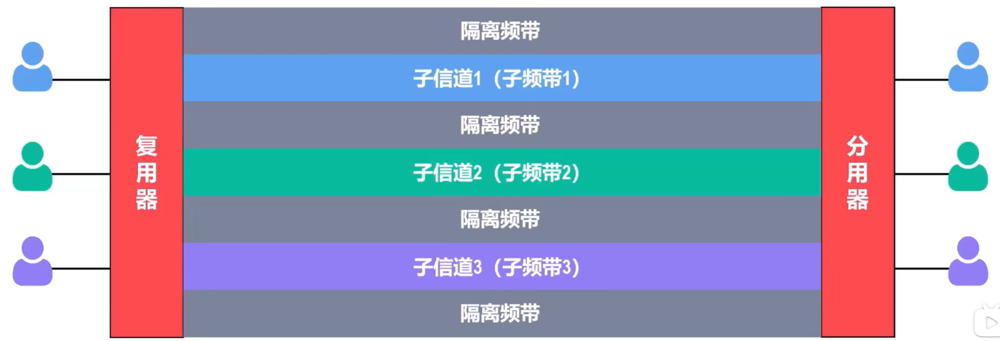
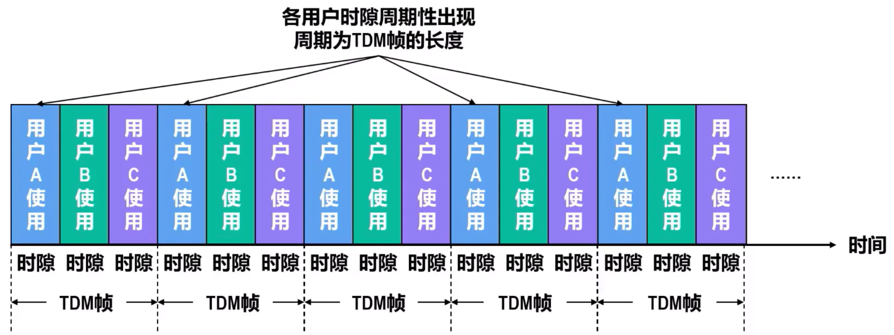
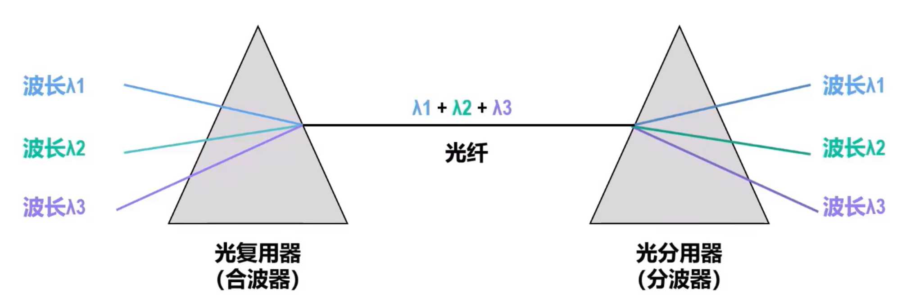
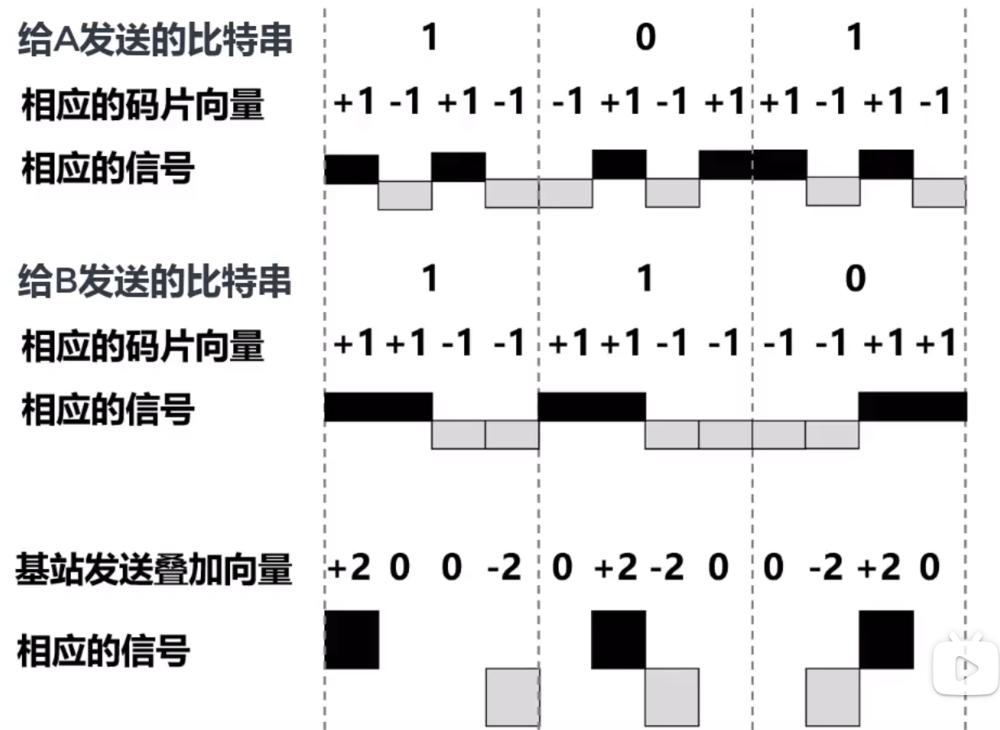

# 信道复用技术
**复用**就是在**一条传输媒体上同时传输多路用户的信号**

-   在发送端使用一个**复用器**，让多个用户通过复用器使用一个大容量共享信道进行通信
-   在接收端使用一个**分用器**，将共享信道中传输的信息分别发送给相应用户

## 频分复用
**频分复用**将传输媒体的总频带划分为多个子频带，每个子频带作为一个通信子信道。每对用户使用其中一个子信道进行通信

**频分复用的所有用户同时占用不同的频带资源发送数据**

## 时分复用
**时分复用**是将时间划分为一段等长的时隙，每个时分复用的用户，再起相应时隙内独占传输媒体的资源进行通信

各用户的时隙，构成了**时分复用帧（TDM帧）**

**时分复用的所有用户，在不同的事件占用相同的通信资源发送数据**

## 波分复用
**波分复用**就是**光的频分复用**

## 码分复用
码分复用将每个比特时间划分为 $m$ 哥更短的时间片，称为**码片**

每个站点被指派一个唯一的 $m$ 比特码片序列，
-   若该站发送bit1，则发送其 $m$ 比特码片序列
-   若发生bit0，则发送器反码

**码片向量**，bit0计 $-1$，bit1计 $1$

有多个站同时发送数据，则信道中信号就是这一系列码片序列或反码的叠加，为了**从信道中分离每个站的信号**，指派码片序列需要遵循：
-   分配给每个站的码片序列**必须各不相同**，实际通常采用伪随机码
-   每个站的**码片序列必须互相正交**，也就可以得到下列各式

-   $$ A \cdot B = \frac{1}{m} \sum_{i=1}^m A_i B_i = 0$$
-   $$ A \cdot \bar B = \frac{1}{m} \sum_{i=1}^m A_i \bar B_i = 0$$
-   $$ A \cdot A = \frac{1}{m} \sum_{i=1}^m A_i \bar A_i = 1$$
-   $$ A \cdot \bar A = \frac{1}{m} \sum_{i=1}^m A_i \bar A_i = -1$$

这样在接受信息时，就可以计算了

各接收方接受到信息后，会用自己的码片向量与收到的叠加后的码片向量做规格化内积运算: 
-   $(A+\bar B) \cdot A = 1$，表明收到bit1
-   $(A+\bar B) \cdot B = -1$，表明收到bit0
-   $(A+\bar B) \cdot C = 0$，表明没有收到信息

经过计算，叠加后不影响结果