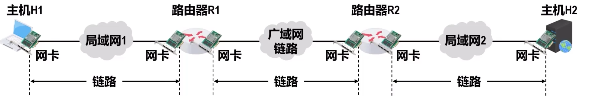

# 数据链路层概述
数据链路层的主要任务是**实现帧在一段链路上或一个网络中进行传输的问题**

## 链路、数据链路和帧
**链路和数据链路是有区别的**

**链路**是指一个节点到**相邻**节点的一段物理线路，**中间没有任何其他的交换节点**

**数据链路**是基于链路的。当在一条链路砂锅传输数据时，除需要链路本身个，还需要一些必要的**通信协议**来控制这些数据的传输，把**实现这些协议的硬件和软件加在链路上**，就构成了数据链路。

**网络适配器（网卡）** 和其相应的软件驱动程序实现了这些协议。<u>一般的网卡都包含了物理层和数据链路层这两层的功能</u>

**帧**是**数据链路层**对等实体之间在水平方向进行逻辑通信的**协议数据单元PDU**
> 为简单起见，可认为帧是在通信双方数据链路层对等实体之间沿水平方向直接传送

