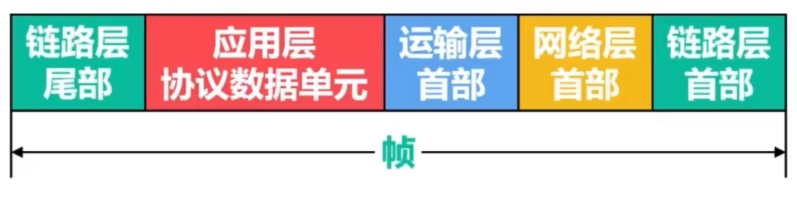
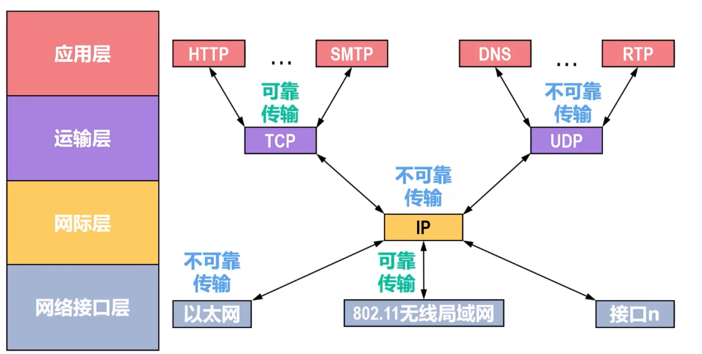
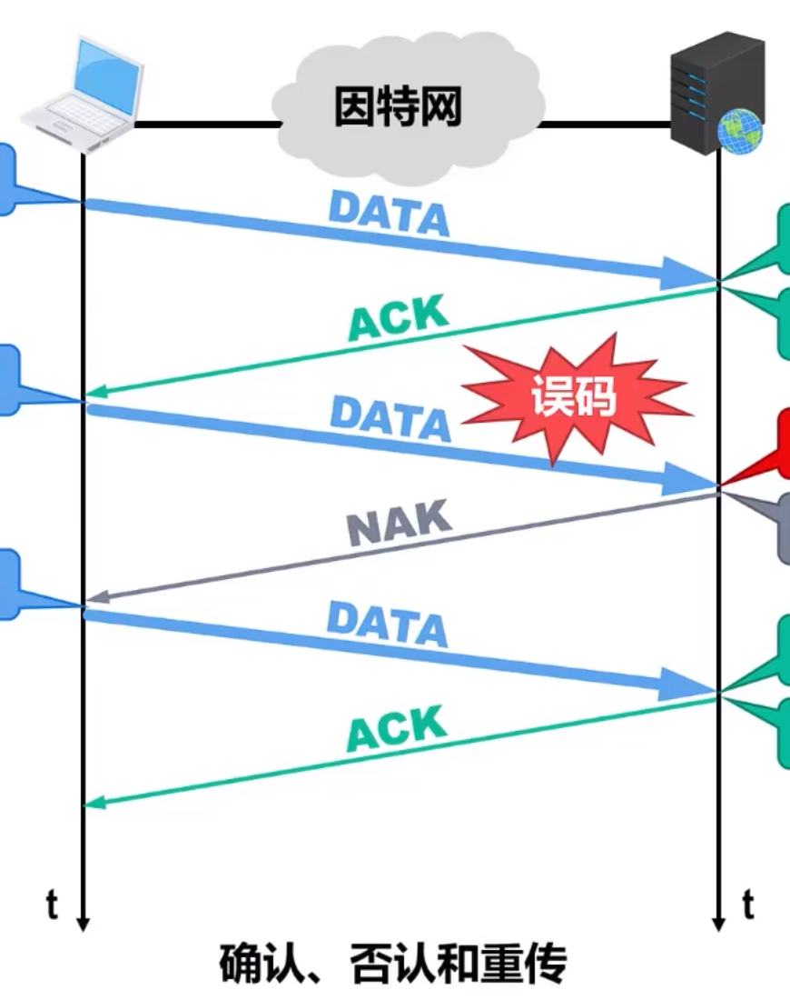
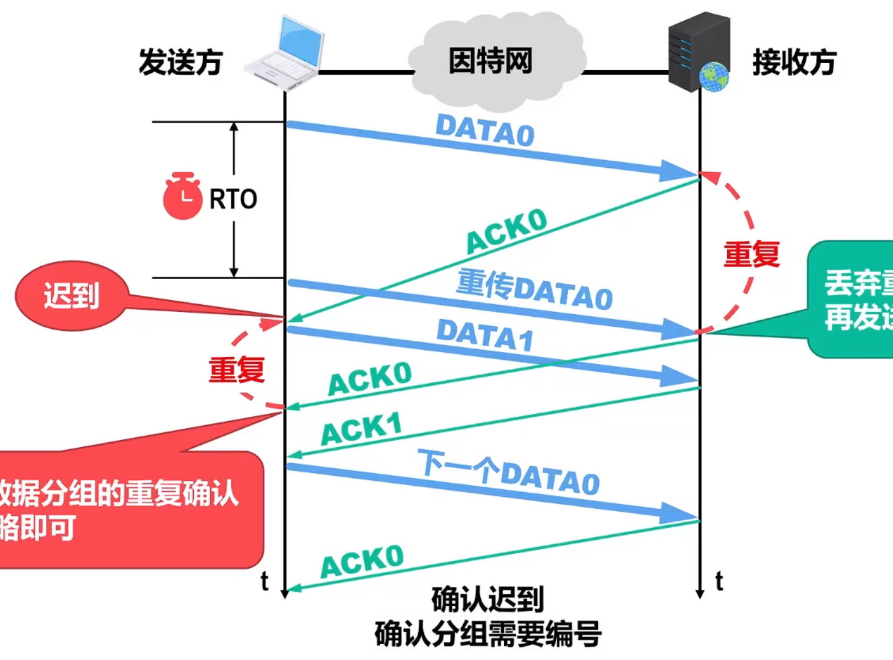
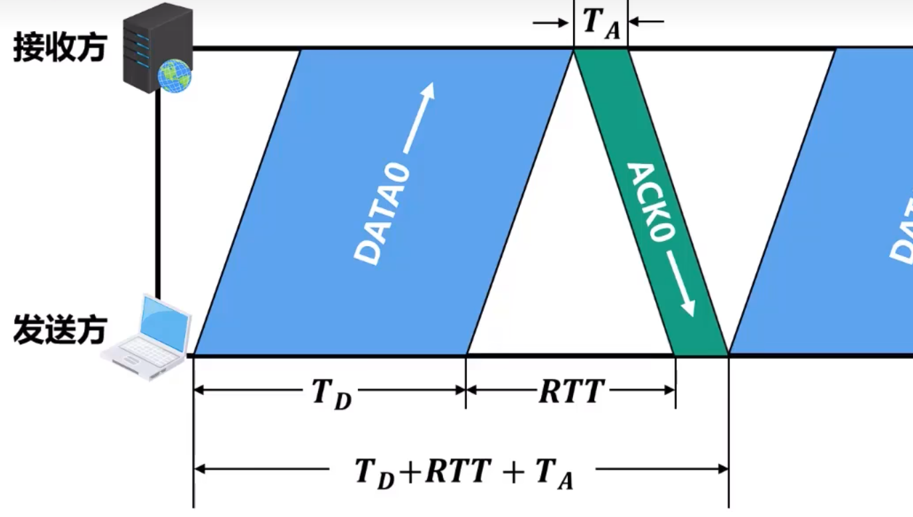
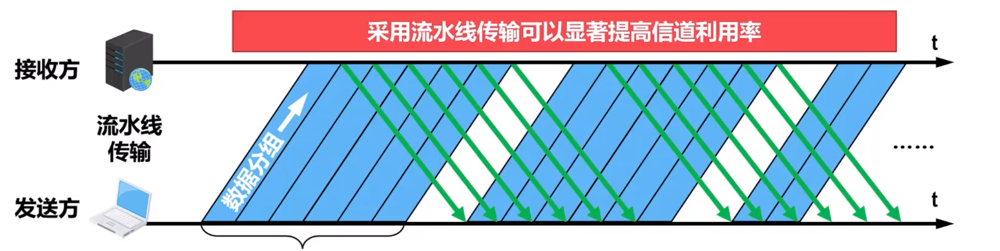

# 数据链路层的三个重要问题
三个问题是封装成帧和透明传输、插座检测、可靠传输

## 封装成帧和透明传输
### 封装成帧

**封装成帧**：给网络层交付下来的分组**添加一个首部和尾部**，这样就构成一个帧

**帧的首部和尾部**包含一些重要的控制信息
-   帧首部一般包含帧开始符，帧原地址和目的地址
-   帧尾部一般包含帧校验序列进而帧结束符

**帧定界**：接收方收到比特流后，根据帧首部帧开始符和帧尾部帧结束符，从收到的比特流中识别出帧的开始和结束。

<u>为了提高数据链路层传输效率，应使帧的数据在和的长度尽可能大于首部和尾部的长度</u>

每一种数据链路层协议都规定了帧的数据在和的上限，即**最大传送单元MTU**

### 透明传输
如果在数据在和出现了帧定字符，则出现**帧定界的错误**，为解决这个问题，需要限制上层内容，但这样对数据传输有很大影响，所以需要采取措施<u>使得数据链路层对PDU的内容**没有任何限制**</u>，好像数据链路层不存在，就称为**透明传输**

#### 实现透明传输的方法
-   **字节传输**，应用于**面向字节**的物理链路
    发送方的数据链路层在发送前，在数据段冲突位置前插入**转义字符**ESC（HEX 1B），若是数据载荷中包含转义字符，则在该转义字符之前插入一个转义字符
    接收方的链路层接受后，将转义字符删除再向上传递
-   **比特传输**，应用于**面向bit**的物理链路
    假设帧定界符为`0111 1110`
    发送方数据链路层扫描数据在和，只要出现**五个连续的 `1`**，就在后面添加一个 `0`
    接收方链路层接受后，发现五个连续 `1` 则删除后面 `0`

## 差错检测
**比特差错**：传说过程中，比特1变成0，变成1

**误码率**：出现错误的比特数量占这段时间内传输比特总数量的比例。提高链路的信噪比，可以降低误码率。但是实际不可能降低到 $0$

**检错码**：发送方的数据链路采用某种检错技术，根据帧的内容计算出一个检错码，将检错码填入帧尾部。接受方数据链路层从帧尾部取出检错码，采用与发送方相同的检错技术检测。
> **检错方式通信双方预先约定，检错码存放的是帮助校验的内容**

**帧检验序列**

### 检错方式
**奇偶校验**
因为偶校验和奇校验的区别就是两者检测的是 $1$ 个数的奇偶性，所以以奇校验为例

发送方在待发送的数据后添加一个校验位，使得整个数据的 $1$ 的个数是奇数

**问题**
若是出现偶数位误码，则有**无法检测**

**循环冗余检验**

**二进制 $\bmod 2$ 除法**：不借位，减法是异或，但是要保证被异或的数首位为 $1$

**发送方使用CRC的操作**
-   将待发送的数据作为被除数的一部分，后面添加 $G(x)$ 最高次个 $0$ 构成被除数（多项式次数 $0 \sim n-1$）
-   $G(x)$ 各项系数作为除数
-   进行二进制模 $2$ 除法，得到商和余数，余数就是冗余码，**冗余码长度应与 $G(x)$** 最高次数相同
-   将冗余码添加到待发送数据后

**接收方使用CRC的操作**
-   将收到的数据作为被除数
-   $G(x)$ 各项系数作为除数
-   进行二进制模 $2$ 除法，得到商和余数
-   **如果余数为 $0$，则未误码**

**循环冗余检验**具有**很好的纠错能力**，虽然计算软件比较复杂，但是**非常易于用硬件实现**，因此广泛用于数据链路层

## 可靠传输
在检测出误码后，根据数据链路层向上层提供的服务，采取不同的操作
-   **不可靠传输**，接收方直接丢弃误码帧
-   **可靠传输**，数据链路层通过某种机制操作（比如重传）

一般**有限链路**采用不可靠传输，**无线链路**采用可靠传输

**误码**只是**传输差错**的一种，在计网结构上，还有**分组丢失，分组失序，分组重传**，这三者出现在链路层上层

**下述三种可靠传输协议不仅限于数据链路层**
### 停止-等待协议
**停止-等待**是指发送方美发送完一个数据分组就必须停下来，等待接收方发来**确认分组ACK**或**否认分组NAK**

**仅包含否认的操作：**
接收方收到发送发的数据分组后，通过差错检测技术检测出数据分组是否误码
-   **没有误码**，**接受**该分组，并给发送发发送**ACK分组**
    发送方收到ACK分组，就可以**发送下一个分组**
-   **存在误码**，**丢弃**该分组，并给发送方发送**NAK分组**
    发送方收到NAK分组，就**重传这个分组**

**该方法局限性**：<u>在出现数据分组，确认分组，否认分组丢失的情况，此机制无法实现可靠传输</u>

所以引入**超时重传**
-   在发送方每发送一个数据分组，就启动一个**超时计时器**
-   若到了超时计时器设置的**超时重传时间RTO**，发送方仍未收到接收方的确认分组，则重传该数据分组

**RTO**一般设置为略大于收发双方的平均往返时间**RTT**
-   在数据链路层，点对点的往返时间RTT比较好确定，RTO就很好设定
-   在TCP/IP的网际层，收发双方的同学可能进过多个网络，RTT不确定

**在有了超市重传机制后，可以不使用否认机制**
但是否认机制在误码率较高的点对点线路，使用否认机制可以在计时器超时前尽快重传

**该方法局限**：若是因为分组堵塞而重传，那接收方可能接收到两个分组，产生**分组重复**

所以引入**编号**，给**数据分组**和**确认分组**均要编号

因为我们只在确定接收方接受到当前分组后，才传输下一个分组，所有只需要让相邻分组编号不同即可，也就是说**只需要一个位给分组编号**

假设当前分组是DATA0，接收方接收到两个DATA0后，可以发现DATA0重复，而若是第二个传输来的是DATA1，则代表开始传输下一个分组

而对确认分组，对DATA0的确认分组应该是ACK0，这样接收方接收到两次DATA0后，**再发送两次ACK0**，发送方会在第一次接收时得知DATA0已经成功传输，而不用理会第二次
> 对每次DATA，都必须发送ACK，目的是让发送方尽快收到确认，停止重传；比如第一次ACK0丢失导致发送方再次发送DATA0，而接收方第二次不发送ACK0，那么发送方会一直发送DATA0，这也是为什么此方法可以涵盖双方的丢失情况

#### 信道利用率

$$ 信道利用率 \ U = \frac{T_D}{T_D + RTT + T_A} $$

**当RTT远大于 $T_D$ 时，信道利用率很低**，如果出现超时重传，则利用率更低，所以在**RTT远小于 $T_D$（无线局域网）时应用停止-等待协议**
 
**流水线传输**：发送方在未收到接收方发来的确认分组情况下，就可以连续发送多个数据分组，而不比发送完每一个数据分组就等待，这样可以大幅提升信道利用率

### 回退N帧协议
**回退N帧（GBN）协议**采用流水线传输方式，并利用发送窗口来限制发送方连续发送数据分组的数量，这属于**连续ARQ协议**

采用 $n$ 个bit给分组编号，则
-   **发送窗口 $W_T$** 大小应该为 $1 < W_T \le (2^n -1)$，
-   **接收窗口大小为 $1$**

ACKn 代表n号帧及以前的帧都已经被接受

**累计确认**，接收方收到并丢弃分组后，会传输最后一个已被正常接收的分组序号的ACK，发送方收到限制个数的相同确认信号后可在超时前重传

**分组滑动时**，会将**新进入窗口的分组发送**

**重传时**，会将**整个窗口发送**
> 后半未发送的是首次发送

### 选择重传协议
**选择重传（SR）协议**：接收窗口的尺寸 $\ge 1$，可以先收下失序但正确到达接收方且序号落入接收窗口内的数据分组，等到所缺数据分组收齐后再一并送交上层

采用 $n$ 个bit给分组编号，则
-   $1 < W_R \le W_T$
-   $W_T + W_R \le 2^n$
-   $1 < W_R \le 2^{(n-1)}$

对于接收窗口，窗口内首个分组被接收就滑动

ACK$_i$ 标识分组 $i$ 成功被接收，需要给发送方打标记

