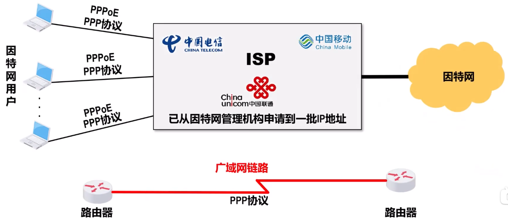
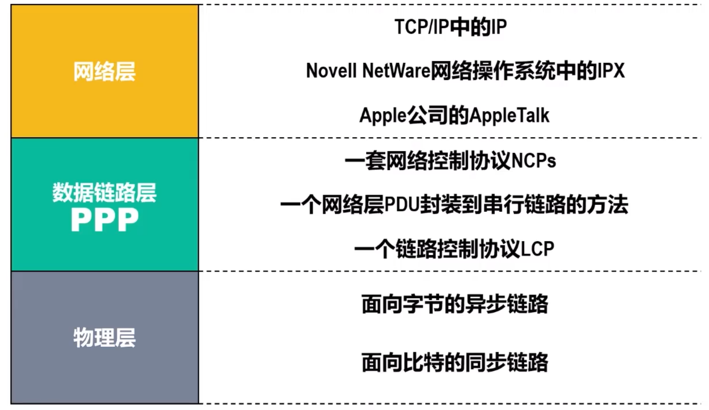
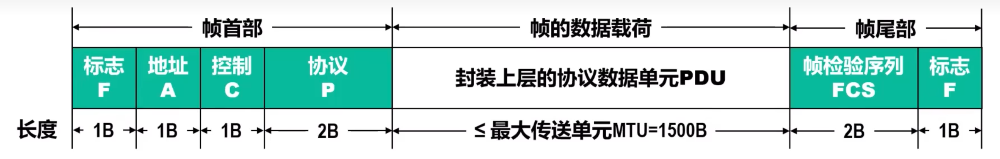
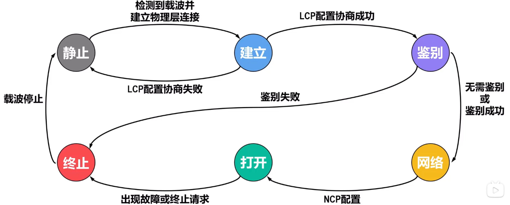

# 点对点协议
**点对点协议PPP**是目前使用最广泛的点对点数据链路层协议

## PPP协议的组成
PPP协议由三部分组成
-   **链路控制协议LCP**：用来建立、配置、测试数据链路的链接以及写上一些选项
-   **网络层PDU封装到串行链路的方法**：网络层PDU作为PPP帧的数据载荷被封装在PPP帧中传输。网络层PDU的长度受PPP协议的最大传送单元MTU的限制。PPP协议支持面向字节的异步链路，也支持面向比特的同步链路
-   **网络控制协议NCP**：包含多个协议，其中每一个协议分别用来支持不同的网络层协议。如图中网络层的部分

### PPP协议的帧格式

#### PPP帧各字段含义
**帧首部中的各字段**
-   **标志字段F**：长度**一字节**，固定为`0x7E`。是PPP帧的**定界符**，在首位各一个。连续两帧之间只需要一个F，两个连续F表示一个空帧

-   **地址字段A**：长度一字节，固定取指`0xFF`，目前无作用
-   **控制字段C**：长度一字节，固定取指`0x03`，目前无作用
    > 属于历史遗留问题，在其他协议这两段有实际作用，但是PPP无作用

-   **协议字段P**：长度为**两字节**
    -   当取指为`0x0021`时，PPP帧的信息字段 $I$（数据载荷）是IP数据报
    -   当取指为`0xC021`时，PPP帧的信息字段 $I$（数据载荷）是PPP链路控制协议的分组
    -   当取指为`0x8021`时，PPP帧的信息字段 $I$（数据载荷）是PPP网络控制协议的分组

**帧的数据载荷**
-   **信息字段I**就是PPP帧协议的**数据载荷**，长度可变，但是 $\le 1500 B$
    **此处长度指经透明传输的转义前**

**帧尾部的各字段**
-   **帧检验序列FCS**长度为**两字节**，采用CRC计算冗余码，生成多项式为：$CRC-CCITT = X^{16} + X^{12} + X^5 + 1$

-   **标志字段F**与首部相同

#### PPP帧的透明传输
如果信息字段出现了标志字段`0x7E`的内容，就需要采取措施
-   **字节填充**：
    -   **出现标志字段F**：将`0x7E`**异或**`0x20`，然后在其**前面插入<u>转移字符`0x7D`</u>**。即将该字符替换为`0x7D 0x5E`
    -   **出现转义字符**：将`0x7D`**异或**`0x20`，然后在其**前面插入<u>转移字符`0x7D`</u>**。即将该字符替换为`0x7D 0x5D`
    -   **出现ASCII控制字符**，将转义字符**异或**`0x20`，然后在其**前面插入<u>转移字符`0x7D`</u>**
        > 为什么控制字符需要切换：属于历史遗留问题，以前会使用控制字符传输一些控制信息，现在线路仍可能产生反应
    > 虽然都是异或操作，但是前两者等同`-`，后者等同`+`
-   **零比特填充**：
    -   发送方扫描数据载荷，只要出现 $5$ 个连续的 1，就在后面填入一个0
    -   接收方接收数据后，对载荷进行扫描，没出现 $5$ 个连续 1，就把后面一个 0删除

### PPP协议的工作状态
