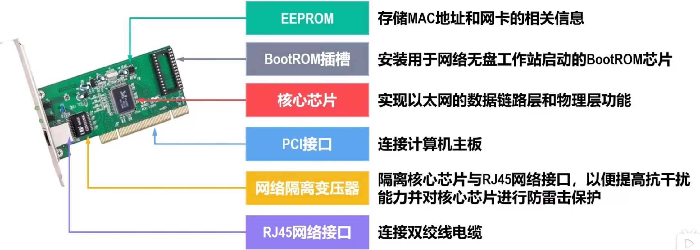
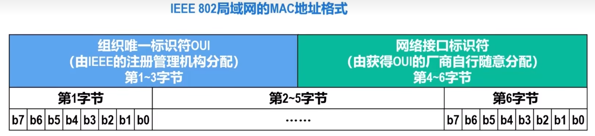
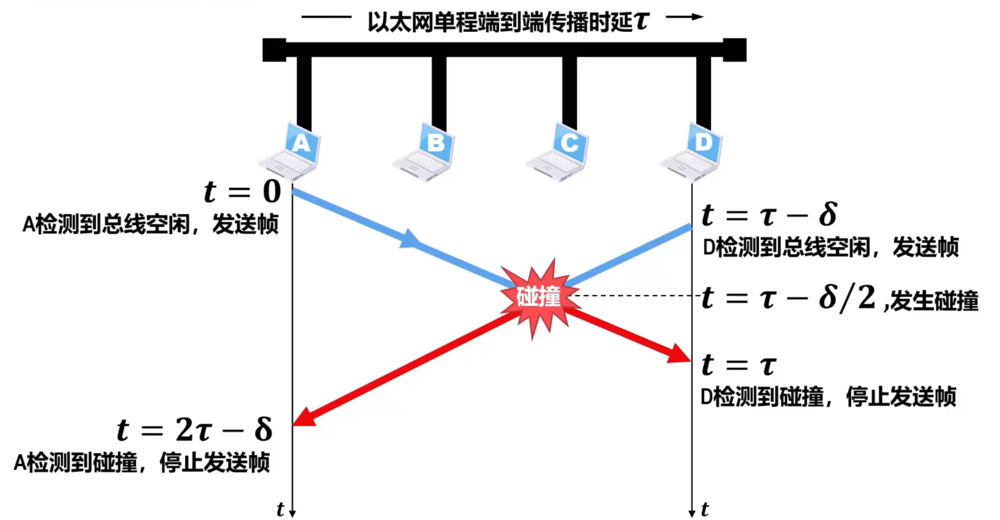

# 共享式以太网
以太网以假想的电磁波传输介质 - 以太 命名，它是一种无源电缆作为总线来传输帧的基带总线局域网。

以太网目前已从传统的**共享式以太网**发展到**交换式以太网**

本节介绍最早流行的 $10Mb/s$ 共享式以太网

## 网络适配器与MAC地址
### 网络适配器
要将计算机连接到局域网，需要使用相应的**网络适配器**（即网卡）

#### 组成

**核心芯片** 实现以太网的数据链路层和物理层功能
**EEPROM** 存储MAC地址和网卡相关信息
**BootRom插槽** 安装用于网络无盘工作站启动的BoorRom芯片
**PCI接口**  是网卡与计算机主板的接口
**网络隔离变压器** 将核心芯片与连接外部局域网的RJ45网络接口进行隔离，以便提高抗干扰能力并对核心芯片进行防雷击保护

#### 功能
-   在计算机**内部**，网卡与CPU之间的通信，是通过计算机主板上的IO总线以**并行传输**方式进行。
-   网卡与**外部**以太网之间的通信，一般通过传输媒体以串行方式进行

网卡要**实现物理层和数据链路层的功能**，还要进行**串并转换**

因为网络传输速率与内部总线速率不同，所以网卡的核心芯片会包含**用于缓存数据的存储器**

为使网卡正常工作，还必须在OS中为网卡安装相应的**设备驱动程序**，**驱动程序**负责驱动网卡发送和接收帧：
-   当网卡收到正确的帧，就以中断方式通知CPU取走数据并将其交付给协议栈中的网络层
-   当网卡收到误码的帧，就把这个帧丢弃而不必通知CPU

## MAC地址
对于连接有多个站点的广播信道，要实现两个站点间的通信，每个站点必须要一个**数据链路层地址**作为唯一标识

在每个主机发送的帧的首部中都携带有发送主机和接收主机的地址。由于这类地址是用于**媒体接入控制(Medium Access Control, MAC)**，所以被称为MAC地址

MAC地址一般被固化在网卡的EEPROM中，因此**MAC地址也被称为硬件地址或物理地址**

普通用户计算机往往包含有线局域网的以太网卡和无线局域网的WiFi网卡，**每块网课都有一个全球唯一的MAC地址**，交换机和路由器拥有更多网络接口，所以有更多MAC地址。

**MAC地址是对网络接口的唯一标识**，而不是对设备的

### IEEE 802局域网MAC地址
#### 格式
IEEE 802标准为局域网规定了一直又**48bit（6B）** 构成的MAC地址，由IEEE注册管理机构RA负责管理

对于这6B
-   前三个字节是**组织唯一标识符OUI**，生产网络设备的厂商需要向IEEE注册管理机构申请一个或多个OUI
-   后三个字节是获得OUI的厂商可自行随意分配的**网络接口标识符**，只要保证无重复即可

组织唯一标识符OUI也被称为**公司标识符**  

#### 表示方法
每四个bit写成一个十六进制字符，每B为一组，用符号链接
-   Windows为 `FF-FF-FF-FF-FF-FF`
-   Linux，IOS和Android为 `FF:FF:FF:FF:FF:FF`

#### 分类
$b_0$ 位为 I/G(Individual/Group) 位
$b_1$ 位为 G/L(Global/Local) 位

-   `00`**全球单播地址**，由厂商生产网络设备时固化在设备内
-   `01`**全球多播地址**，交换机和路由器等标准网络设备锁支持的多播地址，用于特定功能
-   `10`**本地单播地址**，由网络管理员分配，可以覆盖网络接口的全球单薄地址
-   `11`**本地多播地址**，可由用户对网卡编程实现

地址总数 **$2^{48} \approx 280$ 万亿**，四种地址各 $\dfrac{1}{4}$

全 $1$ 地址 `FF-FF-FF-FF-FF-FF-FF-FF`为**广播地址**

#### 传输过程
网卡从网络上收到一个帧，就检查帧首部MAC地址
-   如果MAC地址为广播地址，则接受该帧
-   如果MAC地址与网卡全球单播地址相同，则接受该帧
    > 本地单播相同也接受，事实上是做全同匹配，这
-   如果MAC地址是网卡支持的多播地址，则接受该帧
> 事实上设备的地址，无论单播多播，都会被放在一个列表中，再做全同匹配

**混杂方式**
网卡还可被设置为一种特殊的工作方式 —— **混杂方式**。

工作在该方式的网卡，只要收到共享媒体上传来的帧就会**收下**，而不管帧的目的MAC地址

## CSMA/CD协议
### 基本原理
**共享以太网**具有**天然的广播特性**，总线上某个站点给另一个站点发送单播
帧，信号会沿着总线传播到其他站点。站点中网卡根据所收到帧的目的MAC地址决定是否接受帧。

如果总线上若干站点要发送帧，会发生**信号碰撞**

为了解决各站点争用总线的问题，共享总线以太网使用了一种专用协议CSMA/CD（载波监听多址接入/碰撞检测）

-   **多址接入**：多个站点链接在一条总线上，他们竞争使用总线
-   **载波监听**：每个站点在发送帧之前，要先检测一下总线上是否有其他站点在发送帧。
    -   若检测到总线空闲**96bit时间**，则发送帧
    -   若检测到总线忙，则继续检测并等待总线转为空闲96bit时间
-   **碰撞检测**：每一个真在发送帧的站点必须“边发送帧边检测碰撞”。一旦发现总线产生碰撞，就立刻停止发送，退避一段随机事件后再从载波监听开始进行发送。
> 在有载波监听的情况下，还有传播时延等，导致产生碰撞

**强化碰撞**：发送帧的站点一旦检测到碰撞，除了立即停止发送帧，还要继续发送**32bit/48bit**人为干扰信号，一遍有最够多碰撞信号使所有站点都能检测到

**半双工通信**，正在发送帧的站点必须边发送帧边边碰撞检测，所以不可能同时发送和接收，所以只能进行半双工通信

### 争用期

两端的传播时延为 $2 \tau$，则最多经过 $2 \tau$ 可以检测所发送的帧是否遭遇碰撞

所以**端到端往返时间 $2 \tau$** 被称为**争用期**或**碰撞窗口**

总线长度越长，站点数量越多，发生碰撞概率就越大，$10Mb/s$ 共享总线以太网规定，**争用期 $2 \tau$ 值为 512bit的发送时间，即 $51.2 \mu s$**

长度 $= v \times \tau = 5120 m$

规定总线长度 $\le 2500m$

### 最小帧长和最大帧长
**最小帧长**
在一个站点发送完一个帧后，就不会再进行碰撞检测，但是该帧传输过程中有可能碰撞。

**为了保证每个站点在发送完一个完整的帧之前，能检测出是否碰撞，发送时延不能小于一个争用期，也就是 $512b$**

由此也可得，碰撞一定发生在前 $64B$
> 遭遇碰撞指站点自己检测到碰撞的时刻，因为此时才能对碰撞产生翻译

**最大帧长**

**载荷限制为 $1500B$**，总长度 $1518B$（首位 $18B$）

### 退避算法
站点在检测到碰撞时，立即停止发送，**退避一段<u>随机</u>时间**

$退避时间 = 基本退避时间 \times 随机数r$

基本退避时间为争用期 $2 \tau$
随机数 $r \in \{0,1,\cdots,(2^k-1)\}, k = \min\{重传次数,10\}$ 

此方法可使推迟的平均时间岁重传次数增多而增大，即**动态退避**，而又不会一直增大

**当重传 $16$ 次仍不成功**，应该放弃重传，向高层报告

### 信道利用率
假设总线一旦空闲就有某个站点立即发送帧，且不产生碰撞。则发送一帧占用时间为 $T_0 + \tau$，帧本身发送时间 $\tau$

信道极限利用率 $S_{\max} = \dfrac{T_0}{T_0+\tau} = \dfrac{1}{1+\frac{\tau}{T_0}}$

记 $a = \dfrac{\tau}{T_0}$，为了提高信道利用率，$a$ 应该尽可能小，则端距离不应该太长，帧长度应尽量大

## 使用集线器的共享式以太网
早期以太网使用细同轴电缆，每台主机连接到总线需要带有BNC接口的网卡和一个BNC T型接口，两端还需要终端匹配电阻。这样网络中会有大量机械连接点，若某个点接触不良或者断开，整个网络就不稳定或断网。

以太网发展处一种使用大规模集成电路来代替总线、并且可靠性非常高的设备，叫做**集线器**

主机到集线器的传输媒体页转为更便宜灵活的**双绞线电缆**

**集线器特点**
-   虽然物理拓扑是星形，但是**逻辑上**还是一个**总线网**，使用的还是**CSMA/CD协议**
-   集线器**只工作在物理层**，每个接口仅简单地转发bit
-   **有少量容错能力和网络管理功能**

IEEE于1990年指定了**10BASE-T星形**以太网标准802.3i，<u>通信距离较短，每个站点到集线器不能超过 $100m$</u>

$10$ 代表 $10Mb/s$，BASE表示采用基带信号进行传输，T表示双绞线为传输媒体

IEEE802.3还可使用光纤作为传输媒体，对应标准为10BASE-F

## 在物理层拓展以太网
### 拓展站点于集线器之间的距离

两站点之间的距离不能太远，否则传输的<u>信号会衰减到使CSMA/CD协议无法正常工作</u>

10BASE-T星形以太网每个站点到集线器的距离不能超过 $100m$，因此两站点距离**不超过 $200m$**

可以使用光学和一堆光纤调制解调器拓展站点与集线器之间的距离，可以很简便的拓展到 $1000m$ 以上

### 拓展共享式以太网的覆盖范围和站点的数量
集线器一般具有 $8 \sim 32$ 个接口，如果连接站点超过单个集线器的接口数量，就需要使用多个集线器，这样可以连接成覆盖更大范围、连接更多站点的多级星形以太网

**缺陷**
每个集线器对应的10BASE-T以太网是一个**独立碰撞域**，最大吞吐量 $10Mb/s$，连接前两个以太网吞吐量有 $20Mb/s$，连接后两个碰撞域合并为**一个**更大的碰撞域，吞吐量降为 $10Mb/s$，碰撞概率还会显著增加

## 在数据链路层拓展以太网
为了避免形成更大的碰撞域，可以使用**网桥(Hub)** 在数据链路层拓展共享式以太网

### 网桥工作原理
网桥一般有两个接口，连接两个不同的以太网，每个以太网被称为**网段**

网桥收到帧后会在自身**转发表**中查找帧的MAC地址
-   若从接口1收到发送给网段2的帧，就从接口2转发给网段2
-   若从接口1收到发送给网段1的帧，则丢弃
-   若接受到广播帧，则转发

**网桥会指向相应媒体接入控制协议**，共享式以太网就是CSMA/CD协议

### 透明网桥的自学习和转发帧的流程
**透明网桥**指以太网中各站点不知道自己所发送的帧会经过哪些网桥的转发

**自学习**
某站点发送帧后，网桥可以该站点从哪个接口传播，将其录入转发表（若是未录入）

**转发帧**
帧进入网桥后，网桥会根据目的地址确定转发的接口，若是不存在该地址，则<u>盲目</u>的往另一个站点发送

若是知道，则根据转发表进行操作

### 透明网桥生成树协议
为了提高以太网的可靠性，有时需要再两个以太网之间使用**多个透明网桥**来提供**冗余链路**

<u>但是冗余链路可能导致环路</u>，比如广播帧或未记录单播帧

<u>为了避免帧在网络中永久兜圈</u>，透明网桥使用**生成树协议**
-   不管网桥之间是什么结构，网桥直接通过**交互网桥协议单元**，找出原网络图谱的一个**生成树**
-   首次连接网桥或网络拓扑发生变化事，网桥都会重新构造生成树