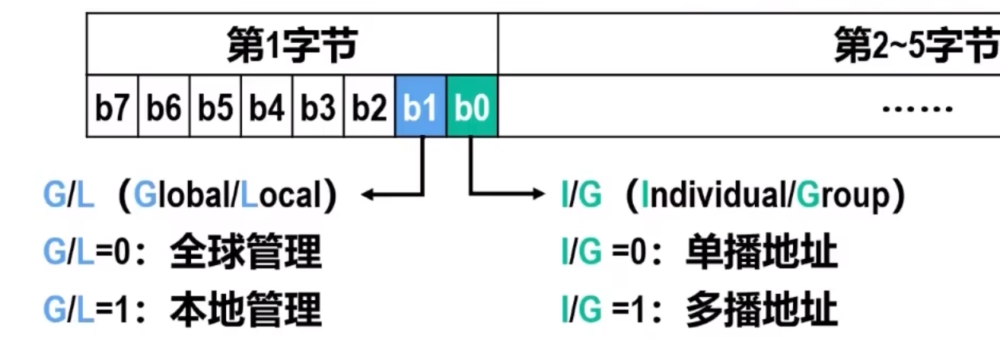

# 共享式以太网
以太网以假想的电磁波传输介质 - 以太 命名，它是一种无源电缆作为总线来传输帧的基带总线局域网。

以太网目前已从传统的**共享式以太网**发展到**交换式以太网**

本节介绍最早流行的 $10Mb/s$ 共享式以太网

## 网络适配器与MAC地址
### 网络适配器
要将计算机连接到局域网，需要使用相应的**网络适配器**（即网卡）

#### 组成

**核心芯片** 实现以太网的数据链路层和物理层功能
**EEPROM** 存储MAC地址和网卡相关信息
**BootRom插槽** 安装用于网络无盘工作站启动的BoorRom芯片
**PCI接口**  是网卡与计算机主板的接口
**网络隔离变压器** 将核心芯片与连接外部局域网的RJ45网络接口进行隔离，以便提高抗干扰能力并对核心芯片进行防雷击保护

#### 功能
-   在计算机**内部**，网卡与CPU之间的通信，是通过计算机主板上的IO总线以**并行传输**方式进行。
-   网卡与**外部**以太网之间的通信，一般通过传输媒体以串行方式进行

网卡要**实现物理层和数据链路层的功能**，还要进行**串并转换**

因为网络传输速率与内部总线速率不同，所以网卡的核心芯片会包含**用于缓存数据的存储器**

为使网卡正常工作，还必须在OS中为网卡安装相应的**设备驱动程序**，**驱动程序**负责驱动网卡发送和接收帧：
-   当网卡收到正确的帧，就以中断方式通知CPU取走数据并将其交付给协议栈中的网络层
-   当网卡收到误码的帧，就把这个帧丢弃而不必通知CPU

## MAC地址
对于连接有多个站点的广播信道，要实现两个站点间的通信，每个站点必须要一个**数据链路层地址**作为唯一标识

在每个主机发送的帧的首部中都携带有发送主机和接收主机的地址。由于这类地址是用于**媒体接入控制(Medium Access Control, MAC)**，所以被称为MAC地址

MAC地址一般被固化在网卡的EEPROM中，因此**MAC地址也被称为硬件地址或物理地址**

普通用户计算机往往包含有线局域网的以太网卡和无线局域网的WiFi网卡，**每块网课都有一个全球唯一的MAC地址**，交换机和路由器拥有更多网络接口，所以有更多MAC地址。

**MAC地址是对网络接口的唯一标识**，而不是对设备的

### IEEE 802局域网MAC地址
#### 格式
IEEE 802标准为局域网规定了一直又**48bit（6B）** 构成的MAC地址，由IEEE注册管理机构RA负责管理

对于这6B
-   前三个字节是**组织唯一标识符OUI**，生产网络设备的厂商需要向IEEE注册管理机构申请一个或多个OUI
-   后三个字节是获得OUI的厂商可自行随意分配的**网络接口标识符**，只要保证无重复即可

组织唯一标识符OUI也被称为**公司标识符**  

#### 表示方法
每四个bit写成一个十六进制字符，每B为一组，用符号链接
-   Windows为 `FF-FF-FF-FF-FF-FF`
-   Linux，IOS和Android为 `FF:FF:FF:FF:FF:FF`

#### 分类
$b_0$ 位为 I/G(Individual/Group) 位
$b_1$ 位为 G/L(Global/Local) 位

-   `00`**全球单播地址**，由厂商生产网络设备时固化在设备内
-   `01`**全球多播地址**，交换机和路由器等标准网络设备锁支持的多播地址，用于特定功能
-   `10`**本地单播地址**，由网络管理员分配，可以覆盖网络接口的全球单薄地址
-   `11`**本地多播地址**，可由用户对网卡编程实现

地址总数 **$2^{48} \approx 280$ 万亿**，四种地址各 $\dfrac{1}{4}$

全 $1$ 地址 `FF-FF-FF-FF-FF-FF-FF-FF`为**广播地址**

#### 传输过程
网卡从网络上收到一个帧，就检查帧首部MAC地址
-   如果MAC地址为广播地址，则接受该帧
-   如果MAC地址与网卡全球单播地址相同，则接受该帧
    > 本地单播相同也接受，事实上是做全同匹配，这
-   如果MAC地址是网卡支持的多播地址，则接受该帧
> 事实上设备的地址，无论单播多播，都会被放在一个列表中，再做全同匹配

**混杂方式**
网卡还可被设置为一种特殊的工作方式 —— **混杂方式**。

工作在该方式的网卡，只要收到共享媒体上传来的帧就会**收下**，而不管帧的目的MAC地址

 