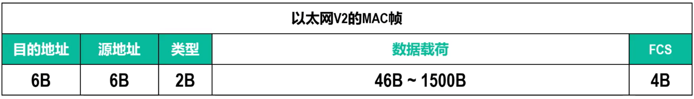

# 以太网MAC帧格式
以太网MAC帧格式有DIX Ethernet V2（即以太网V2）和IEEE 802.3两种标准

**两者仅在类型字段有差别**

现在市场流行以太网V2 MAC帧，所以仅讨论该者
## 以太网V2的MAC帧格式

**类型**字段用来知名**数据载荷**中的内容由上层哪个协议封装

**数据载荷**最少 $46B，和其他部分加起来恰好 $64B$
> 当载荷少于 $46B$，链路层将在载荷后面加入填充字节

## 物理层前导吗
见3.2

## 无效MAC帧
-   MAC帧长度不是**整数**字节
-   通过FCS字段检测出帧有误码
-   长度 $\notin[64,1518]$

**接收方收到无效MAC帧时，就简单的将其丢弃，以太网链路层没有重传机制**