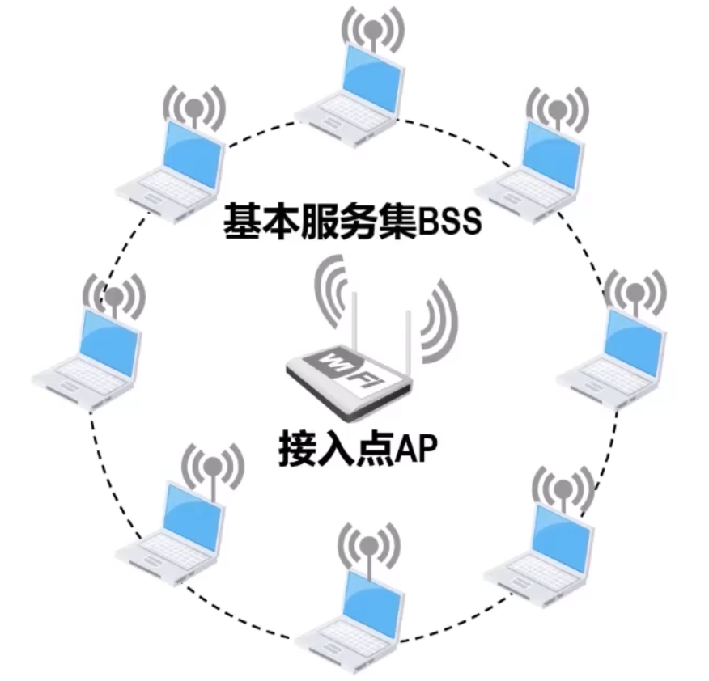
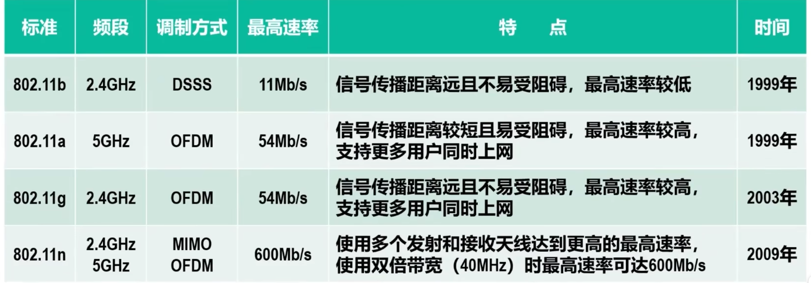

# 802.1无线局域网
无线局域网 WLAN

**802.11无线局域网**是目前应用最广泛的无线局域网之一，人民更多地将其简称**Wi-Fi**

可分为两类
-   有固定基础设施的
-   无固定基础设施的

## 固定基础设施

**固定基础设施**指预先建立的，能够覆盖一定地理范围的，**多个固定的通信基站**

采用**星形拓扑结构**，中心基站被称为**接入点AP**

802.11无线局域网的最小构件称为**基本服务集BSS**，其包含一个接入点和若干移动站。

本BSS内各站点之间的通信以及与之外的站点通信，都需要经过本BSS的AP转发

网管配置BSS内AP时，需要为其分配一个**最大32B**的**服务集标识符SSID**和一个**无线通信信道**

一个BSS覆盖的范围称为**基本服务区**，直径不可超过 $100m$

BSS可以通过一个**分配系统DS**与其他BSS连接，这样就构成了一个**拓展服务集ESS**

DS最常用的是以太网，也可使用其他点对点链路或其他无线网络。起作用是使WSS对上层的表现像一个BSS一样

**漫游**：移动站从一个网络或接入点，移动到另一个网络或接入点，仍能保持正在进行的网络连接不中断，802.11标准没有定义实现漫游的具体方法，仅定义了一些基本服务

### 关联服务
一个移动站如果要加入某个BSS，它首先必须选择一个AP并与之建立关联。关联成功就加入该AP所属无线局域网

-   **被动关联**：AP会周期性地发送**信标真**，包含服务机标识符SSID、AP的MAC地址和所支持的速率，加密算法和安全配置等若干参数，而移动站被动等待接收信标帧
-   **主动扫毛**：移动站主动发出**探测请求帧**，然后等待AP的探测响应帧

### 重建关联服务和分离服务
如果一个移动站要把与某个加入点AP的关联转移到另一个AP，就可以使用重新关联服务

若要终止关联服务，就应使用分离服务

## 无固定基础设施
也称为**自组织网络** ad hoc Network

其并没有预先联机的固定基础设施（如基站或AP），是由一些对等的移动站点构成的临时网络。**数据在自组织网络中被多跳存储转发**

## 无线局域网的物理层
802.11无线局域网的物理层非常复杂吗，一句工作频段、调制方式、传输速率等可分为多种物理层标准

无线网卡一般被做成多模的，以便适应多种不同的物理层标准

## 无线局域网的数据链路层 
### 使用CSMA/CA协议
因为传输介质不同，不能简单照搬共享以太网

**CSMA/CA即载波监听多址接入/碰撞避免协议**

CA指碰撞避免，是尽量减少碰撞发生的概率

**不能碰撞检测的原因**
-   无线信道传输环境复杂，信号强度动态范围很大，**在网卡收到的信号强度一般都远小于发送信号的强度**，若要实现碰撞检测，**对硬件要求很高**
-   因为无线电波传输的特殊性（存在隐蔽站问题），还会出现无法检测碰撞的情况，因此实现碰撞检测没有意义
    > 隐蔽站问题，即站点发送信号的覆盖范围不同，两者不一定能检测到对方发送的信号

### 两种不同的媒体接入方式
**分布式协调功能DCF**
在DCF方式下，没有中心控制站点，每个站点使用CSMA/CA系诶通过争用信道来获取发送权。**DCF方式是802.11定义的默认方式（必须实现）**

