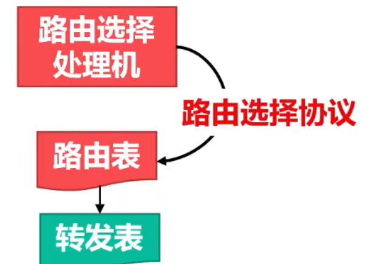
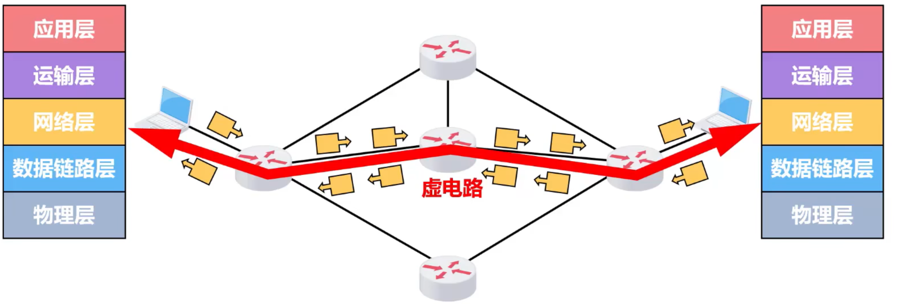

# 网络层概述
## 分组转发和路由选择
网络层的主要任务就是**将分组从源主机经过多个网络和多段链路传输到目的主机**，可以将该任务划分为**分组转发**和**路由选择**两种重要的功能

### 分组转发
**分组转发**：当路由器从自己的某个接口所连接的链路（或网络）上收到一个分组后，将该分组从自己其他适当的接口转发给下一跳路由器或目的主机

每个路由器需要维护自己的一个**转发表**，路由器根据分组首部的转发标识在转发表查询，根据结果指示的接口进行分组转发

### 路由选择
**路由选择**：源主机和目的主机之间可能存在多条路径，网络层需要决定选择哪一条路径来传送分组

## 网络层向其上层提供的两种服务
-   面向连接的虚电路服务
-   无连接的数据报服务

### 面向连接的虚电路服务
核心思想是**可靠通信应由网络自身来保证**

**过程**
-   当两台计算机进行通信，首先建立网络层的链接，即一条**虚电路VC**，以保证通信双方所需的一切网络资源
-   双方沿着已建立的虚电路发送分组
-   通信结束，释放所建立虚电路

### 无连接数据报服务
核心思想是**可靠通信应由用户主机来保证**

-   当两台计算机进行通信时，它们的网络层不需要建立连接
-   <u>每个分组可走不同路径</u>，所以**每个分组的首部必须携带目的主机的完整地址**
-   该通信方式传送的分组可能误码、丢失、重复、失序
-   通信结束没有需要释放的连接

TCP/IP体系结构中网际层向上提供无连接数据报服务