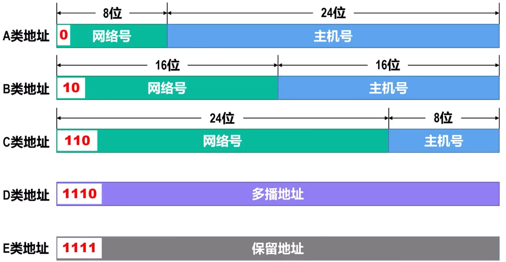
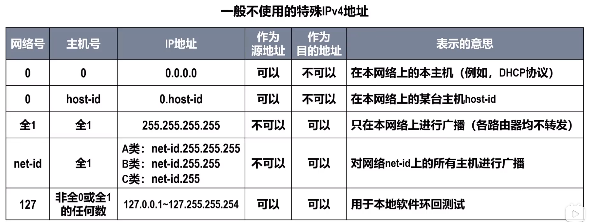
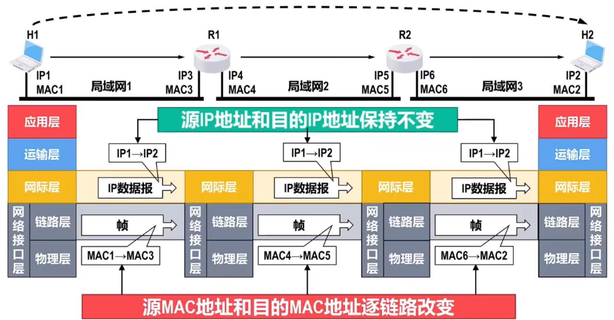
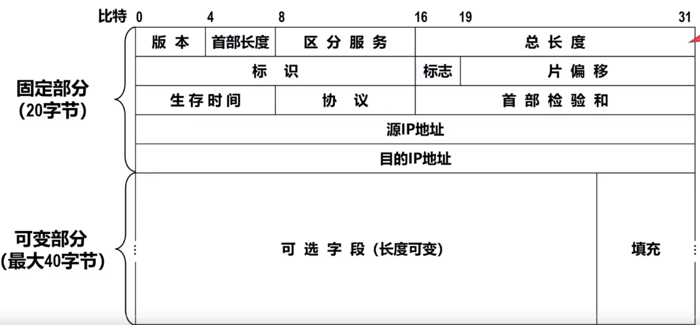
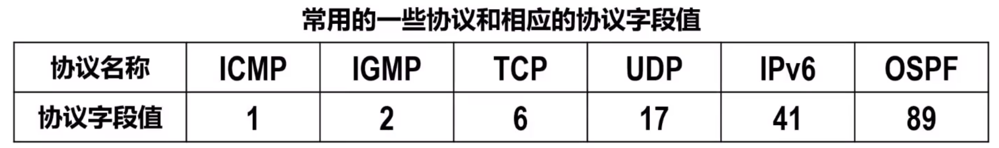

# 网际协议(IP)
**网际协议IP是TCP/IP体系结构网络层的核心协议**

## 异构网络互联
异构网络都使用相同的网际协议IP，从网络层角度看，它们好像一个统一的网络 —— **IP网**。当IP网上的主机进行通信时，就好像在单个网络上通信一样，它们<u>看不见互联的各网络的具体异构细节</u>

## IPv4地址及其编制方法

IPv4地址是给因特网上**每个主机的每个接口**分配的一个在全世界范围内唯一的32bit的标识符

历史阶段
-   **分类编址**
-   **划分子网**
-   **无分类编制**

### IPv4地址的表示方法
因为IPv4地址由32bit构成，不方便阅读，因此采用**点分十进制表示方便**

每8bit为一组，写为十进制，之间用`.`隔开

### 分类编址
将IPv4地址分为以下两部分
-   **网络号**：用来标志主机（或路由器）接口所连接到的网络
    同一个网络，不同主机的接口的**网络号必须相同**，表示它们属于同一个网络
-   **主机号**：用来标志接口
    同一个网络，不同主机的接口**主机号必须不同**，以区分各主机的接口

分类编址的IPv4地址分为五类

ABC类占比分别为 $1/2, 1/4, 1/8$，DE类占比均为 $1/16$

**分配规定**
-   **A,B,C类均为单播地址**，只有单薄地址可以分配给主机的各接口
-   **主机号全 $0$ 的为网络地址**，不能分配给主机的各接口
-   **主机号全 $1$ 的为广播地址**，不能分配给主机的各接口

|网络类别|可用网络数|最小网络号|最大网络号|单个最大主机数|
|:-:|:-:|:-:|:-:|:-:|
|A|$2^7-2$|`1`|`126`|$2^{24}-2$|
|B|$2^{14}$|`128.0`|`191.255`|$2^{16}-2$|
|C|$2^{21}$|`192.0.0`|`223.255.255`|$2^{8}-2$|

> A类网络最大网络号`127`最为本地环回测试地址，不能指派

### 划分子网
出于一些原因，需要将原有网络划分为若干子网，若是申请新的网络号非常浪费，所以可以将一部分bit的主机号作为子网号

为了知道主机号有多少bit被借用作为子网号，需要一个划分子网的工具 —— **子网掩码**

#### 子网掩码
子网掩码可以表面分类IPv4地址的主机号部分被借用了几个bit作为子网好
-   用**左起多个连续的bit1**对应网路号和子网号
-   之后**多个连续bit0**对应主机号

**默认子网掩码是未划分自慰情况下的子网掩码**
比如A类地址就是前 $8$ 位为 $1$

### 无分类编制
使用地址掩码确定网络好和主机号

方式与子网掩码类似

为了简便，可以在地址后加上$/num$ 表示网络前缀为 $num$ bit

## IPv4地址的应用规划
IPv4地址的应用规划是指将给定的IPv4地址块划分成几个更小的地址块，并将这些地址块分配给互联网中的不同网络，进而可以给各网络中的主机和路由器的接口分配IPv4地址

### 定长子网掩码
所划分的每个自慰都使用一个子网掩码，并且每个子网所分配的IPv4地址数量相同，容易造成地址资源的浪费

### 变长子网掩码
每个子网所分配的地址数量不同，尽可能的减少了对地址资源的浪费

计算地址需要的bit数，然后优先分配需要地址数多的子网

## IPv4地址与MAC地址
### 封装位置

### 数据包传送过程中地址的变化情况
-   数据报的**源IP地址和目的IP地址保持不变**
-   数据报的**源MAC地址和目的MAC地址随着链路改变**

### 两者关系
仅使用MAC地址会导致因特网路由器的路由表需要记录因特网**所以接口的MAC地址**，显然不显示，且查表时延巨大

因特网的网际层**使用IP地址进行寻址**，可以是路由器的路由记录数量大大减少，因为只需记录部分网络的网络地址

## 地址解析协议
**地址解析协议ARP**的主要功能是**通过一直IP地址找到其相应的MAC地址**

**逆地址解析协议RARP**的主要功能是使只知道自己MAC地址的主机找出其IP地址

### 地址获取过程
以主机A向B发送为例
-   根据主机A的ARP高速缓存表查找目的IP的MAC地址
    -   若找到，则发送
-   若未找到，则**发送ARP请求报文（广播）**
-   其他主机收到该报文，发送上层ARP进程解析
-   B发现询问的IP地址为自己的地址
    -   将A的IP地址与MAC地址记录到自己的ARP高速缓存表
    -   主机B给A**发送ARP响应报文（单播）**，以告知自己的MAC地址

ARP高速缓存表会记录地址类型
-   **动态**为ARP自动获取，生命周期默认为**两分钟**
-   **静态**为手工配置，不同OS生命周期不同

ARP协议解决**同一个局域网**上的地址映射问题，**不能跨网络使用**

如果要跨网络，需要逐个链路或网络使用ARP
> 因为路由器隔绝广播域

## IP数据报的发送和转发过程
包含两个过程
-   **主机**发送IP数据报
-   **路由器**转发IP数据报
> 下文ARP协议与自学习和转发帧被忽略

**源主机如何判断目的主机与自己在同一网络**
主机X将主机Y的IP地址的网络号部分取出，若长度不同或内内容不同，则不在同一网络

**如何指派路由器进行跨网络通信**
在各网络中选取一个路由器的一个接口作为默认网关，在进行间接通信时，将IP数据报发送给默认网管关，然后由默认网管进行转发

**路由器如何转发**
路由器路由表会存储目的地址，地址掩码和下一跳接口

路由器会根据地址掩码和目的地址，计算出目的地址所在网络，然后匹配目的地址接口进行转发

## IPv4数据报的首部格式

每行32bit，固定部分20B，可变部分最大40B

-   **版本**，4bit，表示IP协议的版本，**通信双方的IP协议版本必须一致**，目前广泛使用的版本好为4，即IPv4
-   **首部长度**，以4B为单位，即实际长度为 $x \times 4B$
    $x \in [0101,1111]$
-   **可选字段**，虽然增加了功能，但是也增减路由器处理的开销，实际上很少使用
-   **填充字段**，用来确保长度为4B的倍数，使用全0填充
-   **区分服务**，不同取指课提供不同等级的辅助质量，旧标准未使用；只有使用区分服务时该字段才起作用
-   **总长度**，以B为单位，表示数据报的长度（首部长度 $+$ 载荷长度）
-   **表示、标志和片偏移**，共同用于数据报分片
    **分片**网际层封装了一个超过链路层规定的数据包，需要将其分割发送
    -   **标识**，16bit，同一个数据包的分片应该具有相同标识
        IP软件会维持一个计数器，每产生一个数据包就++，并将值赋值给该字段
    -   **标志** 3bit
        -   最低位MF，$=1$ 表示该分配后还有分片，$=0$ 没有分片
        -   中间位DF，$=1$ 表示不允许分片，$=0$ 允许
        -   最高位保留位，必须设置为 $0$
    -   **片偏移**，13bit，取值以8B为单位，用来指出分片的数据报的载荷偏移其在原载荷的位置有多远
-   **生存时间**，8bit，现在为**跳数**，路由器收到时该字段--，转发时若为0就丢弃
-   **协议**，8bit，用来知名数据报的**数据在和是何种协议数据单元PDU**，6为TCP，17为UDP
    
-   **首部检验和**，16bit，用于检测数据包在传输过程中期**首部是否出现了差错**。数据包没经过一个路由器，都需要重新计算一次首部检验和
    >   **计算方法**：将首部以16bit划分为若干段，并把首部检验和字段置0；用反码算数运算求所有字段的和，然后再取反码置于该字段
        **检验方法**：用上面相同的方法计算和，单不需要吧该字段置0，若无差错，最后结果应该为0
-   **源IP地址字段和目的IP地址字段**，均为32bit，填写发送和接收主机的IPv4地址