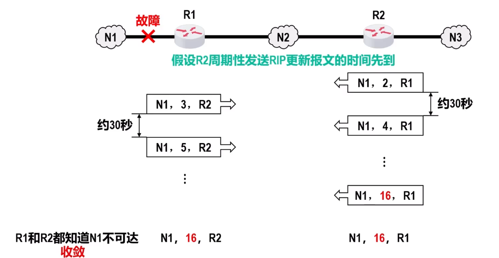
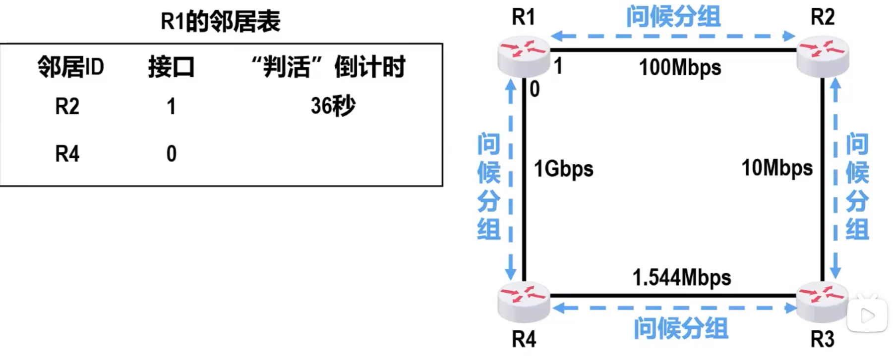
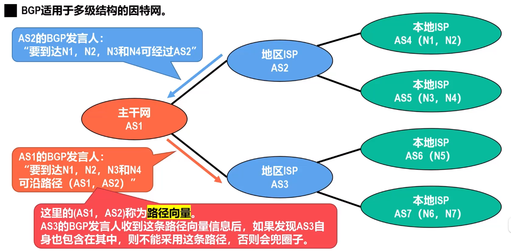
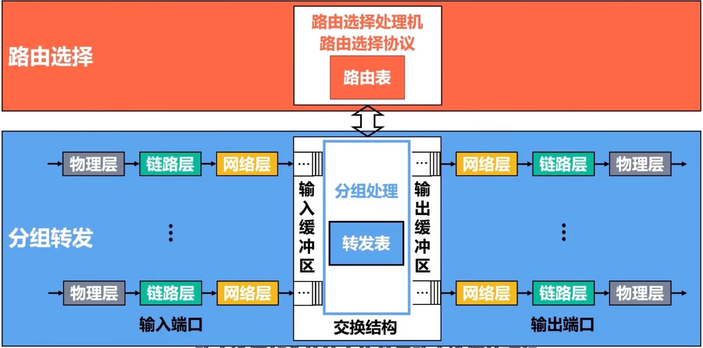

# 因特网的路由选择协议
## 路由选择分类
**静态路由选择**
-   采用**人工配置**的方式给路由器添加网络路由，默认路由和特定路由等路由条目
-   <u>简单，开销小</u>，但**不能及时适应网络状态变化**
-   一般只在**小规模网络**采用

**动态路由选择**
-   路由器通过路由协议**自动获取**路由信息
-   <u>比较复杂，开销较大</u>，**但能较好地适应网络状态的变化**
-   适用于**大规模网络**

## 因特网采用分层次的路由选择协议
作为全球最大的互联网，其路由选择协议具有三个主要特点
-   **自适应**：采用**动态路由**选择，能较好使用网络状态变化
-   **分布式**：**各路由器**通过互相间的信息交互，**共同完成路由信息的获取和更新**
-   **分层次**：将因特网划分为许多较小的**自治系统**
    在自治系统内外分别采用不同类别的路由协议，分别进行路由选择

**自治系统之间**的路由选择简称**域间路由选择**，使用**外部网关协议EGP**
**自治系统内部**的路由选择简称**域内路由选择**，使用**内部网关协议IGP**

## 路由信息协议RIP
### 基本概念
**路由信息协议RIP**是内部网关协议中最先得到广泛使用的协议之一

RIP要求自治系统AS内的每一个路由器，都要维护从它自己到AS内每一个网络的距离记录。这是一组距离，称为**距离向量D-V**

RIP使用**跳数**作为度量来衡量到达目的网络的**距离**
-   路由器到**直连网络**的距离为 **$1$**
-   路由器到**非直连网络**的距离为 **的路由器数 $+1$**
-   一条路径最多只能包含 $15$ 个路由器，即**最远距离 $15$**，因此RIP只适用于小型互联网

RIP认为**好的路由**就是距离短的路由，也就是**通过路由器最少的路由**

当到达同一目的网络有多条RIP距离相等的的路由时，可以进行**等价负载均衡**

RIP有三个重要特点：
-   **和谁交换信息**：仅和**相邻路由器**交换信息
-   **交换什么信息**：交换的信息是**路由器自己的路由表**
-   **何时交换信息**：**周期性交换**

### 基本工作过程
-   路由器刚开始工作，**只知道自己到直连网络的距离为 $1$**
-   每个路由器仅和**相邻路由器周期性地交换信息并更新路由信息**
-   若干次交换和更新后，**每个路由器都知道到达本自治系统内各网络的最短距离和下一跳路由器，称为收敛**

### 距离向量算法
假设有两个路由器A,B

A向B发送自己的路由表，B收到路由表后线将个条目的RIP距离 $+1$，然后和自身的比较
-   若不存在，则添加
-   若存在，
    -   若是原信息的**下一跳是A**，则**必须更新**
    -   若下一跳不是A，则取 $\min\{原记录，新记录\}$
        **特别的**，如果下一跳不同，但是RIP距离相同，则**添加**，可以等价负载均衡

    
还包含一些时间参数
-   路由器每隔**约 $30s$** 项其所有相邻路由器发送路由更新报文
-   若 **$180s$**（默认）没有收到某条路由条目的更新报文，则把该路由条目**标记为无效**，在过一段时间还是没有收到，则**删除**

### 存在的问题
**“坏消息传的慢”**，也称为路由环路或**RIP距离无穷计数问题**
因为更新报文时，不会发送发送方的下一跳信息，所以如果与A相连的网络N故障无法传递，
-   其会收到B的更新报文，然后更新
-   然后A给B发送报文，B更新
-   B再给A发送报文，A对N的RIP距离 $+1$
-   以此类推，直到有一方距离 $> 15$

采用下述方法可以**减少**出现该问题的概率
-   限制最大RIP距离为 $15$
-   当路由表变化就立刻发送更新报文，即**触发更新**
-   让路由器记录收到某个特定路由信息的接口，而不让同一路由信息再通过此接口反向发送，即**水平分割**

## 开放最短路径优先协议
### 基本概念
**开放最短路径有限OSPF**是为了**克服**RIP的缺点于1989年开发的
-   **开放**表明OSPF协议不受某一厂商控制，而是**公开发表**的
-   **最短路径优先**是因为使用了Dijkstra的**最短路径算法**
    > 不代表其他协议不寻找最短路径

OSPF是基于**链路状态**的，而不是像RIP基于距离向量
OSPF基于链路状态并采用最短路径算法计算路由，从算法上保证了**不会产生路由环路**
OSPF**不限制网络规模，更新效率高，收敛速度快**

#### 链路状态LS
链路状态LS是指本路由器都和**哪些路由器相邻**，以及**相应链路的代价**
-   **代价**用来表示费用，距离，时延和带宽等，由网络管理员人员决定
    > 如思科路由器OSPF协议计算代价为 $100Mb/s$ 除以链路带宽，小于 $1$ 记 $1$，大于 $1$ 舍小数

#### 邻居关系的建立和维护
相邻路由器之间通过交互**问候(Hello)分组**来建立和维护**邻居关系**
-   问候分组的**发送周期为 $10s$**
-   若 **$40s$** 未收到来自邻居的问候分组，则认为邻居路由器不可达
-   每个路由器会建立一张**邻居表**
    

#### 链路状态通告LSA
LSA包含以下两类链路昨天信息
-   **直连网络**的链路状态信息
-   **邻居路由器**的链路状态信息

## 边界网关协议BDP
### 基本概念
**边界网关协议BGP**属于外部网关协议EGP，用于**自治系统AS之间的路由选择协议**

因为在不同AS内度量路由的代价不同，因此对于AC之间的路由选择，无法选择统一的代价作为度量

AS之间的路由选择还必须考虑相关**策略（政治，经济，安全等）**

BGP是力求寻找一条能够到达目的网络的**较好**路由，而非寻找一条最佳路由

### 边界路由器
在配置BGP时，每个AS的管理员要选择至少一个路由器作为该AS的**BGP发言人**，一般来说，两个BGP发言人通过一个共享网络连接在一起，而BGP发言人往往就是**BGP边界路由器**

BGP发言人交换网络可达性信息，也就是**要到达某个网络锁要经过的一系列自治系统**

交换了网络可达性信息后，各BGP发言人就根据所采用的策略，从收到的路由信息中找出到达各自治系统的较好的路由，也就是构造出树形结构且**不存在环路的自治系统连通图**

### BGP适用于多级结构的因特网

### BGP-4的四种报文
-   **OPEN（打开）报文**：用来与相邻的另一个BGP发言人建立关系，使通信初始化
-   **UPDATE（更新）报文**：用来通告某一路由的信息，以及列出要撤销的多条路由
-   **KEEPALIVE（保活）报文**：用来周期性地证实邻站的连通性
-   **NOTIFICATION（通知）报文**：用来发送检测到的差错

## 路由器基本工作原理
**路由器**是一种具有多个输入端口和输出端口的**专用计算机**，其任务是**转发分组**

**路由选择部分**：核心构建是**路由选择处理机**，其任务是根据所使用的**路由选择协议**，周期性地与其他路由器进行路由信息的交换，以便构建和更新**路由表**

**分组转发部分**：由**一组输入端口**，**交换结构**以及**一组输出端口**构成

