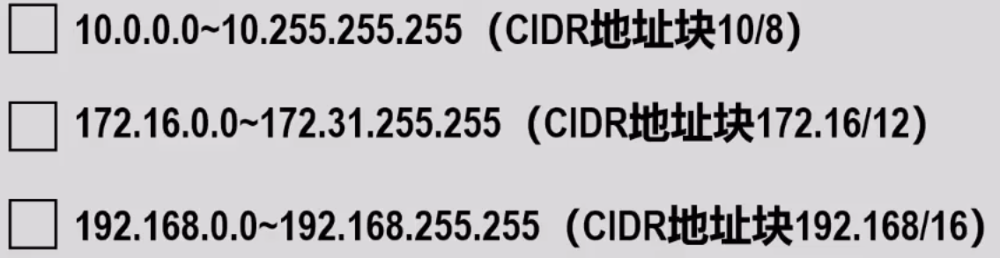

# 虚拟专用网和网络地址转换
## 虚拟专用网VPN
对于两个不同位置的机构的专用网，需要经常进行通信，而租用电信公司的通信线路为机构专用，虽然方便，但是租金很高

VPN：**利用公用的因特网**作为本机构各专用网之间的通信载体，这样形成的网络又称为虚拟专用网

这样需要给专用网中各主机配置IP地址，出于安全考虑，**专用网内各计算机并不应该直接爆率与公用的因特网上**。因此，给专用网内各主机配置的IP地址应是各主机在专用网内可以相互通信，而不能直接与公用的因特网通信

给专用网内各主机配置的IP地址应该是该**专用网所在机构可以自行分配的IP地址**，这类IP地址仅在机构内部有效，称为**专用地址**，不需要向因特网的管理机构申请

[RFC 1918]规定了三个CIDR地址块中的地址作为专用地址

**因特网中的所有路由器，对目的地址是专用地址的IP数据报一律不进行转发**，这需要由因特网服务提供者ISP对其拥有的因特网路由器进行设置来实现

### 通信过程
两专用网要借助VPN通信，需要保证两专用网至少有一个路由器拥有合法的全球IP地址，设此二路由器为R1和R2

发送数据报时，先将数据载荷封装成**内部IP数据报**发送给R1，R1发现必须经过因特网才能到达，就将IP数据报进行加密，并添加上因特网的首部：首部中的源地址为R1的IP地址，目的地址为R2的IP地址

### 外联网VPN
上述通信过程的例子为**内联网VPN**，有时一个机构的VPN需要某些外部机构参加进来，这样VPN就成为外联网VPN

## 网络地址转换NAT
网络地址转换NAT技术于1994年提出，用来缓解IPv4地址空间即将好久的问题
-   NAT能<u>是大量使用内部专用地址的专用网络用户共享少了外部全球地址来访问因特网上的主机和资源</u>
-   这张方法需要再专用网络连接到因特网的路由器上**安装NAT软**。装有NAT软件的路由器称为***NAT路由器**，它**至少要有一个有效的外部全球地址IP**

