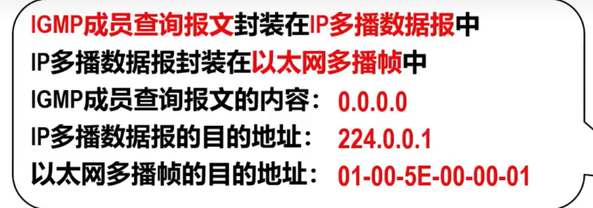
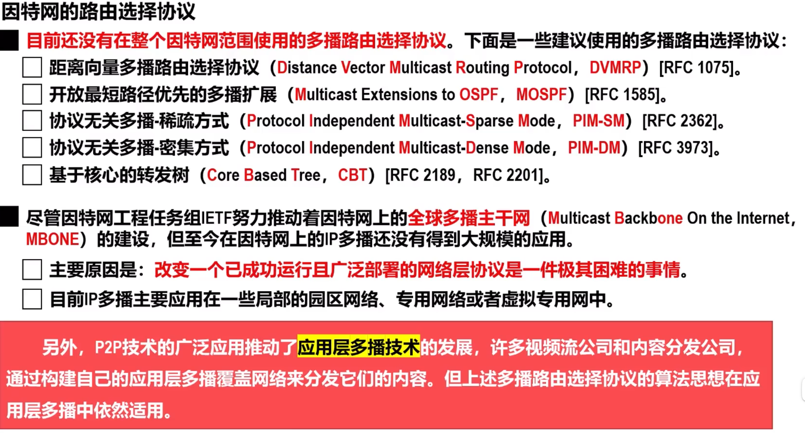

# IP多播
**多播（组播）**是一种实现**一对多**通信的技术，与传统单播相比，可以**极大地节省网络资源**

**IP多播**：在因特网上进行的多播

采用多播方式可以显著减少网络中各种资源的消耗

## IP多播地址和多播组
在**IPv4**中，**D类地址**被作为**多播地址**

多播地址只能用作目的地址，而不能用作原地。

用每一个D类地址标识一个多播组，使用**同一个IP多播地址**接受多播数据报的所有主机就构成了一个多播组。
-   每个多播组的成员是可以随时变动的，一台主机可以随时加入或离开多播组
-   多播组成员的数量和所在地理位置也不受限制，一台主机可属于若干多播组

IP多播数据包也是**尽最大努力交付**

IPv4多播地址可分为：预留的多播地址（永久多播地址）、全球范围可用的多播地址、本地管理的多播地址

可分为：**只在本局域网进行的硬件多播**和**在因特网进行的多播**

## 在局域网上进行硬件多播
因为MAC地址有多播MAC地址这种类型，因此只需要**把IPv4多播地址映射为多播MAC地址**，即可将IP多播数据包封装在局域网的MAC帧中，而MAC帧首部的目的MAC地址设置为映射的多播MAC地址，这样可以很方便**利用硬件多播实现局域网内IP多播**

## 在因特网上进行IP多播需要的两种协议
要在因特网进行IP多播，必须考虑**IP多播数据包经过多个多播路由器进行转发**的问题
-   **多播路由器**必须根据IP多播数据报首部中的IP多播地址，将其转发到有该多播组成员的局域网

## 网际组管理协议IGMP
网际层中的协议，作用是**让连接在本地局域网上的多播路由器知道本局域网上是否有主机（实际上是主机中的某个进程）加入或退出了某个多播组**

IGMP仅在本网络有效，使用IGMP并不难知道多播组所包含的成员数量和分布

### 基本概念
有三种报文类型
-   成员报告报文
-   成员查询报文
-   离开组报文

IGMP被封装在IP数据报中发送，其协议字段值为 $2$，表示数据载荷为IGMP报文；生成时间TTLL为 $1$，避免被转发到其他网络

### 工作原理
**加入多播组**
-   主机发送IGMP成员报告报文，与其直连的主机或路由器接受该报文
-   若接受到的主机发现其多播帧MAC地址与自身不同，或者自身不属于任何多播组，则在MAC层丢弃
-   若多播MAC地址相同，则接受该报文，并向上传递给网际层
    若IP多播地址不同，则由网际层丢弃
-   若IP多播地址相同，则交付IGMP进行解析，这样便知道这是来自同一多播组成员的报告报文，于是取消自己将要发送的成员报告报文
    > 因为仅关系多播组是否存在，而不关心数量
-   路由器接收成员报告报文，将该多播组地址加入自己的多播组列表

**监视多播组成员变化**
-   多播路由器默认每隔 $125s$ 就向直连网络发送一个IGMP成员查询报文
    
    -   该报文内容`0.0.0.0`表示查询全部多播组地址
    -   目的地址`224.0.0.1`是一个特殊的IP多播地址，本网络所以参加多播的主机和路由器都会受到该数据报
-   若主机不存在任何多播组，则在MAC层丢弃该数据报
-   若多播帧MAC地址相同，则接受并交付网际层，IGMP对该数据报内容进行解析，针对是自身的查询进行响应（随机选择 $1 \sim 10 s$ 的一个延迟时间进行响应）
    -   延迟时间最短的主机发送成员报告报文，和上面加入多播组的步骤一样，其他**相同多播组**的主机接收该报文后，发现是同一多播组，则无需再发送报告报文
-   若是路由器长时间收不到多播组列表中某个多播组的成员的响应，则将其删除

同一网络只需要一个查询路由器
-   每个多播路由器若箭头到源地址比自己IP地址小的查询报文，则退出选举
-   最后<u>网络中只有IP地址最小的多播路由器成为查询路由器</u>

**退出多播组**
IGMPv2在v1的基础上增加了一个可选项：当主机要退出某个多播组，可主动发送一个<u>离开祖报文</u>，这样多播路由器可以更快发现某个组有成员离开

路由器接受离开报文后，立即发送<u>针对该多播组的成员查询报文</u>

## 多播路由选择协议
主要任务是在多播路由器之间为每个多播组建立一个**多播转发树**
-   多播转发树链接多播源和所有拥有该多播组成员的路由器
-   IP多播数据包只要沿着多播转发树进行洪泛，就能传送到所有拥有该多播组成员的多播路由器

有**基于源树**和**组共享树**两种方法

### 基于源树的多播路由选择
最典型的算法是**反向路径多播RPM算法**，包含两个步骤
-   利用**反向路径广播RPB**算法建立一个**广播转发树**
-   利用**剪枝**算法，剪除广播转发树中的下游非成员路由器，获得一个**多播转发树**

#### 反向路径广播算法RPB
利用此算法生成的广播转发树，不会存在环路

RPB算法的要点是：每一台路由器在收到一个广播分组时，先**检查该广播分组是否是从源点最短路径传送来的**
-   若是，则从除该接口外的所有接口转发该广播分组
-   若不是，则丢弃
-   若有好几个邻居路由器都处在最短路径上，则选取IP地址最小路由器所在的最短路径

#### 剪枝
将没有多播组成员，也没有下游路由器的叶节点路由器从转发树上剪除

### 组共享树多播路由器选择
采用**基于核心的分布式生成树算法**来建立共享树
-   该方法在**每个多弄组**中知道一个**核心路由器**，以该路由器为根建立一科连接多播组的所有成员路由器的生成树，作为多播转发树

每个多播组中除了核心路由器，其他所有成员路由器都会向自己多播组的核心路由器单播**加入报文**
-   加入报文通过单播朝着核心路由器转发，直到它**到达**已经属于**该多播生成树的某个节点**或*直接到达核心路由器**
-   此过程所经过的路径，就确定了一条**从单播该报文的边缘节点到核心路由器之间的分支**，这个新分支就被<u>嫁接</u>到现有的**多播转发树**上

**源主机**发送多播分组，会先发送给核心路由器，再经过核心路由器洪泛转发

### 因特网多播路由选择协议

