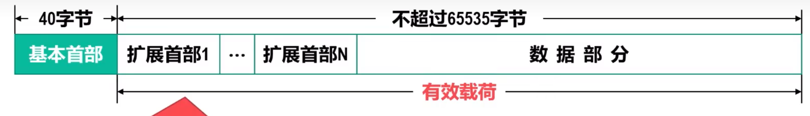
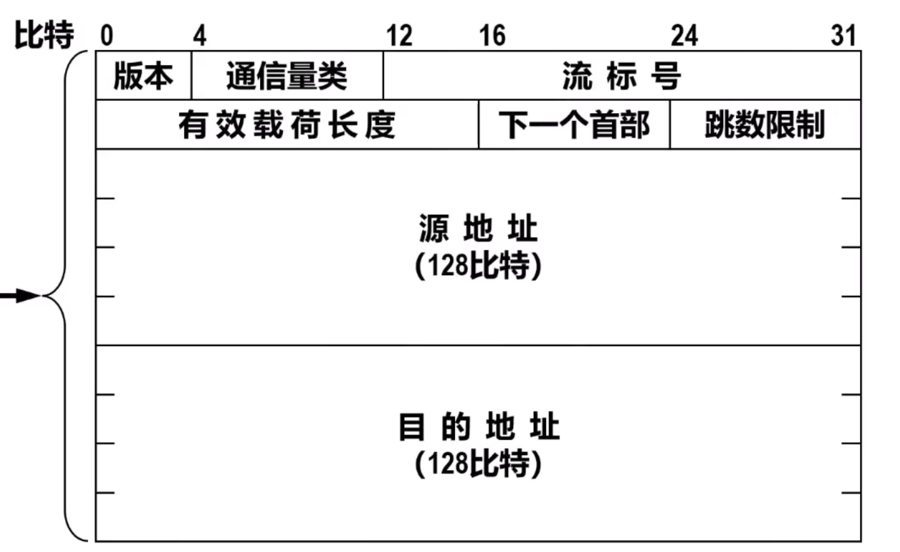
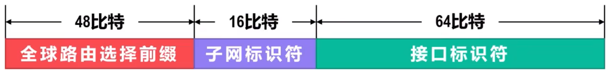
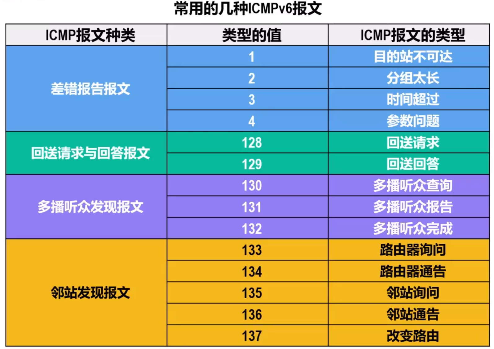

# IPv6
IPv6根本措施是采用具有更大地址空间（IP地址长度128bit）的新版本IP

## 主要变化
**更大的地址空间**，地址空间增大到128bit，在可预见的未来是不会用完的

**扩展的地址层次结构**：可划分为更多的层次，这样可以更好地反应因特网的拓扑结构，使得对寻址和路由层次的设计更具有灵活性

**灵活的首部格式**：与IPv4首部病不兼容。IPv6定义了许多**可选的首部格式**，不仅可提供比IPv4更多的功能，而且还可以**提高路由器的处理速率**，因为路由器对逐跳扩展首部外的其他扩展首部都不进行处理

**改进的选项**：IPv6允许分组包含选项的控制信息，因而可以包含一些新的选项

**允许协议继续扩充**

**支持自动配置**，IPv6支持主机或路由器自动配置IPv6地址及其他网络配置参数

**支持资源的预分配**

## 基本首部

IPv6数据报由40B的基本首部和长度可变的有效在和组成

相比IPv4，IPv6**对某些字段进行了更改**
|IPv6|IPv4|
|-|-|
|||

IPv6将IPv4首部中不必要的功能取消了，这使得首部中的字段数量减少到 **$8$ 个**

但是因为地址扩展到了128bit，使得IPv6长度反倒增大到了40B
-   取消了**首部长度字段**，因为IPv6首部长度固定为40B
-   取消了**服务类型字段**，因为**通信量类**和**流标号**字段实现了服务类型字段的功能
-   将**总长度**改为**有效载荷长度**，因为只有有效载荷长度可变
-   取消了**标识、标志、片偏移**，因为这些功能包含在**分片扩展首部**中
-   将**生存时间TTL**改为**跳数限制**，这样名称与作用更一直
-   取消了**协议**，改用**下一个首部**
-   取消了**首部检验和**，可以加快路由器处理速度
-   取消了**选项字段**，改用**扩展首部**实现选项功能

**字段功能**
-   **版本**，4bit，用来标识IP协议的版本，IPv6对应 $6$
-   **通信量类**，8bit，用来**区分不同IPv6数据报的区别或优先级**
-   **流标号**，20bit
    -   IPv6提出了**流**的概念
        > 流是因特网上从特定源点到特定终点（单播或多播）的一系列IPv6数据包，而这个流所经过的路径上的所有路由器都保证指明的服务质量

        所有属于一个流的IPv6数据报具有同样的流标号，**流标号用于资源分配**
    -   对实时音视频数据的传送特别有用，但对传统非实时数据则没有用处，可直接置 $0$
-   **有效载荷长度**，16bit，指明基本首部后的有效载荷的**字节数量**
-   **下一个首部**，8bit，相当于IPv4的协议字段或可选字段
    -   当IPv6数据包没有扩展首部时，其值域IPv4一样指出后面的数据是何种协议数据单元PDU
    -   当IPv6数据包**有扩展首部时**，该字段标识第一个扩展首部的类型
        之后的扩展首部都指明下一个扩展首部的类型，或者数据部分的类型
-   **跳数限制**，8bit
-   **源地址**与**目的地址**，均为128bit

## 扩展首部
为了提高路由器对数据报的处理效率，IPv6把IPv4中的选项字段都放在了扩展首部中，由路径两端的源点和终点来处理

在[RFC 2460]中第一了六种扩展首部
1.  逐条选项
2.  路由选择
3.  分片
4.  鉴别
5.  封装安全有效载荷
6.  目的站选项

**每一个扩展首部都有若干字段组成**，它们的长度各不相同
**所有扩展首部的第一个字段都是8bit的下一个首部字段**

当有多个扩展首部时，**应按以上先后顺序出现**

## IPv6地址
### 地址空间大小
每个地址站128bit，所以**IPv6地址空间大小为 $2^{128}$**

### 表示方法
128bit，每16bit分为一组，每组之间用`:`分割

**左侧零省略**，两个冒号中间，最前面的一串0可以省略不写
**连续零压缩**，连续的一串零用一对冒号代替，**一个地址只能使用一次**

### 地址的分类
**单播** 传统的点对点通信
**多播** 一对多点的通信。IPv6没有采用广播术语，而是将广播视作多播的特例
**任播** 任播的**终点是一组计算机，但数据报只交付其中的一个**，通常是按路由算法得出的距离最近的一个

-   **未指明地址**，128bit全0，可缩写为`::`
    -   不能用作目的地址，只能用作还没有配置到一个标准IPv6地址的主机作为源地址
-   **环回地址**，最低bit为1，其余127bit全0，可缩写为`::1`
-   **多播地址**，高8bit全1，可记为`FF00::/8`
-   **本地链路单薄地址**，最高10bit为`1111111010`，可记为`FE80::/10`
    即使用户网络没有连接到因特网，但仍然可以使用TCP/IP协议。链接在这种网络上的主机可以使用本地链路单薄地址进行通信，但是不能和因特网其他主机通信。这类地址占 $1/1024$
-   **全球单播地址**，采用三级结构，方便路由器更快地查找路由
    

## IPv4向IPv6过渡
因为历史遗留问题，从IPv4向IPv6转变只能只能采用逐步演进的办法

新部署的IPv6系统页必须能够兼容IPv4

### 双协议栈
使一部分主机或路由器**装有IPv4和IPv6两套协议栈**

双协议栈主机或路由器记为`IPv6/IPv4`，表面它**具有一个IPv6地址和一个IPv4地址**

其通过域名系统DNS查询目的主机采用的IP地址：若返回IPv4地址，则源主机使用IPv4地址；否则使用IPv6地址

在传递过程中IPv4和IPv6数据报可能互相转换，这可能导致如流标号这样的信息丢失

### 隧道技术
**核心思想**
-   当IPv6数据报要进入IPv4网络，将其重新封装成IPv4数据报，即整个IPv6数据报称为IPv4的数据载荷
-   封装后的数据包在IPv4网络正常传输
-   IPv4数据包要离开IPv4网络时，再将其数据在和取出并转发到IPv6网络

**此情况下IPv4首部中协议字段必须设置为41**

## 网际控制报文协议ICMPv6
因为其比v4要复杂地多，所以合并了原来的**地址解析协议ARP和网际组管理协议IGMP**

封装该报文的首部的下一个首部字段值为 $58$

