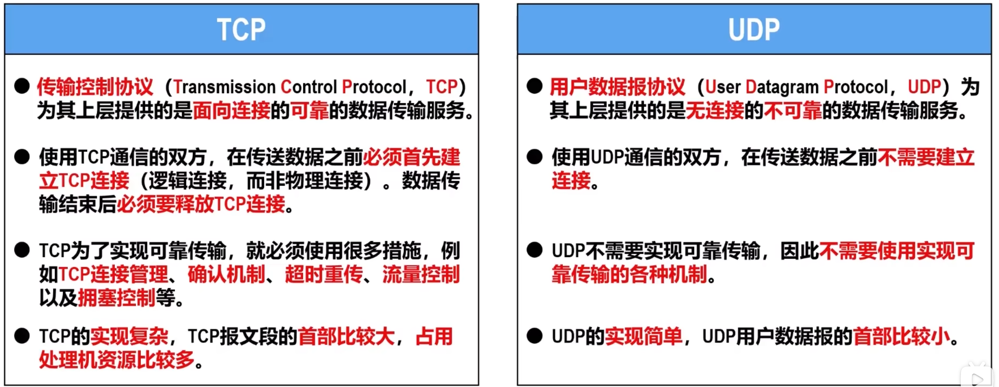
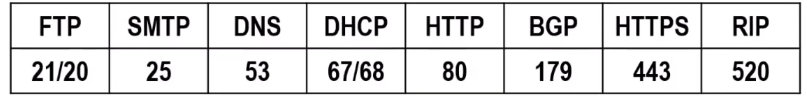

# 运输层概述
运输层为运行在不同主机上的应用进程提供直接的的逻辑通信服务

## 两个重要协议

## 运输层端口号，复用与分用

### 运输层端口号
运行在计算机上的进程使用**进程标识符PID**来标识

因为不同OS使用不同格式的PID，为使运行不同OS的计算机的应用进程之间能给予网络进行通信，就必须**使用统一的方法对TCP/IP体系的应用进程进行标识**

运输层使用**端口号**来标识和区分应用层的不同应用进程。端口号的**长度为16bit，取值范围 $0 \sin 65535$**
****
**端口号**
-   **服务器使用端口号**
    -   **熟知端口号** $0 \sim 1023$：由IANA分配给TCP/IP体系结构应用层最重要的一些应用协议
    
    -   **登记端口号** $1024 \sim 49151$：为没有熟知端口号的应用程序使用。要使用这类端口号，必须在IANA进行登记，防止重复
-   **客户端使用端口号**
    -   **短暂端口号** $49152 \sim 65535$：仅在客户端使用，由客户进程在运行时动态选择，通信结束后会被系统收回，以便给其他客户进程使用

****

**端口号值具有本地意义**，即端口号是为了标识本计算机网络协议栈应用层中的各应用进程。
-   在Internet，不同计算机中的相同端口号是没有关系的，即相互独立。
-   TCP和UDP的端口号之间也是没有关系的

### 发送方的复用和接收方的分用
发送方某些应用进程所发送的不同的应用报文，在运输层使用
-   UDP封装，称为**UPD复用**
-   TCP封装，称为**TCP复用**

无论是哪种协议封装成的报文，在**网际层**都需要使用IP协议封装成**IP数据报**，称为**IP复用**
-   IP数据报首部**协议字段**表明数据载荷封装何种协议数据单元
    -   $6$ 表示TCP报文段
    -   $17$ 表示UDP用户数据报

接收方网际层收到IP数据报后进行**IP分用**，根据协议字段的值将数据报向上交付对应运输层协议

运输层对UDP用户数据报进行**UDP分用**，对TCP报文段进行**TCP分用**