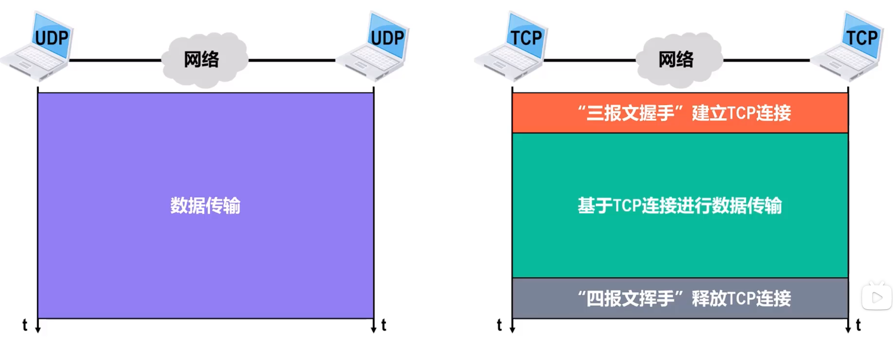
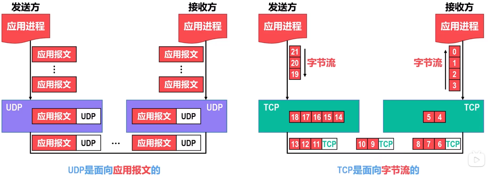
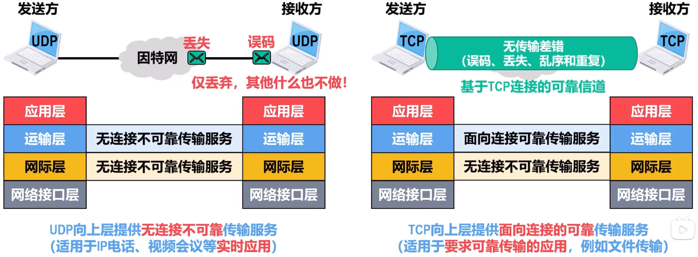
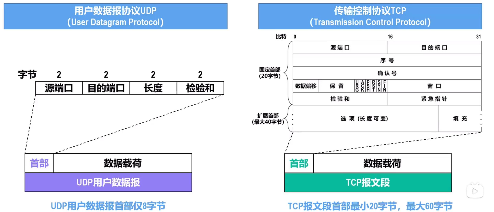

# UDP与TCP对比
UDP提供**无链接**的**不可靠**的数据传输服务，因此非常简单

TCP提供**面向连接**的**可靠**的数据传输服务，非常复杂

## 无连接的UDP和面向连接的TCP

**UDP**无连接，传输数据之前无需建立连接，可随时发送数据

**TCP**面向连接，在传输数据之前，必须使用**三报文握手**建立TCP连接，然后才能给予TCP连接传输数据，结束需要进行**四报文挥手**释放TCP连接

## 对单播多播广播的支持情况
UDP支撑单播多播和广播

TCP仅支持单播

## 对应用层报文的处理
UDP面向应用报文

TCP面向字节流

TCP可以进行全双工通信

## 可靠性对比

## 首部对比

