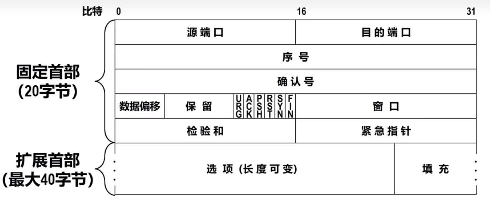
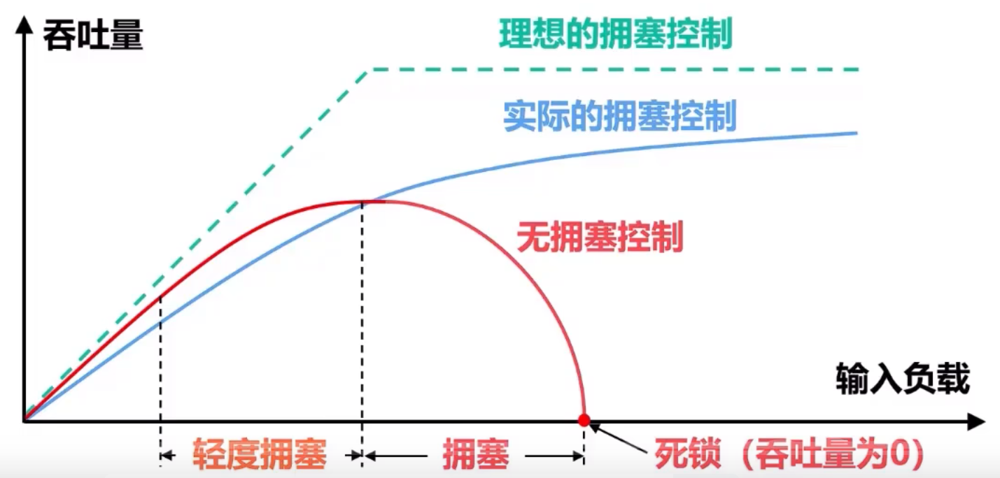
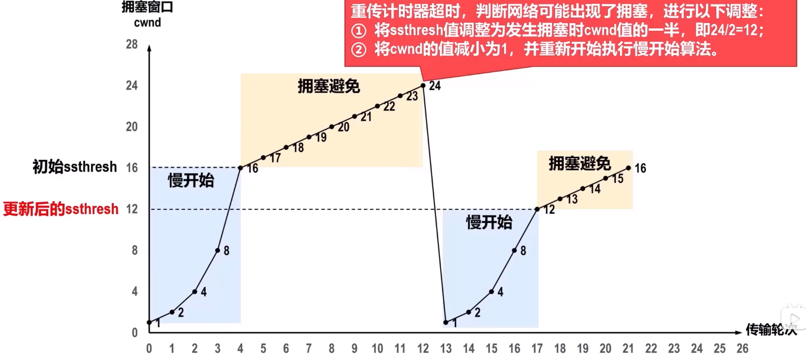
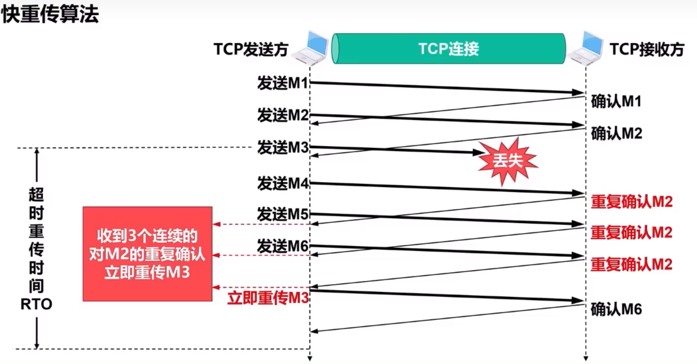
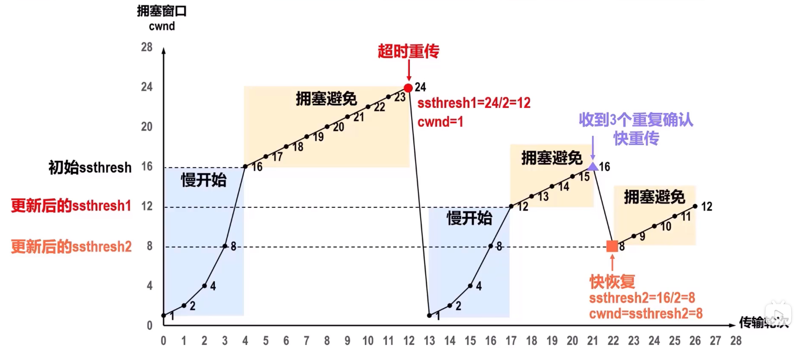
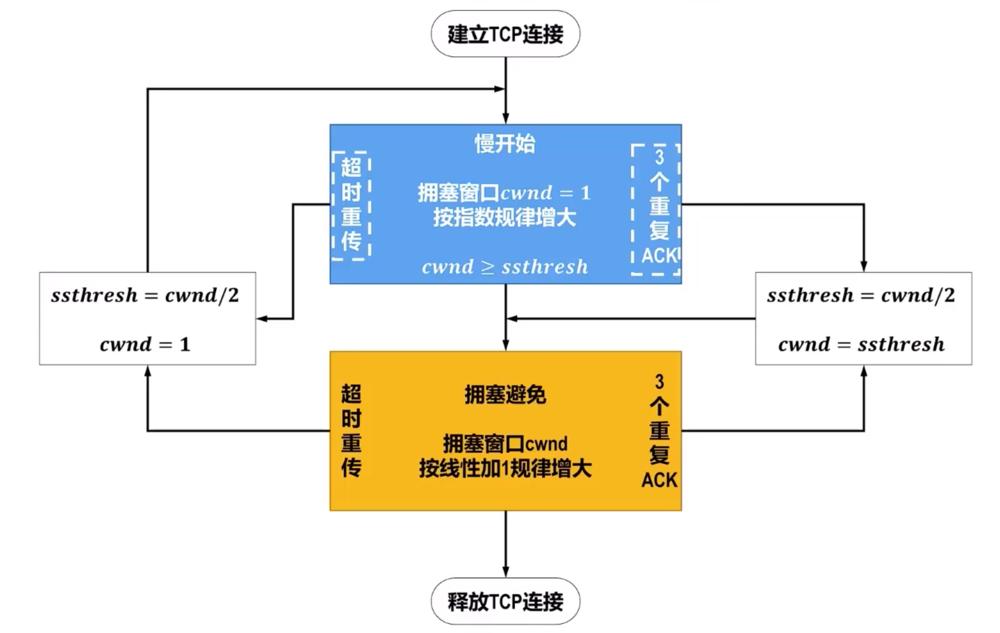

# 协议控制协议TCP

## TCP报文段首部格式
TCP在发送数据时，根据发送策略从发送缓存中取出一定量的字节，并给其添加一个首部使之成为**TCP报文段**后进行发送

**首部格式由 $20B$ 的固定首部和最大 $40B$ 的扩展首部构成**

### 源端口字段和目的端口字段
**源端口字段**占16bit，**源端口号**用来<u>标识发送该TCP报文的应用进程</u>

**目的端口**占16bit，**目的端口号**用来<u>标识接受该TCP报文段的应用进程</u>

### 序号字段、确认字段以及确认标识符ACK
**序号**占32bit，取值范围 $0 \sim 2^{21}-1$。当序号增加到最后一个，下一个回到 $0$。**用来指出本TCO报文段数据载荷的第一个字节的序号**

**确认号**占32bit，取值范围 $0 \sim 2^{21}-1$。当增加到最后一个，下一个回到 $0$。**用来指出期望收到对方下一个TCP报文段的数据在和的第一个字节的序号，同时也是对之前收到的所有数据的确认**

**确认号标志位ACK**，<u>只有当ACK取值为1时，确认号字段才有效</u>
TCP规定：在TCP连接建立后吗，所有传送的TCP报文段必须把ACK置1

### 数据偏移字段
占4bit，取值以 $4B$ 为单位，指出数据在和起始部分离报文起始多远，**实际上指出了首部长度**

### 保留字段
占6bit，保留为今后使用，目前应置0

### 窗口字段
16bit，取值范围 $0 \sim 2^{16}-1$，以字节为单位，用来指出发送本报文段的一房的接收窗口大小，即**接受缓存的可用空间大小**，者用来表征接收方的**接收能力**

### 检验和字段
占16bit，用来检验整个TCP报文段在传输过程是否发生了误码

与IPv4检验和方法类似，不过这里要对整个报文段进行检验

### 同步标志位SYN
用于TCP双方建立连接
-   `SYN = 1`, `ACK = 0`，表面这是一个TCP连接请求报文
-   若对方同理链接，则应在响应报文首部使用`SYN = 1`且`ACK = 1`

### 终止报文段FIN
用于释放TCP连接
-   当`FIN = `时，表明此TCP报文段的发送方已经将全部数据发送完毕，现在要求释放TCP连接

### 复位标志位RST
用于复位TCP连接

当`RST = 1`，表面TCP连接出现严重差错，必须释放连接，然后再重新建立连接

RST置1还用来拒绝一个非法的TCP报文段或拒绝打开一个TCP连接

### 推送标志位PSH
处于效率，收发双方可能延迟发送或交付数据，这样可以一次性处理更多视距

但当两个应用在进行交互式通信时，优势在一端的应用进程吸引在键入一个命令后就能收到对方的响应，在此情况下可以通知TCP使用推送操作

### 紧急标志位URG和紧急指针字段
`URG = 1`时，紧急指针字段有效

**紧急指针**，占16bit，以字节为单位，用来指明紧急数据的长度

**紧急字段会在此报文最前面**，即紧急指针会指明载荷有多长紧急数据

接收方收到URG为1的报文，就会直接取出紧急数据并交付，而不必再排队

### 选项字段
长度可变，最大 $40B$

**最大报文段长度MSS选项**：指出TCP报文段数据在和的最大长度，而不是整个报文段的长度

**窗口扩大选项**：用来扩大窗口，提高吞吐率

**时间戳选项**：
-   用于计算往返时间RTT
-   用于处理序号超范围的情况，又称为防止序号绕回PAWS

**选择确认选项**：用来实现选择确认功能

### 填充字段
填充若干0，保证TCP报文段首部能被 $4B$ 整除

### TCP的运输连接管理
TCP是面向连接的协议，它基于运输连接来传送TCP报文段。

TCP运输连接的建立和释放，是每一次面向连接的通信中必不可少的过程

**运输连接的过程**
-   建立TCP连接
-   数据传送
-   释放连接

#### 三报文握手建立TCP连接
**需要解决的问题**
-   使TCP双方都能**确知对方的存在**
-   使TCP双方能够**协商一些参数**（如最大报文段长度，最大窗口大小，时间戳选项等）
-   使TCP双方能够**对运输实体资源进行分配和初始化**，运输试题资源包括缓存大小、各状态变量、连接表中项目等

对于要进行TCP通信的两台主机，主动发起的称为**TCP客户**，被动等待的称为**TCP服务器**

**过程**
-   起初，两端的TCP进程都处于关闭(CLOSED)状态
-   TCP服务器进程首先创建传输**控制块**，用来存储TCP连接中的一些重要信息。之后TCP服务器进入**监听(LSITEN)** 状态，等待TCP客户进程的连接请求。称为**被动打开链接**
-   TCP客户进程要首先创建传输控制块，之后在<u>打算建立TCP连接时</u>向TCP服务器进程发送**TCP连接请求报文段**，并进入**同步已发送**状态
    -   <u>TCP连接请求报文段首部</u>中的**同步标志位SYN被置1**，表面这是一个TCP连接请求报文；
    -   序号字段seq被设置一个初始值 $x$，TCP客户进程下一次发送的TCP报文段的数据在和的第一个字节的序号为 $x+1$
        > **TCP规定SYN被设置为 $1$ 的报文段不能携带数据，但要消耗掉一个序号**，也就是说TCP请求报文段不能懈怠数据，但是会消耗掉序号 $x$

    称为**主动打开链接**
-   TCP服务器进程收到TCP连接请求报文段后，如果同意建立连接，则向TCP客户进程发送**TCP连接请求报文段**，并进入**同步已接收**
    -   该报文段首部的**SYN和ACK都置1**，表面这是一个TCP连接请求确认报文
    -   序号字段seq被设置了一个初始值 $y$，这是TCP服务器进程所选择的出事序号
        > 连接确认请求报文也不能懈怠数据
    -   确认号字段ack的值被设置为 $x+1$，这是对TCP客户进程所选择的初始序号的确认
-   TCP客户进程收到TCP连接请求确认报文段后，还要写TCP服务器进程发送一个**普通的TCP确认报文段**，并进入**连接已建立**状态
    -   该报文首部**ACK置1**，表面这是一个普通的TCP确认报文段
    -   序号seq被设置为 $x+1$
        > **TCP规定普通的TCP确认报文段可以懈怠数据，但如果不懈怠数据，则不消耗序号**
-   TCP服务器进程收到针对TCP连接请求报文段的普通确认报文后，也进入**连接已建立**状态，此时双方都进入该状态，可以基于链接进行数据传输了

**为什么不使用更少的两报文握手**
为了防止已失效的TCP连接请求报文段突然又传送到了TCP服务器进程，因而导致错误

#### 四报文挥手
**过程**
-   数据传输结束后，双方都可以释放TCP连接。现在双方都处于连接已建立状态
-   假设TCP客户进程的应用进程通知其**主动关闭TCP连接**，TCP客户进程会发送**TCP连接释放报文段**，并进入**终止等待1**状态
    -   <u>该报文段首部</u>中的**终止标志位FIN和ACK都置1**，表面这是一个TCP连接释放报文，同时对之前收到的报文段进行确认
    -   序号字段seq的值设置为 $u$，等于TCP客户进程之前已经传输的最后一个字节的序号 $+1$
    > **TCP规定FIN为1的报文段即使不携带数据，也消耗一个序号**
        FIN为1的报文段可以携带数据，但现实几乎不会
    -   确认号字段ack值置为 $v$，等于客户进程已经收到最后一个字节的序号 $+1$
-   TCP服务器进程收到TCP连接释放报文段后，会发送一个**普通的TCP确认报文段**并进入**关闭等待**状态
    -   该报文段首部**ACK置1**，表面这是一个普通的TCP确认报文段
    -   序号字段seq值置 $v$，等于与TCP服务器进程之前已经传输的最后一个字节的序号 $+1$
    -   确认号字段**ack值置 $u+1$**，这是对TCP连接释放报文段的确认 
    -   TCP服务器进程这时应通知高层应用进程“TCP客户进程要断开与自己的TCP连接”。此时，从TCP客户进程到TCP服务器进程这个方向的连接就释放了
    -   这时TCP连接属于**版关闭状态**，也就是TCP客户进程有IJ没有数据要发送，但若是TCP服务器进程还有数据要发送，TCP客户进程仍要接收
-   TCP客户进程收到该普通TCP确认报文段后就进入**终止等待2**状态，等待TCP服务器进程发出的TCP连接释放报文。
-   若使用TCP服务器进程的应用进程已经没有数据要发送了，应用进程就通知期TCP服务器进程释放连接
    -   因为TCP款姐师范是客户进程主动发起，所以TCP服务器进程对TCP连接的师范称为**被动关闭连接**
-   TCP服务器进程发送**TCP连接释放报文段**并进入**最后确认**状态
    -   该报文段首部中的FIN和ACK的值都被置1，表面这是一个TCP连接释放报文，同时也对之前收到的报文进行确认
    -   现在嘉定序号字段seq的值为 $w$（班关闭状态服务器进程可能发送一些数据）
    -   确认号字段ack的值为 $u+1$，这是对之前收到TCP连接释放报文的重复确认
-   TCp客户进程收到TCP连接释放把稳段后，必须真毒已改报文段发送**普通的TCP确认报文段**，之后进入**时间等待**状态
    -   该报文段首部中ACK值置1
    -   序号seq值为 $u+1$
    -   确认号ack值为 $w+1$
-   TCP服务器进程收到该普通TCP确认报文段后就进入*关闭ClOSED**状态
    -   TCp服务器进程撤销相应的传输控制块
-   而TCP客户进程要经过2MSL后才能进入**关闭CLOSED**状态
    -   MSL意思是**最长报文寿命**，[RFC793]建议时长 $2min$
        > 也就是说，TCP客户进程进入时间等待状态后，还有经过 $4min$ 才能进入关闭状态
        > 现在工程商可能取更短时间

## TCP流量控制
### 基本概念
TCP为应用程序提供了**流量控制**机制，以**解决因发送发发送数据太快而导致接收方开不机接收，造成接收方的接受换车溢出的问题**。

**流量控制的基本方法是接收方根据自己的接收能力（接受环境的可用空间大小）控制发送方的发送速率**

### TCP流量控制方法
**起始假设**
-   A每次发送 $100B$ 数据
-   连接建立时，B告诉A其接收窗口为 $400$
-   因此A将自己发送窗口设置为 $400$

**传输过程**
-   A以 $100B$ 为单位发送数据，报文段seq设置为上次发送 $+1$
-   若发送数据已经占满发送窗口，则暂停发送，等待B的**确认报文段**
-   A收到B的确认报文段（不一定对发送的报文全部确认，可能有丢失）
    -   A根据报文的ack，确认其对此之前的数据全部接收，于是将发送窗口起点设置为ack
    -   根据确认报文首部的rwnd确定此时的窗口大小，并将自身发送窗口设置为rwnd
    -   然后将新加入窗口的数据进行发送
-   一段时间后，窗口内某部分数据未被确定，进行超时重传
-   B可以给A发送rwnd $=0$ 的确认报文，此时A需要等待下次流量控制才能继续发送
    -   为了打破由非零窗口通知报文段丢失而引起的双方互相等待的死锁居民，TCP为每一个连接都设有一个**持续计时器**：
        -   只要TCP连接的一房收到对方的**零窗口通知**，就启动持续计时器
        -   等持续计时器超时，就发送一个**零窗口探测报文**，仅携带 $1B$ 数据
        -   对方在确认这个零窗口探测报文段时，给出自己现在的接收窗口值
        -   如果仍然是 $0$，就重启启动计时器
        -   如果不是 $0$，死锁打破
        -   零窗口探测报文段也有重传计时器

        **TCP规定，即使窗口值为 $0$，也必须接受零窗口探测报文段，确认报文段，以及携带有紧急数据的报文段**

B给A发送的确认报文段，可视为**B对A的流量控制**

## TCP的拥塞控制
### 基本概念
**拥塞**：在某短时间，若**对网络中某一资源的需求超过了该网络所能提供的可用部分，网络性能就要变坏**
-   计算机网络中的链路容量（带宽），交换节点中的缓存和处理机等都是网络的资源

若出现拥塞而不控制，整个网络的*8吞吐量将随输入负荷的增大而下降

### 基本方法
#### 流量控制和拥塞控制的区别
**流量控制**的任务是确保发送方不会持续地以超过接收方接收能力的速率发送数据
-   以**接收方接受能力**控制发送方发送速率
-   只与特定点对点通信的发送与接收方之间的流量有关

**拥塞控制**的任务是防止过多的数据注入到网络中，使网络能承受咸鱼的网络载荷
-   源点根据各方面因素，按拥塞控制算法**自行控制发送速率**

#### 基本方法
可以分为开环控制和闭环控制两大类

**开环控制**方法试图用良好的设计来解决问题，也就是一开始就保证问题不会发生，一旦系统启动并运行起来了，就不需要中途修正

**闭环控制**是一种基于反馈的控制方法，包含：
-   检测网络拥塞在何时、何地发生
-   把拥塞发生的相关信息传送到可以采取行动的地方
-   调整网络的运行以解决拥塞问题

当网络流量特征可以准确规定且性能要求可以事先获得时，适合使用开环控制
当网络的流量特征不能准确描述或当网络不提供资源预留时，适合使用闭环控制

**因特网采用闭环控制方法**

**衡量网络拥塞的指标**
-   由于缓存溢出而丢弃的分组的百分比
-   路由器的平均队列长度
-   超市重传的分组数量
-   平均分组时延和分组时延的标准差

上述指标的上升 $\to$ 拥塞程度增大

可将闭环拥塞算法分为显式反馈算法和隐式反馈算法

**显示反馈算法**
-   **从拥塞节点（即路由器）向源点**提供关于网络中拥塞状态的显示反馈信息

**隐式反馈算法**
-   **源点自身**通过对网络行为的观察（如超市重传或往返时间RTT）来推断网络是否发生了拥塞。**TCP采用隐式反抗算法**

**拥塞控制不仅是运输层要考虑的问题**，显式反馈算法就必须涉及网络层

**进行拥塞控制是需要付出代价的**
-   可能需要再节点之间**交换信息和各种命令**，一遍选择拥塞控制的策略并实时控制，这样会产生额外开销
-   可能需要**预留一些资源**用于特殊用户或特殊情况，这样就降低了网络资源的共享程度

### TCP的四种拥塞控制方法
假定：
-   数据是单方向传送的，而另一个方向只传送确认
-   接收方总是有足够大的缓存空间，因而发送方的窗口大小仅由网络拥塞程度决定
-   以TCP最大报文段MSSG额数为讨论问题的单位

发送方要维护一个**拥塞窗口**的状态变量`cwnd`，其值取决于网络的拥塞成都和所采用的TCP拥塞控制算法。

**cwnd维护原则**：网络没有拥塞，窗口扩大一些，拥塞则减小

**判断网络出现拥塞的一句**：没有按时收到应当到达的TCP确认报文段而产生了**超时重传**

发送方除了要维护cwnd还有维护**发送窗口swnd**

$\text{swnd} = \min(\text{cwnd}, \text{rwnd})$

此处 $\text{swnd} = \text{cwnd}$

除此之外，发送方还要维护一个叫作**慢开始门限**的状态变量`ssthresh`
-   当 cwnd $<$ ssthresh，使用慢开始算法
-   当 cwnd $>$ ssthresh，停止使用慢开始算法，而改用拥塞避免算法
-   当 cwnd $=$ ssthresh，两者皆可

#### 慢开始算法和拥塞避免算法
起始cwnd $=1$，防止一次传输大量数据造成拥塞，然后逐渐增加

ssthresh此处设为 $16$

**传输轮次**：发送方给接收方发送数据报文段，接收方发回确认报文段。一个传输轮次的时间就是RTT

**慢开始算法**执行过程：发送方**每收到一个队新报文段的确认时**，就把**拥塞窗口cwnd $+1$**，然后开始下一轮传输

虽然是每次 $+1$，但是每个轮次是倍增的，因为每个轮次会发送多个报文段
-   因为在发送两个报文段后，会收到两个确认报文，cwnd $+2$
-   然后回发送四个报文段，收到四个 cwnd $+4$
-   $\vdots$
-   直到 cwnd $=$ ssthresh，不再增加
-   **注意**在最后一轮 $2$ cwnd $>$ ssthresh时，cwnd会设置为ssthresh，而不是超过

然后执行**拥塞避免算法**，此时每个轮次 cwnd 只能线性 $+1$，不能再倍增

**出现拥塞后**：
-   将 ssthresh 设为**当前cwnd**的一半
-   cwnd设置为 $1$，然后重新开始慢启动算法

#### 快重传算法和快恢复算法
1990年Reno版本提出，以改进TCP性能

有时报文丢失并不代表网络拥塞，但是发送方会认为产生拥塞并产生相应措施

采用**快重传算法**可以让发送方尽早直到发生了个别TCP报文段的丢失
快重传指：<u>使发送方尽快（尽早）进行重传，而不是等重传计时器超时在重传</u>
-   这就要求接收方不要等待发送数据时才捎带确认，而是要**立即发送确认**，即使收到了失序报文段，也要立即对已收到的报文进行**重复确认**
-   发送方一旦**收到三个连续的重复确认**，就将相应报文段**立即重传**

这样对于个别丢失报文段，发送方不会出现超时重传，就不会误认为产生拥塞，**快重传可以使整个网络吞吐量提高约 $20\%$**

**快恢复算法**与快重传算法配合使用，发送方一旦**收到三个重复确认**，就知道当前只是丢失个别报文段，而不启动慢开始算法，**执行快恢复算法**
-   发送方将ssthresh和cwnd都调整为**当前cwnd的一半**，并开始执行拥塞避免算法
    > 也有快回复算法吧cwnd设置略大，即 cwnd $=$ 新ssthresh $+3$

## TCP拥塞控制与网际层拥塞控制的关系

-   当某路由器接收缓存溢出而导致**尾部丢弃**时
-   TCP报文段的这些发送方产生**超时重传**，这导致他们的**cwn陡降为 $1$**，swnd也将为 $1$，并进入TCP拥塞控制的慢开始节点，称为**全局同步
-   全局同步使得**全网的通信量骤降**，而在网络恢复正常后，其通信量又突然增大很多

为了避免网络出现全局同步问题，1998年提出**主动队列管理**
-   **主动**指**在路由器队列长度达到某个阈值但还未满时就主动丢弃IP数据报**
-   应当在路由器昌大达到**某个值得警惕的数值**时，也就是**网络出现了某些拥塞征兆**时就**主动丢弃**来造成<u>发送方超时重传</u>，进而<u>降低发送方发送速率</u>，以**减轻网络的拥塞程度**

**随机早期丢弃(RED)**是主动队列管理的一个方法：路由器需要维护两个参数来实现RED —— 队列长度**最小门限**和**最大门限**。当一个IP数据包到达路由器，RED就按照规定算法计算出当前**平均队列长度**
-   若**平均队列长度 $<$ 最小门限**，则将其**存入**队列排队
-   若**平均队列长度 $>$ 最大门限**，则将其丢弃
-   若**平均队列长度 $<$ 最小门限**，则将其安装某一**丢弃概率 $p$** 将其丢弃

> IETF曾推荐使用RED机制[RFC 2309]。但是多年的实践证明，RED的使用并不理想。在2015年公布的[RFC 7567]已经把[RFC 2309]列为成就点，并不在推荐使用RED。目前还没有一直算法算法成为IETF标准

## TCP可靠传输的实现
TCP基于**以字节为单位的滑动窗口**来实现可靠传输

## TCP超时重传时间RTO的选择
利用每次策略得到的RTT样本计算**加权平均往返时间RTTs**，这样可以得到比较平滑的往返时间

**加权平均往返时间 $RTT_S$**
-   $RTT_{S_1} = RTT_1$
-   $RTT_S = (1-\alpha) \times 旧RTT_S + \alpha \times 新RTT$
-   [RF 6298] 标准推荐 $\alpha = 1/8$

**RTT偏差的加权平均 $RTT_D$**
-   $RTT_{D_1} = RTT_1 / 2$
-   $RTT_D = (1 - \beta) \times 旧RTT_D + \beta \times |RTT_S - 新 RTT|$
-   [RF 6298] 标准推荐 $\beta = 1/4$

**超时重传时间 $RTO$**
-   $RTO = RTT_s + 4 \times RTT_D$

