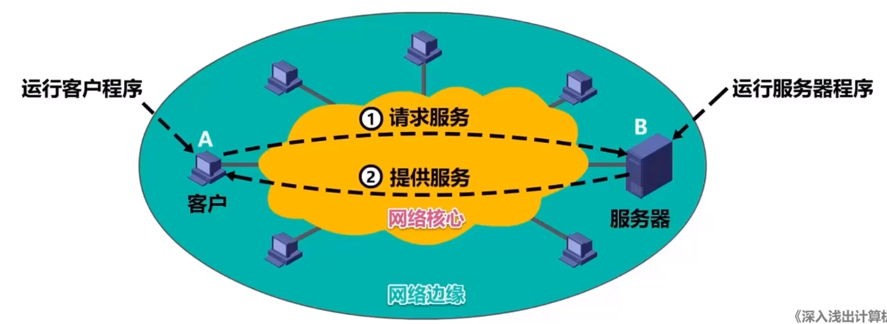

# 客户/服务器方式和对等方式

网络应用程序运行在处于网络边缘的不同的端系统上，通过彼此间的通信来共同完成某项任务。因此，开发移种新的网络应用首先要考虑的就是**网络应用程序在各种端系统上的组织方式和他们之间的关系**

目前流行的主要方式有两种
-   客户/服务器(Client/Server, C/S)方式
-   对等(Peer-toPeer, P2P) 方式

## 客户服务器方式
客户和服务器指通信证所涉及的两个应用进程。客户/服务器方式所描述的是进程之间服务和被服务的关系

在C/S方式：
-   客户和服务器指通信中所涉及的两个应用进程
-   C/S方式所描述的是进程之间服务于被服务的关系
-   **客户是服务请求方，服务器是服务提供方**
-   **服务器总是处于运行状态，并等待客户的服务请求**。服务器有固定端口号，而运行服务器的主机页具有固定的IP地址

C/S方式是因特网上传统的也是最成熟的方式，包括万维网WWW、电子邮件、文件传输FTP这些熟悉的网络应用都是C/S方式

基于C/S方式的应用服务通常是**服务集中型**，即应用服务集中在网络中币客户计算机少得多的服务器计算机上
-   因为一台服务器计算机要服务多个客户计算机，**常会出现服务器计算机跟不上众多客户机请求的情况**
-   为此，常用**计算机群集（或服务器场）** 构建一个强大的**虚拟服务器**

## 对等方式
在P2P方式中，**没有固定的服务请求者和服务提供者**，分布在网络边缘各断系统中的应用进程是对等的，被称为**对等方**。**对等方之间直接通信**。

目前在因特网上流行的P2P应用主要包括P2P文件共享，即时通讯，P2P流媒体，分布式存储等

基于P2P的应用是**服务分散型**的，因为服务不是集中在几个服务器计算机，而是分散在大量对等计算机中

<u>最突出的特性之一</u>是**可拓展性**，因为系统没增加一个对等放，不仅增加请求者，也增加提供者，**系统性能不会因为规模增大而降低**

P2P方式**具有成本上的优势**，它通常不需要庞大的服务器设施和服务器带宽

