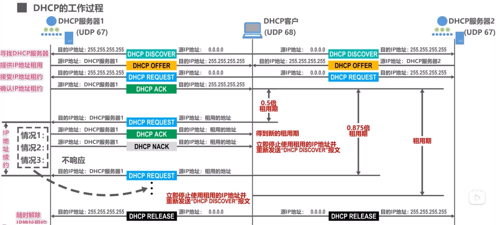

# 动态主机配置协议DHCP

## DHCP作用
使用TCP/IP协议栈的主机，需要配置相关的网络参数，才能与因特网上的主机进行通信，参数一般包括：
-   IP地址
-   子网掩码
-   默认网管IP地址
-   域名服务器IP地址

在网络中添加一台DHCP服务器，在服务器中设置好可微网络中其他各主机配置的网络参数。网络中各主机开机后自动启动DHCP程序，向DHCP服务器请求自己的网络配置参数。

**懂爱主机配置协议DHCP**可为计算机自动配置网络参数，使得计算机**即插即联网**

DHCP目前是英特网草案标准[RFC 2131, RFC 2132]

## DHCP工作过程
DHCP服务器使用C/S方式，其上运行DHCP服务器进程，用户主机运行DHCP客户协议

DHCP使用运输层的UDP提供的服务
-   服务器使得UDP端口号 $67$
-   客户使得UDP端口号 $68$

**具体过程**

假设有两台DHCP服务器，和一台DHCP客户机
-   客户将**广播**发送**DHCP发现报文**
    -   封装该报文的**源IP地址为`0.0.0.0`**
        **目的IP地址为`255.255.255.255`的广播地址**
    -   普通客户部监听该端口号报文，所以直接丢弃；服务器则接收该报文
    -   DHCP报文格式比较复杂，但对于此过程，**只需要知道发现报文封装有事务ID和DHCP客户端MAC地址**
-   服务器收到DHCP发现报文后，根据其中封装的MAC地址查找自己的数据库，看是否有针对该MAC地址的配置信息
    -   如果有，则使用这些信息来构建**DHCP提供报文**
    -   如果无，则采用默认配置信息来构建并发送DHCP提供报文
    -   封装DHCP提供报文的IP数据报**源地址为服务器IP地址**
        目的地址仍为广播地址
    -   对于服务器，其应用层没有监听端口号为 $68$ 的进程，直接丢弃；
        对于客户，根据报文的**事务ID**确认其是否是自己所请求的报文，只有**事务ID相同**，才会接收该报文。
    -   DHCP服务报文还封装有配置信息
    -   DHCP服务器从自己的IP池中挑选待租用给主机的IP地址时，使用ARP来确保所选择的IP地址未被网络其他主机占用
    -   是客户收到**多个服务器的提供报文**，一般选择先到的那个
-   DHCP客户向所选择的服务器发送**DHCP请求报文**
    -   该报文的**源地址仍为`0.0.0.0`**，因为其要征得该服务器同意，才能使用租用IP
        **目的地址仍为广播地址**，这样除了给选择的服务器请求外，还拒绝了其他服务器
    -   此报文包含事务ID，客户端MAC地址，接受租约的IP地址，提供租约的服务器IP地址等
    -   提供该租约的服务器收到请求报文后，给客户发送**DHCP确认报文**
        -   该报文**源IP地址为该服务器IP**
            **目的地址为广播地址**
-   客户收到确认报文后，就可以使用该IP了
    -   在使用IP之前，主机会使用ARP检测该IP地址是否被网络中其他主机占用。**若被占用**，客户会给服务器发送**DHCP谢绝报文**，并重新发送发现报文
-   **当IP地址租用期超过一半**，客户会想服务器发送DHCP请求报文来请求更新租用期
    -   此时报文的源地址改为租用IP，目的地址为服务器
-   服务器收到续租的DHCP请求报文，分为三种情况处理
    -   服务器同意续租，给客户发送确认报文
    -   服务器不同意续租，给客户发送**DHCP否认报文**，客户需要立刻停止使用该IP，并重新发送发现报文申请IP地址
    -   服务器未响应，在租用期过 $87.5\%$，客户必须重新发送请求报文
        在租用期到期，客户必须停止使用IP，并重新发送发现报文申请IP地址
-   DHCP客户可以随时提前终止租用期，这时只需要发送**DHCP释放报文**
    -   该报文**源地址`0.0.0.0`**，**目的地址为广播地址**

