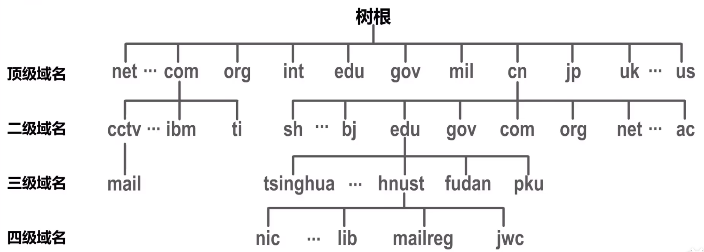

# 域名系统DNS
## 域名系统的作用
用户只要在主机中运行某个浏览器软件，在其地址栏中输入要访问的网站服务器域名，即可访问该网站

用户通过浏览器访问某域名时
-   主机会现在自己的DNS缓存查找对应IP地址
-   如果没有找到，会向因特网中某台DNS服务器查询
-   DNS服务器中有域名和IP地址映射关系数据库
-   用户主机收到服务器发来的查询结果，便课通过域名背后的IP地址访问网站了

因特网不可能只有一台DNS服务器。早在1983年，因特网就开始采用**层次结构的命名树**作为主机的名字（即域名），并使用分布式的**域名系统**。域名系统DNS使大多数域名都在本地解析，仅少量解析需要再因特网上通信，因此系统效率更高。又因为分布式系统，即使单个服务器骨折，也不妨碍系统运行。

## 因特网域名结构
因特网采用**层次树状结构的域名系统**

域名结构由若干个分量组成，各分量之间用`.`隔开，分别代表不同级别的域名
-   每一级域名都有英文字母和数字组成，不超过 $63$ 个字符，不区分大小写
-   级别最低的域名卸载最左边
-   完整的域名不超过 $255$ 个字符

域名系统既不规定一个域名需要包含多个下级域名，也不规定每一级域名代表的意思

各级域名由其上一级域名管理机构管理，最高的顶级域名则有因特网名称与数字分配机构ICANN进行管理

**顶级域名**分为三类
-   **国家顶级域名nTLD**，采用ISO 3166规定，如cn表示中国，us表示每个，uk表示英国等
-   **通用顶级域名gTLD**
    常见统一顶级域名有七个：com（公司企业），net（网络服务机构），org（非营利组织），int（国际组织），edu（美国教育机构），gov（美国政府部门），mil（美国军事部门）
-   **反向域arpa**，即IP地址反向解析为域名

在**国家顶级域名下注册的二级域名均由该国家自行确定**

**我国将二级域名**划分为一下两类
-   **类别域名**：七个
    -   ac 科研机构
    -   com 工商金融等企业
    -   edu 教育机构
    -   gov 政府部门
    -   net 提供网络服务的机构
    -   mil 军事机构
    -   org 非营利组织
-   **行政区域名**：共 $34$ 个

**域名知识个逻辑概念，不代表计算机所在物理地点**

## 因特网上的域名服务器