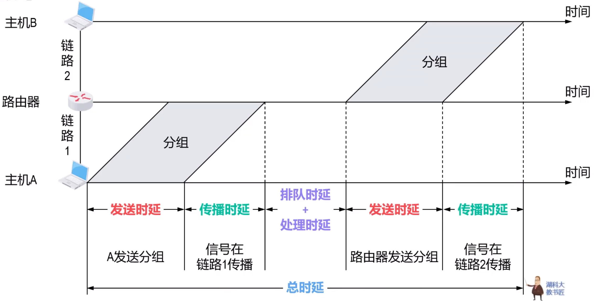
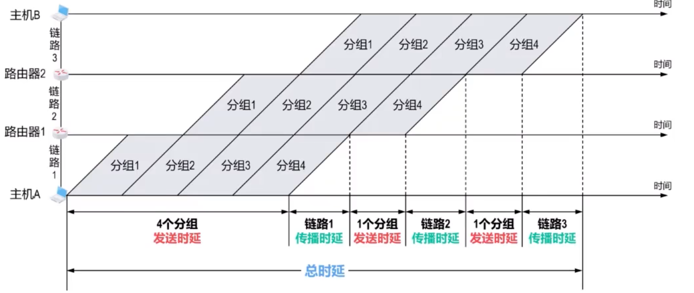
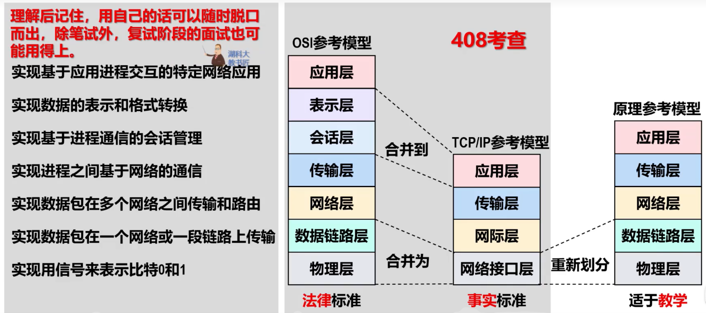
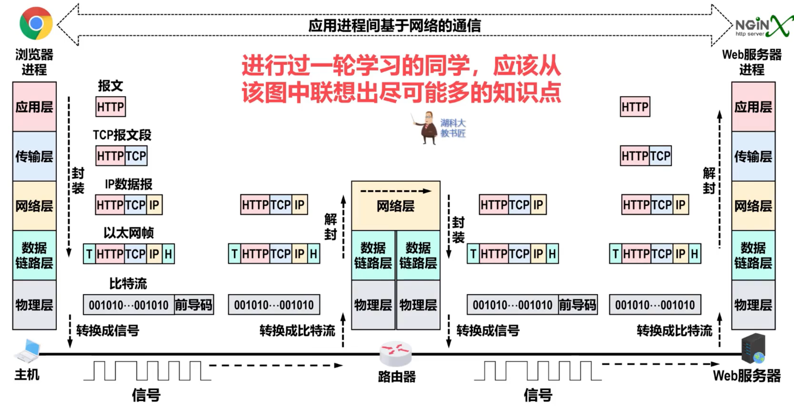
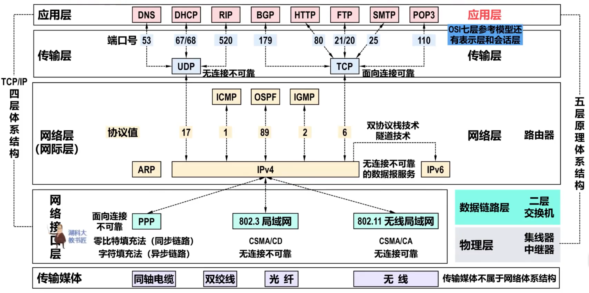
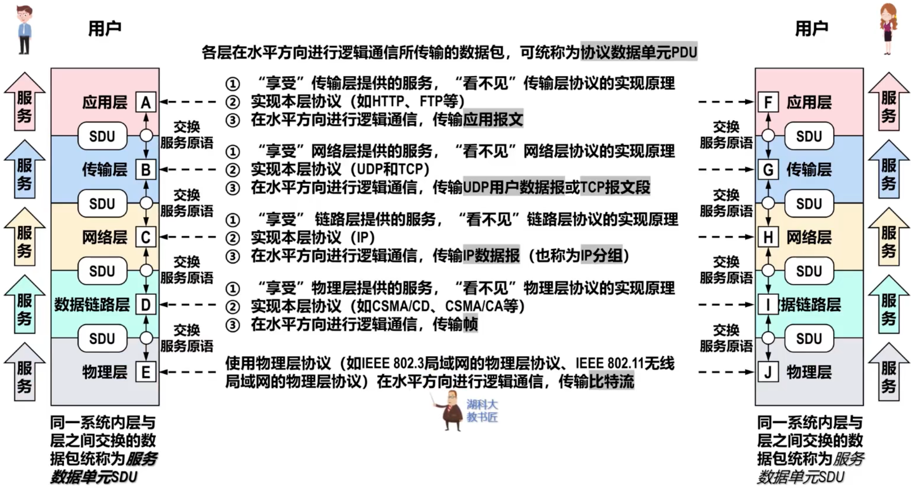

# 计算机网络概述

## 计算机网络基本概念

### 计算机网络的定义
**一般定义**：计算机网络是通过**通信链路**和**网络设备**，将分散在不同地理位置的**独立计算机系统**互联起来，遵循统一的**通信协议**，实现**数据交换，资源共享，协同工作**等功能的复杂系统

### 计算机网络的组成

#### 硬件
主机、链路（有限链路和无线链路）、网络设备（如交换机，路由器等）

主机和网络设备可统称节点

从硬件角度看，计算机网络是由若干节点和连接这些节点的链路组成的

#### 协议
是控制网络通信的规则集合

#### 软件
由**网络操作系统**和**应用软件**两部分组成

网络操作系统提供网络管理功能

### 因特网结构
#### 边缘部分
由各种用户设备组成，这些用户设备被称为**主机**，为用户提供各式各样的网络应用

#### 核心部分
由**大量异构型网络**和连接这些网络的**路由器**构成

因特网的核心部分为其边缘部分提供**连通性**和**数据交换**等服务

### 计算机网络的功能
-   数据功能（基础功能）
-   资源共享
    共享**硬件**，**软件**以及**数据**资源
-   分布式处理
-   其他：
    可靠保障，安全防护，负载均衡与流量优化，远程管理与监控，标准化互操性

### 计算机网络的分类
-   覆盖范围（广域网 $\sim$ 个域网）
-   使用者
    -   公用网
    -   专业网
-   交换方式
    -   电路交换
    -   分组交换
    -   报文交换
-   网络拓扑
    -   总线型
    -   星型
    -   环型
    -   网状型
-   传输介质
    -   有线
    -   无线
-   传输技术
    -   点对点
    -   广播

### **$\star\star\star$三种交换方式**
**重点注意分组交换的时延计算**

#### 电路交换
**步骤**
建立连接 - 通信 - 释放连接

**优点**
传输时延小，带宽独占，实时性强，有序传输，控制简单，适合长时间通信

**缺点**
建立连接耗时长，通信资源利用率低，故障敏感，灵活性差，**不提供误码检测**

#### 分组交换
**源主机**将待发送的整块数据划分为若干等长数据段，再添加首部构造分组，然后发送到分组交换网

**交换节点**收到并缓存分组，从首部提取目的地址，再根据自己的**转发表**找到接口转发，最终转发到目的主机

**目的主机**收到全部分组，根据首部控制信息还原报文

**优点**
无序建立和师范连接，通信链路利用率高，网络生存性好，错误控制优化，流水线传输

**缺点**
额外的传输开销，存储转发时延，无法确保通信时端到端通信资源全可用，存在分组失序和丢失问题

#### 报文交换
是分组交换的前身，报文被整个的发送，而不拆开为分组

**与分组交换相比**
传输时延更长，需要交换节点有更大缓存容量，重传数据量打

### **$\star$计算机网络性能指标**

#### 速率
指数据传送速率

$bps$ 比特/秒，$B/s$ 字节/秒

ps和/s意义相同

**除特殊说明**
-   **数据单位**以 $2^{10}$ 转换
-   **速率单位**以 $10^3$ 转换

#### 带宽
表示**某信道传输数据的能力**，单位是速率单位

**数据传输速率** = $\min$ (**主机接口速率**, **信道带宽**, **网络设备接口速率**)

#### 吞吐量
单位时间内通过某个网络、信道接口的实际数据量

#### 时延
指数据从网络的一段到另一端所耗费的总时间，也称为延时或延迟

对于发送 $m$ 个分组，经过 $n$ 个路由器转发：
$总时延 = 1个分组发送时延 \times (m+n) + 1段链路传播时延 \times (n+1)$

##### 发送时延
$发送时延 = \dfrac{分组长度(b)}{数据传输速率(b/s)}$

##### 传播时延
$传播时延 = \dfrac{链路长度(m)}{电磁波在介质上传播速率(m/s)}$

**电磁波传播速率**
自由空间 $3 \times 10^8 m/s$
铜线电缆 $2.3 \times 10^8 m/s$
光纤 $2 \times 10^8 m/s$

##### 排队时延
分组在路由器的输入队列和输出队列中排队缓冲所好粉的事件

无法用一个简单的公式计算

##### 处理时延
路由器从自己的输入队列冲取出排队缓存等待处理的分组后，会进行一系列处理，这些工作所耗费的时间就是处理时延

无法用一个简单的公式计算

#### 时延带宽积
传播时延和带宽的乘积，表示链路可以容纳多少bit，也称为以bit为单位的链路长度

$时延带宽积 = 传播时延(s) \times 带宽(b/s)$

#### 往返时间RTT
是指从发送端发送完数据开始，到发送端收到接收端发来的相应确认分组位置，所耗费的时间（不包含接收确认分组的时间）

#### 利用率

##### 信道利用率
信道有百分之几的时间是有数据通过的

$信道利用率 = \dfrac{一次交互信道有数据通过的时间}{一次交互的总时间}$

完全空闲的信道利用率为 $0$

##### 网络利用率
网络所有信道利用率的加权平均

$D$ 表示网络当前时延，$D_0$ 表示空闲时延，$U$ 为信道利用率

$D = \dfrac{D_0}{1-U}$

## 计算机网络体系结构

### **$\star \star \star$常见三种网络体系结构**

#### OSI参考模型

#### TCP/IP参考模型

#### 原理参考模型

### 数据包按网络体系结构逐层封装和解封

#### 重要设备和其所在层级
-   集线器Hub - 物理层
-   交换机Switch - 数据链路层
-   路由器 - 网络层

#### 各层级一些要点
**物理层**只负责bit与信号之间的交换，**并不参与数据包的封装和解封**

在不考虑网络地址转换NAT的情况，**IP数据报整个传输过程，源IP地址和目的IP地址都保持不变**

IP数据报从路由器转发时，首部中的某些字段值一定/可能被路由器重新设置

以太网帧的整个传输过程中，**其首部中的源MAC地址和目的MAC地址逐网络改变**

### 专业术语和基本概念

#### 实体
实体是任何可以发送或接收信息的硬件或软件进程

#### 对等实体
是指通信双方**相同层次**中的实体

#### 协议
协商一控制**两个对等实体**在“水平方向”进行“逻辑通信”的规则集合

##### 协议三要素
###### 语法
定义通信双方所交换信息的格式

###### 语义
定义通信双方所要完成的操作

###### 同步
定义通信双方的时序关系

##### 协议数据单元PDU
对等实体在水平方向进行逻辑通信所交互的数据包

-   应用层PDU
    -   应用层报文
-   传输层PDU
    -   TCP报文段
    -   UDP报文段
-   网络层PDU
    -   IP数据报
    -   IP分组
-   数据链路层PDU
    -   帧
-   物理层PDU
    -   比特流

#### 服务
在协议的控制下，两个对等实体在水平方向的逻辑通信使得**本层能向上一层提供服务**

实体能看到下层提供的五福，但是下层协议对上层实体是透明的

##### 服务访问点SAP
相邻两层实体交换信息的逻辑接口称为服务访问点

-   数据立案查处的为帧的**类型字段**
-   网络层的为IP数据报的**协议字段**
-   传输层的为**端口号字段**

######

##### 服务原语
上层使用下层提供的服务，必须通过下层交换一些命令，这些命令为**服务原语**

###### 请求原语
服务用户 $\to$ 服务提供者，请求完成某项任务

###### 指示原语
服务用户 $\leftarrow$ 服务提供者，指示服务客户执行某项任务

###### 响应原语
服务用户 $\to$ 服务提供者，作为对服务提供者所发送指示的响应

###### 证实原语
服务用户 $\leftarrow$ 服务提供者，作为服务用户所发送请求的证实

##### 服务数据单元SDU
**同一系统**内**层与层之间**交换的数据包

##### SDU与PDU关系
多个SDU可以合成为一个PDU
> 如TCP可有将应用层交付的哼多个很短的应用报文（SDU），封装成一个TCP报文段（PDU）

一个SDU也可以划分成几个PDU
> 网际层的某个较大IP数据报SDU长度超过数据链路层限制，网际层会将其划分为几个较小的SDU

