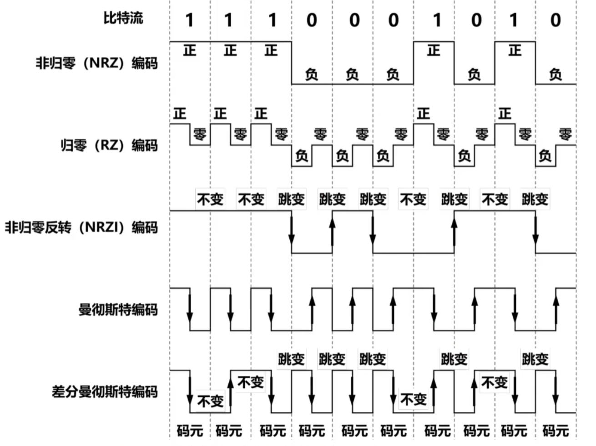
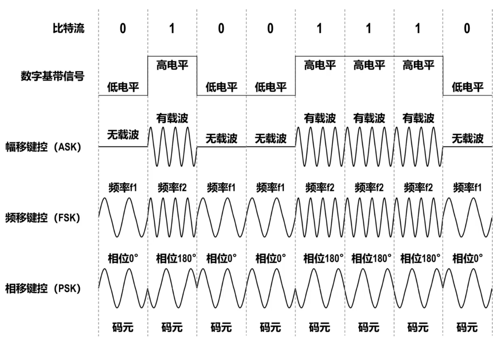
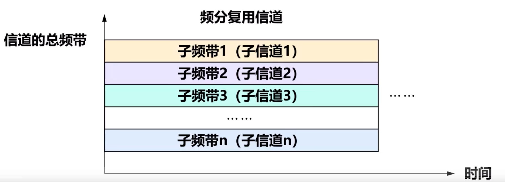

# 物理层

## 概述

### 物理层要实现的功能
在各种传输媒体上传输bit0和bit1，进而给其上面的数据链路层提供透明传输bit留的服务

### 物理层的接口特性
> 曾考 $2$ 次
物理层定义了与传输媒体的接口有关的一些特性

#### 机械特性
规定了接口（如RJ45接口）所用接线器的性质和物理尺寸

#### 电气特性
规定了在接口点来的各条线上传输bit流时，信号电压的范围、阻抗匹配情况以及传输速率和距离限制等
> 或许可以理解为“物理”特性

#### 功能特性
规定了接口电缆的**各条信号线上出现的某一电平电压的意义**以及**每条信号线的功能**

#### 过程特性
又称**规程特性**，规定了在信号线上进行bit流传输的一组操作过程，包括各信号间的时序关系

## 物理层下的传输媒体
传输媒体是计算机网络中**各设备之间的物理通路**，也称**传输介质**或**传输媒介**

**传输媒体并不在计网体系结构中**

分为以下两类

### 导向型传输媒体
> 考频较低，仅 $1$ 次

#### 同轴电缆

#####

#### 双绞线
把两根互相绝缘的铜导线按一定密度互相绞合起来就构成了双绞线，绞合有两个作用
减少向量导线间的电磁干扰；抵御部分来自外界的电磁干扰

**双绞线电缆**：将多队双绞线一起包在一个绝缘保护套内

#### 光纤

##### 单模光纤
光纤的直接减小到只有一个光的波长，使得广播一直向前传播，不会产生多次反射，不会出现**脉冲展宽**。适合**长距离传输**并且**衰减更小**。

发送端必须使用昂贵的半导体激光器，接收端必须使用昂贵的激光检波器

##### 多模光纤
可以有入射角大于临界角的多条不同入射角的光波，在同一条光纤中传输。会发生**脉冲展宽**，只适合近距离传输。

发送端可以使用比较便宜的发光二极管，接收端可以使用比较便宜的光电二极管

##### 主要优点
-   通信容量非常大
-   抗雷电和电磁干扰性能好
-   传输损耗小，中继距离长
-   无串音干扰，保密性好
-   体系小，重量轻

##### 主要缺点
对光纤的切割需要专用设备，并且目前光电接口还比较昂贵

### 非导向型传输媒体
也就是各种电磁波

-   无线电波
-   微波
-   红外线、激光、可见光

## 数据通信基础

### 数据通信系统的基本模型

一个**数据通信系统**可以划分为源系统，传输系统和目的系统三大部分
#### 源系统
##### 信源
产生要传输的数据

##### 发送器
将信源生成的数字基带信号进行调制/编码。这样信号才能在传输系统进行传输

#### 传输系统
位于源系统和目的系统之间，可以是简单的传输线（如光纤），也可以是复杂网络系统（如ISP光纤骨干网）

#### 目的系统

##### 接收器
接受传输系统传送来的信号，并将其转换成信宿所能识别的数字基带信号

##### 信宿
从接受器获取传送来的数字基带信号，然后输出响应信息

### 信道的概念

**信道与传输媒体并不等同**

传输媒体的传输数据时使用的**物理媒介**

信道是传输媒体中划分出的**逻辑或物理的通信通道**。信道一般都是用来想某一个方向传送信息。因此<u>一条传输媒体往往包含一条**发送信道**和一条**接收信道**</u>

### 通信双方交互的基本方式

#### 单向通信(单工通信)
只有一个方向的通信

#### 双向交替通信（半双工通信）
通信双方都可以发送和接收信息，但对任何一方，发送和接收不能同时进行

#### 双向同时通信（全双工通信）
通信双方都可以同时发送信息和接收信息

****
单向通信只需要一条信道

而双向通信**都需要**两条信道

### **$\star\star\star$ 编码与调制**
> 与下一节非常常考，共 $9$ 次第 $34$ 题

#### 基本概念

##### 消息
在计网中，需要由计算机处理和传输的文字、图片、音频和视频等内容，可统称为消息

##### 数据
消息输入计算机后，就成为了有意义的符号序列，即数据

可将数据看早运送消息的实体

##### 信号
计算机中的网卡将bit0和bit1变换为相应的信号发送到传输媒体

可将信号看作数据的电磁表现

##### 基带信号
由信源发出的原始信号称为**基带信号**，也就是基本频带信号

基带信号网文包含较多的低频成分，甚至包含直流成分，而需要信道不能传输这类分量。<u>因此需要对基带信号进行调制后才能在信道上传输</u>

##### 调制与编码
-   **基带调制**：对数字基带信号的波形进行变化
    调制后仍然是数字基带信号，也称为**编码**
-   **带通调制**：将数字基带信号的频率范围搬移到教导的频段
    并转化为模拟信号，简称为**调制**

##### 码元
使用时间域的波形表示信号时，代表不同离散数值的基本波形

一个码元能表示的信息量取决于**编码方法**或**调制方法**

#### 常用编码方法
> 曾考 $3$ 次

##### 非归零NRZ编码
信号在每个码元期间不会回归到零电平

编码效率最高，但是**存在收发双方同步问题**

##### 归零RZ编码
每个码元期间会回归到零电平

相当于时钟信号编码在了数据之内

每个码元周期需要两次电平跳表，与NRZ相比，在相同数据速率下需要更大的频谱带宽（约为 $2$ 倍）

##### 非归零反转NRZI编码
电平保持不变表示bit1，电平的跳变表示bit0

继承了NRZ编码的高效，还借鉴了RZ编码的同步机制

**局限性**：若bit流包含连续多个bit1，电平不变会导致同步问题，需要采用位填充或扰码
> 如 $6$ 个bit1插入一个bit0

##### 曼切斯特编码
在每个码元中间时刻电平发生跳表。电平的跳变既表示时钟信号，也表示数据。属于**自同步信号**

有两种标准：
**G.E. Thomas 标准**：高 $\to$ 低表示bit1
**IEEE 802.3 以太网标准**：高 $\to$ 低表示bit0

$10Mb/s$ 传统以太网采用的就是曼切斯特编码

**注意**
如果将一个周期看作一个码元，则波特率 $=$ 比特率

如果将一个周期视作两个码元，则波特率 $= 2 \times$ 比特率

##### 差分曼切斯特编码
在每个码元的中间时刻都会发生跳变，但是其跳变仅表示时钟信号，而不表示数据。

数据表示在每一个码元的开始处师范有跳变：**无跳变为bit1，有跳变为bit0**

相比曼切斯特编码**优势**：抗极性反转；更强的抗干扰能力

#### 基本带通调制方法和混合调制

##### 基本带通调制方法
基本带通调制展示：

-   幅移键控ASK：振幅
-   频移键控FSK：频率
-   相移键控PSK：相位

上述方法为将数字基带信号转换成模拟信号

如果将模拟信号转换为另一中模拟信号，则称幅度调制，频率调制和相位调制（调幅，调频，调相）
> 若仅使用一直方法，让一个码元表示多个bit信息，则称多进制调制
  如取 $\{0^\circ, 90^\circ, 180^\circ, 270^\circ\}$ 四个相位，每个码元就能表示两bit信息

##### 混合调制方法
**基本**带通调制方法只能表示 $2$ bit

为了提高数据传输速率，可以使用更复杂的混合调制方法，条指出多种不同的码元，使得一个码元可以表示多个bit信息

###### **正交振幅调制-16**
每个码元可以表示 $\log_2 16 = 4$ bit信息

采用**格雷码**进行映射，目的是将噪声导致的码元错误**降至1bit错误**，这样还能简化纠错码（如海明码）设计

### **$\star\star\star$信道极限容量**
> 往往和上一节一起考，超常考

任何实际的信道都不是理想的，都会收到带宽限制和噪声干扰，因此信号在信道上传输不可避免地会产生失真

#### 产生失真主要原因
-   码元传输速率：越高越严重
-   信号传播距离：越远越严重
-   噪声干扰：越大越严重
-   传输媒体质量：越大越严重

#### **奈氏准则**
> 曾考四次
每种信道所能通过的频率范围总是有限的

**模拟信号在模拟信道中传输**，受信道频率带宽的限制

**数字信号在数字信道中传输**，高频部分可能因信道带宽限制而无法通过信道，此时发生马建串扰

信道的频段越宽，能够通过的信号高频分量越多，码元传输速率就可以更高，而不会发生马建串扰

**奈氏准则（奈奎斯特定理）**$$ 理想低通信道的最高码元传输速率 = 2W Baud $$

**理想**指无噪声；$W$ 是理想**频率带宽**，单位 $Hz$；Baud是波特，码元传输速率单位，码元 $/s$

**码元传输速率和bit传输速率不同**

#### **香农公式**
> 曾考 $2$ 次

奈氏准则给出了码元传输速率的上限，为了让信道在单位时间传输更多bit，需要**使每个码元可以表示更多bit**

但是bit率不能无限制提高，因为噪声存在且随机产生，会影响码元的识别

1948年香农根据信息论理论推导出频率带宽首先且有高斯白噪声干扰的信道极限信息传输速率，即**香农公式**：$$ C = W \cdot \log_2(1 + \dfrac{S}{N})(b/s) $$

$C$：bit率|$b/s$

$W$：高斯噪声功率

$\dfrac{S}{N}$：信噪比，常用dB表示

**信噪比dB $= 10 \log_{10}(\dfrac{S}{N}) (dB)$**

只要信息传输速率低于香农公式的极限信息传输速率，就存在某种方法实现无差错传输

实际信道能达到的信息传输速率，比香农公式极限要低不少，因为一些其他损耗损伤

### 信道复用技术
> 曾考 $3$ 次，均为码分多址CDMA

信道复用指通过某种方式将多路独立的信号合并到同一物理信道中进行传输

目的是提高信道利用率，降低通信成本

在发送端使用一个复用器，接受藕断使用一个分用器

#### 频分复用FDM
将信道划分出多个子频带，每个子频带作为一个通信子信道

频分复用的多路信号在**同一时间**占用**同一信道**的**不同频带资源**

**频分多址接入FDMA**：简称频分多址，让多个用户（可处于不同地点）共享信道资源。例如每个用户使用一个子频带，或更多用户轮流使用这些频带

#### 时分复用TDM
将时间划分成一段段等长的**时隙**，每一路信号再起相应的时隙内独占信道的全部资源进行通信

时分复用的多路信道在**不同时间**占用**同意信道**的**全部资源**

各路信号占用的时隙，就构成了**时分复用帧（TDM帧）**。每一路信号在每一个TDM帧占用固定序号的时隙
> 每个帧包含一轮所有时隙

每一路信号所占用的时隙周期性出现，周期为TDM帧长度

**时分多址接入TDMA**：简称时分多址，可以让多个用户（可处于不同地点）共享信道资源

因为计算机数据的突发性，每个用户对分配到的TDM帧的利用率并不高，导致时分复用后的信道利用率不高

#### 波分复用WDM
实际上是**光的频分复用**，可在一根光纤上同时传输多个频率相近的光载波信号

#### **码分复用CDM**
通过多路信号分配不同且正交的码片序列，使多路信号可以在相同频段和时间上叠加传输，实现信道复用

CDM既**共享信道频率**，又**共享时间**

**码分多址接入CDMA**：简称码分多址。CDMA的每个用户可以在同一时间使用同意频带进行通信

有很强的抗干扰能力

**基本实现原理**：
##### 码片序列和码片向量
CDMA将每个bit时间划分为 $m$ 个更短的时间片，称为码片。CDMA的**每个站**都被指派一个**唯一的 $m$ bit码片序列
> $m$ 实际去 $64/128$，考试可能只取 $8$ 甚至 $4$

当某个站要**发送bit1**时，就发送指派给该站的码片序列
当某个站要**发送bit0**时，就发送指派给该站的码片序列**的反码**

为了方便计算，将 $1$ 记为 $+1$，$0$ 记为 $-1$

##### 码片序列的挑选规则
如果有两个活多个站点同时发送数据，则信道中的信号就是这些站各自所发送的信号的叠加

为了能够判断叠加信号师范包含目标信号，以及目标信号的比特流，给各个站挑选码片序列是吗，需要遵循以下规则

系统中**各站的码片序列必须各不相同**

系统中**任意两个站的码片序列必须互相正交**，也就是码片向量规格化内积为 $0$
$$ X \cdot Y = \frac{1}{m} \sum_{i=1}^m X_i Y_i = 0 $$

还可以得到其他三个式子
$X \cdot \bar Y = 0$
$X \cdot X = 1$
$X \cdot \bar X = -1$

##### 从叠加信号中提取信号
**叠加不影响信号获取**

系统会用站点码片向量与收到的信号做内积运算：
如 $$ A \cdot(A + \bar B) = AA + A\bar B = 1 + 0 = 1 $$，说明有 $A$ 站发送bit1

> 信道不是只能发送1或0，实际用不同电平代表不同的值
> 比如 $A$ 的码片向量为 $\{1,1,1,1\}$，$B$ 的码片向量为 $\{1,-1,1,-1\}$，叠加后为 $\{2,0,2,0\}$ 是可以直接发送的，使用此例也可以说明上面内积的运算