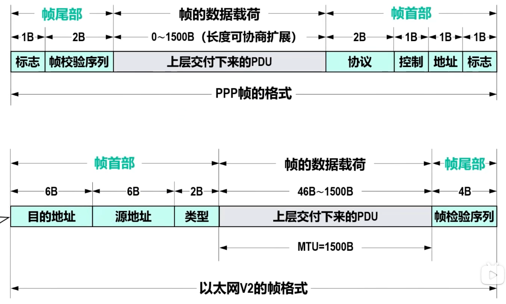
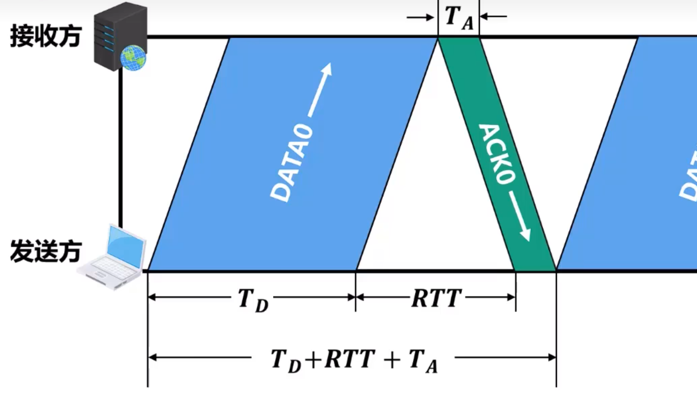
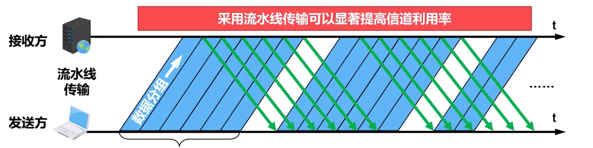
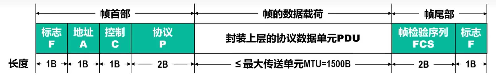
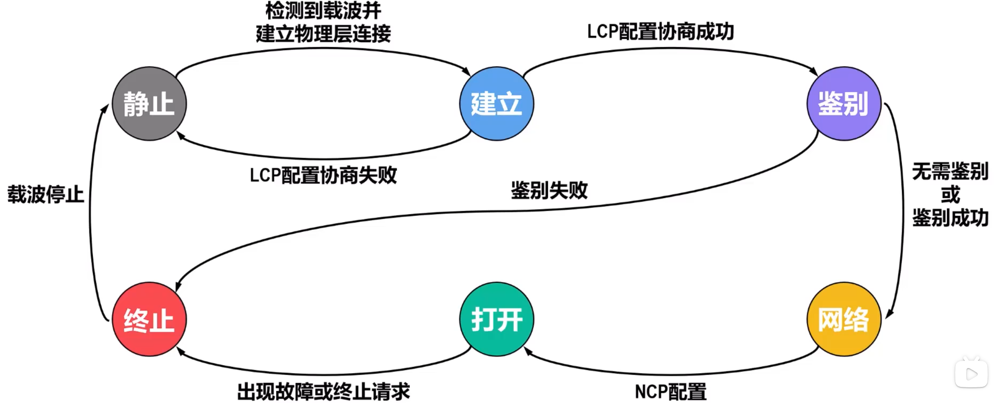
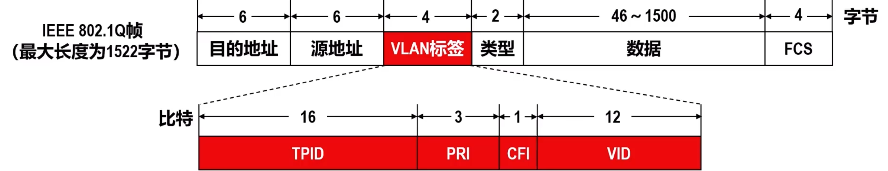
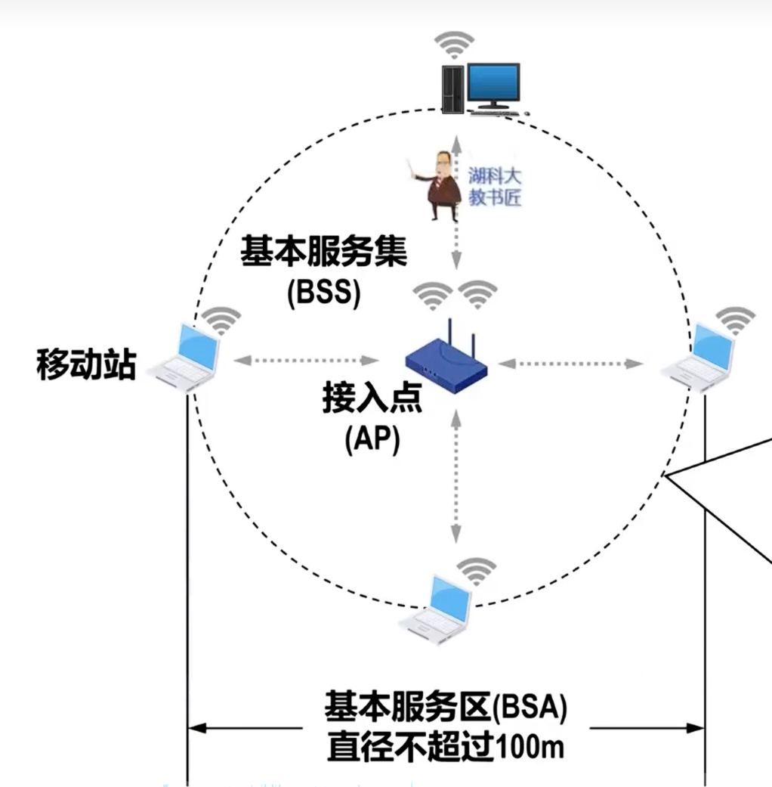
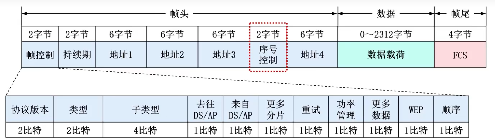
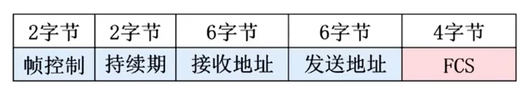
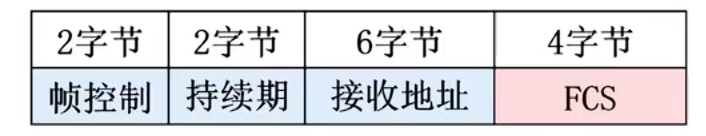

# 数据链路层

## 概述

### 数据链路层要实现的功能
**在一段链路或一个网络中**（不是多个网络间）**传输帧**，进而给其上面的网络层提供透明传输帧的服务

### 链路
指从一个节点到相邻节点的**一段物理线路**（有线或无线），**中间没有任何其他交换节点**

### 数据链路
数据链路是基于链路的。

当在一条链路传输数据，除需要**链路**本身，还需要一些必要的**通信协议**来控制这些数据的传输，把**实现这些协议的硬件和软件加到链路上**，就构成了数据链路

计算机的网络适配器（网卡）和其相应软件驱动程序就实现了这些协议，一般的网卡都包含了**物理层**和**数据链路层**两层功能

### 帧
帧是**数据链路对等实体之间**在水平方向进行逻辑通信的协议数据单元PDU

## 数据链路层的三个重要问题

封装成帧，透明传输，差错检测

随着802.11无线局域网普及，可靠传输也成了重要问题，于是此处将前两者合并

### 封装成帧和透明传输

#### 封装成帧
指给放两次交付下来的PDU添加一个首部和尾部，使之称为数据链路层的PDU

接收方的数据链路层收到物理层交付的bit流后，进行如下处理：
根据帧首部中的**帧开始符**和帧尾部中的**帧结束**符，从收到的比特流中识别除帧的开始和结束，也就是进行**帧定界**
根据帧尾部**帧检验序列FCS**的值，检测帧在传输过程中是否出现**误码**
根据帧首部中的**目的地址**决定是否接收该帧

<u>为了提高数据链路层传输帧的效率</u>，应是帧的数据在和长度尽可能大于首部和尾部的长度

各种数据链路层协议都对**帧格式**（首部，数据在和、尾部）有明确定义，属于网络协议三要素的语法所规定的内容，下为两种常用帧格式：

**最大传送单元MTU**：每一种数据链路层协议都规定了**数据载荷**的长度上限，如以太网MTU为 $1500$ 字节

#### 透明传输
> 曾出现一次，且是已经删除的HDLC

当数据载荷中包含**帧定界符FCS**，会造成接收方出现**帧定界错误**，如果上层主动规避FCS，会产生限制

如果采取措施，使得数据链路层对商城交付下来的PDU内容没有任何限制，就好像数据链路层不存在一样，就称为**透明传输**

##### 字节（字符）填充
使用**面向字节**的物理链路时，使用**字节填充**的方法实现透明传输。
> 面向字节值数据以字节（8bit）为基本单位进行传输和处理

**发送方**数据链路层在数据载荷中的帧定界符或转义字符前插入一个**转义字符ESC**（十六进制编码`1B`）

**接收方**将帧的载荷向上交付前，删除插入的转义字符ESC

##### 比特填充
使用**面向比特**的物理链路时，使用**比特填充**的方法实现透明传输
> 面向bit值将数据以bit为基本代为进行传输和处理

*假设某数据链路层协议采用 $8$ bit构成的特定比特串`0111 1110`作为帧定界符*

**发送方**数据链路层扫描数据在和，在出现的**每五个连续的bit1后，插入一个bit0**

**接收方**将帧的载荷向上交付前，扫描载荷，每遇到五个连续bit1，就把后面一个bit0删除

##### 以太网帧
以太网帧首位没有帧定界符，因此不存在透明传输bit流问题

**物理层会在以太网帧前面添加8B前导码**，前导码构成：
**前同步码**：$7B$，作用是使接收方时钟同步
**帧开始符**：$1B$：位于前同步码后，表明其后紧跟以太网帧

且**以太网**规定了**帧间间隔**时间为 $96$bit时间，因此**以太网不需要帧结束符**

### 差错检测
**校验码**用于差错检验

#### 校验码基本概念
> 曾考一次

##### 校验码和数据校验流程
**校验码**是具有**检测出误码（甚至纠正误码）**能力的**数据编码**。

**基本原理**：
-   **基于原始数据**，根据某种编码规则产生**校验数据**，校验数据是冗余信息，属于额外开销
-   原始数据和校验数据组成脚丫那么
-   若校验码某些为产生误码，此时的校验码就违反了原本的编码规则，从而使得误码可以检测出来
    > 原始数据误码也会导致和产生的校验码和原本不同

###### 
##### 码距
两个长度相同的编码之间，对应二进制不然的数量

也称为海明距离

##### 校验码编码集的码距
对于某种校验码，其编码集中任意两个编码之间都存在码距，其中<u>最小</u>的就是该**编码集的码距**

**码距为 $1$ 的编码集不具备检测误码的能力**

码距 $d$，检错 $e$，纠错 $t$ 的关系|检错/纠错能力
:-:|:-:
$d \ge e+1$ | 可检测 $e$ 个误码
$d \ge 2t + 1$ | 可纠正 $t$ 个误码
$d \ge e + t + 1$ 且 $e \ge t$ | 可检测 $e$ 个误码并纠正 $t$ 个误码

> 此表，纠错上其实没有区别，只是在纠错的同时，检测的误码 $e' = e-t$

#### 奇偶校验
奇偶教育的编码规则是**给原始数据添加 $1$ 个校验位形成校验码**，使得**校验码中bit1数量为奇数（或偶数）**
> 奇校验码为奇数，用于奇校验，偶校验码则为偶数

奇偶校验码的**码距**为 $2$，可以检测出任何 $1$ 个bit误码的情况

事实上，如果奇偶校验码中出现**奇数个位**发生误码，就可以检测，否则不能检测

普通奇偶校验在低成本、低复杂度、单比特误码为主的常见被广泛使用

#### 海明校验
本质也是利用奇偶校验，但既能检错也能纠错

**基本思想**
在原始数据中插入若干校验位形成海明校验码：

每个校验位对应一个校验组（一般做偶校验）

每个数据位处于两个或以上的校验组中
> 其实就是 `__builtin_popcount()`（二进制 $1$ 的个数） 个
> 校验位也同理，对应一个校验组也等效处于一个校验组

按此思想，海明校验有多种类型，此处只说明就在 $1$ 位误码的海明码。在此情况下，码距为 $3$

##### 数据位与校验位的长度关系、
设数据位 $m$，校验位 $r$，这样就形成了 $m+r$ 位的海明校验码。

$m+r \le 2^r-1$

**编码效率** $= \dfrac{原始数据位数}{海明校验码位数}$
> 如 $m = 8, r = 4$ 时，编码效率为 $67 \%$

**原始数据位数越大，编码效率越高。因此海明校验码非常适合在内存和存储设备中应用。**

##### 海明码流程
**位置分配**
将校验位分配在 $2^k$ 的位置，然后将数据位按顺序填充

**校验组分配**
每个校验位对应一个校验组，而数据位则分配给其二进制存在 $1$ 的校验组

假设校验位 $P_i$ 位于码的 $H_{2^{-1}}$ 位，而数据位直接用其在码中的位置 $H_i$ 代称
> 如第一位数据位 $D_1$ 位于 $H_3$，因为前面两位为校验位

如 $6 = 110$，则分配到 $P_2, P_3$ 组，因为其第二和第三位为 $1$

**计算校验位的值**
一般采用偶校验
$P_1 = D_1 \oplus D_2 \oplus D_4 \oplus D_5 \oplus D_7$
$P_2 = D_1 \oplus D_3 \oplus D_4 \oplus D_6 \oplus D_7$
> 事实上对应 $P_1 = H_3 \oplus H_5 \oplus H_7 \oplus H_7$
> 即该组所有数据位成员的异或
> 所以（对于本人），求解可以将其全部画出，标出 $H - D$ 的对应关系

**对海明校验码进行检验**
根据校验组的个数，计算检错位
$G_i =$ 所有第 $i$ 组元素的异或和（包括校验位）

如果只有一个检错位错误，说明对应组的校验位错误

如果有多个检错位错误，则找出同时位于这几组的数据位，这个数据位只有一个

**如果不止一个**，则说明存在 $\ge 2$ 的误码，无法找出具体位置

#### 循环冗余检验CRC
> 曾考 $1$ 次

目前在计网的数据链路层广泛使用**循环冗余校验**

因为网络传输的误码多维突发性多比特误码，所以不适合用海明校验

##### 基本思想：**多项式除法**

**使用二进制模 $2$ 运算**，等价为各位进行异或，且只有保证被除数和除数位数相同(首位为 $1$)才得 $1$，否则得 $0$

生成多项式 $G(x)$ 直接关系到CRC检错码的检错能力，**生成多项式常采用**
CRC-16 $= x^{16} + x^{15} + x^2 + 1$
CRC-CCITT $= x^{16} + x^{12} + x^5 + 1$
> CRC-32略

**项中必须包含 $x^0$，即 $1$**

##### CRC步骤
**构建CRC校验码**
在原始数据后添加 $r$ 个 $0$ 构成被除数
> $r$ 为生成多项式 $G(x)$ 最高次幂
> 生成多项式收发双方已实现确定

将 $G(x)$ 的 $r+1$ 位系数作为除数做除法

得到的余数作为**冗余码**，加在原始数据之后形成**CRC校验码**

**对CRC校验码进行检验**
将收到的CRC校验码作为被除数，生成多项式作为除数

进行出发，如果**余数为 $0$，则未误码**，否则误码

### **$\star \star \star \star \star$ 可靠传输**
> 常考，曾考 $13$ 次，近乎年年考了

检测出误码后，根据**数据链路层向上层提供的服务类型**，做不同处理

-   **不可靠传输服务**：接收方的数据链路层**丢弃误码的帧**即可
-   **可靠传输服务**：需要数据链路层**通过某种极值实现**无论发送方发送的帧遭遇了什么，接收方**最终都能收到正确的帧**

误码只是传输差错的一种，传输差错还包括**分组丢失**，**分组失序**，**分组重复**，但这些问题一般不会出现在数据链路层，而是出现在其上层。因此，可靠传输也不局限于数据链路层。

#### 停止-等待SAW协议
> 曾考 $3$ 次

##### 确认与否认分组
指发送方每啊送完一个数据分组，就必须停下来，等待接收方发来确认（ACK）或否认（NAK）分组

##### 丢失与超时重传
如果出现分组丢失，接收方不会发送ACK或NAK，发送方将永久等待。

为此引入**超时计时器**，若到了超时计时器的**超时重传时间RTO**，就重新发送分组，称为**超时重传**

**超时重传时间一般略大于双方平均往返时间RTTs**

<!-- 有了超时重传，就可以不使用 -->

##### 重复与分组编号
若ACK丢失，发送方超时重传，接收方将收到两个相同的数据分组

为了分辨相同的分组，引入**分组序号**。因为序号会放在分组的首部，为了减小传输开销，应该使用尽量少的bit

对于停止等待协议，只要保证当前分组和上一个分组序号不同即可，所以使用的bit数为 $1$，**可用序号为 $0$ 和 $1$**

若是重传的ACK到达接收方前，原本的ACK已经到达（但是在RTO之后），那么重传的ACK可能导致对新发送分组错误的确认，为此**可以给ACK编号**

数据链路层RTT比较固定，一般不会出现ACK迟到，所以**可以不对ACK编序号**

发送方发送一个分组后，**必须暂时保留已发送的分组的副本**以便重传使用，**只有收到ACK才能从缓存中删除**

##### 信道利用率
忽略接收方对数据分的处理时延和发送方对确认分组的处理时延，收发双方的RTT可有看作双方信号的往返传播时延

$$ U = \dfrac{T_D}{T_D + RTT + T_A} $$

因为确认分组一般远小于数据分组，所以忽略 $T_A$

$$ U \approx \dfrac{T_D}{T_D + RTT} $$

**优缺点（特点）**
-   RTT较大时，信道利用率 $U$ 很低
-   $RTT \ll T_D$ 时（如无线局域网），信道利用率 $U$ 则不会很低
> 如果出现误码或分组丢失，$U$ 还要降低
######

##### 流水线传输方式

在RTT较大的情况下，可以采用**流水线传输方式**：
指发送方在未收到接收方发来的确认分组的情况下，**可以连续发送多个数据分组，而不必没发送完一个数据分组就等待确认**。这样可以显提高 $U$

<u>使用该方式，发送方不能无限制地连续发送数据分组</u>，因此需要采取措施限制发送方连续发送的分组数量，这样引出回退N帧协议。

#### **回退N帧GBN协议**
> 曾考 $5$ 次

**回退N帧（GBN）协议**采用**流水线传输**方式，属于连续ARQ协议

GBN协议编号系统所采用的比特数量 $n$，要大于停止等待协议的一个比特

##### 滑动窗口
-   发送方需要维护一个**发送窗口**，在未收到接收方确认分组情况下，发送方可以将**序号落入发送窗口内的所有数据分组连续发送出去**
-   接收方需要维护一个**接受窗口**，只有**正确**到达接收方且**序号落入接收窗口**的数据分组才被接收方接收
######

##### 协议数据
-   编号系统比特数量 $n \ge 2$
    > **$n$ 是预先设定的协议参数**
-   发送窗口尺寸 $2 \le W_T \le 2^n-1$
-   接收窗口尺寸 **$W_R = 1$**
-   $W_T+ W_R \le 2^n$
    > 为了避免接收方无法分辨新旧分组
######

##### 编号
发送方给分组编号，接收方则预设会收到的分组（$now = (last + 1) \bmod 2^n$）

以 $n = 2$ 为例，编号以 $0 \to 2^n - 1$ 循环使用

|0|1|2|3|4|5|6|7|0|1|2|$\cdots$|
|-|-|-|-|-|-|-|-|-|-|-|-|
######

##### 发送与接收
**发送方**逐次将发送窗口内分组发送出去

**接收方**每收到一个**接收窗口内分组**，就将窗口后移一位，**同时发送对该分组的确认分组**
> GBN采用**累计确认机制**，接收方不必对每个分组进行确认，$ACK_n$ 表示 $n$ 之前的分组都已接收

**发送方**收到**确认分组** $ACK_n$后，将窗口前移到 $n+1$，同时再将新进入窗口的分组发送

##### 差错与超时重传
在超市重传的基础上，还有差错重传

接收方接收到非当前窗口对应分组时，发送上一次的确认分组

**发送方**收到上次确认分组 $ACK_n$，得知 $n+1$ 错误，可以**立刻重传窗口内所有分组$**

**为什么 $W_T \le 2^n -1$**

假设 $W_T = 2^n$，当前发送窗口处于 $0 \sim 2^n-1$

那么发送方收到确认分组 $2^n-1$ 时，不清楚是对 $2^n-1$ 以前的确认，而认为是分组 $0$ 错误而重传

##### 信道利用率
**没有差错的情况下**，信道利用率远高于停止等待协议，如果发送方一直在正确发送，甚至可能到达 $100\%$

但是，**一次差错就导致大量数据重传**，在信道质量交叉时，**利用率不一定比停止-等待协议高**

#### 选择重传SR协议
> 曾考 $4$ 次

##### $\ge 1$ 的接收窗口
为了进一步提高信道利用率，设法值重传差错的分组，这就需要**接收窗口尺寸 $W_R \ge 1$**

##### 协议数据
-   编号系统比特数量 $n \ge 2$
    > **$n$ 是预先设定的协议参数**
-   **$2 \le W_R \le W_T$**
    -   $W_T \le 2^n - 1$
    -   $W_R \le 2^{n-1}$
        > 取此值是，$W_T$ 最大也只能取 $2_{n-1}$
-   $W_T+ W_R \le 2^n$
###### 

##### 逐一确认
**不再使用累积确认，而是使用逐一确认，一个 $ACK$ 对应一个分组**

发送方将落入窗口的数据连续发送出去

接收方接收在窗口内的分组，并发生相应确认分组 $ACK$

对于**误码**，可以选择直接发送 $NAK_n$，而不是等待选择重传
> 丢失的情况较为复杂，至少湖科大教材没有提及可以发送 $NAK$

######

##### 窗口滑动
**发送方**收到确认分组后，将窗口移到**第一个未被确认的分组**

**接收方**接收分组后，将窗口移动到**第一个未收到的分组**

##### 信道利用率
可以实现乱序接受和选择性重传，在出现误码时比GBN协议优秀的多

## PPP协议
> 曾考 $0$ 次，但不排除出现，尤其是其**透明传输**

**点对点PPP协议**是目前使用最广泛的**点对点数据链路层协议**

**主要应用**
-   因特网用户的积算仪通过点对点链路连接到某个ISP进而接入互联网。用户计算机与ISP通信所采用的数据链路层协议一般就是PPP协议
-   广泛用于广域网路由器之间的专用电路
-   1999年公布了在以太网上运行的PPP协议

### PPP协议的组成
#### 链路控制协议LCP
用来建立、配置、测试数据链路的链接以及协商一些选项

#### 网络层PUD封装到串行链路的方法
网络层PDU作为PPP帧的数据在和被装在PPP帧中传输。其长度收到PPP协议最大传输单元限制

PPP协议及支持面向字节的异步链路，也支持面向bit的同步链路

#### 网络控制协议NCP
包含多个自协议，分别用于协商和配置不同的网络层协议

### PPP协议的帧格式

#### 各字段含义
**标志字段F**，长度 $1B$，取值规定为 $0x7E$。首尾各一个，是**PPP帧定界符**
> 连续两帧甚至需要一个标志字段F分隔

**地址字段A**，长度 $1B$，取值规定 $0xFF$，目前无意义
**控制字段A**，长度 $1B$，取值规定 $0x03$，目前无意义
**协议字段P**，长度 $2B$
-   取值为 `0x0021``，表示载荷为IPv4数据报
-   取值为 `0xC021``，表示载荷为LCP分组
-   取值为 `0x8021``，表示载荷为IPCP分组

**数据载荷**
信息字段I的内容就是PPP帧的数据在和，受最大接受单元MRU限制，默认不超过 $1500B$

**帧检验序列FCS**，长度 $2B$，采用**CRC计算冗余码**填入
-   使用生成多项式 CRC-CCITT $= x^{16} + x^{12} + x^5 + 1$
    可以通过LCP协商使用 $32$ 位FCS，多项式为 CRC-32
-   计算范围是地址字段A到信息字段I的全部内容
-   计算不受透明传输（填充）的影响
    > 发送端先计算FCS再填充
    > 接收端先去除填充，在验证FCS
#####

### PPP帧透明传输
如果PPP帧**信息字段I出现了标志字段F相同内容`0x7E`**，就需要采用措施实现透明传输

#### 字节填充
当PPP协议采用面向字节的一部链路

如果出现**帧定界符`0x7E`，转义字符`0x7D`，ASCII控制字符（数值小于`0x20`）**

就将其 **$\oplus$ `0x20`**，然后再在前面**插入转义字符`0x7D`**
> 对前两者是减，第三者是加

接收方反向处理即可，每遇到一个转义字符，就删除并给其后者 $\oplus$ `0x20`
#### 零比特填充
发送端的数据链路层扫描数据在和每五个连续bit1，就在其后面插入一个bit0

接收端反向处理即可

### PPP帧工作状态

#### 

## 局域网
### 基本概念
局域网LAN在计网有举足轻重的地位，主要特点：
-   **覆盖范围和站点数目受限**：一般为 $1km$ 以内
-   **高速传输**：通常由微型计算机或工作站通过高速链路相同，时延低，误码率小。
    但随着光纤技术在广域网普遍应用，目前广域网也具有很高的链路带宽和很低的误码率
-   **自主改变**：组织或个人独立拥有、部署和维护
-   **支持广播和多播**

**按网络拓扑分类**
-   总线型局域网
-   星形局域网
-   环型局域网

局域网主要涉及**物理层**和**数据链路层**

最常用的技术是**以太网技术**，目前以太网已成为局域网的代名词
#### 
### 以太网
#### 网络适配器
即**网卡**

网卡**与CPU之间**的通信以**并行传输**进行，而**与外部局域网**（以太网）之间以**串行方式**进行。所以网卡除了要实现物理层和数据链路层的共鸣还好实现串行与并行的转换

为了使网卡正常工作，还必须在计算机的OS中为网卡安装相应**驱动程序**。驱动程序负责驱动网卡发送和接收帧：收到正确帧，以终端方式通知取走帧的载荷；收到错误帧，直接丢弃并不必通知CPU

#### **$\star \star \star$ MAC地址**
> 常考，曾出现 $9$ 次

##### MAC地址的作用
对于连接有多个站点的广播信道，要实现两个站点间的通信，每个站点必须要一个**数据链路层**作为唯一标识符

每个主机发送的**帧首部中都携带有发送主机和接收主机的地址**。由于这类地址是用于**媒体接入控制(Medium Access Control, MAC)**，所以被称为MAC地址

**MAC地址**一般固化在网卡上，也称为**硬件地址**或**物理地址**

MAC地址是对网络上**各接口**的唯一标识，而不是对各设备的。一个设备可以有多个接口
> 如主机就有有线的以太网卡和无线的Wi-Fi网卡

##### IEEE 802 局域网的MAC地址
IEEE 802 标准为局域网规定了一直**由40bit构成的MAC地址**

每8bit为一字节，写为两个十六进制字符
-   Win使用`-`隔开，如`XX-XX-XX-XX-XX-XX`
-   UNXI/Linux用`:`隔开，如`XX:XX:XX:XX:XX:XX`
-   也有2B（四字符）为一组的

前 $3B$ 是**组织唯一标识符OUI**，由IEEE注册管理机构负责分配
后 $3B$ 是获得OUI的厂商可自行分配的**网络接口标识符**

-   第一字节的 $b_0$ 为为 I/G 为
    -   为 $0$ 时为单播地址
    -   为 $1$ 时为多播地址
-   第一字节的 $b_1$ 为为 G/L 为
    -   为 $0$ 时表示MAC地址是**全球管理**，由IEEE注册管理机构后负责分配
    -   为 $1$ 时表示MAC地址是**本地管理**，可在完全封闭的私有环境任意适应，**不受IEEE限制**

这样可以将MAC地址**划分为四个类型**
-   **全球单播MAC地址**，可看作公有单播MAC地址，需要由生产网络设备的厂商项IEEE注册管理机构购买。全球单播MAC地址由其相应厂商固化在所生产的网络设备中
-   **全球多播MAC地址**，可看作公有多播MAC地址，由IEEE注册管理机构负责分配。用于标准网络设备（如交换机和路由器）中的通用协议
-   **本地单播MAC地址**，可看作私有单播MAC地址，使用不受IEEE限制，一般用于实验室或虚拟化环境中。本地单播地址**不固化到设备中**，而是通过软件或配置文件动态指定。可以覆盖设备原厂的全球单播MAC地址，提供灵活性和隐私保护
-   **本地多播MAC地址**，可看作私有多播MAC地址。
    **48bit全 $1$ 的MAC地址** 是本地多播MAC地址的一个特例，即**广播地址`FF-FF-FF-FF-FF-FF`**

**网卡对不同帧的处理**
网卡从网络正确收到一个帧，就检查首部中的目的MAC地址
-   广播地址，该帧是广播帧，接受该帧
-   单播地址，该帧是单播帧，若地址与网卡相同，则接受
-   多播地址，该帧是多播帧，如果网卡被配置为支持<u>该</u>多播地址，则接受
-   否则丢弃该帧

单播地址可以作为源地址和目的地址，**广播MAC地址和多播MAC地址只能作为目的地址**
######

#### **$\star \star \star$ CSMA/CD协议**
> 曾考 $9$ 次
> 也就是说MAC地址只考过这个协议

**共享总线以太网天然具有广播特性**

当某个站带你在总线上发送帧时，**总线资源就会被该站点独占**。如果其他站点也要发送帧，就会产生**信号碰撞**

所以共享总线以太网必须解决**协调总线上各站点争用总线**的问题，为此使用**载波监听多址接入/碰撞检测（CMSA/CD）协议**

##### 基本原理
**多址接入**：多各站点要连接在一条总线上

**载波监听**：每个站点在发送帧之前，要先检测一下总线上师范有其他站点在发送帧。
若检测到**总线空闲 $96$ bit，则发送帧
若检测到**总线忙**，则继续检测并等待 $96$ bit空闲

**碰撞检测**：每个<u>正在发送帧</u>的站点必须**边发送帧边检测**。一旦发现总线上出现碰撞，就立即停止发送。退避一段**随机时间**后再从载波监听开始进行发送

CSMA/CD协议的共享总线以太网，只能尽可能避免碰撞并在碰撞时退避冲窜，不能完全避免碰撞

因为要边发送变检测，所以站点不能同时发送和接收，**只能进行半双工通信**

##### 争用期
记位于共享总线以太网两端的站点，端到端单程时延为 $\tau$

那么如果经过 $\tau$ 没有检测到碰撞，就可以肯定此次发送不会产生碰撞。

所以**端到端往返时间 $2\tau$** 被称为**争用期**

早期 $10Mbps$ 共享式以太网，规定争用期 $2 \tau$ 为 $512$ bit发送时间，即 $51.2 \mu s$。这不仅考虑了传播时延，还考虑到一些其他因素，如网络中可能存在的**转发器所带来的时延**

IEEE 802.3 标准规定，发送帧的站点一旦**检测到产生了碰撞**，除了立即停止发送，还要在继续**发送至少 $32$ bit**（全 $1$ 或全 $0$）的**人为干扰信号**

> 因为 $L = v \times \tau$，所以可以计算出在 $10Mbps$ 以太网
> 考虑到如转发器时延等其他因素，规定总线长度不能超过 $2500m$
> 深入浅出有，不知道为什么强化书没讲

##### 最小帧长
为了确保共享总线以太网上的每一个站点在发送完一个完整的帧之前，能够检测是否产生了碰撞，帧的发送时延不能少于 $2 \tau$，这样就可以计算最小帧长 $$ 最小帧长 = 帧传输速率 \times 2\tau $$

对于 $10Mbps$ 以太网，$2 \tau = 51.2 \mu s$，**最小帧长 $ = 512b = 64B$**

##### 最大帧长
如果帧太长，会长时间占用总线，还对站点缓存容量有更高要求（和报文交换对分组交互一样）

**规定数据载荷 $1500 B$，帧长最大 $1518B$（首部尾部 $18B$）**

##### 退避算法
各站点采用**截断二进制指数退避算法**来选择**退避的随机时间**

**退避时间 $= 2 \tau \times r$**
-   基本退避时间使用争用期 $2\tau$
-   $r = \text{random}\{0,1,2,\cdots 2^k-1\}$
    > $\text {random}$ 即从集合中等概率随机选择
-   $k = \min\{重传次数, 10\}$

使用此退避算法，可使需要推迟的**平均重传时间随重传次数增多而增大**
######

##### 信道利用率
发送一帧的时间为 $T_0$，实际占用信道的平均时间为 $2 \tau \times n + T_0 + \tau$

信道极限利用率 $U = \dfrac{T_0}{2 \tau \times + T_0 + \tau} = \dfrac{1}{(2n+1) \dfrac{\tau}{T_0} + 1}$

记 $a = \dfrac{\tau}{T_0}$，为了提高信道利用率，$a$ 应该尽可能小，则端距离不应该太长，帧长度应尽量大

#### 以太网MAC帧格式
有以太网V2和 IEEE 802.3两种标准，差别很小，目前市场上流行以太网V2的MAC帧

##### 以太网V2MAC帧格式

**类型**字段指明数据字段内容由上一层那个协议封装的PDU

**FCS**使用CRC-32计算得出
######

##### 物理层前导码
具体见[透明传输-以太网帧](#以太网帧)

##### 无效MAC帧
包括
-   MAC帧长度不是整数字节
-   通过FCS字段检测出误码
-   长度 $\notin [64, 1518]$

接收方收到无效MAC帧，仅将其丢弃，因为以太网数据链路层向上层提供**不可靠传输服务**

######

### **$\star$ 使用集线器的共享总线以太网**
> 曾考 $6$ 次，有些是将集线器，交换机和路由器综合考察

**集线器Hub**是一种**使用大规模集成电路来代替总线**，且**可靠性非常高**的设备

主机连接到集线器的传输媒体也转为更便宜，更灵活的**双绞线电缆**

实践证明，使用集线器和双绞线比使用大量机械接头的无源电缆要可靠的多，且价格便宜，使用方便

**10BASE-T以太网是局域网发展史上一座非常重要的里程碑，它为以太网在家㝼中的统治地位奠定了牢固的基础**，-T代表采用双绞线作为传输媒体
> 涉及 10BASE-T的题目出现了 $3$ 次

**集线器特点**
-   虽然物理结构上是星型，但逻辑上仍是一个**总线网**，使用的还是**CMSA/CD**协议，只能进行**半双工通信**
-   集线器**只工作在物理层**，每个接口仅转发bit，**不进行碰撞检测**。**可将集线器简单视作一条总线**
-   集线器一般**具有少量的容错能力和网络管理功能**
    如某个站带你因为故障不停地发送帧，集线器可以检测这个问题，在内部断开㝼该网卡的链接
####

### 在物理层扩展以太网
在物理层扩展以太网，指这种扩展方法仅涉及物理层。所使用的扩展设备也只工作在物理层

在物理层扩展的共享式以太网**仍是一个碰撞域**，不能连接太多站点

#### 扩展 10BASE5 和 10BASE2 以太网
早期广泛使用的线缆以太网，为了扩展网络的地理覆盖范围，最常用的方法是使用工作在物理层的**中继器**

#### 扩展 10BASE-T 以太网

##### 扩展站点与集线器之间的距离
在 10BASE-T 以太网中，每个站点到集线器的距离不能超过 $100m$，因此两站点最大不能超过 $200m$。

为了拓展站点于集线器之间的距离，可以使用光学和一对调制解调器，将站点于集线器基站的距离拓展到 $1000m$ 以上

##### 扩展 10BASE-T 以太网
如果站点数量超过单个集线器接口上限，就需要使用多个集线器

这样集线器会**合并出一个更大的碰撞域**，遭遇碰撞的可能性显著增加

### 在数据链路层扩展以太网
此扩展方法不仅涉及物理层，还涉及数据链路层

最初使用的设备是**网桥**，后来被**以太网交换机**淘汰

#### **$\star \star \star \star \star$ 以太网交换机**
> 涉及Switch的题目经常出现，曾出现 $10$ 次
**以太网交换机Swithch**是具有**多个接口，工作在数据链路层**的网络设备。Switch的每个接口可以直接连接计算机，也可以连接集线器或另一个交换机

-   当Switch**接口直接与计算机或Switch连接**，可以工作在**全双工方式**，并能在自身内部<u>同时连通多对接口</u>，使<u>每一对互相通信的计算机都能像独占传输媒体那样**无碰撞地传输数据**</u>，这样就**不需要使用CSMA/CD协议**
-   当Switch接口连接集线器，就只能使用CSMA/CD协议，并工作在半双工方式下

Switch可以隔离碰撞域，但是不隔离广播域

**直通方式**
**一般Switch**都采用**存储转发**方式。为了减少Switch转发时延，某些Switch采用了**直通交换方式**。

采用该方式的Switch，在接受帧的同时就按帧的目的MAC地址决定该帧的转发接口，然后通过其**内部基于硬件的交叉矩阵**进行转发，而不必缓存。

这样在交换时**时延非常小**，但是**不检错**就直接将帧转发出去 
> 直通方式曾考 $1$ 次

##### **$\star$ 自学习与转发帧流程**
> 曾考 $5$ 次

交换机从自己的某个接口收到一个帧后，首先进行检错，然后进行：

**进行自学习**：将帧首部中的**源MAC地址**与该帧进入交换机的接口的**接口号**作为一条记录（也叫转发条目），登记到帧转发表中

**进行转发**
-   对于**单播帧**，在转发表中查找目的地址MAC地址所在转发条目
    -   找不到转发条目，只能通过除接收该帧的接口外其他所有接口转发该帧，也称**泛洪**
    -   找到了转发条目，并且条目接口号与帧进入接口号**不同**，则按条目接口号进行转发
    -   找到了转发条目，但是条目接口号与帧进入接口号**相同**，证明帧的目的主机和源主机在同一网段，无需转发，直接丢弃该帧
-   对于**广播帧**，即目的MAC地址是广播地址`FF-FF-FF-FF-FF-FF`，无需查表，直接泛洪

自学习时，还要登记帧进入交换机的时间，因为**自学习到的MAC地址与接口的关系不是永远不变**。转发表的条目都有其生存时间，倒计时为 $0$ 时自动删除
> 再次收到来自该源MAC地址的帧，就更新生存时间
> 不过感觉理解为每次都触发自学习，只是根据实际情况决定是增还是删改

######

##### 生成树协议
> 曾考 $0$ 次

为了避免帧在环路中永久兜圈，Switch使用**生成树协议STP**，可以在增加冗余链路提高网络可靠性的同时，又避免环路带来的各种问题

无论交换机之间连接成了怎么的带环拓扑，交换机之间都能通过交互STP相关数据包并进行相应算法，找出原网络拓扑的一个生成树

### 共享式以太网与交换式以太网对比
**共享式以太网**指各主机仅通过**工作在物理层的集线器**连接而成的以太网，需要使用CSMA/CD协议，工作在半双工

**交换式以太网**指各主机**仅**通过**工作在数据链路层的交换机**连接而成的以太网，不使用CSMA/CD协议，工作在全双工

下面的讨论建立在帧无误码，且交换机已经自学习建立完整转发表
#### 发送单播帧
对于**共享式以太网**，其具有**天然的广播特性**，即使是单播帧，在共享总线也是有广播方式传播的

对于**交换式以太网**，可以根据帧首部的目的MAC地址和转发表，将帧**明确的转发**给目的主机

#### 发送广播帧
表面上看两者相同，但是有**本质区别**

对于**共享式以太网**，无论单播多播都是以广播方式传播的

对于**交换式以太网**，查找首部目的MAC地址是广播地址，知道是广播帧，再从其他接口进行转发

对于两者，其各自主机都**属于同一个广播域**

#### 多主机同时通信
对于**共享式以太网**，**必然产生碰撞**

对于**交换式以太网**，因为交换机**存储转发**，不产生碰撞

#### 使用Hub和Switch扩展共享式以太网的区别
> 对三种网络设备的考察，出现过 $3$ 次

集线器既不隔离广播域也不隔离碰撞域
交换机不隔离广播域，但是**隔离碰撞域**
> 路由器都隔离

仅使用交换机的交换式以太网，已经取代传统仅使用集线器构建的共享式以太网

### 虚拟局域网
> 22年新增，曾考 $2$ 次

#### 概述
一个局域网（实际为以太网）就是一个**广播域**，如果局域网规模较大，则会带来以下**缺点**
-   局域网出现**大量广播**，这会消耗大量网络资源，如果
-   如果一个单位仅有一个局域网，**多部门共享一个局域网是不安全的**

如果根据使用需求**将庞大得局域网分隔成若干较小的局域网**，分配给不同部门，这样不但**缩小了广播域**，同时也**提高了网络安全性**。

**虚拟局域网VLAN**是一种**将局域网内的站点划分成与物理位置无关的逻辑组的技术**
-   统一VLAN中的站点可以直接通信
-   不同VLAN的站点**不能**直接通信，包括单播和多播
##### 

#### 实现机制
**最常见**的是基于**以太网交换机的接口**来实现

这需要交换机实现：
-   能处理**带有VLAN标记的帧**，即 **IEEE 802.1Q帧**
-   交换机接口可以支持不同的接口类型，不同接口类型**对帧的处理方式有所不同**

##### IEEE 802.3Q 帧
其对以太网V2的MAC帧格式进行了拓展，在源地址的后面插入了VLAN标签

**VLAN标签**占 $4B$，
-   前 $2B$ 是**标签协议标识符**，值固定为 `0x8100`，表示该帧为 IEEE 802.3Q 帧
    > 相当于占用了原本类型字段的位置
-   后 $2B$，前 $4$ bit很少使用，**剩余 $12$ bit**是**虚拟局域网标识符VID**，取值范围 $[1,4094]$（因为实际 $0,4095$ 不使用）
    VID是真所属VLAN的编号，设备利用VID来识别帧所属VLAN，帧只在同一VLAN内转发

**注意**
-   插入VLAN标签是，**帧检验序列必须重新计算**
-   因为一般真是主机封装，再由交换机插入VLAN标签，若是主机之间封装出IEEE 802.3Q 帧，则最小长度可以减小到 $42B$，但这种情况很少
###### 

##### Switch的接口类型
根据接口在接收帧和发送帧时**对帧处理方式**的不同，以及接口**连接对象**不同，接口类型一般分为Access和Trunk两种

接口未配置时，默认类型为Access，端口VlAN ID为 $1$，即 VLAN1

###### Access接口
用于连接用户计算机，对帧处理方式如下：

**接收帧**：只接受**未插入**VLAN标签字段的普通以太网MAC帧，根据接收帧的接口PVID给帧插入 $4B$ 的VLAN标签字段，使之成为 IEEE 802.3Q 帧，**标签的VID值即接口PVID值**

**转发帧**：若 IEEE 802.3Q 帧中VID的值域PVID相同，则删除VLAN标签，使之成为普通以太网MAC帧然后转发；若不同则不转发

也就是说，**从Access接口接收或转发的帧，都是不带VLAN标签的**

###### Trunk接口
用于交换机之间的互联。接口可以通过不同VLAN帧。

默认 Trunk 接口的PVID值为 $1$，一般不建议用户修改

对帧的处理如下：

**接收帧**：可接收IEEE 802.3Q 帧；也可接收普通的MAC帧，此时根据接口的PVID给帧插入

**转发帧**：若IEEE 802.3Q 帧中的VID值与接口PVID值相同，则删除帧的VALN标签，使之成为普通帧再转发；若不同，则直接转发

### 高速以太网

## **$\star \star \star$ 无线局域网**
> 曾考多次

### IEEE 802.11 无线局域网的组成
可分为有固定基础设施和无固定基础设施两种

有**固定基础设施**，指<u>预先建立的，能够覆盖一定地理范围的，多个固定的通信基站</u>

使用最多的是有固定基础设施的组网方式

#### 有固定基础设施的

##### 组网方式
|有固定基础设施的组网方式|描述|
|-|-|
||采用**星形网络拓扑** 位于其中心的**基站**被称为**接入点AP**|

IEEE 802.11 无线局域网的最小构件称为**基本服务集BSS**。包含**一个AP**和若干移动站

BSS内各站点之间的通信以及与BSS之外站点之间的通信，**都必须经过BSS内的AP进行转发**

管理员配置BSS内的AP时：
-   为其分配一个最大 $32B$ 的**服务集标识符SSID**。SSID实际上就是使用该AP的无线局域网名字
-   为其选择一个用于通信的**无线信道**

**注意**：AP本身固化有一个 $48B$ 的**MAC地址**，称为基本服务集标识符BSSID，不要和SSID混淆

一个BSS所覆盖的地理范围称为**基本服务区BSA**，直径不超过 $100m$

###### 
##### 网络拓展
一个BSS可以通过一个**分配系统DS**与其他BSS链接，构成一个**拓展的服务集ESS**

此时：
-   DS作为骨干网，负责跨BSS的数据转发
-   ESS可以看做所有BSS合成了一个更大的BSS，其对上层所呈现的仍是一个局域网。为避免一个ESS内不同BSS信号覆盖充电导致的干扰，给相关AP选择工作信道时，至少要相隔 $5$ 个信道
-   移动站课在不同BSS之间漫游
######

##### 关联服务、重建关联服务、分离服务
IEEE 802.11 标准没有给出实现漫游的具体方法，仅定义了**关联服务、重建关联服务、分离服务**

**关联服务**
一个移动转如果要加入某个BSS，它首先必须选择一个AP并与该AP建立关联

建立关联的方式：
**被动扫描**（AP发送）
-   AP会周期新地发出信标帧（$10 次/s$），包含BSSD相关信息，移动站被动等待接受**信标帧**
-   移动站一次在每个信道监听信标帧，进而选择想要加入的AP所在的BSS。之后想所选定的AP发送**关联请求帧**
-   被选定的AP同意移动站发来的关联请求，向移动站发送**关联响应帧**
-   至此，移动站和AP建立关联

**主动扫描**（移动站发送）
-   移动站主动发出**探测请求帧**，然后等待来自AP的**探测响应帧**
-   可能多个AP发出探测响应帧应答
-   移动站选择想要加入的AP所在的BSS，发送**关联响应帧**
-   被选定的AP同意移动站发来的关联请求，向移动站发送**关联响应帧**
-   至此，移动站和AP建立关联

具体实现，移动站更愿意使用被动扫描，可以有效降低移动站功耗

**重建关联服务和分离服务**
如果一个移动站要吧与某个AP的关联 转移到另一个AP，就可以使用重建关联服务

若要终止管理，就使用分离服务
######

#### 无固定基础设施
也称为**自组织网络** ad hoc Network

其并没有预先联机的固定基础设施（如基站或AP），是由一些对等的移动站点构成的临时网络。**数据在自组织网络中被多跳存储转发**

### 无线局域网的物理层

### 无线局域网的数据链路层
#### MAC帧
分为三个类型
**数据帧**：用来在站点之间传输数据

**控制帧**：通常与数据帧配合使用
-   用来协调无限信道访问（如用于信道预约的RTS帧和CTS帧）
    
    > 此图为RTS帧，帧控制字段子类型值为`1011`
-   确保数据传输的可靠性（如确认帧ACK）
    
    > 此图为CTS、ACK帧，帧控制字段子类型值为`1100`、`1101`
-   管理能耗（如PS-Pool帧）

**管理帧**：主要用于加入或退出网络

##### 数据帧首部与寻址先关的字段
> 曾考两次

从上图数据帧可以看出，其包含四个地址字段，每个长 $6B$，用于填入相应MAC地址，使用情况取决于**帧控制字段的去往DS/AP和来自DS/AP**

|去往DS/AP|来自DS/AP|地址1|地址2|地址3|地址4|
|:-:|:-:|:-:|:-:|:-:|:-:|
|$0$|$0$|目的地址|源地址|BSSID|未被使用|
|$0$|$1$|目的地址|AP地址|源地址|未被使用|
|$1$|$0$|AP地址|源地址|目的地址|未被使用|
|$1$|$1$|目的AP地址|源AP地址|目的地址|源地址|

第一行是ad hoc模式，很少使用，不做讨论

**若是主机A,B和AP处于同一个BSS**
A要给B发送帧，因为需要经过AP，帧使用第三行的格式

AP接收A的帧给B转发，使用第二行的帧格式

**若AB不属于一个BSS，需要经过多个AP转发**
则两个AP之间使用第三行的帧格式

**若是两AP属于不同局域网，通过路由器互联**
则两个AP之间不再使用MAC帧，而是使用IP数据报通过路由器通信
> 应该说此时链路层对两个AP和路由器透明

######

#### 使用CSMA/CA协议
因为传输介质不同，不能简单照搬共享以太网

**CSMA/CA即载波监听多址接入/碰撞避免协议**

CA指碰撞避免，是尽量减少碰撞发生的概率

##### 不能使用CSMA/CD的原因
-   无线信道传输环境复杂，信号强度动态范围很大，**在网卡收到的信号强度一般都远小于发送信号的强度**，若要实现碰撞检测，**对硬件要求很高**
-   因为无线电波传输的特殊性（存在隐蔽站问题），还会出现无法检测碰撞的情况，因此实现碰撞检测没有意义
    > 隐蔽站问题，即站点发送信号的覆盖范围不同，两者不一定能检测到对方发送的信号
###### 

##### 两种不同的媒体接入方式
**分布式协调功能DCF**
在DCF方式下，没有中心控制站点，每个站点使用CSMA/CA系诶通过争用信道来获取发送权。**DCF方式是802.11定义的默认方式（必须实现）**

**点协调功能PCF**
**使用几种控制的接入算法**，用类似探询的方法吧发送权轮流交给各个站点，从而避免了碰撞的产生。因此PCF向上提供无争用服务。
是可选方式，**很少使用**

#### 确认机制
采用确认机制的原因：
-   使用CMSA/CA协议不能完全避免碰撞。因此若碰撞，则发送方不会收到接收方发来的确认。**就能通过确认机制简介判断传输是否成功**
-   无线信号很容易受影响，导致帧丢失或误码。因此CSMA/CA还需要使用停止-等待的确认机制实现可靠传输

CSMA/CA需要实现可靠传输，而CSMA/CD是不可靠传输
#####

#### 时隙时间
**时隙时间**是IEEE 802.11 标准中定义的一个**基本时间单位**，用于协调无线信道的访问和退避机制，作用：
-   **时间同步基准**
-   **传输实际判断**
-   **退避计时的单位**

##### 帧间间隔
IEEE 802.11 无线局域网规定，**每个站点必须在持续监测到无限信道空闲一段指定时间后才能发送帧**，这段时间为**帧间间隔IFS**，IFS的长短取决于站点要发送的帧类型
-   **高优先级**的帧，ISF值较小
-   **低优先级**的帧，ISF值较大

也就是说，IFS的总有是协调各种类型的帧在无限信道上的发送，以减少碰撞发生的概率

**最常见的两种IFS**
-   **短帧间间隔SIFS**：是最短的IFS，用于高优先级的帧，用来分隔开属于一次对话的帧（如数据帧和ACK帧之间等）
    > 高优先级帧包括ACK帧、CTS帧、过长MAC帧分片后的数据在，所有回答AP探询的帧和在PCF方式中AP发送出的任何帧
-   **DFC帧间间隔DIFS**，比SIFS长很多，在DCF方式下用来发送数据帧和管理帧
###### 

#### 虚拟载波监听机制
该机制让源站把它自己要占用的无线信道的事件（包括目的站发回ACK帧所需的时间）及时通知给其他站某一边使其他站在这一段时间都停止发送帧，**大大减少碰撞发生的概率**

#### 退避算法

## 介质访问控制
