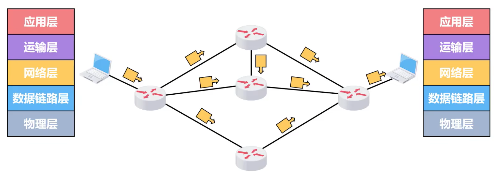
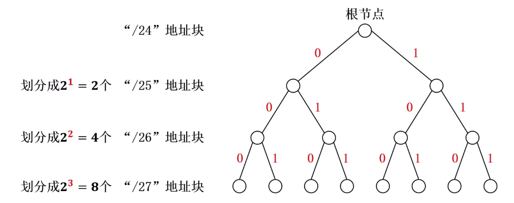
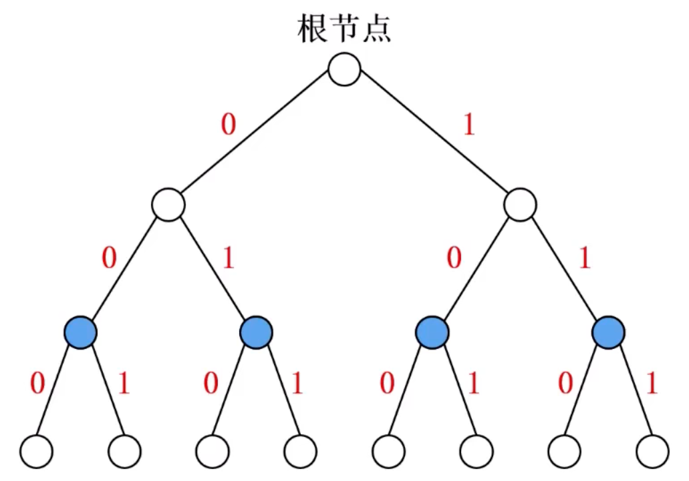
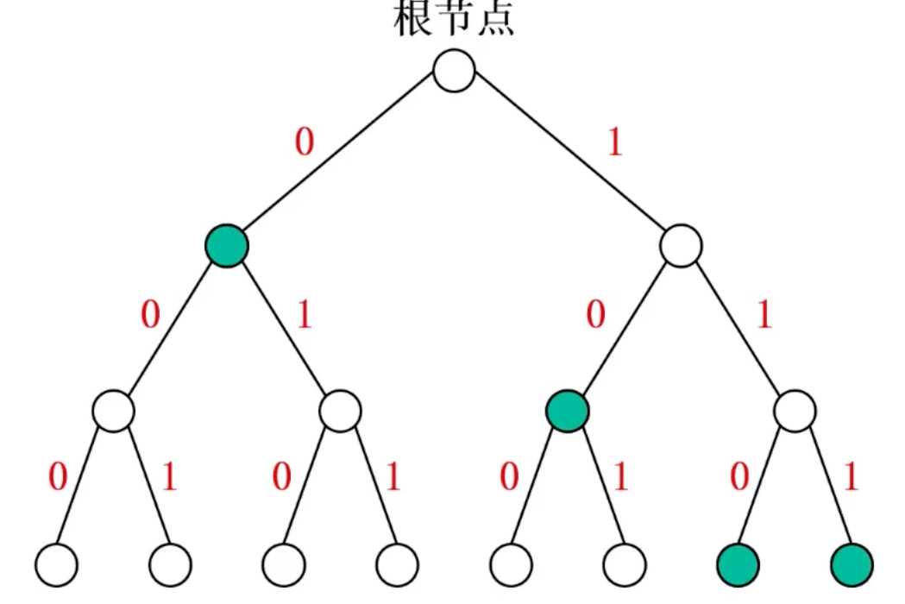
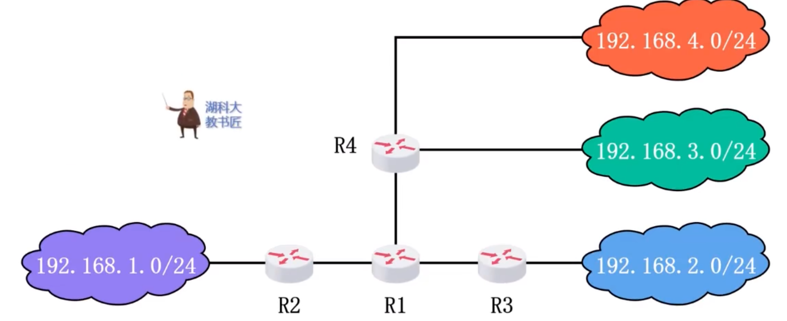
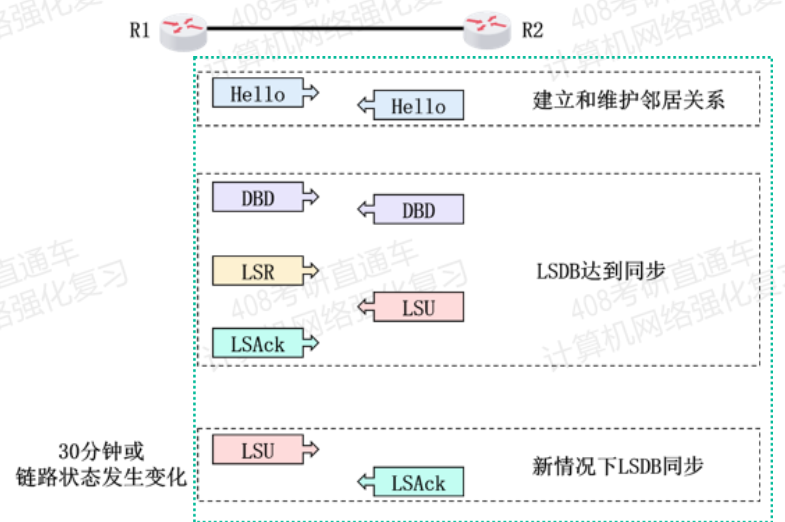
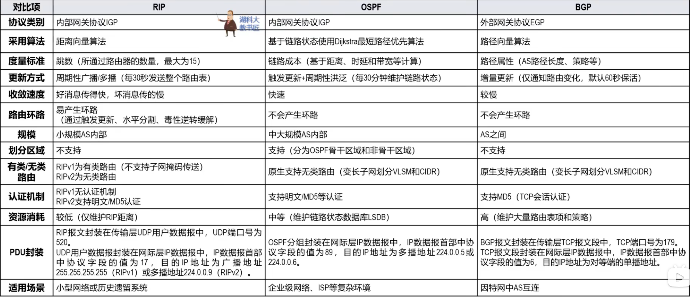
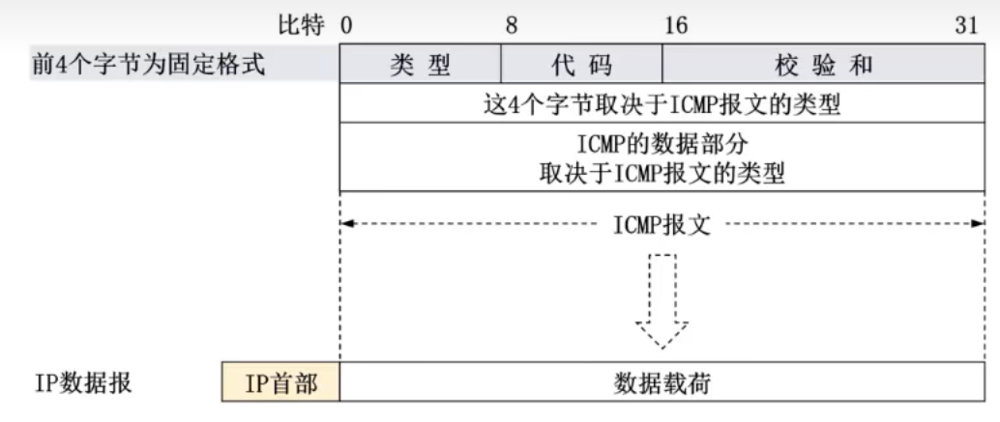

# 网络层

## 概述

### 网络层要实现的功能
> 曾考一次

**网络层要要实现的功能是将分组从源主机经过多个网络、多锻炼路、多个路由器传输到目的主机**，可划分为以下两个重要功能

#### 分组转发
当路由器从自己的某个接口所连接的链路（或网络）上收到一个分组后，将该分组从自己其他适当的接口转发给下一跳路由器或目的主机

每个路由器需要维护自己的一个**转发表**，路由器根据分组首部的转发标识在转发表查询，根据结果指示的接口进行分组转发

#### 路由选择
源主机和目的主机之间可能存在多条路径，网络层需要决定选择哪一条路径来传送分组

### 网络层向其上次提供的两种服务
> 曾考 $2$ 次

#### 面向连接的虚电路服务
**核心思想**：可靠通信应由网络自身来保证

**过程**
-   通信双方进行通信之前应该首先建立**网络层的连接**，也就是建立一条**虚电路VC**，以保证通信双方所需的一切网络资源
-   双方沿着已建立的虚电路发送分组
-   通信结束后，释放所建立虚电路

对于提供虚电路服务的分组交换，分组的首部**仅在虚电路建立阶段使用完整的目的主机地址**，之后每个分组的首部只需要携带一条虚电路编号即可。
#####

#### 无连接的数据报服务
**核心思想**：可靠通信应由用户主机来保证

-   当两台计算机进行通信时，它们的网络层**不需要建立连接**
-   <u>每个分组可走不同路径</u>，所以**每个分组的首部必须携带目的主机的完整地址**
该通信方式传送的分组可能误码、丢失、重复、失序
-   通信结束没有需要释放的连接

因特网网络层向上层提供的是简单灵活的、无连接的、尽最大努力交付的数据报服务
#####

## 网际协议
**网际协议IP**是TCP/IP体系结构**网际层**的**核心协议**，负责**异构网络互连**

### 异构网络互连
异构网络都使用相同的网际协议IP，从网络层角度看，它们好像一个统一的网络 —— **IP网**。当IP网上的主机进行通信时，就好像在单个网络上通信一样，它们<u>看不见（也无需看见）互联的各网络的具体异构细节</u>

### **$\star\star\star\star\star$ IPv4地址及编址**
> **每年出现**，甚至一年多次（平均一年 $2$ 次）

IPv4地址是给因特网上**每个主机的每个接口**分配的一个在全世界范围内唯一的 **$32$ bit的标识符**

#### IPv4地址的表示方法
采用点分十进制表示方法，**每 $8$ bit一组**，写为对应十进制数，之间用`.`分隔
如 `255.255.255.255`

#### IPv4地址的编制方法
历史阶段
-   **分类编址**
-   **划分子网**
-   **无分类编制**

##### 分类编址
将 $32$ bit的地址划分为两部分
-   **网络号**：用来表示主机或路由器的接口所连接到的网络。同一个网络，不同接口的IPv4地址的网络号必须相同，表示属于一个网络
-   **主机号**：用来表示主机或路由器的接口。同一个网络，不同接口的IPv4地址的网络号必须不同

分类编址的IPv4地址**分为 $5$ 类**

ABC类占比分别为 $1/2, 1/4, 1/8$，DE类占比均为 $1/16$

**分配规则**
**只有ABC类地址用于分配**给网络中主机或路由器的各接口
-   主机号全 $0$ 的为网络地址，不能分配接口
-   主机号全 $1$ 的是广播地址，不能分配接口

|网络类别|可用网络数|最小网络号|最大网络号|单个网络最大主机数|
|:-:|:-:|:-:|:-:|:-:|
|A|$2^7-2$|`1`|`126`|$2^{24}-2$|
|B|$2^{14}$|`128.0`|`191.255`|$2^{16}-2$|
|C|$2^{21}$|`192.0.0`|`223.255.255`|$2^{8}-2$|
> A类网络最大网络号`127`最为本地环回测试地址，不能指派
> $-2$ 是去掉全 $0$ 的网络地址和全 $1$ 的广播地址
**缺点**：分配方式不灵活，容易造成地址大量**浪费**
######

##### 划分子网
在划分子网的方式上进行改进
-   从主句号部分借用一些bit作为子网号，用来表示不同的子网
-   需要使用**子网掩码**来表面从主机号部分借用了多少bit

**子网掩码**由 $32$ bit构成
-   连续的 bit $1$ 对应网络号和子网号部分
-   连续的 bit $0$ 对应主机号

未划分子网情况下使用**默认子网掩码**，和地址类型相适应，如A类地址的子网掩码为`255.0.0.0`
######

##### 无分类编址
消除了传统ABC类地址的概念

**表示方法**
采用**斜线记法**，地址后加上$/num$ 表示网络前缀为 $num$ bit

### **$\star$ IPv4地址的应用规划**
> 曾考 $7$ 次

#### 定长子网划分和变长子网划分
IPv4地址的应用规划是指将给定的IPv4地址块划分为若干更小的子块，并将这些子块分配给互联网中不同的网络（子网），一般有两种策略
-   采用**定长子网掩码**
-   采用**变长子网掩码**

#####
#### 基于二叉树的子网划分方法

若采用定长子网掩码，则只能选取同层的点，只能划分出 $2^k$ 个子网

采用变长子网约掩码，则可以选择不同层的点，可以划分出任意个子网（但子网内主机号仍为 $2^k$ 个）
> 但是需要保证每个叶节点有且仅有一个祖先作为子网点，或者说每条路径仅有一个

|定长|变长|
|-|-|
|||
#####

### MAC地址与IPv4地址

#### 封装位置
地址封装位置：

#### 数据包传送过程相关地址的变化情况
> 曾考 $4$ 次

**源IP地址和目的PI地址**在整个传输过程中**保持不变**（不考虑网络地址转换NAT）

**源MAC地址和目的MAC地址**整个传输过程**逐网络变化**

### **地址解析协议ARP**
> 曾考 $5$ 次

**地址解析协议ARP**的作用是**通过已知的IP地址找到对应的MAC地址**

**地址获取过程**
以主机A向B发送为例
-   根据主机A的ARP高速缓存表查找目的IP的MAC地址
    -   若找到，则进入执行发送
-   若未找到，则**发送ARP请求报文（广播）**
-   其他主机收到该报文，发往上层ARP进程解析
-   B发现询问的IP地址为自己的地址
    -   将A的IP地址与MAC地址记录到自己的ARP高速缓存表
    -   主机B给 **A** **发送ARP响应报文（单播）**，以告知自己的MAC地址

ARP高速缓存表会记录地址类型
-   **动态**为ARP自动获取，生命周期默认为**两分钟**
-   **静态**为手工配置，不同OS生命周期不同

ARP协议解决**同一个局域网**上的地址映射问题，**不能跨网络使用**

如果要跨网络，需要逐个链路或网络使用ARP
> 因为路由器隔绝广播域

还有可用于检查IP地址冲突的<u>无故ARP或免费ARP</u>
####
### **$\star\star\star\star\star$ IPv4数据报的发送和转发过程**
> 每年都考

#### 主机发送IPv4数据报
同一个网络中的主机之间可以**直接通信**，属于**直接交付**
**怎么得知目的主机是同一地址？** 根据两者IP地址的网络号，可得知是否**属于同一地址**
-   将目的主机网络号与源主机掩码做逻辑与，若结果与自身网络号相同，则属于同一网络

不同网络主机之间，需要**默认网关（默认路由器）** 来中转，属于**间接交付**
#####

#### 路由器转发IPv4数据报
默认网关正确接收主机的数据报，根据其首部中目的IP地址在自身**路由表**进行查表
-   若没有匹配的路由条目，则直接丢弃，并给主机发送差错报告报文
-   若有相关条目，从对应接口转发
    > 多跳遵循最长前缀匹配原则

路由器不转发广播，即**路由器隔绝广播域**
#####

### IPv4数据报首部格式

每行32bit，**固定部分 $20B$**，可变部分最大 $40 B$

#### 版本
$4$ bit，表示IP协议的版本，**通信双方的IP协议版本必须一致**，目前广泛使用的版本好为4，即IPv4

#### 首部长度字段
$4$ bit，用来表示首部长度，数值以 $4B$ 为单位，即实际长度为 $x \times 4B, x \in [0101,1111]$

#### 可选字段
$1 \sim 40 B$，用来支持排错，测量以及安全措施等功能，**实际很少使用**

#### 填充字段
用来确保长度为 $4B$ 的倍数，使用全 $0$ 填充

#### 区分服务字段
$8$ bit，不同取值可提供不同等级的辅助质量，只有使用区分服务时该字段才起作用，**一般情况都不使用该字段**

#### 总长度字段
$16$ bit，表示IPv4数据包长度，数值以 $1B$ 为单位

#### 标识字段、标志字段、片偏移字段
> 曾考 $2$ 次

三者共同用于数据分片

**分片**的原因：网际层封装了一个超过链路层规定的数据包，需要将其分割发送

**标识**：16bit，同一个数据包的分片应该具有相同标识
    IP软件会维持一个计数器，每产生一个数据包就++，并将值赋值给该字段

**标志**：3bit
-   最低位MF，$=1$ 表示该分配后还有分片，$=0$ 没有分片
    > 对于已经一个非最后分片，若是将其再分，其 MF $=1$
-   中间位DF，$=1$ 表示不允许分片，$=0$ 允许
    > GPT: DF=1 在实际网络中很重要，因为它可以配合 路径 MTU 发现（PMTUD），让发送端知道路径上的最大可用 MTU，从而主动把数据报控制在合适的大小，避免中途分片。
-   最高位保留位，必须设置为 $0$

**片偏移**：13bit，取值以 $8B$ 为单位，用来指出分片的数据报的载荷偏移其在原载荷的位置有多远
> **因为片偏移字段值一 $8B$ 为单位，所以要求除了最后一个分片外，其他分片数据在和长度必须为 $8B$ 整数倍**
#####

#### 生存时间字段
$8$ bit，现在为**跳数**，路由器收到时该字段 $-1$，若不为 $0$则进行转发，否则直接丢弃

#### 协议
$8$ bit，用来指明数据报的**数据在和是何种协议数据单元PDU**，6为TCP，17为UDP

#### 首部检验和
16bit，用于检测数据包在传输过程中期**首部是否出现了差错**。数据包没经过一个路由器，都需要重新计算一次首部检验和

**计算方法**：将首部以 $16$ bit划分为若干段，并把首部检验和字段置 $0$ ；用反码算数运算求所有字段的和，然后再取反置于该字段
> 额外说明：如果最高位产生进位，则将其加入进位部分 `>>16` 然后和结果的后 $16$ 位再做加法

**检验方法**：用上面相同的方法计算和，但不需要吧该字段置 $0$，若无差错，最后结果应该为 $0$

#### 源IP地址字段和目的IP地址字段
均为 $32$ bit，填写发送和接收主机的IPv4地址

## **静态路由配置**
> 曾考 $5$ 次

**静态路由配置**指运维人员使用路由器的相关命令给路由器**人工配置**路由表

### 直连网络路由和非智联网络路由
路由器的**各接口配置了IP地址和地址掩码后**，**路由器就可自行得出**自己的各接口直接连接的是哪个网络。路由器将这些直连网络的条目记录在自己的路由表中

路由器到其他非直连网络的路由可由运维人员人工配置，也可**通过路由选择协议自动获取**

### 路由聚合与最长前缀匹配

#### 路由聚合
如图，对于R1，可将R4连接的两个网络视作一个网络填入路由表中

**路由聚合的方法**就是找**共同前缀**

#### 最长前缀匹配
在路由表中匹配时，如果出现多条匹配，**最长前缀匹配**的结果

因为前缀越长，地址块越小，路由就更具体

### 默认路由和特定主机路由

#### 默认路由
如果事先给路由器配置过默认路由条目，则当路由器查询不到匹配的路由条目时，就**按默认路由条目的下一跳进行转发**

默认路由条目目的地址为`0.0.0.0/0`，因为路由器查找转发表根据最长前缀原则，所以**默认路由条目匹配优先级最低**

极大减少了路由表所占用的存储空间和搜索路由表所耗费的时间

#### 特定主机路由
特定主机路由目的地址为`x.x.x.x/32`，拥有最长网络前缀，优先级最高

## **$\star$ 路由选择协议**
> 曾考 $7$ 次

分为
-   **静态路由选择**：采用**人工配置**的方式给路由器添加路由条目
-   **动态路由选择**：路由器通过**路由选择协议自动获取**路由信息

### 因特网采用分层次的路由选择协议
> 曾考 $2$ 次

因特网路由选择协议具有三个主要特点
-   **自适应**：采用**动态路由**选择，能较好使用网络状态变化
-   **分布式**：**各路由器**通过互相间的信息交互，**共同完成路由信息的获取和更新**
-   **分层次**：将因特网划分为许多较小的**自治系统**
    在自治系统内外分别采用不同类别的路由协议，分别进行路由选择

**自治系统之间**的路由选择简称**域间路由选择**，使用**外部网关协议EGP**，包含**边界网关协议BGP**

**自治系统内部**的路由选择简称**域内路由选择**，使用**内部网关协议IGP**，包含**路由信息协议RIP**和**开放最短路径有限OSPF**
####

### **路由信息协议RIP**
> 曾考 $5$ 次

**路由信息协议RIP**是内部网关协议中最先得到广泛使用的协议之一

#### RIP距离
RIP要求自治系统AS内的每一个路由器，都要维护从它自己到AS内每一个网络的距离记录。这是一组距离，称为**距离向量D-V**

RIP使用**跳数**作为度量来衡量到达目的网络的**距离**，称为**RIP距离**
-   路由器到直连网络的距离为 $1$
-   路由器到非直连网络的距离为所经过的路由器数 $+1$
-   一条路径最多只能包含 $15$ 个路由器，即**最远距离 $15$**，RIP距离 $= 16$ 时不可达，因此RIP只适用于小规模AS
#####

#### 好路由的标准
RIP认为**好的路由**就是距离短的路由，也就是**通过路由器最少的路由**

当到达同一目的网络有多条RIP距离相等的路由时，可以进行**等价负载均衡**

#### 三个重要特点
**和谁交换信息**：仅和**相邻路由器**交换信息

**交换什么信息**：交换的信息是**路由器自己的路由表**

**何时交换信息**：**周期性交换**

#### 距离向量算法
运行RIP的路由器周期性地向其他所有邻居路由器发送RIP更新报文。收到每一个邻居的更新报文后，会根据其更新自己的路由表

假设有两个路由器A,B

A向B发送自己的路由表，B收到路由表后线将个条目的RIP距离 $+1$，然后和自身的路由表比较
-   若条目不存在，则直接添加
-   若条目存在，
    -   若是原信息的**下一跳是A**，则**必须更新**
    -   若下一跳不是A，则取 $\min\{原记录，新记录\}$
        **特别的**，如果下一跳不同，但是RIP距离相同，则**添加**，可以等价负载均衡

    
还包含一些**时间参数**
-   路由器每隔**约 $30s$** 项其所有相邻路由器发送路由更新报文
-   若 **$180s$**（默认）没有收到某条路由条目的更新报文，则把该路由条目**标记为无效**，在过一段时间还是没有收到，则**删除**对应条目

若干次交换和更新后，**每个路由器都知道到达本自治系统内各网络的最短距离和下一跳路由器，称为收敛**
#####

#### 存在的问题
**“坏消息传的慢”**，也称为路由环路或**RIP距离无穷计数问题**
因为更新报文时，不会发送发送方的下一跳信息，所以如果与R1相连的网络N1故障无法传递，
-   其会收到R2的更新报文，然后更新
-   然后R1给R2发送报文，R2更新
-   R2再给R1发送报文，R1对N的RIP距离 $+1$
-   以此类推，直到有一方距离 $> 15$

采用下述方法可以**减少**出现该问题的概率
-   限制最大RIP距离为 $15$
-   **触发更新**：当路由表变化就立刻发送更新报文
-   **水平分割**：让路由器记录收到某个特定路由信息的接口，而不让同一路由信息再通过此接口反向发送
-   **毒性逆转**：当路由器发现某条路由失效时，就立即发送该路由的不可达信息
#####

#### RIP报文
RIP处于应用层PDU的首部

从逐层封装角度看，RIP数据应用层；从实现的核心功能看，RIP属于网际层

#### 优缺点
**优点**
-   实现简单，路由开销小
-   好消息传播的快

**确定**
-   最大RIP距离限制了自治系统AS的规模
-   邻居路由之间交换完整路由表，随着AS规模扩大，开销也增加
-   坏消息传播的慢

#####

### 开放最短路径有限OSPF协议
> 曾考 $3$ 次

**开放**表明OSPF协议不受某一厂商控制，而是**公开发表**的
**最短路径优先**是因为使用了Dijkstra的**最短路径算法**

#### 相关基本概念
##### 链路状态
OSPF是基于**链路状态**的，而不是像RIP基于距离向量
OSPF基于链路状态并采用最短路径算法计算路由，从算法上保证了**不会产生路由环路**
OSPF**不限制网络规模，更新效率高，收敛速度快**

**链路状态LS**是指本路由器都和**哪些路由器相邻**，以及**相应链路的代价**

**代价**用来表示费用，距离，时延和带宽等，由网络管理员人员决定

##### 使用问候分组建立和维护邻居关系
相邻路由器之间通过交互**问候(Hello)分组**来建立和维护**邻居关系**
-   Hello 分组**封装在IP数据报**中，发往**多播地址`224.0.0.5`**
-   问候分组的**发送周期为 $10s$**
-   若 **$40s$** 未收到来自邻居的问候分组，则认为邻居路由器不可达

每个路由器会建立一张**邻居表**

######

##### 链路状态通告LSA
使用ISPF的每个路由器都会产生**链路通告状态**

LSA包含以下两类链路昨天信息
-   **直连网络**的链路状态信息
-   **邻居路由器**的链路状态信息
######

##### 链路状态更新分组和链路状态确认分组
**链路状态通告LSA**被封装在**链路状态更新LSU分组**中，采用可靠的洪泛法发送
-   **洪泛法**指路由器向所有非上游邻居路由器发送LSU分组
-   **可靠**指收到LSU分组后要发送相应的**链路状态确认LSAck分组**
######

##### 链路状态数据库
使用OSPF的每个路由器都有一个**链路状态数据库LSDB**，用于存储LSA

##### 基于链路状态数据库进行最短路径优先计算
路由器课基于LSDB，构建出带权*有向图*，然后执行Dijkstra以自己为根，到各个路由器的最短路
> 教材写有向图，但是个人认为就是无向图，也不影响Dijkstra的使用

#### OSPF分组

##### 五种OSPF分组
**问候Hello分组**：用来建立和维护邻居关系

**数据库描述DBD分组**：用来向邻居路由器给出自己的链路状态数据库LSDB中所有链路状态的摘要信息

**链路状态请求LSR分组**：用来向邻居路由器请求发送某些链路状态项目的详细信息

**链路状态更新LSU分组**：路由器泛洪发送封装有链路状态通告LSA的LSU分组，对整个系统更新链路状态

**链路状态确认LSAck分组**：对LSU分组的确认分组

##### OSPF分组的封装
OSPF分组被封装在IP数据报中发送

在IP首部的协议字段值被设置为 $89$，在其后封装OSPF首部

从PDU还是核心功能看，OSPF都属于网际层

##### OSPF基本工作过程

######

##### 多点接入网络的OSPF路由器
若 $n$ 个路由器连在一个网络上，将产生大量邻居关系，这是每轮要发送 $n(n-1)/2$ 个Hello分组

为了减少发送OSPF分组的数量，OSPF采用选举**指定路由器DR**和**备用的制定路由器BDR**的方法
-   普通OSPF路由器只与DR和BDR建立邻居关系
-   普通OSPF路由器之间不能之间交换信息，必须通过DR或BDR进行交换
-   若DR出现问题，则有BDR顶替DR

这样 $n^2$ 规模的邻居关系降低为 $n$ 的规模
> 实际为 $2(n-2) + 1$
######

##### OSPF划分区域
为使**OSPF协议能够用于规模很大的AS**，OSPF把一个AS划分为若干更小的范围，称为**区域**

每个区域有一个 $32$ bit的区域标识符

**主干区域标识符必须为 $0$**，用于连通其他区域

划分区域的好丑就是把利用洪泛法交换链路状态信息的范围局限于每一个区域，而不是整个AS，这样就**减少了AS中用于OSPF的通信量**

### 边界网关协议BGP
> 曾考 $3$ 次

**边界网关协议BGP**属于外部网关协议EGP，用于**自治系统AS之间的路由选择协议**

#### 基本概念
因为在不同AS内**度量路由的代价**不同，因此对于AC之间的路由选择，无法选择统一的代价作为度量

AS之间的路由选择还必须考虑相关**策略（政治，经济，安全等）**

BGP是力求寻找一条能够到达目的网络的**较好**路由，而非寻找一条最佳路由

#### 自治系统AS的分类
因特网中的自治系统AS的数量非常庞大，并且各AS之间的连接也很复杂

可将AS分为三大类：
-   **末梢AS**：通过其之间连接的AS发送或者接收末梢AS自身的IP数据报，**不中转其他AS的流量**
    -   **多归属AS**：也是末梢AS，可以同时连接到两个或两个以上的AS。通过**冗余连接**提升可靠性，可分配流量到不同连接上**实现负载均衡**。一般不中转其他AS的流量
-   **对等AS**：基于**互惠协议**（流量交换互不收费），双方直接连接的两个AS
-   **穿越AS**：是**提供流量中转服务的大型主干AS**。为其他AS有偿中转流量
#####

#### eBGP连接和iBGP连接
在一个AS内，有**BGP边界路由器**和**BGP内部路由器**两种不同功能的路由器

在配置BGP时，每个AS的管理员要选择**至少一个路由器和相邻AS的BGP边界路由器直接相连**

当**两个BGP边界路由器**进行通信时必须要首先建立传输层TCP连接，TCP端口号为 $179$

BGP边界路由器之间的链接称为**外部BGP连接（eBGP连接）**

**AS中任意两个路由器之间还必须建立内部BGP连接（iBGP连接）**

**BGP通过遵循的规则**
-   从eBGP的对等段收到的BGP路由，可以通过iBGP告诉同一AS的对等端
-   从iBGP首对等段收到的BGP路由，可以通过eBGP告诉不同AS的对等端
-   从iBGP首对等段收到的BGP路由，**不能告诉同AS的对等端**

**注意**：每个AS内任意两个路由器必须建立iBGP，称为**全连通**，即使两者没有直接的物理连接

#####

#### BGP路由的一般格式
可描述为 **“目的网络，BGP属性”**，BGP属性包含多种，最重要的两个：
-   **AS-PATH**：记录路由经过的AS的路径。用于AS路由选择以**防止AS之间形成路由环路**
-   **NEXT0HOP**：是通过这条BGP路由的BGP路由器

##### BGP路由器构建转发表
假设有两个AS
-   AS1中有网络N1，边界路由器为R1
-   AS2中有内部路由器R3，边界路由器R2

AS2中的R3收到BGP路由(N1,AS1,R1)后，就知道了“可经过AS1到达N1，下一跳应该转发给R1”，由于R1不在AS2，因此R3会将该路由中的R1修改为对等端的R2。之后，IP数据包经过R2转发到R1，最终R1将IP数据报转发给AS1中的N1

R3还要利用内部网关协议IGP找出从R3到R2最佳路由的下一跳，假设为R4，至此就可以在自己的转发表添加一条去往N1的转发条目，下一跳为R4
######

##### AS-PATH如何避免环路
**BGP理由必须避免AS路由环路**

每个AS收到BGP路由后，就检查自己是否出现在AS-PATH属性中
-   如果出现，则丢弃该路由
-   如果未出现，则将自己加在最前面
######

#### BGP的路由选择规则
优先级从高到低：本地偏好LOCAL-PREF值 $\to$ AS跳数 $\to$ 热土豆路由选择算法 $\to$ 路由器的BGP标识数值

#### BGP报文
-   **OPEN（打开）报文**：用来与相邻的另一个BGP发言人建立关系，使通信初始化
-   **UPDATE（更新）报文**：用来通告某一路由的信息，以及列出要撤销的多条路由
-   **KEEPALIVE（保活）报文**：用来周期性地证实邻站的连通性
-   **NOTIFICATION（通知）报文**：用来发送检测到的差错
#####
### 三者对比

### 路由器的功能、组成和基本工作原理
**路由器**是一种具有多个输入端口和输出端口的专用计算机，**功能是转发分组**

**结构可分为**
-   **路由选择部分**：核心构件是**路由选择处理机**，功能是根据所使用的路由选择协议，周期性地与其他路由器进行路由信息的交换，以便构建和更新路由
-   **分组转发部分**：由**一组输入端口、交换结构**以及**一组输出端口**构成
####

## 网际控制报文协议ICMP
> 曾考 $2$ 次

**主机**或**路由器**使用ICMP来发送**差错报告报文**和**询问报文**

### ICMP差错报告报文
用来向主机或路由器报告差错情况，分为以下四类：

#### 目的不可达
**当路由器或主机不能交付IP数据报时，就向源点发送ICMP差错报告报文**。错误类型为**目的不可达**。

具体可根据ICMP代码字段细分为目的网络不可达，目的主机不可达，目的协议不可达，目的端口不可达，目的网络未知，目的主机未知等 $13$ 种

#### 时间超过
-   当路由器收到一个目的IP地址不是自己的数据报时，会将其首部中**生存时间TTL字段的值 $-1$**。若不为 $0$ 转发；若为 $0$，不但要丢弃，**还要向发送该IP数据报的源点发送ICMP差错报告报文**，错误类型为**时间超过**
-   当<u>终点在预先规定的事件内未能收到一个数据报的**全部数据报分片**时</u>，<u>就把已收到的数据报片都丢弃，也会向源点发送时间超过报文</u>
#####

#### 参数问题
当路由器或目的主机收到IP数据报后发现其**首部中有不正确的字段值**时，**会丢弃该数据报，并向原点发送ICMP差错报告报文**，差错类型为**参数问题**

**注意**：若路由器或目的主机发现**IP数据报首部检验错误**，会**静默丢弃**

#### 改变路由（重定向）
当路由器发现主机选择的**下一跳并非最优时**，就会给主机发送ICMP差错报告报文，错误类型为**改变路由**

### 不应发送ICMP差错报告报文的情况
-   对ICMP差错报告报文自身的出错
-   对IP数据报的非首个数据报分配的出错
-   对目的地址是IP广播或多播地址的数据报出错
-   对具有特殊地质（如`127.0.0.0`, `0.0.0.0`）的数据报的出错
####

### ICMP询问报文

#### 回送请求和回答
由主机或路由器向一个特定的目的主机或路由发出。收到次报文的主机或路由器必须给发送该报文的源主机或路由器发送ICMP回送回答报文。

这种询问报文**用来测试目的站是否可达，以及了解其有关状态**

#### 时间戳请求和回答
用来请求某个主机或路由器回答当前的日期和时间。在ICMP时间戳回答报文种有一个32bit的字段，其中写入的整数代表从 $1900$ 年 $1$ 月 $1$ 日起到当前时刻一共有多少 $s$

这种询问报文**用来进行时钟同步和测量时间**

### ICMP报文

#### ICMP报文的格式和封装
ICMP报文封装在IP数据报中

### ICMP差错报告把我摁的数据部分
类型 $+$ 差错报文的IP首部和数据载荷的前 $8B$

### 典型应用

#### 分组网间探测PING
用来**测试主机或路由器之间的连通性**
-   PING是**应用层直接使用网际层ICMP**的一个例子，不使用运输层的TCP或UDP
-   PING应用所**使用的ICMP报文类型为回送请求和回答**
#####

#### 跟踪路由
跟踪路由应该traceroute用于**探测IP数据报从源主机到达目的主机要经过哪些路由器**

## **网络地址转换**
> 曾考 $6$ 次

网络地址转换NAT技术于1994年提出，用来缓解IPv4地址空间即将耗尽的问题

NAT能**是大量使用内部专用地址的专用网络用户共享少了外部全球地址来访问因特网上的主机和资源**

为实现NAT功能，需要再专用网络连接到因特网的路由器上**安装NAT软件**。装有NAT软件的路由器称为**NAT路由器**，它**至少要有一个有效的外部全球地址IP**

### 网络地址和端口号转换
为了更有效利用NAT路由器中的全球IPv4地址，现在常将**NAT转换和传输层端口号结合使用**。这样就可**使私有网络中使用私有IPv4地址的大量主机，共享NAT路由器上的 $1$ 个全球IPv4地址同时与因特网通信**

使用传输层端口号的NAT称为**网络地址和端口号转换NAPT**

**基本步骤**
假设存在私有网络的主机H，其要给公网的主机S发送报文
-   NAPT路由器收到H发来的IP数据报后，**将其源地址（私有IPv4地址）修改为NAPT路由器的全球IPv4地址**，并将其封装的传输层PDU的源端口改为一个新的传输层端口号（NAPT动态分配），还要将该**相关修改内容记录到自己的NAPT转换表中**，然后将修改后的数据报转发到因特网
-   当NAPT路由器从因特网收到主机S发回的数据报时，**根据NAPT转换表中的相关记录**，NAPT路游记可知道该数据报要发送给私有网络中的H。因此NAPT路由器**将数据报首部中的目的地址和所封装的传输层PDU的目的端口号，按NAPT转换表中的记录进行修改**，之后发送给H1
####

## IP多播
**多播（组播）**是一种实现**一对多**通信的技术，与传统单播相比，可以**极大地节省网络资源**

**IP多播**：在因特网上进行的多播

### IP多播地址和多播组
IP多播通信必须依赖于IP多播地址。在**IPv4**中，**D类地址**被作为**多播地址**

多播地址只能用作目的地址，而不能用作源地址。

IPv4多播地址有 $2^{28}$ 个，范围是$222.0.0.0 \sim 239.255.255.255$

可分为：预留的多播地址（永久多播地址）、全球范围可用的多播地址、本地管理的多播地址

用每一个IP多播地址标识一个多播组，使用**同一个IP多播地址**接受多播数据报的所有主机就构成了一个多播组。
-   每个多播组的**成员**是可以**随时变动**的，一台主机可以随时加入或离开多播组
-   多播组成员的数量和所在地理位置也不受限制，一台主机可属于若干多播组

IP多播数据包也是**尽最大努力交付**

IP多播可分为：**只在本局域网进行的硬件多播**和**在因特网进行的多播**
####

### 在局域网上进行硬件多播
由于局域网支持硬件多播（因为MAC地址有多播MAC地址这种类型），因此只需要**把IPv4多播地址映射为多播MAC地址**，即可将IP多播数据包封装在局域网的MAC帧中，而MAC帧首部的目的MAC地址设置为映射的多播MAC地址，这样可以很方便**利用硬件多播实现局域网内IP多播**

### 在因特网上进行IP多播需要的两种协议
要在因特网进行IP多播，必须考虑**IP多播数据包经过多个多播路由器进行转发**的问题，**多播路由器**必须根据IP多播数据报首部中的IP多播地址，将其转发到有该多播组成员的局域网

#### 网际组管理协议IGMP
网际层中的协议，作用是**让连接在本地局域网上**的多播路由器知道本局域网上是否有主机（实际上是主机中的某个进程）**加入或退出了某个多播组**

IGMP仅在本网络有效，使用IGMP并不难知道多播组所包含的成员数量和分布

### 多播路由选择协议
主要任务是在多播路由器之间为每个多播组建立一个**多播转发树**
-   多播转发树链接多播源和所有拥有该多播组成员的路由器
-   IP多播数据包只要沿着多播转发树进行洪泛，就能传送到所有拥有该多播组成员的多播路由器
-   **多播路由器在其所直连的局域网内**，通过**硬件多播**将IP多播数据包发送给该多播组所有成员
#####
## 移动IP技术

### IPv6
> 曾考 $1$ 次

IPv6根本措施是采用具有更大地址空间（IP地址长度128bit）的新版本IP

#### 主要变化
**更大的地址空间**，地址空间增大到128bit，在可预见的未来是不会用完的

**扩展的地址层次结构**：可划分为更多的层次，这样可以更好地反应因特网的拓扑结构，使得对寻址和路由层次的设计更具有灵活性

**灵活的首部格式**：与IPv4首部病不兼容。IPv6定义了许多**可选的首部格式**，不仅可提供比IPv4更多的功能，而且还可以**提高路由器的处理速率**，因为路由器对逐跳扩展首部外的其他扩展首部都不进行处理

**改进的选项**：IPv6允许分组包含选项的控制信息，因而可以包含一些新的选项

**允许协议继续扩充**

**支持自动配置**，IPv6支持主机或路由器自动配置IPv6地址及其他网络配置参数

**支持资源的预分配**

**IPv4分组的搜捕长度必须是 $8B$ 的整数倍**，而不想IPv4是 $4B$ 的整数倍

### IPv6分组
#### IPv6分组的组成

IPv6数据报由40B的基本首部和长度可变的有效载荷组成

**所有的扩展首部不属于IPv6分组的首部，它们与其后面的数据部分合起来构成了有效载荷**

相比IPv4，IPv6**对某些字段进行了更改**
|IPv6|IPv4|
|-|-|
|||
#####

#### IPv6分组的基本首部
**对IPv4首部某些字段的更改**
-   取消了**首部长度字段**，因为IPv6首部长度固定为 $40B$
-   取消了**服务类型字段**，因为**通信量类**和**流标号**字段实现了服务类型字段的功能
-   将**总长度**改为**有效载荷长度**，因为只有有效载荷长度可变
-   取消了**标识、标志、片偏移**，因为这些功能包含在**分片扩展首部**中
-   将**生存时间TTL**改为**跳数限制**，这样名称与作用更一直
-   取消了**协议**，改用**下一个首部**
-   取消了**首部检验和**，可以加快路由器处理速度
-   取消了**可选字段**，改用**扩展首部**实现选项功能

IPv6将IPv4首部中不必要的功能取消了，这使得首部中的字段数量减少到 **$8$ 个**，但是因为地址扩展到了128bit，使得IPv6长度反倒增大到了40B

**字段功能**
-   **版本**，4bit，用来标识IP协议的版本，IPv6对应 $6$
-   **通信量类**，8bit，用来**区分不同IPv6数据报的区别或优先级**
-   **流标号**，20bit
    -   IPv6提出了**流**的概念
        > 流是因特网上从特定源点到特定终点（单播或多播）的一系列IPv6数据包，而这个流所经过的路径上的所有路由器都保证指明的服务质量

        所有属于一个流的IPv6数据报具有同样的流标号，**流标号用于资源分配**
    -   对实时音视频数据的传送特别有用，但对传统非实时数据则没有用处，可直接置 $0$
-   **有效载荷长度**，16bit，指明基本首部后的有效载荷的**字节数量**
-   **下一个首部**，8bit，相当于IPv4的协议字段或可选字段
    -   当IPv6数据包没有扩展首部时，其值域IPv4一样指出后面的数据是何种协议数据单元PDU
    -   当IPv6数据包**有扩展首部时**，该字段标识第一个扩展首部的类型
        之后的扩展首部都指明下一个扩展首部的类型，或者数据部分的类型
-   **跳数限制**，8bit
-   **源地址**与**目的地址**，均为128bit
#####
#### 扩展首部
为了提高路由器对数据报的处理效率，IPv6把IPv4中的选项字段都放在了扩展首部中，由路径两端的源点和终点来处理

在[RFC 2460]中第一了六种扩展首部
1.  逐条选项
2.  路由选择
3.  分片
4.  鉴别
5.  封装安全有效载荷
6.  目的站选项

**每一个扩展首部都有若干字段组成**，它们的长度各不相同
**所有扩展首部的第一个字段都是8bit的下一个首部字段**

当有多个扩展首部时，**应按以上先后顺序出现**

#####

### IPv6地址

#### 表示方法
128bit，每16bit分为一组，每组之间用`:`分割

**左侧零省略**，两个冒号中间，最前面的一串0可以省略不写
**连续零压缩**，连续的一串零用一对冒号代替，**一个地址只能使用一次**

#### 地址的分类
##### 目的地址有三种基本类型
**单播**：传统的一对一通信
**多播**：一对多点的通信。IPv6没有采用广播术语，而是将广播视作多播的特例
**任播**：IPv6新增的一种特殊的<u>目的地址类型</u>。允许多个设备共享同一个IPv6地址，但分组只会被路由到“最近”或“最优”的一个设备

##### IPv6地址分类
-   **未指明地址**，128bit全0，可缩写为`::`
    -   不能用作目的地址，只能用作还没有配置到一个标准IPv6地址的主机作为源地址
-   **环回地址**，最低bit为1，其余127bit全0，可缩写为`::1`
-   **多播地址**，高8bit全1，可记为`FF00::/8`
-   **本地链路单薄地址**，最高10bit为`1111111010`，可记为`FE80::/10`
    即使用户网络没有连接到因特网，但仍然可以使用TCP/IP协议。链接在这种网络上的主机可以使用本地链路单薄地址进行通信，但是不能和因特网其他主机通信。这类地址占 $1/1024$
-   **全球单播地址**，采用三级结构，方便路由器更快地查找路由
    
######

### IPv4向IPv6过渡
因为历史遗留问题，从IPv4向IPv6转变只能只能采用逐步演进的办法

新部署的IPv6系统页必须能够兼容IPv4

#### 双协议栈
使一部分主机或路由器**装有IPv4和IPv6两套协议栈**

双协议栈主机或路由器记为`IPv6/IPv4`，表面它**具有一个IPv6地址和一个IPv4地址**

其通过域名系统DNS查询目的主机采用的IP地址：若返回IPv4地址，则源主机使用IPv4地址；否则使用IPv6地址

在传递过程中IPv4和IPv6数据报可能互相转换，这可能导致如流标号这样的信息丢失

#### 隧道技术
**核心思想**
-   当IPv6数据报要进入IPv4网络，将其重新封装成IPv4数据报，即整个IPv6数据报称为IPv4的数据载荷
-   封装后的数据包在IPv4网络正常传输
-   IPv4数据包要离开IPv4网络时，再将其数据在和取出并转发到IPv6网络

**此情况下IPv4首部中协议字段必须设置为41**
#####
### 网际控制报文协议ICMPv6
因为其比v4要复杂地多，所以合并了原来的**地址解析协议ARP和网际组管理协议ICMP**

封装该报文的首部的下一个首部字段值为 $58$

## 软件定义网络
> 22年新增，在22年考过一次

**软件定义网络SDN**是一种**新型网络体系结构**

**核心思想**是**把网络的控制层面和数据层面分离**，而**让控制层面利用软件来控制数据层面的许多设备**
